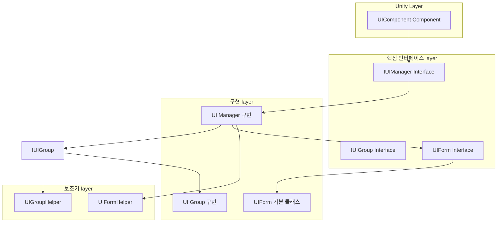
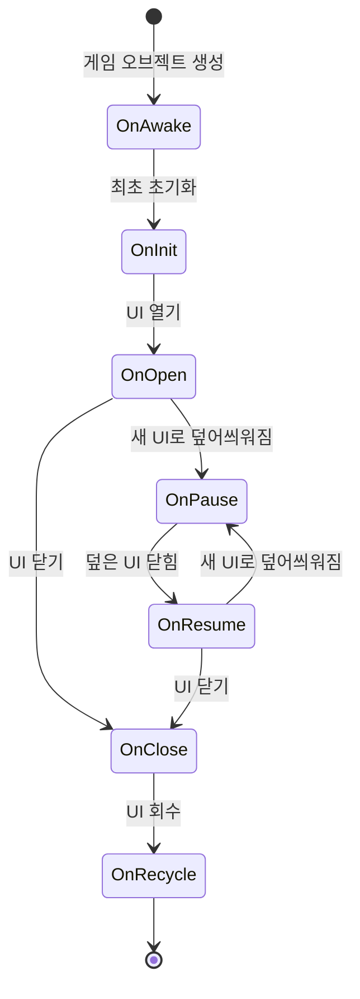
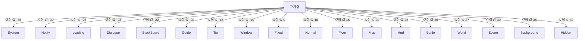

# 빠른 시작

이 가이드는 GameFrameX Unity UI 시스템에 빠르게入门하는 데 도움이 됩니다. 이 가이드를 통해 UI 구성 요소 구성, UI 창체 생성 및 기본 UI 작업 수행 방법을 알게 됩니다.

## 개요

GameFrameX Unity UI는 완전한 UI 관리 솔루션으로, UGUI와 FairyGUI 두 가지 UI 시스템을 지원합니다. 이 시스템은 통합된 UI 관리 인터페이스, 계층化 UI 시스템, 객체 풀 관리, 이벤트驱动 메커니즘 및 비동기 로딩 기능을 제공합니다.

**전제 조건:**
- Unity 2019.4 이상
- GameFrameX 핵심 프레임워크 설치됨

## 시스템 아키텍처

GameFrameX UI 시스템은 컴포넌트화 아키텍처 설계를 채택했으며, 주요 핵심 부분으로 구성됩니다:



**아키텍처 설명:**
- **UIComponent**: Unity 컴포넌트로, 개발자를 위한 API 진입점 제공
- **IUIManager**: UI 관리자 인터페이스로, UI 창체의 핵심 작업을 정의
- **IUIGroup**: UI 그룹 인터페이스로, UI의 계층 관계 관리
- **UIForm**: UI 창체 기본 클래스로, 모든 사용자 정의 UI 창체가 이 클래스를 상속해야 함

## UIComponent 구성

### 단계 1: UIComponent 컴포넌트 추가

Unity 장면에서 빈 GameObject를 생성하고 `UIComponent` 컴포넌트를 추가합니다:

1. Hierarchy 패널에서 마우스 오른쪽 버튼 클릭 **Create Empty** 선택
2. GameObject 이름을 "UI"로 변경
3. Inspector 패널에서 **Add Component** 클릭
4. **GameFrameX/UI** 컴포넌트 검색 및 추가

> Source: [UIComponent.cs](https://github.com/GameFrameX/com.gameframex.unity.ui/blob/main/Runtime/UIComponent.cs#L48-L50)

### 단계 2: 컴포넌트 속성 구성

Inspector 패널에서 UIComponent 속성을 구성합니다:

| 속성 | 유형 | 기본값 | 설명 |
|------|------|--------|------|
| Enable Open UI Form Success Event | bool | true | UI 열기 성공 이벤트 활성화 여부 |
| Enable Open UI Form Failure Event | bool | true | UI 열기 실패 이벤트 활성화 여부 |
| Enable Auto Release UI Form | bool | true | UI 자동 회수 여부 |
| Enable Close UI Form Complete Event | bool | true | UI 닫기 시 완료 이벤트 트리거 여부 |
| Is Enable UI Show Animation | bool | false | UI 표시 애니메이션 활성화 여부 |
| Is Enable UI Hide Animation | bool | false | UI 숨김 애니메이션 활성화 여부 |
| Instance Auto Release Interval | float | 60f | UI 인스턴스 자동 해제 간격（초）|
| Instance Capacity | int | 16 | UI 인스턴스 객체 풀 용량 |
| Instance Expire Time | float | 60f | UI 인스턴스 만료 시간（초）|
| Recycle Interval | int | 60 | UI 회수 간격（초）|

### 단계 3: UI 루트 노드 설정

사용하는 UI 시스템에 따라 해당 루트 노드를 구성합니다:

- **UGUI Root**: UGUI 사용 시 UGUI Canvas가 있는 Transform 설정
- **FairyGUI Root**: FairyGUI 사용 시 FairyGUI 루트 컨테이너가 있는 Transform 설정

> Source: [UIComponent.cs](https://github.com/GameFrameX/com.gameframex.unity.ui/blob/main/Runtime/UIComponent.cs#L145-L161)

## UI 창체 생성

### UIForm을 상속하여 사용자 정의 UI 생성

모든 사용자 정의 UI 창체는 `UIForm` 기본 클래스를 상속해야 합니다. 다음은 완전한 메인 메뉴 UI 예제입니다:

```csharp
using GameFrameX.UI.Runtime;
using UnityEngine;
using UnityEngine.UI;

public class MainMenuUI : UIForm
{
    [SerializeField] private Button startButton;
    [SerializeField] private Button settingsButton;
    [SerializeField] private Button exitButton;

    protected override void OnInit(object userData)
    {
        base.OnInit(userData);
        
        // 버튼 이벤트 바인딩
        startButton.onClick.AddListener(OnStartButtonClick);
        settingsButton.onClick.AddListener(OnSettingsButtonClick);
        exitButton.onClick.AddListener(OnExitButtonClick);
    }

    protected override void OnOpen(object userData)
    {
        base.OnOpen(userData);
        
        // UI 열기 시 로직
        Debug.Log("메인 메뉴가 열렸습니다");
    }

    protected override void OnClose(bool isShutdown, object userData)
    {
        base.OnClose(isShutdown, userData);
        
        // 자원 정리
    }

    private void OnStartButtonClick()
    {
        // 현재 UI 닫고 게임 UI 열기
        UIComponent.CloseUIForm(this);
        GameEntry.GetComponent<UIComponent>().OpenUIFormAsync<GameUI>("UI/Game");
    }

    private void OnSettingsButtonClick()
    {
        // 설정 UI 열기
        GameEntry.GetComponent<UIComponent>().OpenUIFormAsync<SettingsUI>("UI/Settings");
    }

    private void OnExitButtonClick()
    {
        // 게임 종료
        Application.Quit();
    }
}
```

> Source: [UIForm.cs](https://github.com/GameFrameX/com.gameframex.unity.ui/blob/main/Runtime/UIForm.cs#L47-L100)

### UIForm生命周期 메서드

`UIForm`은 완전한生命周期 후크를 제공합니다:



|生命周期 메서드|호출 타이밍|용도|
|-------------|---------|------|
| OnAwake | Unity Awake 시 | 이벤트 구독 초기화 |
| OnInit | UI 최초 초기화 시 | UI 요소 바인딩, 데이터 초기화 |
| OnOpen | UI 매번 열릴 때 | UI 데이터 새로 고침, 애니메이션 재생 |
| OnClose | UI 닫을 때 | 임시 데이터 정리, 상태 저장 |
| OnRecycle | UI 회수 시 | UI 상태 초기화 |
| OnPause | UI 덮어씌워질 때 | UI 관련 로직 일시 정지 |
| OnResume | UI 표시 복원 시 | UI 로직 복원 |
| OnUpdate | 매 프레임 업데이트 | 폴링 로직 처리 |

> Source: [UIForm.cs](https://github.com/GameFrameX/com.gameframex.unity.ui/blob/main/Runtime/UIForm.cs#L530-L610)

## 기본 작업

### UIComponent 인스턴스 가져오기

```csharp
// GameEntry를 통해 UIComponent 가져오기
var uiComponent = GameEntry.GetComponent<UIComponent>();
```

> Source: [UIComponent.cs](https://github.com/GameFrameX/com.gameframex.unity.ui/blob/main/Runtime/UIComponent.cs#L48-L50)

### UI 창체 열기

**비동기 방식（권장）:**

```csharp
var uiComponent = GameEntry.GetComponent<UIComponent>();

// 방식 1: 제네릭 메서드로 경로 자동 해석
var mainMenu = await uiComponent.OpenUIFormAsync<MainMenuUI>();

// 방식 2: 자원 경로 지정
var mainMenu = await uiComponent.OpenUIFormAsync<MainMenuUI>("UI/MainMenu");

// 방식 3: 사용자 데이터 전달
var userData = new { playerName = "Player1", level = 10 };
var mainMenu = await uiComponent.OpenUIFormAsync<MainMenuUI>("UI/MainMenu", userData);

// 방식 4: 덮어지는 UI 일시 정지 여부 지정
var mainMenu = await uiComponent.OpenUIFormAsync<MainMenuUI>("UI/MainMenu", false); // false는 일시 정지 안 함
```

> Source: [UIComponent.Open.cs](https://github.com/GameFrameX/com.gameframex.unity.ui/blob/main/Runtime/UIComponent.Open.cs#L115-L155)

### UI 창체 닫기

```csharp
var uiComponent = GameEntry.GetComponent<UIComponent>();

// 방식 1: 현재 UI 닫기（UIForm 내부에서）
UIComponent.CloseUIForm(this);

// 방식 2: 유형으로 닫기
uiComponent.CloseUIForm<MainMenuUI>();

// 방식 3: 인스턴스로 닫기
uiComponent.CloseUIForm(mainMenuUI);

// 방식 4: 시퀀스 번호로 닫기
uiComponent.CloseUIForm(serialId);

// 방식 5: 로드된 모든 UI 닫기
uiComponent.CloseAllLoadedUIForms();

// 방식 6: 즉시 회수（객체 풀 건너뛰기）
uiComponent.CloseUIForm(mainMenuUI, true); // isNowRecycle = true
```

> Source: [IUIManager.cs](https://github.com/GameFrameX/com.gameframex.unity.ui/blob/main/Runtime/UI/IUIManager.cs#L385-L455)

### UI 창체 가져오기

```csharp
var uiComponent = GameEntry.GetComponent<UIComponent>();

// 시퀀스 번호로 가져오기
var uiForm = uiComponent.GetUIForm(serialId);

// 자원 이름으로 가져오기
var uiForm = uiComponent.GetUIForm("MainMenuUI");

// UI 존재 여부 확인
if (uiComponent.HasUIForm("MainMenuUI"))
{
    // UI가 열려 있음
}
```

> Source: [IUIManager.cs](https://github.com/GameFrameX/com.gameframex.unity.ui/blob/main/Runtime/UI/IUIManager.cs#L252-L290)

## UI 그룹 시스템

### UI 그룹이란

UI 그룹은 UI의 계층 관계 관리를 위해 사용됩니다. 프레임워크는 18개의 사전 정의된 UI 그룹을 제공하며, 각 그룹에는 특정 깊이 값이 있습니다.

### UI 그룹 계층



**깊이 값 설명:** 깊이 값이 작을수록 표시 계층이 높습니다（더 앞에 표시）. 예를 들어, System 그룹（-35）은 다른 모든 UI 위에 표시됩니다.

> Source: [UIGroupConstants.cs](https://github.com/GameFrameX/com.gameframex.unity.ui/blob/main/Runtime/UIGroupConstants.cs#L38-L202)

### UI 그룹 사용

UI 열기 시 소속 UI 그룹을 지정할 수 있습니다:

```csharp
var uiComponent = GameEntry.GetComponent<UIComponent>();

// 일반 UI 열기（기본 Normal 그룹 사용）
await uiComponent.OpenUIFormAsync<MainMenuUI>("UI/MainMenu");

// 대화창 열기（Dialogue 그룹 사용）
await uiComponent.OpenUIFormAsync<DialogueUI>("UI/Dialogue");

// 힌트 열기（Tip 그룹 사용）
await uiComponent.OpenUIFormAsync<TipUI>("UI/Tip");
```

### 사전 정의된 UI 그룹 상수

| 그룹명 | 깊이 값 | 일반적인 용도 |
|------|---------|---------|
| System | -35 | 시스템 공지, 버전 정보 |
| Notify | -30 | 알림, Marquee |
| Loading | -25 | 로딩 인터페이스 |
| Dialogue | -23 | 대화창 |
| BlackBoard | -22 | 블랙보드 인터페이스 |
| Guide | -20 | 초보자 안내 |
| Tip | -15 | 힌트 정보 |
| Window | -10 | 창 인터페이스 |
| Fixed | 0 | 고정 UI（하단 네비게이션 등）|
| Normal | 10 | 일반 인터페이스 |
| Floor | 15 | 바닥 인터페이스 |
| Map | 20 | 지도 인터페이스 |
| Hud | 22 | 하늘 정보 |
| Battle | 25 | 전투 UI |
| World | 27 | 세계 UI |
| Scene | 30 | 장면 UI |
| Background | 35 | 배경 UI |
| Hidden | 40 | 숨김 UI |

> Source: [UIGroupConstants.cs](https://github.com/GameFrameX/com.gameframex.unity.ui/blob/main/Runtime/UIGroupConstants.cs#L38-L202)

## 이벤트 시스템

### UI 이벤트 구독

GameFrameX UI 시스템은 완전한 이벤트通知 메커니즘을 제공합니다:

```csharp
using GameFrameX.UI.Runtime;
using GameFrameX.Event.Runtime;

public class UIManagerExample : MonoBehaviour
{
    private void Start()
    {
        var eventComponent = GameEntry.GetComponent<EventComponent>();
        
        // UI 열기 성공 이벤트 구독
        eventComponent.Subscribe(OpenUIFormSuccessEventArgs.EventId, OnOpenUIFormSuccess);
        
        // UI 열기 실패 이벤트 구독
        eventComponent.Subscribe(OpenUIFormFailureEventArgs.EventId, OnOpenUIFormFailure);
        
        // UI 닫기 완료 이벤트 구독
        eventComponent.Subscribe(CloseUIFormCompleteEventArgs.EventId, OnCloseUIFormComplete);
    }

    private void OnOpenUIFormSuccess(object sender, GameEventArgs e)
    {
        var args = (OpenUIFormSuccessEventArgs)e;
        Debug.Log($"UI 열기 성공: {args.UIForm.UIFormAssetName}");
    }

    private void OnOpenUIFormFailure(object sender, GameEventArgs e)
    {
        var args = (OpenUIFormFailureEventArgs)e;
        Debug.LogError($"UI 열기 실패: {args.UIFormAssetName}, 오류: {args.ErrorMessage}");
    }

    private void OnCloseUIFormComplete(object sender, GameEventArgs e)
    {
        var args = (CloseUIFormCompleteEventArgs)e;
        Debug.Log($"UI 닫기 완료: {args.UIFormAssetName}");
    }
}
```

> Source: [IUIManager.cs](https://github.com/GameFrameX/com.gameframex.unity.ui/blob/main/Runtime/UI/IUIManager.cs#L109-L142)

### 사용 가능한 이벤트 유형

| 이벤트 유형 | 설명 | 트리거 타이밍 |
|---------|------|---------|
| OpenUIFormSuccessEventArgs | UI 열기 성공 | UI 성공적으로 열린 후 |
| OpenUIFormFailureEventArgs | UI 열기 실패 | UI 열기 실패 시 |
| CloseUIFormCompleteEventArgs | UI 닫기 완료 | UI 닫기 완료 후 |
| UIFormVisibleChangedEventArgs | UI 가시성 변경 | UI 표시/숨김 시 |

## 데이터 전달

### UI 열기 시 데이터 전달

```csharp
// 데이터 클래스 생성
public class ShopUIData
{
    public int PlayerId { get; set; }
    public List<Item> Items { get; set; }
    public string CurrencyType { get; set; }
}

// UI 열기 및 데이터 전달
var shopData = new ShopUIData 
{ 
    PlayerId = 123, 
    Items = itemList,
    CurrencyType = "Gold"
};
await uiComponent.OpenUIFormAsync<ShopUI>("UI/Shop", shopData);
```

### UI에서 데이터 수신

```csharp
public class ShopUI : UIForm
{
    private ShopUIData _shopData;

    protected override void OnOpen(object userData)
    {
        base.OnOpen(userData);
        
        // 전달된 데이터 수신
        _shopData = userData as ShopUIData;
        if (_shopData != null)
        {
            // 데이터로 UI 초기화
            Debug.Log($"상점 데이터: 플레이어 ID = {_shopData.PlayerId}");
            RefreshShopItems(_shopData.Items);
        }
    }
}
```

> Source: [IUIManager.cs](https://github.com/GameFrameX/com.gameframex.unity.ui/blob/main/Runtime/UI/IUIManager.cs#L358-L383)

## 성능 최적화

### 객체 풀 구성

객체 풀 매개변수를 구성하여 메모리 사용을 최적화할 수 있습니다:

```csharp
var uiComponent = GameEntry.GetComponent<UIComponent>();

// 객체 풀 용량 설정
uiComponent.InstanceCapacity = 20;

// 인스턴스 만료 시간 설정（초）
uiComponent.InstanceExpireTime = 120f;

// 자동 해제 간격 설정（초）
uiComponent.InstanceAutoReleaseInterval = 60f;

// 회수 간격 설정（초）
uiComponent.RecycleInterval = 60;
```

> Source: [UIComponent.cs](https://github.com/GameFrameX/com.gameframex.unity.ui/blob/main/Runtime/UIComponent.cs#L320-L351)

### 성능 모범 사례

1. **합리적인 UI 그룹 사용**:频繁切换的 UI를同一 그룹에 배치하여 깊이 조정 오버헤드 감소
2. **객체 풀 활성화**: 기본 객체 풀 구성 유지하여频繁 생성 파괴 방지
3. **비동기 로딩**: 비동기 API를 사용하여 UI 열기 시 메인 스레드 차단 피하기
4. **불필요한 UI 닫기**: 더 이상 사용하지 않는 UI를 적시에 닫아 자원 해제
5. **불필요한 애니메이션 비활성화**: 표시/숨김 애니메이션이 필요하지 않으면 성능 향상을 위해 비활성화

## 완전한 예제

다음은 게임 진입점의 완전한 예제로, UI 시스템 초기화 및 사용 방법을 보여줍니다:

```csharp
using GameFrameX.UI.Runtime;
using GameFrameX.Event.Runtime;
using UnityEngine;

public class GameEntryExample : MonoBehaviour
{
    private UIComponent _uiComponent;
    private EventComponent _eventComponent;

    private void Start()
    {
        // 컴포넌트 가져오기
        _uiComponent = GetComponent<UIComponent>();
        _eventComponent = GetComponent<EventComponent>();
        
        // UI 컴포넌트 구성
        ConfigureUIComponent();
        
        // 이벤트 구독
        SubscribeEvents();
        
        // 메인 메뉴 열기
        OpenMainMenu();
    }

    private void ConfigureUIComponent()
    {
        _uiComponent.InstanceCapacity = 16;
        _uiComponent.InstanceExpireTime = 60f;
        _uiComponent.RecycleInterval = 60;
    }

    private void SubscribeEvents()
    {
        _eventComponent.Subscribe(OpenUIFormSuccessEventArgs.EventId, OnOpenUIFormSuccess);
        _eventComponent.Subscribe(OpenUIFormFailureEventArgs.EventId, OnOpenUIFormFailure);
    }

    private async void OpenMainMenu()
    {
        try
        {
            var mainMenuUI = await _uiComponent.OpenUIFormAsync<MainMenuUI>("UI/MainMenu");
            Debug.Log("메인 메뉴 열기 성공");
        }
        catch (System.Exception ex)
        {
            Debug.LogError($"메인 메뉴 열기 실패: {ex.Message}");
        }
    }

    private void OnOpenUIFormSuccess(object sender, GameEventArgs e)
    {
        var args = (OpenUIFormSuccessEventArgs)e;
        Debug.Log($"UI 열기 성공: {args.UIForm.UIFormAssetName}");
    }

    private void OnOpenUIFormFailure(object sender, GameEventArgs e)
    {
        var args = (OpenUIFormFailureEventArgs)e;
        Debug.LogError($"UI 열기 실패: {args.UIFormAssetName}, 오류: {args.ErrorMessage}");
    }
}
```

## 관련 링크

- [개요](./1-overview) - UI 시스템의 특성 및 아키텍처에 대해 더 많이 알아보기
- [설치](./2-installation) - 상세 설치 가이드
- [UI 컴포넌트](./4-core-concepts.ui-component) - UIComponent 상세 문서
- [UI 창체](./4-core-concepts.ui-form) - UIForm 상세 문서
- [UI 그룹 시스템](./4-core-concepts.ui-group) - UI 그룹 시스템 상세 문서
- [API 참고](./5-api-reference.ui-component) - 완전한 API 문서
- [이벤트 시스템](./6-event-system) - 이벤트 시스템 상세 설명
- [UI 그룹 계층](./7-ui-group-hierarchy) - UI 그룹 계층 상세 설명