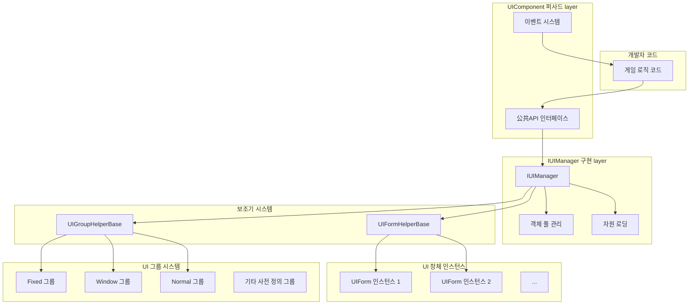
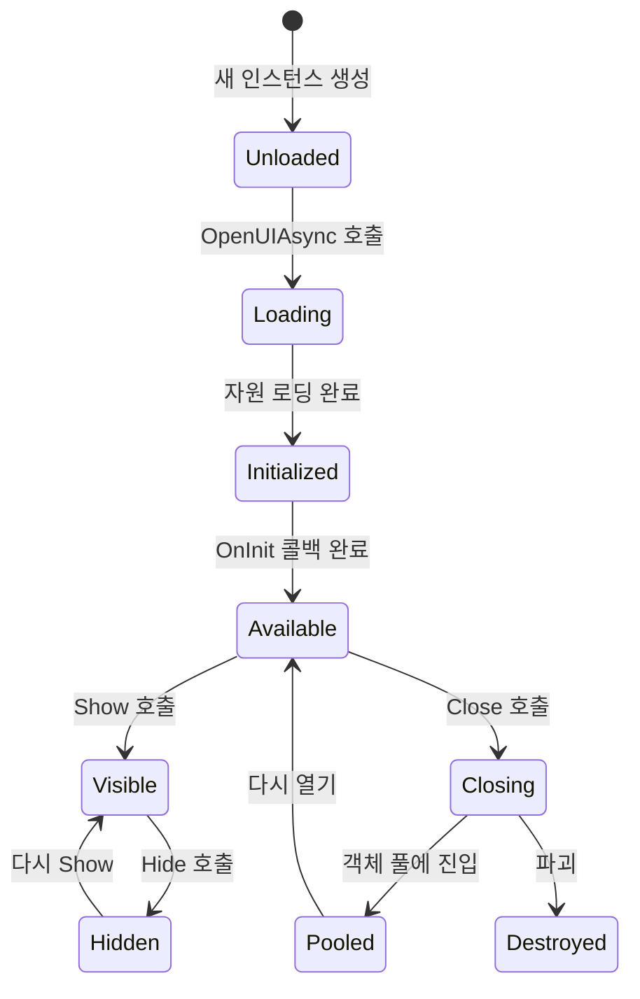
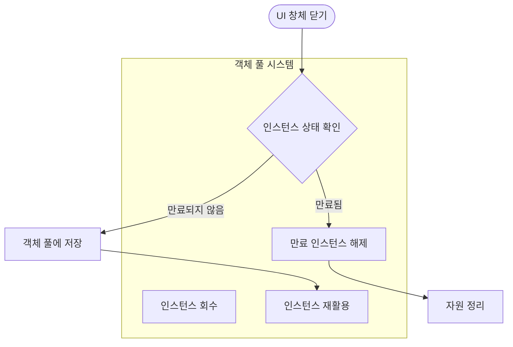
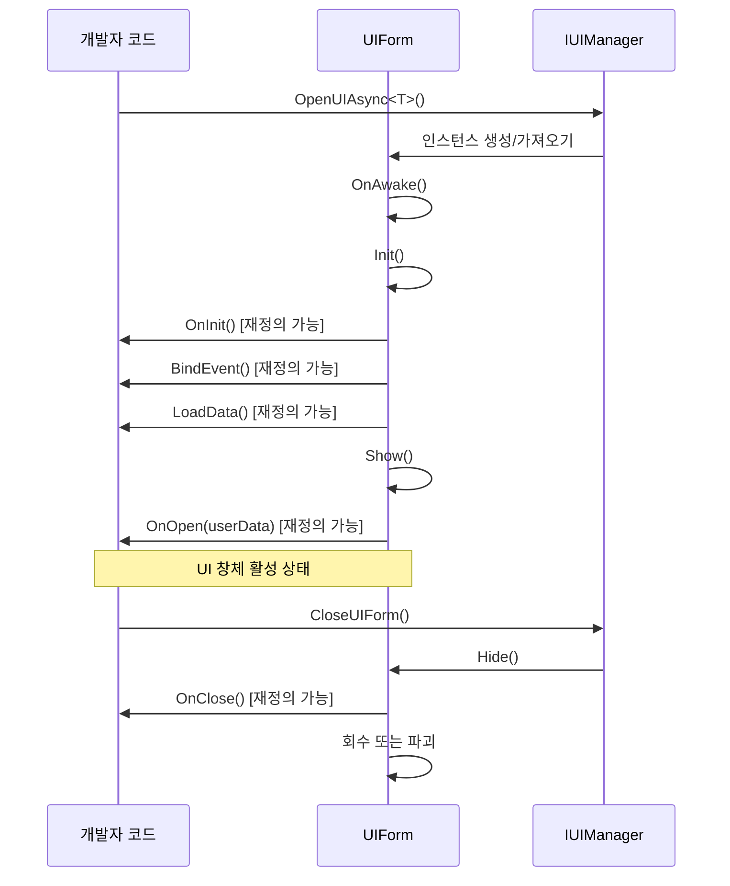

# UI 컴포넌트

UI 컴포넌트（UIComponent）는 GameFrameX 프레임워크에서 UI 창체를 관리하고 조작하는 핵심 컴포넌트입니다. 이는 UI 시스템의 퍼사드（Facade）로, 하위 `IUIManager`의 복잡한 구현을 캡슐화하여 개발자에게简洁한 API 인터페이스를 제공합니다.

## 개요

UIComponent는 Unity 컴포넌트（GameFrameworkComponent를 상속）로, 전체 게임 생명주기에서 UI 창체의 로딩, 표시, 숨김, 닫기 및 회수 등 모든管理工作을 담당합니다. 객체 풀 모드를 채택하여 UI 창체 인스턴스를 관리하며,频繁 생성销毁로 인한性能 오버헤드를 효과적으로 줄입니다.

UIComponent는 Unity 기본 UGUI와 서드파티 UI 프레임워크 FairyGUI를 포함한 다양한 UI 렌더링 솔루션을 지원합니다. 사전 정의된 18개의 UI 그룹（UIGroup）을 통해 정확한 계층 제어 및 가림 관계 관리를 실현할 수 있습니다.

**핵심 기능:**
- 비동기 로딩 및 UI 창체 열기
- 다양한 방식으로 UI 창체 닫기（직접 닫기, 지연 닫기, 그룹 닫기）
- UI 창체 객체 풀 관리
- UI 그룹 계층 제어
- 표시/숨김 애니메이션 지원
- 완전한 이벤트 시스템

> UIComponent는 UI 시스템의 핵심 진입점이며, 자세한 API 메서드 설명은 [UIComponent API 참고](./5-api-reference.ui-component)를 참조하세요.

## 아키텍처

UIComponent는 퍼사드 모드（Facade Pattern）설계를 채택하여 복잡한 UI 관리 로직을 내부에 캡슐화하고,简洁한 API만 개발자에게 노출합니다.



**아키텍처 설명:**

1. **퍼사드 layer（UIComponent）**: 통합된公共 API를 제공하며, 열기, 닫기, UI 창체 가져오기, UI 그룹 관리 등의 메서드를 포함합니다. 동시에 이벤트 분배를 담당합니다.

2. **구현 layer（IUIManager）**: 구체적인 비지니스 로직을 처리하며, UI 창체의 로딩, 캐시, 표시/숨김 상태 관리 등을 포함합니다.

3. **객체 풀 관리**: IObjectPoolManager를 사용하여 UI 창체 인스턴스의 재활용을 관리하며, 자동 회수 및 만료 해제를 지원합니다.

4. **보조기 layer**: UIFormHelperBase（UI 창체 인스턴스의 생성 및 파괴를 담당）및 UIGroupHelperBase（UI 그룹의 생성 및 관리를 담당）를 포함합니다.

5. **UI 창체 layer**: 실제 UI 창체 인스턴스로, UIForm 기본 클래스를 상속합니다.

6. **UI 그룹 layer**: 동일 계층 속성을 가진 UI 창체를 구성 및 관리하는 데 사용됩니다.

## 핵심 개념

### UI 창체（UIForm）

UI 창체는 UI 시스템이 관리하는 최소 단위입니다. 각 UI 창체는 `UIForm` 기본 클래스를 상속하며 `IUIForm` 인터페이스를 구현합니다. UI 창체는 다음 상태를 가집니다:

- **Available（사용 가능）**: 창체가 초기화 완료되어 표시될 수 있음
- **Visible（可见）**: 창체가 현재 표시 중임
- **FromPool（풀에서 옴）**: 창체 인스턴스가 객체 풀에서 가져온 것인지 여부



### UI 그룹 시스템

UI 그룹（UIGroup）은 유사한 표시 계층 특성을 가진 UI 창체를 구성하는 데 사용됩니다. 각 UI 그룹에는 깊이 값（Depth）이 있으며, 깊이 값이 클수록 계층이 높습니다（더 앞에 표시）.

**사전 정의된 18개의 UI 그룹:**

| UI 그룹 이름 | 깊이 값 | 용도 설명 |
|----------|--------|----------|
| Hidden | 40 | 숨김 layer, 임시 저장용 |
| Background | 35 | 배경 layer |
| Scene | 30 | 장면 layer |
| World | 27 | 세계 layer（3D 장면의 UI 등）|
| Battle | 25 | 전투 layer |
| Hud | 22 | 하늘 정보 layer |
| Map | 20 | 지도 layer |
| Floor | 15 | 바닥 layer |
| Normal | 10 | 일반 layer |
| Fixed | 0 | 고정 layer |
| Window | -10 | 창 layer |
| Tip | -15 | 힌트 layer |
| Guide | -20 | 안내 layer |
| BlackBoard | -22 | 블랙보드 layer |
| Dialogue | -23 | 대화 layer |
| Loading | -25 | 로딩 layer |
| Notify | -30 | 알림 layer |
| System | -35 | 시스템 layer（최고 우선순위）|

> UI 그룹에 대한 더 자세한 내용은 [UI 그룹 계층](./7-ui-group-hierarchy) 문서를 참조하세요.

### 객체 풀 관리

UIComponent는 강력한 객체 풀 관리 시스템을 내장했으며, 주요 매개변수는 다음과 같습니다:

- **InstanceCapacity**: 객체 풀 용량, 기본값 16
- **InstanceExpireTime**: 객체 만료 시간（초）, 기본값 60초
- **InstanceAutoReleaseInterval**: 자동 해제 간격（초）, 기본값 60초
- **RecycleInterval**: 회수 간격（초）, 기본값 60초
- **EnableAutoReleaseUIForm**: 자동 해제 활성화 여부, 기본값 활성화



## UI 창체 열기

### 기본 사용법

`OpenAsync<T>()` 메서드를 사용하여 UI 창체를 비동기적으로 열 수 있습니다:

```csharp
// 전체 화면 UI 열기
var mainMenuForm = await UIComponent.Instance.OpenFullScreenAsync<MainMenuForm>();

// 비전체 화면 UI 열기
var settingsForm = await UIComponent.Instance.OpenAsync<SettingsForm>(false);

// 사용자 데이터와 함께 열기
var dialogData = new DialogData { Title = "확인", Message = "확인하시겠습니까?" };
var confirmForm = await UIComponent.Instance.OpenAsync<ConfirmForm>(false, dialogData);
```

> UI 열기 API 메서드에 대한 더 자세한 내용은 [UIComponent API 참고 - Open 메서드](./5-api-reference.ui-component#open-메서드)를 참조하세요.

### UI 그룹 속성 사용

`[OptionUIGroup]` 특성을 사용하여 UI 창체에 소속 UI 그룹을 지정할 수 있습니다:

```csharp
[OptionUIGroup(UIGroupNameConstants.Window)]
public class MyWindowForm : UIForm
{
    // 창 내용
}
```

## UI 창체 닫기

### 단일 UI 닫기

```csharp
// 인스턴스로 닫기
var form = UIComponent.Instance.GetLoaded<SettingsForm>();
UIComponent.Instance.CloseUIForm(form);

// 유형으로 닫기（첫 번째 일치 항목 닫기）
UIComponent.Instance.CloseUIForm<SettingsForm>();

// 시퀀스 번호로 닫기
UIComponent.Instance.CloseUIForm(serialId);
```

### 복수 UI 닫기

```csharp
// 로드된 모든 UI 닫기
UIComponent.Instance.CloseAllLoadedUIForms();

// 지정된 UI 그룹의 모든 UI 닫기
UIComponent.Instance.CloseUIGroup(UIGroupNameConstants.Window);

// 로딩 중인 모든 UI 닫기
UIComponent.Instance.CloseAllLoadingUIForms();
```

## UI 창체 가져오기

### 로드된 UI 쿼리

```csharp
// 유형별로 단일 UI 가져오기
var form = UIComponent.Instance.GetLoaded<MainMenuForm>();

// 모든 해당 유형의 UI 가져오기
var forms = UIComponent.Instance.GetLoadedList<DialogForm>();

// 로드되고 표시 중인 UI 가져오기
var visibleForm = UIComponent.Instance.GetLoadedAndShowing<AlertForm>();

// 지정된 UI가 표시 중인지 확인
bool isShowing = UIComponent.Instance.HasLoadedAndShowing("AlertForm");
```

### 모든 UI 가져오기

```csharp
// 로드된 모든 UI 가져오기
var allForms = UIComponent.Instance.GetAllLoadedUIForms();

// 로딩 중인 모든 UI의 시퀀스 번호 가져오기
var loadingIds = UIComponent.Instance.GetAllLoadingUIFormSerialIds();
```

## UI 그룹 관리

### 사용자 정의 UI 그룹 추가

```csharp
// 새 UI 그룹 추가
bool success = UIComponent.Instance.AddUIGroup("CustomGroup", 5);
```

### UI 그룹 쿼리

```csharp
// UI 그룹 존재 여부 확인
bool exists = UIComponent.Instance.HasUIGroup("Window");

// UI 그룹 가져오기
var group = UIComponent.Instance.GetUIGroup("Window");

// 모든 UI 그룹 가져오기
var allGroups = UIComponent.Instance.GetAllUIGroups();

// UI 그룹 수 가져오기
int count = UIComponent.Instance.UIGroupCount;
```

## 구성 옵션

UIComponent는 풍부한 구성 옵션을 제공하며, Inspector 패널 또는 코드를 통해 설정할 수 있습니다:

| 구성 항목 | 유형 | 기본값 | 설명 |
|--------|------|--------|------|
| EnableAutoReleaseUIForm | bool | true | UI 자동 해제 활성화 여부 |
| EnableCloseUIFormCompleteEvent | bool | true | UI 닫기 시 완료 이벤트 트리거 여부 |
| IsEnableUIShowAnimation | bool | false | UI 표시 애니메이션 활성화 여부 |
| IsEnableUIHideAnimation | bool | false | UI 숨김 애니메이션 활성화 여부 |
| InstanceAutoReleaseInterval | float | 60f | UI 인스턴스 자동 해제 간격（초）|
| InstanceCapacity | int | 16 | UI 인스턴스 객체 풀 용량 |
| InstanceExpireTime | float | 60f | UI 인스턴스 만료 시간（초）|
| RecycleInterval | int | 60 | UI 회수 간격（초）|
| UGUIRoot | Transform | null | UGUI 루트 노드 |
| FairyGUIRoot | Transform | null | FairyGUI 루트 노드 |

### 코드 구성 예제

```csharp
// 자동 해제 비활성화
UIComponent.Instance.EnableAutoReleaseUIForm = false;

// 객체 풀 용량 설정
UIComponent.Instance.InstanceCapacity = 32;

// 인스턴스 만료 시간 설정
UIComponent.Instance.InstanceExpireTime = 120f;

// 회수 간격 설정
UIComponent.Instance.RecycleInterval = 30;
```

## UI 창체 생명주기

UI 창체는 완전한 생명주기를 가지며, 개발자는 해당 메서드를 재정의하여 상태 변경에 대응할 수 있습니다:



### 재정의 가능한 메서드

사용자 정의 UIForm에서 다음 메서드를 재정의하여 생명주기 이벤트를 처리할 수 있습니다:

| 메서드 | 호출 타이밍 | 용도 |
|------|----------|------|
| `OnAwake()` | 인스턴스 생성 후, 초기화 전 | Awake 로직 실행 |
| `OnInit()` | UI 창체 최초 초기화 시 | UI 컴포넌트 초기화 |
| `BindEvent()` | 초기화 시 | 이벤트 리스너 바인딩 |
| `LoadData()` | 초기화 시 | 데이터 로딩 |
| `OnOpen(object userData)` | UI 창체 열릴 때 | 열기 로직 처리 |
| `OnClose(bool isShutdown, object userData)` | UI 창체 닫힐 때 | 닫기 로직 처리 |
| `OnPause()` | UI 가려질 때 | 일시 정지 로직 처리 |
| `OnResume()` | UI 표시 복원될 때 | 복원 로직 처리 |
| `OnUpdate(float elapseSeconds, float realElapseSeconds)` | 매 프레임 업데이트 | 업데이트 로직 실행 |
| `UpdateLocalization()` | 언어 변경 시 | 현지화 텍스트 업데이트 |

## 이벤트 시스템

UIComponent는 완전한 이벤트 시스템을 제공하여 UI 창체의 상태 변경을 모니터링합니다:

### 구독 가능한 이벤트

| 이벤트 이름 | 설명 | 이벤트 매개변수 |
|----------|------|----------|
| `OpenUIFormSuccess` | UI 창체 열기 성공 | OpenUIFormSuccessEventArgs |
| `OpenUIFormFailure` | UI 창체 열기 실패 | OpenUIFormFailureEventArgs |
| `CloseUIFormComplete` | UI 창체 닫기 완료 | CloseUIFormCompleteEventArgs |

### 이벤트 사용 예제

```csharp
// 열기 성공 이벤트 구독
UIComponent.Instance.OpenUIFormSuccess += OnOpenSuccess;

private void OnOpenSuccess(object sender, OpenUIFormSuccessEventArgs e)
{
    Debug.Log($"UI 열기 성공: {e.UIFormAssetName}");
}

// 닫기 완료 이벤트 구독
UIComponent.Instance.CloseUIFormComplete += OnCloseComplete;

private void OnCloseComplete(object sender, CloseUIFormCompleteEventArgs e)
{
    Debug.Log($"UI 닫기 완료: {e.UIFormSerialId}");
}
```

> 이벤트 시스템의 자세한 설명은 [이벤트 시스템](./6-event-system) 문서를 참조하세요.

## 관련 링크

- [UIComponent API 참고](./5-api-reference.ui-component) - 완전한 API 메서드 설명
- [UI 창체](./4-core-concepts.ui-form) - UIForm 기본 클래스 상세
- [UI 그룹 시스템](./4-core-concepts.ui-group) - UI 그룹 관리 상세
- [객체 풀 관리](./4-core-concepts.object-pool) - 객체 풀 메커니즘 상세
- [UI 그룹 계층](./7-ui-group-hierarchy) - UI 그룹 계층 상세 설명
- [UI 속성](./8-configuration.attributes) - UI 관련 특성 설명