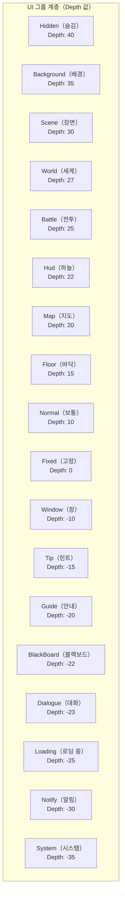

# UI 속성

이 문서는 GameFrameX UI 시스템에서 UI 창체 및 컴포넌트를 구성하는 데 사용되는 다양한 특성（Attribute）및 직렬화 속성을 소개합니다.

## 개요

GameFrameX UI 시스템은 풍부한 속성 구성 메커니즘을 제공하여 개발자가 특성（Attribute）및 직렬화 필드를 통해 UI 창체의 동작을 구성할 수 있도록 합니다. 주요 구성 측면은 다음과 같습니다:

1. **UI 구성 속성** - UI 자원 위치 및 로딩 방식 정의
2. **UI 그룹 속성** - UI를 다른 계층 그룹에 할당
3. **애니메이션 속성** - UI의 표시 및 숨김 애니메이션 구성
4. **UIComponent 전역 속성** - UI 시스템의 전체 동작 제어
5. **UIForm 창체 속성** - 개별 창체의 동작 제어

## UI 구성 특성 (Attributes)

### OptionUIConfigAttribute

UI 구성을 표시하는 특성 클래스로, FairyGUI와 UGUI 두 가지 UI 프레임워크를 지원합니다. 패키지 이름 또는 경로를 지정하여 UI 자원의 자동 위치 지정 및 로딩을 구현합니다.

```csharp
[OptionUIConfigAttribute(packageName: "MainPackage", path: "UI/Prefabs/MainForm")]
public class MainForm : UIForm
{
    // ...
}
```

> Source: [OptionUIConfigAttribute.cs](https://github.com/GameFrameX/com.gameframex.unity.ui/blob/main/Runtime/Attribute/OptionUIConfigAttribute.cs#L42-L108)

**속성 설명:**

| 속성 | 유형 | 설명 |
|------|------|------|
| `PackageName` | string | FairyGUI가 사용하는 패키지 이름으로, FairyGUI UI 자원 패키지 위치를 지정하는 데 사용됩니다 |
| `Path` | string | UGUI가 사용하는 자원 경로로, UGUI UI 프리팹 또는 자원 위치를 지정하는 데 사용됩니다 |
| `IsResource` | bool | 자원 경로 여부인지입니다. true이면 Path가 자원 경로이고, false이면 Path가 UI 프리팹 경로입니다 |

**생성자:**

```csharp
// 방식 1: 패키지 이름 및 경로 지정
public OptionUIConfigAttribute(string packageName = null, string path = null)

// 방식 2: 자원 경로 여부 지정
public OptionUIConfigAttribute(bool isResource = false)
```

---

### OptionUIGroupAttribute

클래스에 UI 옵션 그룹을 지정하는 특성입니다. 클래스에만 적용할 수 있으며, 그룹 이름은 비어 있을 수 없습니다.

```csharp
[OptionUIGroupAttribute("Dialog")]
public class DialogForm : UIForm
{
    // ...
}
```

> Source: [OptionUIGroupAttribute.cs](https://github.com/GameFrameX/com.gameframex.unity.ui/blob/main/Runtime/Attribute/OptionUIGroupAttribute.cs#L42-L73)

**속성 설명:**

| 속성 | 유형 | 설명 |
|------|------|------|
| `GroupName` | string | 그룹 이름으로, UI를 특정 UI 그룹에 할당하는 데 사용됩니다 |

---

### OptionUIShowAnimationAttribute

UI 열기 시 재생할 애니메이션을 지정하는 특성입니다. 클래스에 적용할 수 있으며, 애니메이션 이름과 애니메이션 활성화 여부를 지정합니다.

```csharp
// "FadeIn" 표시 애니메이션 활성화
[OptionUIShowAnimationAttribute("FadeIn")]
public class MainForm : UIForm
{
    // ...
}

// 표시 애니메이션 비활성화
[OptionUIShowAnimationAttribute(false)]
public class TipForm : UIForm
{
    // ...
}
```

> Source: [OptionUIShowAnimationAttribute.cs](https://github.com/GameFrameX/com.gameframex.unity.ui/blob/main/Runtime/Attribute/OptionUIShowAnimationAttribute.cs#L42-L94)

**속성 설명:**

| 속성 | 유형 | 설명 |
|------|------|------|
| `AnimationName` | string | 애니메이션 이름으로, 재생할 애니메이션 이름을 지정합니다 |
| `Enable` | bool | 애니메이션 활성화 여부로, 기본값은 true입니다 |

**생성자:**

```csharp
public OptionUIShowAnimationAttribute(string animationName, bool enable = true)
public OptionUIShowAnimationAttribute(bool enable = true)
```

---

### OptionUIHideAnimationAttribute

UI 닫기 시 재생할 애니메이션을 지정하는 특성입니다. 클래스에 적용할 수 있으며, 애니메이션 이름과 애니메이션 활성화 여부를 지정합니다.

```csharp
// "FadeOut" 숨김 애니메이션 활성화
[OptionUIHideAnimationAttribute("FadeOut")]
public class MainForm : UIForm
{
    // ...
}

// 숨김 애니메이션 비활성화
[OptionUIHideAnimationAttribute(false)]
public class TipForm : UIForm
{
    // ...
}
```

> Source: [OptionUIHideAnimationAttribute.cs](https://github.com/GameFrameX/com.gameframex.unity.ui/blob/main/Runtime/Attribute/OptionUIHideAnimationAttribute.cs#L42-L94)

**속성 설명:**

| 속성 | 유형 | 설명 |
|------|------|------|
| `AnimationName` | string | 애니메이션 이름으로, 재생할 애니메이션 이름을 지정합니다 |
| `Enable` | bool | 애니메이션 활성화 여부로, 기본값은 true입니다 |

---

## UIComponent 전역 속성

UIComponent는 UI 시스템의 핵심 컴포넌트로, 전역 UI 구성 옵션을 제공합니다. 이 속성들은 Unity의 SerializeField 특성을 통해 Inspector 패널에서 보이고 구성할 수 있습니다.

> Source: [UIComponent.cs](https://github.com/GameFrameX/com.gameframex.unity.ui/blob/main/Runtime/UIComponent.cs#L48-L226)

### 이벤트 제어 속성

| 속성 | 유형 | 기본값 | 설명 |
|------|------|--------|------|
| `EnableOpenUIFormSuccessEvent` | bool | true | 인터페이스 열기 성공 이벤트 활성화 여부입니다. 활성화하면 인터페이스가 성공적으로 열릴 때 해당 이벤트가 트리거됩니다 |
| `EnableOpenUIFormFailureEvent` | bool | true | 인터페이스 열기 실패 이벤트 활성화 여부입니다. 활성화하면 인터페이스 열기 실패 시 해당 이벤트가 트리거됩니다 |
| `EnableCloseUIFormCompleteEvent` | bool | true | 인터페이스 닫기 완료 이벤트 활성화 여부입니다. 활성화하면 인터페이스 닫기 완료 시 해당 이벤트가 트리거됩니다 |

### 객체 풀 속성

| 속성 | 유형 | 기본값 | 설명 |
|------|------|--------|------|
| `EnableAutoReleaseUIForm` | bool | true | 자동 회수 인터페이스 활성화 여부입니다. 비활성화하면 인터페이스 닫을 때 자원이 자동으로 해제되지 않습니다 |
| `InstanceAutoReleaseInterval` | float | 60f | 인터페이스 인스턴스 객체 풀의 자동 해제 간격（초）입니다 |
| `InstanceCapacity` | int | 16 | 인터페이스 인스턴스 객체 풀의 용량으로, 풀에서 캐시할 수 있는 최대 인터페이스 인스턴스 수입니다 |
| `InstanceExpireTime` | float | 60f | 인터페이스 인스턴스 객체 풀 객체 만료 시간（초）으로, 인터페이스 닫은 후 이 시간 내 재사용할 수 있습니다 |
| `RecycleInterval` | int | 60 | 인터페이스 회수 간격 시간（초）입니다 |

### 애니메이션 속성

| 속성 | 유형 | 기본값 | 설명 |
|------|------|--------|------|
| `IsEnableUIShowAnimation` | bool | false | UI 표시 애니메이션 활성화 여부 |
| `IsEnableUIHideAnimation` | bool | false | UI 숨김 애니메이션 활성화 여부 |

### 루트 노드 속성

| 속성 | 유형 | 설명 |
|------|------|------|
| `UGUIRoot` | Transform | UGUI 루트 노드 |
| `FairyGUIRoot` | Transform | FairyGUI 루트 노드 |

### 보조기 속성

| 속성 | 유형 | 설명 |
|------|------|------|
| `UIFormHelperTypeName` | string | UI 폼 보조기 유형 이름 |
| `CustomUIFormHelper` | UIFormHelperBase | 사용자 정의 UI 폼 보조기 |
| `UIGroupHelperTypeName` | string | UI 그룹 보조기 유형 이름 |
| `CustomUIGroupHelper` | UIGroupHelperBase | 사용자 정의 UI 그룹 보조기 |

### UI 그룹 구성

| 속성 | 유형 | 설명 |
|------|------|------|
| `UIGroups` | UIGroup[] | UI 그룹 배열로, 기본값으로 18개의 사전 정의 그룹이 포함됩니다 |

---

## UIForm 창체 속성

UIForm은 모든 UI 창체의 기본 클래스로, 창체 실행 시 다양한 상태 속성을 포함합니다.

> Source: [UIForm.cs](https://github.com/GameFrameX/com.gameframex.unity.ui/blob/main/Runtime/UIForm.cs#L47-L856)

### 상태 속성（실행 시）

| 속성 | 유형 | 설명 |
|------|------|------|
| `Available` | bool | 인터페이스 사용 가능 여부 |
| `Visible` | bool | 인터페이스 표시 여부 |
| `SerialId` | int | 인터페이스 시퀀스 번호 |
| `Name` | string | 인터페이스 이름 |
| `FullName` | string | 인터페이스 완전한 이름（네임스페이스 포함）|
| `UIFormAssetName` | string | 인터페이스 자원 이름 |
| `AssetPath` | string | 인터페이스 자원 경로 |
| `IsAwake` | bool | 인터페이스가 깨워졌는지 여부 |
| `IsFromPool` | bool | 인터페이스가 객체 풀에서 왔는지 여부 |
| `IsDisposed` | bool | 인터페이스가 이미 파괴되었는지 여부 |

### 동작 제어 속성

| 속성 | 유형 | 기본값 | 설명 |
|------|------|--------|------|
| `IsDisableRecycling` | bool | false | 회수 비활성화 여부으로, 회수 비활성화된 인터페이스는 회수되지 않습니다 |
| `IsDisableClosing` | bool | false | 닫기 비활성화 여부으로, 닫기 비활성화된 인터페이스는 닫히지 않습니다 |
| `IsCenter` | bool | false | 컴포넌트 중앙 정렬 활성화 여부으로, 컴포넌트 생성 후 기본 부모 컴포넌트가 중앙에 위치합니다 |
| `PauseCoveredUIForm` | bool | true | 덮어지는 인터페이스 일시 정지 여부 |
| `RecycleInterval` | int | - | 인터페이스 회수 간격으로, 단위: 초 |

### 애니메이션 속성

| 속성 | 유형 | 설명 |
|------|------|------|
| `EnableShowAnimation` | bool | 표시 애니메이션 활성화 여부 |
| `ShowAnimationName` | string | 표시 애니메이션 이름 |
| `EnableHideAnimation` | bool | 숨김 애니메이션 활성화 여부 |
| `HideAnimationName` | string | 숨김 애니메이션 이름 |

### 계층 속성

| 속성 | 유형 | 설명 |
|------|------|------|
| `DepthInUIGroup` | int | 인터페이스가 인터페이스 그룹 내의 깊이 |
| `UIGroup` | IUIGroup | 인터페이스가 소속된 인터페이스 그룹 |

---

## UI 그룹 계층 상수

GameFrameX UI 시스템은 18개의 사전 정의 UI 그룹을 제공하며, 각 그룹에는 대응하는 깊이 값（Depth）및 이름（Name）이 있습니다.



> Source: [UIGroupConstants.cs](https://github.com/GameFrameX/com.gameframex.unity.ui/blob/main/Runtime/UIGroupConstants.cs#L38-L202)

**UI 그룹 깊이 설명:**
- 깊이 값이 클수록 UI가 더 앞에 표시됩니다（가림 관계）
- 사전 정의 그룹의 깊이는 40에서 -35까지로, 게임의 다양한 UI 시나리오를 포괄합니다
- Depth 값이 클수록 화면 바깥에 가까릅니다（가장 위층）, 음수는 화면 안쪽에 가까습니다（가장 아래층）

---

## 사용 예제

### 완전한 구성 예제

다음 예제는 사용자 정의 UI 창체 클래스에서 다양한 특성을 사용하는 방법을 보여줍니다:

```csharp
using GameFrameX.UI.Runtime;

// UI 구성 특성: FairyGUI 패키지 이름 및 UGUI 경로 지정
// UI 그룹 특성: 이 창체를 Window 그룹에 할당
[OptionUIConfigAttribute(packageName: "GameUI", path = "UI/Forms/MainMenu")]
[OptionUIGroupAttribute("Window")]
// 표시 애니메이션 특성: "FadeIn" 애니메이션 사용, 활성화 상태
[OptionUIShowAnimationAttribute("FadeIn", true)]
// 숨김 애니메이션 특성: "FadeOut" 애니메이션 사용, 활성화 상태
[OptionUIHideAnimationAttribute("FadeOut", true)]
public class MainMenuForm : UIForm
{
    protected override void OnOpen(object userData)
    {
        base.OnOpen(userData);
        // 인터페이스 열기 로직
    }
    
    protected override void OnClose(bool isShutdown, object userData)
    {
        // 인터페이스 닫기 로직
        base.OnClose(isShutdown, userData);
    }
}
```

### 코드를 통한 동적 속성 설정

특성 외에 런타임에 동적으로 UI 창체 속성을 설정할 수도 있습니다:

```csharp
// UI 열기 시 사용자 데이터를 전달하고, UIForm의 OnOpen에서 처리
GameEntry.UI.OpenUIForm<MainMenuForm>(userData: new MainMenuData 
{ 
    EnableShowAnimation = true,
    ShowAnimationName = "CustomFadeIn"
});

// UIForm에서 애니메이션 동적 설정
public class CustomForm : UIForm
{
    public override void OnOpen(object userData)
    {
        if (userData is MainMenuData data)
        {
            EnableShowAnimation = data.EnableShowAnimation;
            ShowAnimationName = data.ShowAnimationName;
        }
    }
}
```

---

## 관련 링크

- [에디터 구성](./8-configuration.editor) - Unity 에디터에서의 UI 시스템 구성 방법
- [UI 컴포넌트](./4-core-concepts.ui-component) - UIComponent 컴포넌트의 상세 설명
- [UI 창체](./4-core-concepts.ui-form) - UIForm 창체의 상세 설명
- [UI 그룹 시스템](./4-core-concepts.ui-group) - UI 그룹 시스템의 상세 설명
- [이벤트 시스템](./6-event-system) - UI 이벤트 시스템