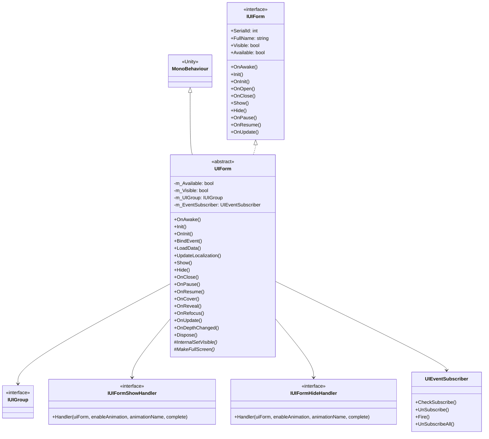
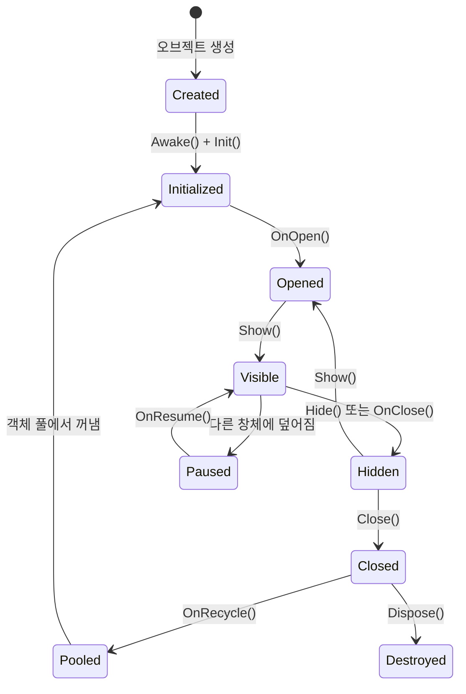

# UIForm

UIForm은 GameFrameX 프레임워크에서 모든 UI 창체의 기본 클래스로, 창체의 생명주기 관리, 가시성 제어, 이벤트 구독 및 UI 그룹 통합 기능을 제공합니다.

## 개요

UIForm은 UI 시스템의 핵심 클래스로, Unity의 `MonoBehaviour`를 상속하고 `IUIForm` 인터페이스를 구현합니다. UI 창체에 완전한 생명주기 관리를 제공하며, 초기화, 표시, 숨김, 닫기, 일시 정지, 복원 등의 상태 전환을 포함합니다.

**주요 특성:**
- 완전한生命周期 콜백 메커니즘
- 내장 이벤트 구독 시스템
- 표시/숨김 애니메이션 지원
- 객체 풀 회수 메커니즘
- UI 그룹 깊이 관리
- 현지화 언어 자동 업데이트

## 클래스 관계도



## 생명주기 흐름



## 핵심 속성

| 속성 | 유형 | 설명 |
|------|------|------|
| SerialId | int | 창체의 고유 시퀀스 번호 |
| FullName | string | 창체의 완전한 클래스 이름 |
| Name | string | 창체 이름（GameObject 이름에 대응）|
| Available | bool | 창체 사용 가능 여부 |
| Visible | bool | 창체 표시 여부 |
| UIGroup | IUIGroup | 소속된 UI 그룹 |
| DepthInUIGroup | int | UI 그룹 내의 깊이 |
| PauseCoveredUIForm | bool | 덮어지는 창체 일시 정지 여부 |
| IsAwake | bool | Awake 실행 여부 |
| IsDisableRecycling | bool | 회수 비활성화 여부 |
| IsDisableClosing | bool | 닫기 비활성화 여부 |
| IsCanRecycle | bool | 회수 가능한지 여부 |
| EnableShowAnimation | bool | 표시 애니메이션 활성화 여부 |
| EnableHideAnimation | bool | 숨김 애니메이션 활성화 여부 |
| UserData | object | 사용자 정의 데이터 |

## 핵심 메서드

### 초기화 흐름

#### `OnAwake()` - 깨우기 콜백

Unity 생명주기 메서드로, 오브젝트 생성 시 호출됩니다. 이벤트 구독 초기화 및 현지화 언어 변경 이벤트 구독에 사용됩니다.

```csharp
public override void OnAwake()
{
    IsAwake = true;
}
```
> Source: [UIForm.cs](https://github.com/GameFrameX/com.gameframex.unity.ui/blob/main/Runtime/UIForm.cs#L433-L436)

#### `Init(...)` - 초기화 메서드

UI 창체를 초기화하며, UI 관리자가 호출합니다.

**매개변수:**
- `serialId` (int): 창체 시퀀스 번호
- `uiFormAssetPath` (string): 창체 자원 경로
- `uiFormAssetName` (string): 창체 자원 이름
- `uiGroup` (IUIGroup): 소속된 UI 그룹
- `onInitAction` (Action~IUIForm~): 초기화 전 실행할委托
- `pauseCoveredUIForm` (bool): 덮어지는 창체 일시 정지 여부
- `isNewInstance` (bool): 새 인스턴스인지 여부
- `userData` (object): 사용자 정의 데이터
- `recycleInterval` (int): 회수 간격（초）
- `isFullScreen` (bool): 전체 화면인지 여부

```csharp
public void Init(int serialId, string uiFormAssetPath, string uiFormAssetName, IUIGroup uiGroup, 
    Action<IUIForm> onInitAction, bool pauseCoveredUIForm, bool isNewInstance, 
    object userData, int recycleInterval, bool isFullScreen = false)
```
> Source: [UIForm.cs](https://github.com/GameFrameX/com.gameframex.unity.ui/blob/main/Runtime/UIForm.cs#L555-L599)

#### `OnInit()` - 초기화 완료 콜백

초기화 완료 후 콜백으로, 상속 클래스가 초기화 로직을 재정의할 수 있습니다.

```csharp
public virtual void OnInit()
{
}
```
> Source: [UIForm.cs](https://github.com/GameFrameX/com.gameframex.unity.ui/blob/main/Runtime/UIForm.cs#L608-L610)

### 표시와 숨김

#### `OnOpen(object userData)` - 열기 콜백

창체가 열릴 때 호출됩니다.

```csharp
public virtual void OnOpen(object userData)
{
    m_Available = true;
    Visible = true;
    m_UserData = userData;
}
```
> Source: [UIForm.cs](https://github.com/GameFrameX/com.gameframex.unity.ui/blob/main/Runtime/UIForm.cs#L639-L644)

#### `Show(IUIFormShowHandler handler, Action complete)` - 표시 메서드

창체를 표시하며, 시스템이 표시 애니메이션을 호출합니다.

**매개변수:**
- `handler` (IUIFormShowHandler): 표시 처리 인터페이스
- `complete` (Action): 완료 콜백

```csharp
public abstract void Show(IUIFormShowHandler handler, Action complete);
```
> Source: [UIForm.cs](https://github.com/GameFrameX/com.gameframex.unity.ui/blob/main/Runtime/UIForm.cs#L689)

#### `Hide(IUIFormHideHandler handler, Action complete)` - 숨김 메서드

창체를 숨기며, 시스템이 숨김 애니메이션을 호출합니다.

**매개변수:**
- `handler` (IUIFormHideHandler): 숨김 처리 인터페이스
- `complete` (Action): 완료 콜백

```csharp
public abstract void Hide(IUIFormHideHandler handler, Action complete);
```
> Source: [UIForm.cs](https://github.com/GameFrameX/com.gameframex.unity.ui/blob/main/Runtime/UIForm.cs#L724)

#### `OnClose(bool isShutdown, object userData)` - 닫기 콜백

창체가 닫힐 때 호출됩니다.

**매개변수:**
- `isShutdown` (bool): UI 관리자 닫을 때 트리거되는지 여부
- `userData` (object): 사용자 정의 데이터

```csharp
public virtual void OnClose(bool isShutdown, object userData)
{
    gameObject?.SetLayerRecursively(m_OriginalLayer);
    m_Available = false;
    Visible = false;
    if (m_IsDisableRecycling)
    {
        return;
    }
    ReleaseStartTime = DateTime.Now;
}
```
> Source: [UIForm.cs](https://github.com/GameFrameX/com.gameframex.unity.ui/blob/main/Runtime/UIForm.cs#L700-L712)

### 일시 정지와 복원

#### `OnPause()` - 일시 정지 콜백

창체가 다른 창체에 덮어질 때 호출됩니다.

```csharp
public virtual void OnPause()
{
    m_Available = false;
    Visible = false;
}
```
> Source: [UIForm.cs](https://github.com/GameFrameX/com.gameframex.unity.ui/blob/main/Runtime/UIForm.cs#L733-L737)

#### `OnResume()` - 복원 콜백

창체가 일시 정지 상태에서 복원될 때 호출됩니다.

```csharp
public virtual void OnResume()
{
    m_Available = true;
    Visible = true;
}
```
> Source: [UIForm.cs](https://github.com/GameFrameX/com.gameframex.unity.ui/blob/main/Runtime/UIForm.cs#L746-L750)

### 가림 처리

#### `OnCover()` - 가림 콜백

창체가 다른 창체에 가려질 때 호출됩니다.

```csharp
public virtual void OnCover()
{
}
```
> Source: [UIForm.cs](https://github.com/GameFrameX/com.gameframex.unity.ui/blob/main/Runtime/UIForm.cs#L759-L761)

#### `OnReveal()` - 가림 해제 콜백

창체가 가림 상태에서 복원될 때 호출됩니다.

```csharp
public virtual void OnReveal()
{
}
```
> Source: [UIForm.cs](https://github.com/GameFrameX/com.gameframex.unity.ui/blob/main/Runtime/UIForm.cs#L770-L772)

### 기타 콜백

#### `OnRefocus(object userData)` - 활성화 콜백

창체가 활성화될 때 호출되며, 창체를 맨 위로 다시 이동하는 데 사용됩니다.

```csharp
public virtual void OnRefocus(object userData)
{
}
```
> Source: [UIForm.cs](https://github.com/GameFrameX/com.gameframex.unity.ui/blob/main/Runtime/UIForm.cs#L782-L784)

#### `OnUpdate(float elapseSeconds, float realElapseSeconds)` - 폴링 콜백

매 프레임 호출되는 폴링 메서드입니다.

**매개변수:**
- `elapseSeconds` (float): 로직 경과 시간（초）
- `realElapseSeconds` (float): 실제 경과 시간（초）

```csharp
public virtual void OnUpdate(float elapseSeconds, float realElapseSeconds)
{
}
```
> Source: [UIForm.cs](https://github.com/GameFrameX/com.gameframex.unity.ui/blob/main/Runtime/UIForm.cs#L795-L797)

#### `OnDepthChanged(int uiGroupDepth, int depthInUIGroup)` - 깊이 변경 콜백

창체 깊이가 변경될 때 호출됩니다.

**매개변수:**
- `uiGroupDepth` (int): UI 그룹 깊이
- `depthInUIGroup` (int): UI 그룹 내의 창체 깊이

```csharp
public void OnDepthChanged(int uiGroupDepth, int depthInUIGroup)
{
    m_DepthInUIGroup = depthInUIGroup;
}
```
> Source: [UIForm.cs](https://github.com/GameFrameX/com.gameframex.unity.ui/blob/main/Runtime/UIForm.cs#L808-L811)

### 이벤트 시스템

#### `OnEventSubscribe()` - 이벤트 구독 콜백

`OnEnable` 시 호출되며, 이벤트 구독에 사용됩니다. 상속 클래스가 필요한 이벤트를 등록하기 위해 이 메서드를 재정의할 수 있습니다.

```csharp
protected virtual void OnEventSubscribe()
{
}
```
> Source: [UIForm.cs](https://github.com/GameFrameX/com.gameframex.unity.ui/blob/main/Runtime/UIForm.cs#L508-L510)

#### `OnEventUnSubscribe()` - 이벤트 구독 취소 콜백

`OnDisable` 시 호출되며, 이벤트 구독 취소에 사용됩니다.

```csharp
protected virtual void OnEventUnSubscribe()
{
}
```
> Source: [UIForm.cs](https://github.com/GameFrameX/com.gameframex.unity.ui/blob/main/Runtime/UIForm.cs#L523-L525)

### 회수와 파괴

#### `OnRecycle()` - 회수 콜백

창체가 회수될 때 호출되며, 창체 상태를 초기화합니다.

```csharp
public virtual void OnRecycle()
{
    m_DepthInUIGroup = 0;
    m_PauseCoveredUIForm = true;
}
```
> Source: [UIForm.cs](https://github.com/GameFrameX/com.gameframex.unity.ui/blob/main/Runtime/UIForm.cs#L625-L629)

#### `Dispose()` - 파괴 메서드

창체를 파괴하고 모든 자원을 해제합니다.

```csharp
public virtual void Dispose()
{
    if (IsDisposed)
    {
        return;
    }
    if (m_EventSubscriber != null)
    {
        m_EventSubscriber.UnSubscribeAll();
        ReferencePool.Release(m_EventSubscriber);
    }
    m_EventSubscriber = null;
    IsDisposed = true;
}
```
> Source: [UIForm.cs](https://github.com/GameFrameX/com.gameframex.unity.ui/blob/main/Runtime/UIForm.cs#L820-L835)

### 하위 클래스 구현 필요 메서드

#### `InternalSetVisible(bool visible)` - 가시성 설정

하위 클래스에서 실제 가시성 설정을 처리하기 위해 이 메서드를 구현해야 합니다.

```csharp
protected abstract void InternalSetVisible(bool visible);
```
> Source: [UIForm.cs](https://github.com/GameFrameX/com.gameframex.unity.ui/blob/main/Runtime/UIForm.cs#L845)

#### `MakeFullScreen()` - 전체 화면 설정

하위 클래스에서 전체 화면 설정을 처리하기 위해 이 메서드를 구현해야 합니다.

```csharp
protected internal abstract void MakeFullScreen();
```
> Source: [UIForm.cs](https://github.com/GameFrameX/com.gameframex.unity.ui/blob/main/Runtime/UIForm.cs#L854)

## 사용 예제

### 사용자 정의 UIForm 생성

```csharp
using GameFrameX.UI.Runtime;
using UnityEngine;

public class MainMenuForm : UIForm
{
    [SerializeField] private Text titleText;
    [SerializeField] private Button startButton;
    [SerializeField] private Button settingsButton;

    protected override void InternalSetVisible(bool visible)
    {
        gameObject.SetActive(visible);
    }

    protected internal override void MakeFullScreen()
    {
        // 전체 화면 로직 구현
    }

    public override void OnInit()
    {
        base.OnInit();
        Debug.Log("MainMenuForm 초기화 완료");
    }

    public override void BindEvent()
    {
        startButton.onClick.AddListener(OnStartButtonClick);
        settingsButton.onClick.AddListener(OnSettingsButtonClick);
    }

    public override void LoadData()
    {
        // 데이터 로딩
        titleText.text = GetLocalizedString("MainMenu_Title");
    }

    private void OnStartButtonClick()
    {
        // 시작 버튼 클릭 처리
    }

    private void OnSettingsButtonClick()
    {
        // 설정 버튼 클릭 처리
    }

    public override void UpdateLocalization()
    {
        base.UpdateLocalization();
        titleText.text = GetLocalizedString("MainMenu_Title");
    }
}
```
> Source: [UIForm.cs](https://github.com/GameFrameX/com.gameframex.unity.ui/blob/main/Runtime/UIForm.cs#L37-L855)

### 이벤트 구독 예제

```csharp
public override void OnEventSubscribe()
{
    // 게임 이벤트 구독
    EventSubscriber.CheckSubscribe(PlayerHealthChangedEventArgs.EventId, OnPlayerHealthChanged);
}

private void OnPlayerHealthChanged(object sender, GameEventArgs e)
{
    var args = (PlayerHealthChangedEventArgs)e;
    UpdateHealthBar(args.CurrentHealth, args.MaxHealth);
}

protected override void OnEventUnSubscribe()
{
    // 구독 취소
    EventSubscriber.UnSubscribe(PlayerHealthChangedEventArgs.EventId, OnPlayerHealthChanged);
}
```
> Source: [UIForm.cs](https://github.com/GameFrameX/com.gameframex.unity.ui/blob/main/Runtime/UIForm.cs#L507-L525)

## 추상 메서드 설명

다음 메서드는 하위 클래스에서 구현해야 합니다:

| 메서드 | 설명 |
|------|------|
| `Show(IUIFormShowHandler, Action)` | 창체 표시 및 애니메이션 실행 |
| `Hide(IUIFormHideHandler, Action)` | 창체 숨김 및 애니메이션 실행 |
| `InternalSetVisible(bool)` | 창체 실제 가시성 설정 |
| `MakeFullScreen()` | 창체를 전체 화면 모드로 설정 |

## IUIForm 인터페이스

`UIForm`은 `IUIForm` 인터페이스를 구현하며, 이 인터페이스는 모든 UI 창체가 갖추어야 할 속성 및 메서드를 정의합니다. 인터페이스 정의는 다음을 포함합니다:

- 속성: `SerialId`, `FullName`, `Visible`, `Available`, `UIGroup`, `DepthInUIGroup` 등
- 메서드: `Init()`, `OnInit()`, `OnOpen()`, `OnClose()`, `Show()`, `Hide()`, `OnPause()`, `OnResume()`, `OnUpdate()` 등

> 자세한 인터페이스 정의는 [IUIForm.cs](https://github.com/GameFrameX/com.gameframex.unity.ui/blob/main/Runtime/UI/IUIForm.cs)를 참조하세요.

## 관련 링크

- [UIComponent](./5-api-reference.ui-component) - UI 컴포넌트 참고
- [IUIManager](./5-api-reference.iuimanager) - UI 관리자 인터페이스
- [IUIGroup](./5-api-reference.iuigroup) - UI 그룹 인터페이스
- [UI 창체 핵심 개념](./4-core-concepts.ui-form) - UI 창체 핵심 개념
- [UI 그룹 시스템](./4-core-concepts.ui-group) - UI 그룹 시스템
- [이벤트 시스템](./6-event-system) - 이벤트 시스템