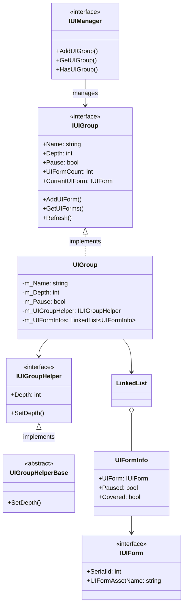
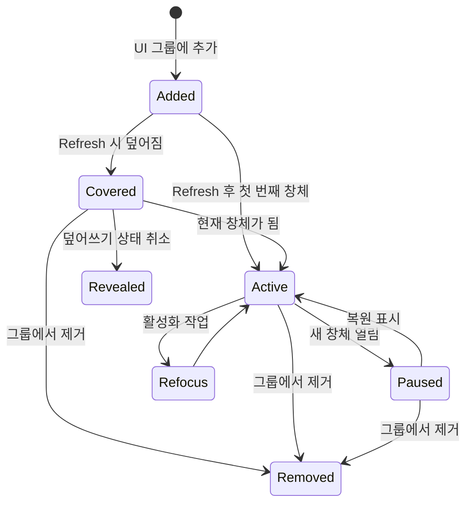
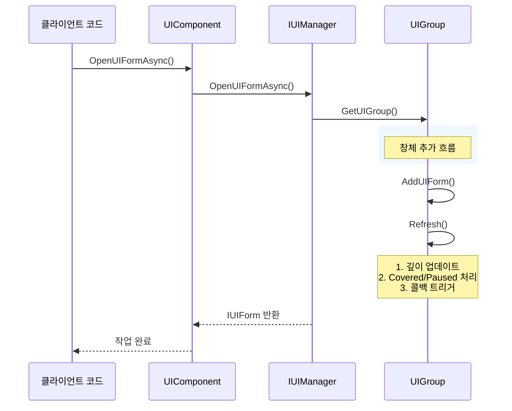
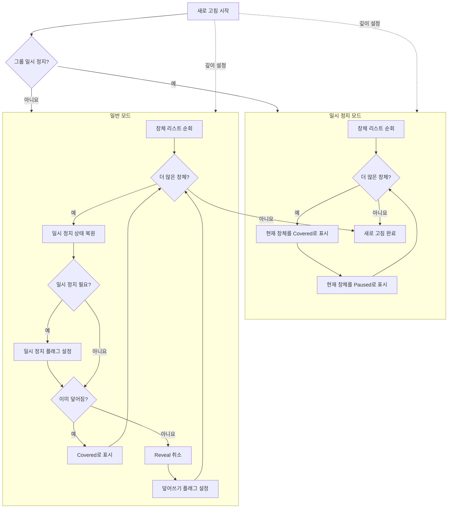

# UI 그룹 시스템

UI 그룹 시스템은 GameFrameX UI 프레임워크의 핵심 구성 부분으로, UI 창체의 표시 계층 관계를 관리하고 구성합니다. UI 그룹 시스템을 통해 개발자는 UI 창체의 우선순위 관리, 덮어쓰기 제어, 일시 정지 복원等功能을 쉽게 구현할 수 있습니다.

## 개요

UI 그룹 시스템（UI Group System）은 동일한 표시 우선순위를 가진 UI 창체 모음을 관리하는 데 사용됩니다. 각 UI 그룹에는 다음 핵심 특성이 있습니다:

- **깊이 관리**: 각 그룹에는 고유한 깊이 값（Depth）이 있으며, 깊이 값이 클수록 더 앞에 표시됩니다
- **일시 정지 제어**: 전체 그룹의 UI 창체 업데이트를 일시 정지할 수 있습니다
- **덮어쓰기 메커니즘**: UI 창체 간의 덮어쓰기 관계를 자동으로 처리합니다
- **활성화 관리**: 지정된 창체를 맨 위로 이동（활성화）할 수 있습니다

이러한 설계는 게임 엔진에서 흔히 사용되는 계층 관리 방식을 참조하여, 그룹化管理를 통해 배경 layer, 장면 layer, 전투 UI, 팝업 창, 힌트 정보 등 다양한 유형과 우선순위의 UI 인터페이스를 명확하게 구성할 수 있습니다.

> UI 그룹 시스템은 UI 창체 시스템과 긴밀하게 통합되어 있으며, IUIManager는 모든 UI 그룹을 관리하고, 각 UI 그룹은 그 안의 UI 창체를 관리합니다.

## 아키텍처 설계



UI 그룹 시스템의 아키텍처는分层 설계를 채택했습니다:

- **IUIManager layer**: 모든 UI 그룹을 관리하며, 그룹의 추가, 삭제, 수정, 조회 인터페이스를 제공합니다
- **IUIGroup layer**: UI 그룹의 핵심 인터페이스를 정의하며, 그룹 이름, 깊이, 일시 정지 상태 등의 속성을 포함합니다
- **UIGroup 구현 layer**: LinkedList 데이터 구조를 사용하여 UI 창체 모음을 효율적으로 관리합니다
- **IUIGroupHelper layer**: UI 그룹의 시각적 표현을 처리하며, Transform 깊이 설정 등의 작업을 담당합니다

## 핵심 개념

### 깊이（Depth）

깊이는 UI 그룹의 핵심 속성으로, 그룹의 표시 우선순위를 결정합니다. 깊이 값이 클수록 UI 그룹이 더 앞에 표시됩니다. 시스템은 일련의 표준 그룹 깊이 값을 사전 정의했으며, 개발자는 새로운 그룹과 깊이를自定义할 수도 있습니다.

깊이 값 설계는 다음 원칙을 따릅니다:
- 배경類 UI는 높은 깊이（40-30）사용
- 장면 및 전투 UI는 중간 깊이（30-20）사용
- 일반 및 고정 UI는 기본 깊이（10-0）사용
- 팝업 창 및 힌트類는 음수 깊이（-10 이하）사용

### 일시 정지（Pause）

UI 그룹이 일시 정지 상태로 설정되면, 그룹 내 모든 UI 창체의 `OnUpdate` 메서드가 호출되지 않지만, 창체는 여전히 표시됩니다. 이는 예를 들어 로딩 인터페이스 표시 시 다른 UI 업데이트를 일시 정지하여性能 자원을 절약하는 데 유용한 기능입니다.

### 덮어쓰기（Covered）

새 창체가 열릴 때, 이전 창체는 자동으로 "덮어쓰기" 상태로 표시됩니다. 시스템은 `Refresh()` 메서드를 통해 이 상태를 자동으로 관리하여, 사용자가 항상 최신으로 열린 창체를 볼 수 있도록 합니다. 덮어쓰기 상태는 UI 창체의 `OnCover` 콜백을 트리거하며, 개발자는 여기서 관련 시각적 효과를 처리할 수 있습니다.

### 활성화（Refocus）

활성화 작업은 지정된 UI 창체를 그룹의 가장 앞으로 이동하여 현재 창체가 되도록 합니다. 이는 예를 들어后台에서 설정 패널을 복원해야 할 때와 같이, 이미 열린 창체를 맨 위로 이동해야 할 때 유용합니다.

## 사전 정의 UI 그룹

프레임워크는 일련의 사전 정의된 UI 그룹 상수를 제공하며, 개발자는 직접 사용할 수 있습니다:

```csharp
// 사전 정의 UI 그룹 상수
UIGroupConstants.Hidden       // 숨김 layer (깊이: 40)
UIGroupConstants.Background   // 배경 layer (깊이: 35)
UIGroupConstants.Scene        // 장면 layer (깊이: 30)
UIGroupConstants.World        // 세계 layer (깊이: 27)
UIGroupConstants.Battle       // 전투 layer (깊이: 25)
UIGroupConstants.Hud          // HUD layer (깊이: 22)
UIGroupConstants.Map          // 지도 layer (깊이: 20)
UIGroupConstants.Floor        // 바닥 layer (깊이: 15)
UIGroupConstants.Normal       // 정상 layer (깊이: 10)
UIGroupConstants.Fixed        // 고정 layer (깊이: 0)
UIGroupConstants.Window       // 창 layer (깊이: -10)
UIGroupConstants.Tip          // 힌트 layer (깊이: -15)
UIGroupConstants.Guide        // 안내 layer (깊이: -20)
UIGroupConstants.BlackBoard   // 블랙보드 layer (깊이: -22)
UIGroupConstants.Dialogue     // 대화 layer (깊이: -23)
UIGroupConstants.Loading      // 로딩 layer (깊이: -25)
UIGroupConstants.Notify       // 알림 layer (깊이: -30)
UIGroupConstants.System       // 시스템 layer (깊이: -35)
```

> Source: [UIGroupConstants.cs](https://github.com/GameFrameX/com.gameframex.unity.ui/blob/main/Runtime/UIGroupConstants.cs#L38-L202)

```csharp
// 사전 정의 UI 그룹 이름 상수
UIGroupNameConstants.Hidden       // "Hidden"
UIGroupNameConstants.Background  // "Background"
UIGroupNameConstants.Scene        // "Scene"
// 더 많은 상수...
```

> Source: [UIGroupNameConstants.cs](https://github.com/GameFrameX/com.gameframex.unity.ui/blob/main/Runtime/UIGroupNameConstants.cs#L38-L202)

## 창체 상태 흐름

UI 창체는 그룹 내에서 다양한 상태 전환을 거칩니다. 이러한 상태를 이해하는 것은 UI 그룹 시스템을 올바르게 사용하는 데 중요합니다:



### 상태 설명

| 상태 | 설명 | 트리거 콜백 |
|------|------|----------|
| **Active** | 활성 상태, 현재 표시되는 창체 | OnResume, OnRefocus |
| **Covered** | 다른 창체에 덮어짐 | OnCover |
| **Paused** | 일시 정지 상태, 업데이트 없지만 표시됨 | OnPause |
| **Removed** | 그룹에서 제거됨 | OnClose |

## 핵심 흐름

### UI 창체 열기 및 그룹에 추가



### UI 그룹 새로 고침 흐름

새로 고침은 UI 그룹의 핵심 논리로, 그룹 내 모든 창체의 올바른 상태를 유지합니다:



## 사용 예제

### 사용자 정의 UI 그룹 생성

UIComponent를 사용하여 사용자 정의 UI 그룹을 생성합니다:

```csharp
public class GameEntry : MonoBehaviour
{
    public UIComponent UIComp;
    
    void Start()
    {
        // 사용자 정의 UI 그룹 생성, 깊이 5
        UIComp.AddUIGroup("CustomGroup", 5);
        
        // 또는 사전 정의 그룹 사용
        UIComp.AddUIGroup(UIGroupNameConstants.Window, -10);
    }
}
```

> Source: [UIComponent.IUIGroup.cs](https://github.com/GameFrameX/com.gameframex.unity.ui/blob/main/Runtime/UIComponent.IUIGroup.cs#L100-L147)

### UI 그룹 접근

UIComponent를 통해 UI 그룹에 접근하고 관리합니다:

```csharp
public class UIManagerExample : MonoBehaviour
{
    public UIComponent UIComp;
    
    public void ManageGroups()
    {
        // 그룹 존재 여부 확인
        if (UIComp.HasUIGroup("Window"))
        {
            // 그룹 가져오기
            IUIGroup group = UIComp.GetUIGroup("Window");
            
            // 현재 표시되는 창체 가져오기
            IUIForm currentForm = group.CurrentUIForm;
            
            // 그룹 내 창체 수 가져오기
            int count = group.UIFormCount;
            
            // 모든 창체 가져오기
            IUIForm[] allForms = group.GetAllUIForms();
            
            // 그룹 깊이 설정
            group.Depth = 10;
            
            // 그룹 일시 정지/복원
            group.Pause = false;
            
            // 지정 창체 활성화
            group.RefocusUIForm(someUIForm, null);
        }
    }
}
```

### 사전 정의 그룹 상수를 사용하여 창체 열기

```csharp
public class UIFormOpener : MonoBehaviour
{
    public UIComponent UIComp;
    
    public async void OpenDialog()
    {
        // 대화 layer로 대화창 열기
        IUIForm dialog = await UIComp.OpenUIFormAsync<DialogForm>(
            "Assets/Prefabs/UI/Dialog.prefab",
            UIGroupNameConstants.Dialogue,
            true,  // 덮어지는 창체 일시 정지
            null   // 사용자 데이터
        );
    }
    
    public async void OpenTip()
    {
        // 힌트 layer로 힌트 열기（다른 창체 일시 정지 안 함）
        IUIForm tip = await UIComp.OpenUIFormAsync<TipForm>(
            "Assets/Prefs/UI/Tip.prefab",
            UIGroupNameConstants.Tip,
            false,
            "이것은 힌트입니다"
        );
    }
}
```

### 전체 UI 그룹 닫기

지정 그룹 내의 모든 UI 창체를 닫습니다:

```csharp
public class UIGroupCloser : MonoBehaviour
{
    public UIComponent UIComp;
    
    public void CloseAllDialogs()
    {
        // 대화 그룹의 모든 창체 닫기
        UIComp.CloseUIGroup(UIGroupNameConstants.Dialogue, null);
    }
    
    public void CloseAllWindows()
    {
        // 창 그룹 닫기
        if (UIComp.HasUIGroup(UIGroupNameConstants.Window))
        {
            UIComp.GetUIGroup(UIGroupNameConstants.Window);
            UIComp.CloseUIGroup(UIGroupNameConstants.Window, "user_close_all");
        }
    }
}
```

> Source: [BaseUIManager.UIGroup.cs](https://github.com/GameFrameX/com.gameframex.unity.ui/blob/main/Runtime/BaseUIManager.UIGroup.cs#L150-L176)

## IUIGroup 인터페이스 참고

완전한 메서드 시그니처 및 설명:

### 속성

| 속성 | 유형 | 설명 |
|------|------|------|
| Name | string | UI 그룹 이름 가져오기 |
| Depth | int | UI 그룹 깊이 가져오기 또는 설정 |
| Pause | bool | UI 그룹 일시 정지 여부 가져오기 또는 설정 |
| UIFormCount | int | UI 그룹 내 창체 수 가져오기 |
| CurrentUIForm | IUIForm | 현재 표시되는 창체 가져오기 |
| Helper | IUIGroupHelper | UI 그룹 보조기 가져오기 |

### 메서드

#### `HasUIForm(int serialId): bool`

그룹 내 지정 시퀀스 번호의 창체 존재 여부 확인.

**매개변수:**
- `serialId` (int): UI 창체의 시퀀스 번호

**반환:** 존재 여부

---

#### `HasUIForm(string uiFormAssetName): bool`

그룹 내 지정 자원 이름의 창체 존재 여부 확인.

**매개변수:**
- `uiFormAssetName` (string): UI 창체 자원 이름

**반환:** 존재 여부

---

#### `GetUIForm(int serialId): IUIForm`

시퀀스 번호로 창체 가져오기.

**매개변수:**
- `serialId` (int): UI 창체의 시퀀스 번호

**반환:** UI 창체 인스턴스, 존재하지 않으면 null

---

#### `GetUIForms(string uiFormAssetName): IUIForm[]`

자원 이름으로 모든 일치 창체 가져오기.

**매개변수:**
- `uiFormAssetName` (string): UI 창체 자원 이름

**반환:** UI 창체 배열

---

#### `GetAllUIForms(): IUIForm[]`

그룹 내 모든 창체 가져오기.

**반환:** 모든 UI 창체 배열

---

#### `AddUIForm(IUIForm uiForm): void`

창체를 그룹에 추가.

**매개변수:**
- `uiForm` (IUIForm): 추가할 UI 창체

---

#### `Refresh(): void`

UI 그룹 상태 새로 고침, 모든 창체의 덮어쓰기 및 일시 정지 상태 업데이트.

---

## IUIManager의 UI 그룹 메서드

IUIManager는 완전한 UI 그룹 관리 인터페이스를 제공합니다:

| 메서드 | 설명 |
|------|------|
| `HasUIGroup(string)` | 그룹 존재 여부 확인 |
| `GetUIGroup(string)` | 지정 그룹 가져오기 |
| `GetAllUIGroups()` | 모든 그룹 가져오기 |
| `AddUIGroup(string, IUIGroupHelper)` | 새 그룹 추가 |
| `AddUIGroup(string, int, IUIGroupHelper)` | 지정 깊이로 그룹 추가 |
| `CloseUIGroup(string, object)` | 그룹 내 모든 창체 닫기 |

> 완전한 IUIManager 인터페이스 정의는 [API 참고 문서](./5-api-reference.iuimanager)를 참조하세요

## 관련 링크

- [UI 컴포넌트](./4-core-concepts.ui-component) - UI 컴포넌트 기초
- [UI 창체](./4-core-concepts.ui-form) - UI 창체 시스템
- [API 참고 - IUIGroup](./5-api-reference.iuigroup) - IUIGroup 완전한 인터페이스 문서
- [API 참고 - IUIManager](./5-api-reference.iuimanager) - IUIManager 완전한 인터페이스 문서
- [UI 그룹 계층](./7-ui-group-hierarchy) - UI 그룹 계층 상세 설명