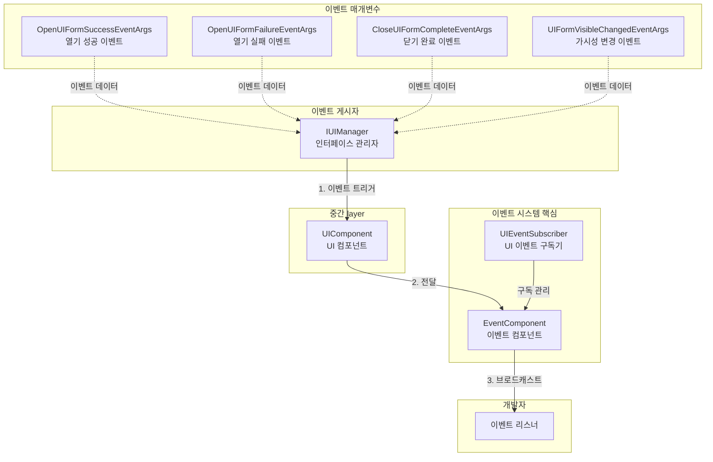
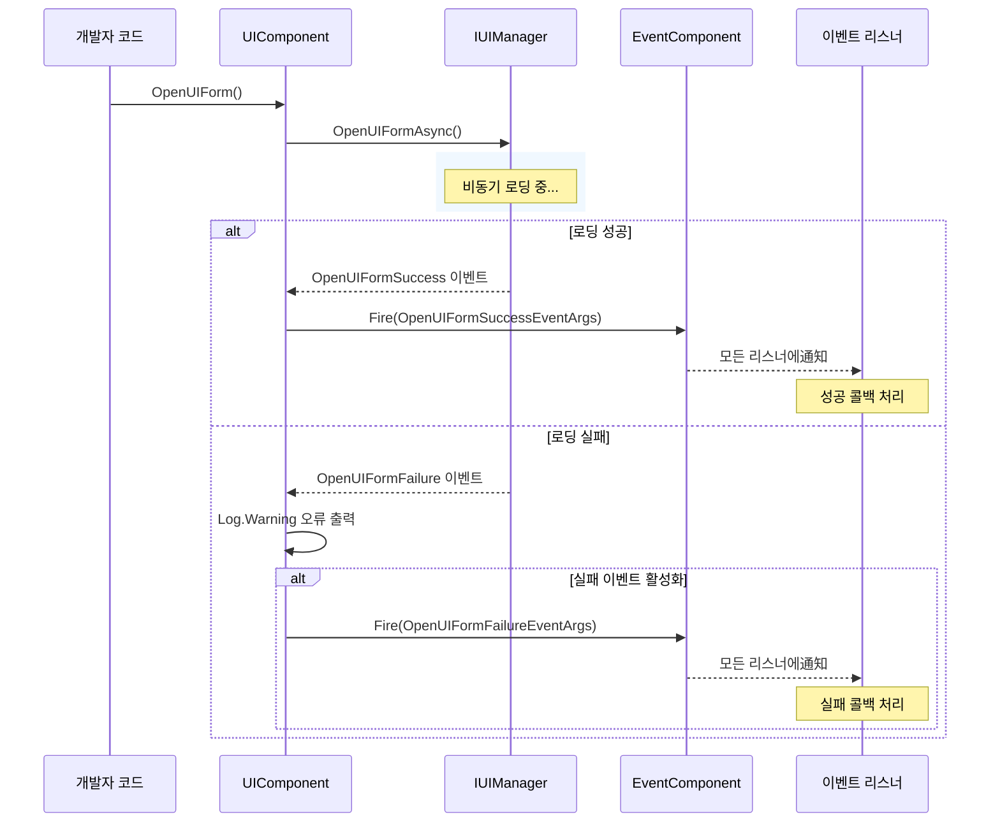
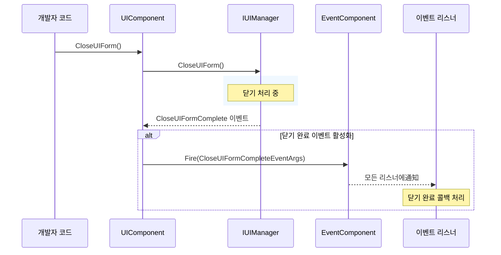

# 이벤트 시스템

GameFrameX.UI 모듈은 UI 인터페이스의 다양한 상태 변경을 모니터링하기 위한 완전한 이벤트 시스템을 제공합니다. 이 문서는 UI 모듈의 이벤트 메커니즘, 이벤트 유형 및 이러한 이벤트를 사용하는 방법을 상세히 설명합니다.

## 개요

UI 모듈의 이벤트 시스템은 관찰자 패턴 설계를 기반으로 하며, 개발자가 UI 인터페이스의 주요 상태 변경을 구독할 수 있도록 합니다. 주요 기능은 다음과 같습니다:

- **인터페이스 열기 이벤트**: 인터페이스 열기 성공 또는 실패 모니터링
- **인터페이스 닫기 이벤트**: 인터페이스 닫기 완료 모니터링
- **인터페이스 가시성 변경**: 인터페이스 표시/숨김 상태 변경 모니터링
- **통합 이벤트 구독**: UIEventSubscriber를 통해 통합 이벤트 구독 관리

이벤트 시스템은 GameFrameX의 핵심 이벤트 컴포넌트（EventComponent）와 통합되어 전역 이벤트 브로드캐스트를 지원합니다.

> 자세한 이벤트 컴포넌트 API는 [EventComponent](https://github.com/GameFrameX/com.gameframex.unity.event/blob/main/Runtime/EventComponent.cs) 문서를 참조하세요.

## 아키텍처



**아키텍처 설명:**

1. **IUIManager**는 UI 관리자의 핵심 인터페이스로, UI 인터페이스의 로딩, 표시, 숨김 등의 작업을 담당하며, 작업 완료 후 해당 이벤트를 트리거합니다
2. **UIComponent**는 Unity层面的 UI 컴포넌트로, IUIManager의 이벤트를 구독하고 전역 EventComponent에 선택적으로 전달합니다
3. **EventComponent**는 GameFrameX의 핵심 이벤트 컴포넌트로, 전역 이벤트의 등록 및 분배를 담당합니다
4. **UIEventSubscriber**는 개발자가 UI 이벤트 구독을 더 편리하게 관리할 수 있도록 돕는 유틸리티 클래스로, 소유자（Owner）별로 일괄 구독 취소 관리를 지원합니다
5. **EventArgs**는 다양한 이벤트 매개변수 클래스로, 이벤트 관련 비지니스 데이터를 캡슐화합니다

## 핵심 이벤트 유형

UI 모듈은 다음 핵심 이벤트 유형을 정의하며, 모든 이벤트 매개변수 클래스는 `GameEventArgs`를 상속합니다:

### 1. OpenUIFormSuccessEventArgs - 인터페이스 열기 성공 이벤트

UI 인터페이스가 성공적으로 열릴 때 트리거됩니다.

```csharp
> Source: [Runtime/EventArgs/OpenUIFormSuccessEventArgs.cs](https://github.com/GameFrameX/com.gameframex.unity.ui/blob/main/Runtime/EventArgs/OpenUIFormSuccessEventArgs.cs#L42-L143)

public sealed class OpenUIFormSuccessEventArgs : GameEventArgs
{
    // 이벤트 ID
    public static readonly string EventId = typeof(OpenUIFormSuccessEventArgs).FullName;
    
    // 열기 성공한 인터페이스 가져오기
    public UIForm UIForm { get; private set; }
    
    // 로딩 지속 시간（초）가져오기
    public float Duration { get; private set; }
    
    // 사용자 정의 데이터 가져오기
    public object UserData { get; private set; }
    
    // 이벤트 인스턴스 생성
    public static OpenUIFormSuccessEventArgs Create(IUIForm uiForm, float duration, object userData);
}
```

### 2. OpenUIFormFailureEventArgs - 인터페이스 열기 실패 이벤트

UI 인터페이스 열기 실패 시 트리거됩니다.

```csharp
> Source: [Runtime/EventArgs/OpenUIFormFailureEventArgs.cs](https://github.com/GameFrameX/com.gameframex.unity.ui/blob/main/Runtime/EventArgs/OpenUIFormFailureEventArgs.cs#L42-L172)

public sealed class OpenUIFormFailureEventArgs : GameEventArgs
{
    // 이벤트 ID
    public static readonly string EventId = typeof(OpenUIFormFailureEventArgs).FullName;
    
    // 인터페이스 시퀀스 번호 가져오기
    public int SerialId { get; private set; }
    
    // 인터페이스 자원 이름 가져오기
    public string UIFormAssetName { get; private set; }
    
    // 덮어지는 인터페이스 일시 정지 여부 가져오기
    public bool PauseCoveredUIForm { get; private set; }
    
    // 오류 정보 가져오기
    public string ErrorMessage { get; private set; }
    
    // 사용자 정의 데이터 가져오기
    public object UserData { get; private set; }
    
    // 이벤트 인스턴스 생성
    public static OpenUIFormFailureEventArgs Create(int serialId, string uiFormAssetName, bool pauseCoveredUIForm, string errorMessage, object userData);
}
```

### 3. CloseUIFormCompleteEventArgs - 인터페이스 닫기 완료 이벤트

UI 인터페이스 닫기 완료 시 트리거됩니다.

```csharp
> Source: [Runtime/EventArgs/CloseUIFormCompleteEventArgs.cs](https://github.com/GameFrameX/com.gameframex.unity.ui/blob/main/Runtime/EventArgs/CloseUIFormCompleteEventArgs.cs#L43-L158)

public sealed class CloseUIFormCompleteEventArgs : GameEventArgs
{
    // 이벤트 ID
    public static readonly string EventId = typeof(CloseUIFormCompleteEventArgs).FullName;
    
    // 인터페이스 시퀀스 번호 가져오기
    public int SerialId { get; private set; }
    
    // 인터페이스 자원 이름 가져오기
    public string UIFormAssetName { get; private set; }
    
    // 인터페이스가 소속된 인터페이스 그룹 가져오기
    public IUIGroup UIGroup { get; private set; }
    
    // 사용자 정의 데이터 가져오기
    public object UserData { get; private set; }
    
    // 이벤트 인스턴스 생성
    public static CloseUIFormCompleteEventArgs Create(int serialId, string uiFormAssetName, IUIGroup uiGroup, object userData);
}
```

### 4. UIFormVisibleChangedEventArgs - 인터페이스 가시성 변경 이벤트

UI 인터페이스의 가시성 상태가 변경될 때 트리거됩니다.

```csharp
> Source: [Runtime/EventArgs/UIFormVisibleChangedEventArgs.cs](https://github.com/GameFrameX/com.gameframex.unity.ui/blob/main/Runtime/EventArgs/UIFormVisibleChangedEventArgs.cs#L42-L143)

public sealed class UIFormVisibleChangedEventArgs : GameEventArgs
{
    // 이벤트 ID
    public static readonly string EventId = typeof(UIFormVisibleChangedEventArgs).FullName;
    
    // 활성화 상태 변경된 인터페이스 가져오기
    public IUIForm UIForm { get; private set; }
    
    // 인터페이스 표시 여부 가져오기
    public bool Visible { get; private set; }
    
    // 사용자 정의 데이터 가져오기
    public object UserData { get; private set; }
    
    // 이벤트 인스턴스 생성
    public static UIFormVisibleChangedEventArgs Create(IUIForm uiForm, bool visible, object userData = null);
}
```

## IUIManager 이벤트 정의

IUIManager 인터페이스는 다음 이벤트를 정의하며, UIComponent는これらの 이벤트를 구독합니다:

```csharp
> Source: [Runtime/UI/IUIManager.cs](https://github.com/GameFrameX/com.gameframex.unity.ui/blob/main/Runtime/UI/IUIManager.cs#L109-L142)

public interface IUIManager
{
    /// <summary>
    /// 인터페이스 열기 성공 이벤트
    /// </summary>
    event EventHandler<OpenUIFormSuccessEventArgs> OpenUIFormSuccess;

    /// <summary>
    /// 인터페이스 열기 실패 이벤트
    /// </summary>
    event EventHandler<OpenUIFormFailureEventArgs> OpenUIFormFailure;

    /// <summary>
    /// 인터페이스 닫기 완료 이벤트
    /// </summary>
    event EventHandler<CloseUIFormCompleteEventArgs> CloseUIFormComplete;
}
```

## 이벤트 구독 방식

### 방식 1: UIComponent를 통해 구독

UIComponent는 초기화 시 IUIManager의 이벤트를 구독하며, 전역 EventComponent에 전달할지 여부를 구성합니다:

```csharp
> Source: [Runtime/UIComponent.cs](https://github.com/GameFrameX/com.gameframex.unity.ui/blob/main/Runtime/UIComponent.cs#L430-L460)

private void OnAwake(object sender)
{
    m_UIManager = GameFrameworkEntry.GetModule<IUIManager>();
    
    if (m_EnableOpenUIFormSuccessEvent)
    {
        m_UIManager.OpenUIFormSuccess += OnOpenUIFormSuccess;
    }
    
    m_UIManager.OpenUIFormFailure += OnOpenUIFormFailure;
    
    if (m_EnableCloseUIFormCompleteEvent)
    {
        m_UIManager.CloseUIFormComplete += OnCloseUIFormComplete;
    }
}

private void OnOpenUIFormSuccess(object sender, OpenUIFormSuccessEventArgs e)
{
    m_EventComponent.Fire(this, e);
}

private void OnOpenUIFormFailure(object sender, OpenUIFormFailureEventArgs e)
{
    Log.Warning("Open UI form failure, asset name '{0}', pause covered UI form '{1}', error message '{2}'.", 
        e.UIFormAssetName, e.PauseCoveredUIForm, e.ErrorMessage);
    if (m_EnableOpenUIFormFailureEvent)
    {
        m_EventComponent.Fire(this, e);
    }
}

private void OnCloseUIFormComplete(object sender, CloseUIFormCompleteEventArgs e)
{
    m_EventComponent.Fire(this, e);
}
```

### 방식 2: UIEventSubscriber를 통해 구독

UIEventSubscriber는 편리한 이벤트 구독 관리 클래스로, 소유자（Owner）별로 일괄 구독 관리를 지원합니다:

```csharp
> Source: [Runtime/UIEventSubscriber.cs](https://github.com/GameFrameX/com.gameframex.unity.ui/blob/main/Runtime/UIEventSubscriber.cs#L44-L218)

public sealed class UIEventSubscriber : IReference
{
    // 소유자 가져오기 또는 설정
    public object Owner { get; private set; }
    
    // 이벤트 구독 확인 및 구독
    public void CheckSubscribe(string id, EventHandler<GameEventArgs> handler);
    
    // 이벤트 구독 취소
    public void UnSubscribe(string id, EventHandler<GameEventArgs> handler);
    
    // 이벤트 트리거
    public void Fire(string id, GameEventArgs e);
    
    // 모든 구독 취소
    public void UnSubscribeAll(List<string> ignoreList = null);
    
    // 이벤트 구독기 생성
    public static UIEventSubscriber Create(object owner);
    
    // 이벤트 구독기 정리
    public void Clear();
}
```

## 사용 예제

### 예제 1: 인터페이스 열기 성공 이벤트 모니터링

```csharp
using GameFrameX.UI.Runtime;
using GameFrameX.Event.Runtime;
using GameFrameX.Runtime;

public class UIMainMenuForm : MonoBehaviour
{
    private void Start()
    {
        // 열기 성공 이벤트 구독
        var eventComponent = GameEntry.GetComponent<EventComponent>();
        eventComponent.Subscribe(OpenUIFormSuccessEventArgs.EventId, OnOpenUIFormSuccess);
    }
    
    private void OnOpenUIFormSuccess(object sender, GameEventArgs e)
    {
        var args = (OpenUIFormSuccessEventArgs)e;
        Debug.Log($"인터페이스 열기 성공: {args.UIForm.Name}, 로딩 시간: {args.Duration}초");
    }
    
    private void OnDestroy()
    {
        // 구독 취소
        var eventComponent = GameEntry.GetComponent<EventComponent>();
        eventComponent.Unsubscribe(OpenUIFormSuccessEventArgs.EventId, OnOpenUIFormSuccess);
    }
}
```

### 예제 2: 인터페이스 열기 실패 이벤트 모니터링

```csharp
using GameFrameX.UI.Runtime;
using GameFrameX.Event.Runtime;
using GameFrameX.Runtime;

public class UILoadFailedHandler : MonoBehaviour
{
    private void Start()
    {
        var eventComponent = GameEntry.GetComponent<EventComponent>();
        eventComponent.Subscribe(OpenUIFormFailureEventArgs.EventId, OnOpenUIFormFailure);
    }
    
    private void OnOpenUIFormFailure(object sender, GameEventArgs e)
    {
        var args = (OpenUIFormFailureEventArgs)e;
        Debug.LogError($"인터페이스 열기 실패: {args.UIFormAssetName}, 오류 정보: {args.ErrorMessage}");
    }
    
    private void OnDestroy()
    {
        var eventComponent = GameEntry.GetComponent<EventComponent>();
        eventComponent.Unsubscribe(OpenUIFormFailureEventArgs.EventId, OnOpenUIFormFailure);
    }
}
```

### 예제 3: UIEventSubscriber를 사용하여 구독 관리

```csharp
using GameFrameX.UI.Runtime;
using GameFrameX.Event.Runtime;
using GameFrameX.Runtime;
using GameFrameX.ObjectPool;

public class UIGamePanel : MonoBehaviour
{
    private UIEventSubscriber _eventSubscriber;
    
    private void Awake()
    {
        // 이벤트 구독기 생성, this를 소유자로 전달
        _eventSubscriber = UIEventSubscriber.Create(this);
        
        // 여러 이벤트 구독
        _eventSubscriber.CheckSubscribe(OpenUIFormSuccessEventArgs.EventId, OnOpenUIFormSuccess);
        _eventSubscriber.CheckSubscribe(CloseUIFormCompleteEventArgs.EventId, OnCloseUIFormComplete);
    }
    
    private void OnOpenUIFormSuccess(object sender, GameEventArgs e)
    {
        var args = (OpenUIFormSuccessEventArgs)e;
        Debug.Log($"인터페이스가 열렸습니다: {args.UIForm.Name}");
    }
    
    private void OnCloseUIFormComplete(object sender, GameEventArgs e)
    {
        var args = (CloseUIFormCompleteEventArgs)e;
        Debug.Log($"인터페이스가 닫혔습니다: {args.UIFormAssetName}");
    }
    
    private void OnDestroy()
    {
        // 모든 구독 일괄 취소
        if (_eventSubscriber != null)
        {
            _eventSubscriber.UnSubscribeAll();
            ReferencePool.Release(_eventSubscriber);
        }
    }
}
```

### 예제 4: UIEventSubscriber를 사용하여 특정 이벤트 구독 취소

```csharp
using GameFrameX.UI.Runtime;
using GameFrameX.Event.Runtime;
using GameFrameX.Runtime;
using GameFrameX.ObjectPool;
using System.Collections.Generic;

public class UIPermanentPanel : MonoBehaviour
{
    private UIEventSubscriber _eventSubscriber;
    private List<string> _ignoredEvents = new List<string> { CloseUIFormCompleteEventArgs.EventId };
    
    private void Awake()
    {
        _eventSubscriber = UIEventSubscriber.Create(this);
        _eventSubscriber.CheckSubscribe(OpenUIFormSuccessEventArgs.EventId, OnOpenUIFormSuccess);
        _eventSubscriber.CheckSubscribe(OpenUIFormFailureEventArgs.EventId, OnOpenUIFormFailure);
        _eventSubscriber.CheckSubscribe(CloseUIFormCompleteEventArgs.EventId, OnCloseUIFormComplete);
    }
    
    private void OnOpenUIFormSuccess(object sender, GameEventArgs e) { /* ... */ }
    private void OnOpenUIFormFailure(object sender, GameEventArgs e) { /* ... */ }
    private void OnCloseUIFormComplete(object sender, GameEventArgs e) { /* ... */ }
    
    private void OnDestroy()
    {
        // CloseUIFormComplete를 제외한 모든 구독 취소
        _eventSubscriber.UnSubscribeAll(_ignoredEvents);
        ReferencePool.Release(_eventSubscriber);
    }
}
```

## 이벤트 흐름

### 인터페이스 열기 이벤트 흐름



### 인터페이스 닫기 이벤트 흐름



## 이벤트 구성

UIComponent는 이벤트 동작을 제어하기 위한 다음 직렬화 필드를 제공합니다:

```csharp
> Source: [Runtime/UIComponent.cs](https://github.com/GameFrameX/com.gameframex.unity.ui/blob/main/Runtime/UIComponent.cs#L62-L86)

[SerializeField] private bool m_EnableOpenUIFormSuccessEvent = true;    // 열기 성공 이벤트 활성화
[SerializeField] private bool m_EnableOpenUIFormFailureEvent = true;     // 열기 실패 이벤트 활성화
[SerializeField] private bool m_EnableCloseUIFormCompleteEvent = true;   // 닫기 완료 이벤트 활성화

[SerializeField] private bool m_IsEnableUIShowAnimation = false;          // 표시 애니메이션 활성화
[SerializeField] private bool m_IsEnableUIHideAnimation = false;        // 숨김 애니메이션 활성화
```

| 구성 항목 | 유형 | 기본값 | 설명 |
|--------|------|--------|------|
| m_EnableOpenUIFormSuccessEvent | bool | true | 열기 성공 이벤트 트리거 여부 |
| m_EnableOpenUIFormFailureEvent | bool | true | 열기 실패 이벤트 트리거 여부 |
| m_EnableCloseUIFormCompleteEvent | bool | true | 닫기 완료 이벤트 트리거 여부 |
| m_IsEnableUIShowAnimation | bool | false | 인터페이스 표시 애니메이션 활성화 여부 |
| m_IsEnableUIHideAnimation | bool | false | 인터페이스 숨김 애니메이션 활성화 여부 |

## 주의 사항

1. **이벤트 구독 메모리 관리**: MonoBehaviour의 `OnDestroy` 메서드에서 반드시 이벤트 구독을 취소하여 메모리 누수 및 null 참조 예외를 방지하세요
2. **이벤트 매개변수 재활용**: 모든 EventArgs 클래스는 ReferencePool을 사용하여 객체 풀 관리를 수행하며, 생성 후 사용 완료 시 자동으로 회수되므로 수동으로 해제할 필요가 없습니다
3. **이벤트 순서**: 이벤트 트리거 순서는 다음과 같습니다: OpenUIFormFailure/OpenUIFormSuccess → 다른 비지니스 로직, 개발자는 필요에 따라 적합한 구독 포인트를 선택해야 합니다
4. **크로스 장면 이벤트**: EventComponent를 통해 구독한 이벤트는 전역적이므로, 인터페이스가 닫힌 후에도 수동으로 구독을 취소해야 합니다

## 관련 링크

- [UI 컴포넌트](./4-core-concepts.ui-component) - UI 컴포넌트의 핵심 기능
- [UI 창체](./4-core-concepts.ui-form) - UI 창체의 기본 개념
- [UI 그룹 시스템](./4-core-concepts.ui-group) - UI 그룹 관리
- [IUIManager 인터페이스](./5-api-reference.iuimanager) - 완전한 IUIManager API 참고
- [GameFrameX Event 모듈](https://github.com/GameFrameX/com.gameframex.unity.event) - 핵심 이벤트 컴포넌트