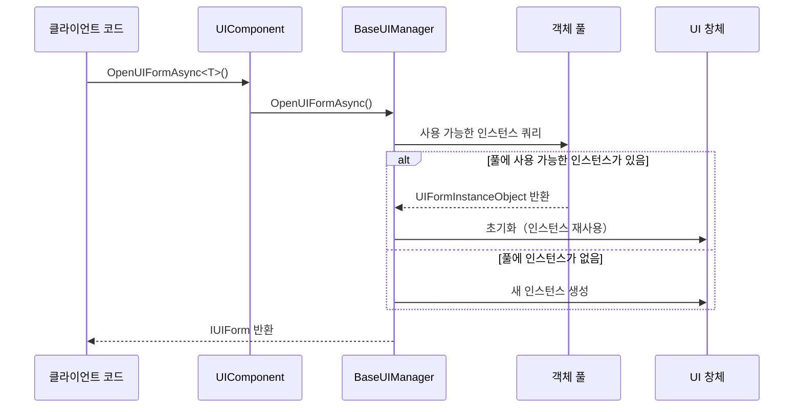
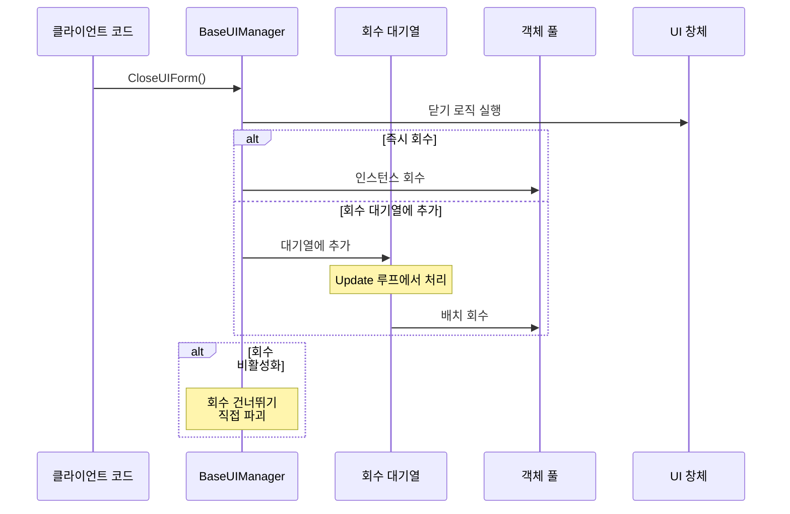
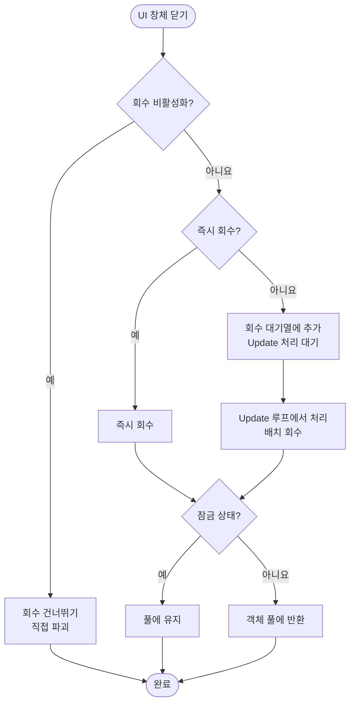

# 객체 풀 관리

객체 풀 관리는 GameFrameX UI 시스템에서 UI 창체 인스턴스의 생성 및 파괴를 최적화하는 핵심 메커니즘입니다. 객체 풀을 통해 시스템은 닫힌 UI 창체 인스턴스를 재사용하여频繁 인스턴스화带来的 성능 오버헤드를 피할 수 있습니다.

## 개요

게임 또는 응용 프로그램에서 UI 창체의 열기 및 닫기는 매우 빈번한 작업입니다. 전통적인 방식은 열 때마다 새 인스턴스를 생성하고 닫을 때 인스턴스를 파괴하는 방식입니다. 이 방식은 다음 문제를 야기합니다:

- **메모리 단편화**: 빈번한 객체 생성 및 파괴는 메모리 단편화를 야기합니다
- **GC 압력**: 대량의 임시 객체는垃圾回収의 빈도를 증가시킵니다
- **로딩 지연**: UI 프리팹 인스턴스화에는 시간이 소요되며, 이는 사용자 경험을 영향을 미칩니다

객체 풀은 다음 방식으로 이러한 문제를 해결합니다:

- **인스턴스 재활용**: 닫힌 UI 창체는 파괴되지 않으며, 회수되어 풀에 저장됩니다
- **필요 시 배분**: 풀에서 인스턴스를 가져올 때, 풀에 사용 가능한 인스턴스가 있으면 직접 재사용하고, 없으면 새 인스턴스를 생성합니다
- **자동 관리**: 객체 풀은 만료 인스턴스의 자동 해제 및 용량 관리를 지원합니다

### 핵심 개념

| 개념 | 설명 |
|------|------|
| **객체 풀 (Object Pool)** | 재사용 가능한 UI 창체 인스턴스를 저장하는 컨테이너 |
| **회수 (Recycle)** | 닫힌 UI 창체 인스턴스를 객체 풀에 반환 |
| **해제 (Release)** | 풀에서 만료되거나 초과된 인스턴스를 완전히 제거 |
| **잠금 (Locked)** | 잠금된 인스턴스는 풀 자동 해제에서 보호됩니다 |
| **우선순위 (Priority)** | 용량 부족 시 우선적으로 보존할 인스턴스를 결정하는 데 사용됩니다 |

## 아키텍처

```mermaid
flowchart TD
    subgraph UIComponent["UIComponent"]
        A1[UIComponent] --> A2[IUIManager]
    end

    subgraph BaseUIManager["BaseUIManager"]
        B1[IObjectPoolManager] --> B2[IObjectPool&lt;UIFormInstanceObject&gt;]
        B2 --> B3[UIFormInstanceObject Pool<br/>"UI Instance Pool"]
    end

    subgraph PoolObjects["풀 객체"]
        C1[UIFormInstanceObject 1]
        C2[UIFormInstanceObject 2]
        C3[UIFormInstanceObject N]
    end

    subgraph UIForms["UI 창체"]
        D1[UI 창체 인스턴스 1]
        D2[UI 창체 인스턴스 2]
        D3[UI 창체 인스턴스 N]
    end

    A2 --> B1
    B2 --- C1
    B2 --- C2
    B2 --- C3
    C1 --- D1
    C2 --- D2
    C3 --- D3
```

### 컴포넌트 설명

| 컴포넌트 | 책임 |
|------|------|
| **UIComponent** | UI 컴포넌트 진입점으로, 객체 풀 관리자 구성 초기화를 담당합니다 |
| **BaseUIManager** | UI 관리자의 핵심으로, 객체 풀의 생성 및 작업을 관리합니다 |
| **IObjectPoolManager** | 외부 객체 풀 관리자 인터페이스（GameFrameX.ObjectPool 패키지에서 가져옴）|
| **IObjectPool\<UIFormInstanceObject\>** | UI 창체 인스턴스 전용 객체 풀 |
| **UIFormInstanceObject** | UI 창체 인스턴스를 캡슐화하는 래퍼 클래스로, 자원 핸들 등의 정보를 포함합니다 |

### 객체 풀 유형

시스템은 `CreateMultiSpawnObjectPool` 메서드를 사용하여 다중 생성 객체 풀을 생성합니다. 이는 다음을 의미합니다:

-同一 유형의 UI 창체가 여러 인스턴스를 동시에 존재할 수 있습니다
- 각 인스턴스는 독립적인 생명주기 관리합니다
- 인스턴스 수준의 잠금 및 우선순위 설정 지원

> Source: [BaseUIManager.cs#L268](https://github.com/GameFrameX/com.gameframex.unity.ui/blob/main/Runtime/BaseUIManager.cs#L268)

## 핵심 흐름

### UI 창체 열기 흐름



### UI 창체 회수 흐름



### 회수 결정 흐름



## 구성 옵션

UIComponent에서 객체 풀의各项 매개변수를 구성할 수 있으며, 이 설정은 `Start()` 메서드에서 UI 관리자에 적용됩니다.

| 구성 항목 | 유형 | 기본값 | 설명 |
|--------|------|--------|------|
| `InstanceAutoReleaseInterval` | float | 60f | 객체 풀의 사용 가능한 객체를 자동 해제하는 간격（초）|
| `InstanceCapacity` | int | 16 | 객체 풀의 용량으로, 최대 캐시할 수 있는 인스턴스 수를 나타냅니다 |
| `InstanceExpireTime` | float | 60f | 객체 만료 시간（초）으로, 이 시간을 초과한 미사용 인스턴스는 해제됩니다 |
| `RecycleInterval` | int | 60 | 회수 간격（초）으로, 회수 대기열 처리 속도를 제어합니다 |
| `EnableAutoReleaseUIForm` | bool | true | UI 자동 해제 활성화 여부 |

> Source: [UIComponent.cs#L113-L141](https://github.com/GameFrameX/com.gameframex.unity.ui/blob/main/Runtime/UIComponent.cs#L113-L141)

### IUIManager 인터페이스를 통해 구성

```csharp
// UI 컴포넌트 가져오기
var uiComponent = GameEntry.GetComponent<UIComponent>();

// 객체 풀 매개변수 구성
uiComponent.InstanceAutoReleaseInterval = 30f;  // 30초 자동 해제
uiComponent.InstanceCapacity = 32;               // 용량을 32로 변경
uiComponent.InstanceExpireTime = 30f;             // 30초 만료
uiComponent.RecycleInterval = 30;                // 30초 회수 간격
```

### 런타임 동적 구성

```csharp
// UI 관리자 가져오기
IUIForm uiForm = await uiComponent.OpenUIFormAsync<MainForm>("UI/MainForm");

// 인스턴스 잠금 설정（해제 방지）
uiComponent.SetUIFormInstanceLocked(uiForm.Handle, true);

// 인스턴스 우선순위 설정（값이 높을수록 우선 보존）
uiComponent.SetUIFormInstancePriority(uiForm.Handle, 100);
```

> Source: [BaseUIManager.Open.cs#L164-L182](https://github.com/GameFrameX/com.gameframex.unity.ui/blob/main/Runtime/BaseUIManager.Open.cs#L164-L182)

## UI 창체 회수 제어

각 UI 창체는 회수 여부를 독립적으로 제어할 수 있습니다.

### UIForm 속성

| 속성 | 유형 | 설명 |
|------|------|------|
| `IsDisableRecycling` | bool | 회수 비활성화 여부입니다. 비활성화된 UI 창체는 닫힌 후 파괴되며, 객체 풀에 저장되지 않습니다 |
| `IsDisableClosing` | bool | 닫기 비활성화 여부입니다. 비활성화된 UI 창체는 닫을 수 없습니다 |
| `IsCanRecycle` | bool | 회수 가능 여부（읽기 전용）으로, 다른 속성으로 종합 계산됩니다 |
| `ReleaseStartTime` | DateTime | 회수 시작 시간으로, 회수 조건에 도달했는지 판단하는 데 사용됩니다 |
| `RecycleInterval` | int | 해당 UI 창체의 회수 간격（초）|

> Source: [IUIForm.cs#L84-L114](https://github.com/GameFrameX/com.gameframex.unity.ui/blob/main/Runtime/UI/IUIForm.cs#L84-L114)

### 사용 예제

UI 창체 스크립트에서 회수 동작을 제어합니다:

```csharp
public class MyUIForm : UIForm
{
    protected override void OnInit()
    {
        // 이 창체의 회수 기능 비활성화
        // 닫힌 후 직접 파괴되며, 객체 풀에 저장되지 않습니다
        IsDisableRecycling = true;
        
        // 또는 닫기 기능 비활성화
        // IsDisableClosing = true;
    }
    
    protected override void OnRecycle()
    {
        // 창체가 회수될 때 실행되는 로직
        // 여기서 상태 저장 또는 자원 정리가 가능합니다
        base.OnRecycle();
    }
}
```

> Source: [UIForm.cs#L56](https://github.com/GameFrameX/com.gameframex.unity.ui/blob/main/Runtime/UIForm.cs#L56)
> Source: [UIForm.cs#L625-L629](https://github.com/GameFrameX/com.gameframex.unity.ui/blob/main/Runtime/UIForm.cs#L625-L629)

## UIFormInstanceObject

`UIFormInstanceObject`는 객체 풀에 저장되는 래퍼 객체로, UI 창체 인스턴스 및 관련 자원을 캡슐화합니다.

```csharp
public sealed class UIFormInstanceObject : ObjectBase
{
    private object m_UIFormAsset = null;           // UI 자원 객체
    private string m_UIFormAssetPath = null;        // UI 자원 경로
    private string m_UIFormAssetName = null;        // UI 자원 이름
    private IUIFormHelper m_UIFormHelper = null;    // UI 보조기
    private object m_AssetHandle = null;           // 자원 핸들
    
    protected override void Release(bool isShutdown)
    {
        // 해제 시 보조기를 통해 UI 자원 회수
        m_UIFormHelper.ReleaseUIForm(m_UIFormAsset, Target, m_AssetHandle, 
            m_UIFormAssetPath, m_UIFormAssetName);
    }
}
```

> Source: [BaseUIManager.UIFormInstanceObject.cs#L41-L104](https://github.com/GameFrameX/com.gameframex.unity.ui/blob/main/Runtime/BaseUIManager.UIFormInstanceObject.cs#L41-L104)

## 모범 사례

### 1. 합리적인 용량 설정

동시에 표시되는 UI 창체 수에 따라 용량을 설정합니다:

```csharp
// 동시에 최대 10개의 서로 다른 유형의 UI 창체를 표시하는 경우
uiComponent.InstanceCapacity = 20; // 여유 유보
```

### 2. 자동 해제 간격 조정

UI 사용 빈도에 따라 조정합니다:

```csharp
// 빈번히 전환되는 UI: 짧은 간격
uiComponent.InstanceAutoReleaseInterval = 30f;
uiComponent.InstanceExpireTime = 30f;

// 전환이 적은 UI: 긴 간격
uiComponent.InstanceAutoReleaseInterval = 300f;
uiComponent.InstanceExpireTime = 300f;
```

### 3. 중요한 인스턴스 잠금

항상 메모리에 상주해야 하는 UI 창체의 경우 잠금 설정합니다:

```csharp
// 설정 인터페이스를 열고 잠금
var settingsForm = await uiComponent.OpenUIFormAsync<SettingsForm>("UI/Settings");
uiComponent.SetUIFormInstanceLocked(settingsForm.Handle, true);
```

### 4. 빈번히 파괴하는 UI 회수 비활성화

빈번히 열리고 닫히지만 재사용할 필요가 없는 특정 UI의 경우 회수를 비활성화합니다:

```csharp
public class PopupTipForm : UIForm
{
    protected override void OnInit()
    {
        // 팝업類 UI는 매번 새 내용이므로 회수 비활성화
        IsDisableRecycling = true;
    }
}
```

## 관련 링크

- [UI 컴포넌트](./4-core-concepts.ui-component)
- [UI 창체](./4-core-concepts.ui-form)
- [UI 그룹 시스템](./4-core-concepts.ui-group)
- [IUIManager API 참고](./5-api-reference.iuimanager)
- [UIForm API 참고](./5-api-reference.ui-form)
- [이벤트 시스템](./6-event-system)