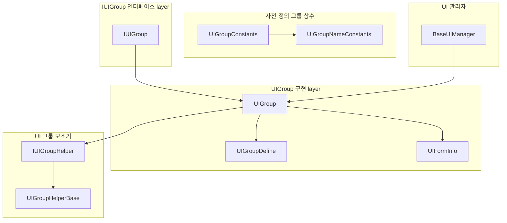
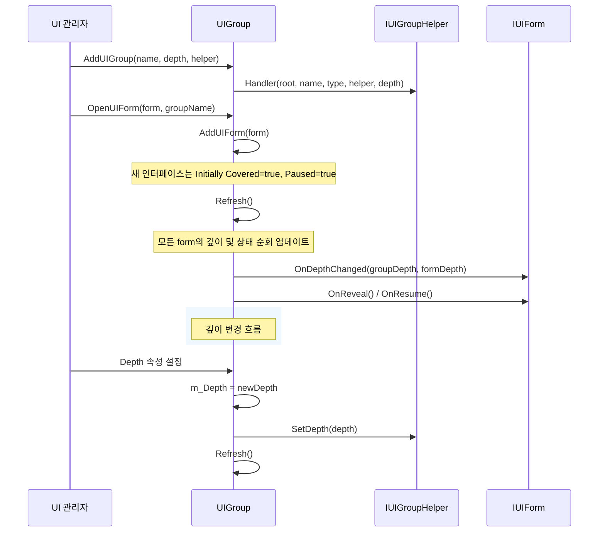
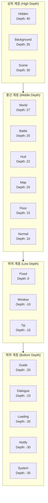

# UI 그룹 계층

UI 그룹 계층（UI Group Hierarchy）은 GameFrameX UI 시스템에서 다양한 UI 인터페이스의 표시 계층 관계를 관리하는 핵심 메커니즘입니다. 깊이（Depth）값 구성을 통해 시스템은 다양한 UI 그룹 및 그룹 내 인터페이스의 전후 가림 관계를 정밀하게 제어할 수 있으며, UI 인터페이스가 예상된 계층 순서대로 렌더링되고 상호작용하도록 보장합니다.

## 개요

복잡한 게임 또는 응용 프로그램에서 UI 인터페이스는 일반적으로分层 관리해야 합니다. 예를 들어, 배경 인터페이스는 가장 하층에 있어야 하고, 팝업된 힌트 또는 시스템 공지는 가장 상층에 표시되어야 합니다. GameFrameX UI 시스템은「그룹」개념을 도입하고 깊이（Depth）속성과 결합하여 UI 인터페이스 계층의 정밀한 제어를 실현합니다.

UI 그룹 계층 시스템은 두 수준의 깊이 제어를 포함합니다:

- **그룹 수준 깊이（Group Depth）**: 다양한 UI 그룹 간의 표시 순서를 제어하며, 깊이 값이 클수록 더 앞에 표시됩니다
- **그룹 내 깊이（Form Depth in Group）**:同一 그룹 내 각 인터페이스 간의 표시 순서를 제어합니다

이러한 이중 레이어 설계는 서로 다른 유형의 UI의 전반적인 계층 관계를 보장하는 동시에,同一 유형의 UI에서 구체적인 인터페이스의 표시 순서를 유연하게 조정할 수 있습니다.

### 핵심 설계 철학

1. **깊이 값分层**: 정수 깊이 값을 사용하여 계층을 나타내며, 음수 깊이를 지원하여 더 유연한 공간 배분을 허용합니다
2. **사전 정의 그룹 유형**:常用的 UI 그룹 유형을 제공하며, 배경에서 시스템 팝업까지 완전한 계층 체계를 포괄합니다
3. **동적 조정**: 런타임에 동적으로 그룹 깊이를 수정하여 실시간으로 모든 관련 인터페이스의 표시 계층을 업데이트하는 것을 지원합니다
4. **자동 새로 고침**: 깊이 변경 후 자동으로 새로 고침 메커니즘을 트리거하여 모든 인터페이스가 올바르게 대응하도록 보장합니다

## 아키텍처 설계

### 핵심 컴포넌트 관계



### 계층 데이터 흐름



### 깊이 값 계층示意图



## 사전 정의 UI 그룹

GameFrameX UI 시스템은 18개의 사전 정의 UI 그룹 유형을 제공하여, 게임 개발에서 흔한 UI 시나리오를 포괄합니다. 이러한 사전 정의 그룹은 깊이 값이 높은 것부터 낮은 것까지 순서대로 정렬되어 있습니다:

| 그룹 이름 | 깊이 값 | 용도 설명 |
|--------|--------|----------|
| Hidden | 40 | 숨김 인터페이스로, 표시하지 않는 인터페이스의 임시 저장용 |
| Background | 35 | 배경 인터페이스로, 게임 메인 인터페이스 배경, 장면 배경 등 |
| Scene | 30 | 장면 인터페이스로, 게임 장면과 관련된 UI |
| World | 27 | 세계 인터페이스로, 세계 공간 내의 UI 요소 |
| Battle | 25 | 전투 인터페이스로, 전투 관련 HUD 및 정보 표시 |
| Hud | 22 | 하늘표시로, 캐릭터 하늘의 HP 바, 이름 등의 정보 |
| Map | 20 | 지도 인터페이스로, 미니맵, 대맵 등 |
| Floor | 15 | 바닥 인터페이스로, 하층의 장식용 UI |
| Normal | 10 | 일반 인터페이스로, 일반적인 게임 내 UI |
| Fixed | 0 | 고정 인터페이스로, 화면에 고정된 UI |
| Window | -10 | 창 인터페이스로, 팝업 창, 대화상자 등 |
| Tip | -15 | 힌트 인터페이스로, 경량 힌트 정보 |
| Guide | -20 | 안내 인터페이스로, 초보자 안내 관련 UI |
| BlackBoard | -22 | 블랙보드 인터페이스로, 교육, 설명類 UI |
| Dialogue | -23 | 대화 인터페이스로, 대화 트리, NPC 대화 등 |
| Loading | -25 | 로딩 인터페이스로, 로딩 화면 |
| Notify | -30 | 알림 인터페이스로, 시스템 알림, 공지 |
| System | -35 | 시스템 인터페이스로, 최고 우선순위의 시스템 레벨 팝업 |

> Source: [UIGroupConstants.cs](https://github.com/GameFrameX/com.gameframex.unity.ui/blob/main/Runtime/UIGroupConstants.cs#L41-L201)

### 사전 정의 그룹 사용

```csharp
// 사전 정의 그룹 상수를 사용하여 UI 그룹 생성
var uiGroupHelper = new DefaultUIGroupHelper();
uiManager.AddUIGroup(UIGroupConstants.Normal.Name, UIGroupConstants.Normal.Depth, uiGroupHelper);

// 또는 그룹 이름 상수 사용
uiManager.AddUIGroup(UIGroupNameConstants.Normal, 10, uiGroupHelper);
```

> Source: [BaseUIManager.UIGroup.cs](https://github.com/GameFrameX/com.gameframex.unity.ui/blob/main/Runtime/BaseUIManager.UIGroup.cs#L136-L148)

## 핵심 메커니즘

### 그룹 깊이 관리

각 UI 그룹은 정수 유형의 `Depth` 속성을 유지하며, 이는 해당 그룹의 전체 UI 계층에서 위치를 나타냅니다. 깊이 값이 변경되면 시스템은 자동으로 다음 작업을 완료합니다:

1. `IUIGroupHelper.SetDepth()` 메서드를 호출하여 보조기에 렌더링 계층 업데이트를通知
2. `Refresh()` 메서드를 호출하여 그룹 내 모든 인터페이스의 깊이 정보를 새로 고침
3. 각 인터페이스의 `OnDepthChanged` 콜백을 트리거하여 인터페이스 깊이 변경을通知

```csharp
// UIGroup.cs의 Depth 속성 구현
public int Depth
{
    get { return m_Depth; }
    set
    {
        if (m_Depth == value)
        {
            return;
        }

        m_Depth = value;
        m_UIGroupHelper.SetDepth(m_Depth);  // 보조기에通知
        Refresh();  // 그룹 내 인터페이스 새로 고침
    }
}
```

> Source: [UIGroup.cs](https://github.com/GameFrameX/com.gameframex.unity.ui/blob/main/Runtime/UI/UIGroup.cs#L106-L120)

### 그룹 내 인터페이스 깊이

同一 UI 그룹 내에서, 새로 열린 인터페이스는 기본적으로 리스트 머리에 추가됩니다（`AddFirst`）. 이는 마지막으로 열린 인터페이스가 가장 앞에 표시된다는 것을 의미합니다. 각 인터페이스의 그룹 내 깊이는 연결 리스트에서의 위치에 의해 결정되며, 리스트 머리의 깊이 값이 가장 크고, 순차적으로 감소합니다.

```csharp
// 그룹에 새 인터페이스 추가
public void AddUIForm(IUIForm uiForm)
{
    m_UIFormInfos.AddFirst(UIFormInfo.Create(uiForm));
}
```

> Source: [UIGroup.cs](https://github.com/GameFrameX/com.gameframex.unity.ui/blob/main/Runtime/UI/UIGroup.cs#L439-L442)

### 새로 고침 메커니즘

`Refresh()` 메서드는 UI 그룹 계층 관리의 핵심으로, 다음을 담당합니다:

1. **인터페이스 깊이 업데이트**: 그룹 내 모든 인터페이스를 순회하며 각 인터페이스의 `DepthInUIGroup`를 계산하여 업데이트
2. **덮어쓰기 상태 처리**: 인터페이스의 표시 순서에 따라 `Covered` 상태를 설정하고 해당 콜백을 트리거
3. **일시 정지 상태 처리**: 그룹의 `Pause` 속성 및 인터페이스의 `PauseCoveredUIForm` 속성에 따라 인터페이스의 일시 정지 상태를 관리

```csharp
public void Refresh()
{
    LinkedListNode<UIFormInfo> current = m_UIFormInfos.First;
    bool pause = m_Pause;
    bool cover = false;
    int depth = UIFormCount;

    while (current != null)
    {
        // 깊이 업데이트
        info.UIForm.OnDepthChanged(Depth, depth--);

        // 덮어쓰기 및 일시 정지 로직 처리
        // ...
    }
}
```

> Source: [UIGroup.cs](https://github.com/GameFrameX/com.gameframex.unity.ui/blob/main/Runtime/UI/UIGroup.cs#L520-L577)

### 인터페이스 상태 변경

UI 그룹 내 인터페이스는 다음 상태가 있습니다:

| 상태 | 설명 | 트리거 콜백 |
|------|------|----------|
| Active | 활성 상태로, 완전 가시 및 상호작용 가능 | - |
| Covered | 덮어쓰기 상태로, 다른 인터페이스에 가려짐 | `OnCover()` / `OnReveal()` |
| Paused | 일시 정지 상태로, 더 이상 입력을 받지 않음 | `OnPause()` / `OnResume()` |

새 인터페이스가 열릴 때, 이전 최상위 인터페이스는 덮어쓰기（Covered）되고 일시 정지될 수 있습니다（`PauseCoveredUIForm` 속성에 따름）.

## 사용 예제

### 사용자 정의 깊이의 UI 그룹 생성

```csharp
// 사용자 정의 깊이의 UI 그룹 생성
public class GameUIInitializer
{
    private IUIManager uiManager;

    public void Initialize()
    {
        // 높은 우선순위 그룹 생성（가장 앞에 표시）
        var dialogHelper = new DialogUIGroupHelper();
        uiManager.AddUIGroup("Dialog", 100, dialogHelper);

        // 일반 그룹 생성
        var normalHelper = new NormalUIGroupHelper();
        uiManager.AddUIGroup("Normal", 50, normalHelper);

        // 배경 그룹 생성
        var bgHelper = new BackgroundUIGroupHelper();
        uiManager.AddUIGroup("Background", 10, bgHelper);
    }
}
```

> Source: [BaseUIManager.UIGroup.cs](https://github.com/GameFrameX/com.gameframex.unity.ui/blob/main/Runtime/BaseUIManager.UIGroup.cs#L136-L148)

### 그룹 깊이 동적 조정

```csharp
// 런타임에 UI 그룹 깊이 조정
public class UIGroupDepthChanger
{
    private IUIManager uiManager;

    public void PromoteGroup(string groupName)
    {
        var group = uiManager.GetUIGroup(groupName);
        if (group != null)
        {
            // 그룹 깊이를 높여 더 앞에 표시
            group.Depth += 10;
        }
    }

    public void DemoteGroup(string groupName)
    {
        var group = uiManager.GetUIGroup(groupName);
        if (group != null)
        {
            // 그룹 깊이를 낮춰 더 뒤에 표시
            group.Depth -= 10;
        }
    }
}
```

### 사용자 정의 UI 그룹 보조기 구현

```csharp
// 사용자 정의 UI 그룹 보조기
public class CustomUIGroupHelper : UIGroupHelperBase
{
    private Canvas m_Canvas;
    private int m_Depth;

    public override int Depth
    {
        get => m_Depth;
        protected set => m_Depth = value;
    }

    public override void SetDepth(int depth)
    {
        m_Depth = depth;
        if (m_Canvas != null)
        {
            // 그룹 깊이에 따라 Canvas 렌더링 순서 설정
            m_Canvas.sortingOrder = depth;
        }
    }

    public override IUIGroupHelper Handler(Transform root, string groupName, 
        string uiGroupHelperTypeName, IUIGroupHelper customUIGroupHelper, int depth = 0)
    {
        base.Handler(root, groupName, uiGroupHelperTypeName, customUIGroupHelper, depth);
        
        m_Canvas = root.GetComponent<Canvas>();
        if (m_Canvas == null)
        {
            m_Canvas = root.gameObject.AddComponent<Canvas>();
        }
        m_Canvas.renderMode = RenderMode.ScreenSpaceCamera;
        m_Canvas.sortingOrder = depth;
        
        return this;
    }
}
```

> Source: [UIGroupHelperBase.cs](https://github.com/GameFrameX/com.gameframex.unity.ui/blob/main/Runtime/UIGroupHelperBase.cs#L41-L77)

## 모범 사례

### 1. 깊이 구간 합리적 계획

사전 정의 그룹의 깊이 분포에 따라 사용자 정의 그룹의 깊이를 계획할 것을 권장합니다:

- **높은 우선순위 영역（30+）**: 장면 배경, 전체 화면 UI용
- **중간 우선순위 영역（10-25）**: 게임 HUD, 정보 패널용
- **일반 영역（-5 to 10）**: 일반 팝업 창용
- **낮은 우선순위 영역（-30 to -10）**: 힌트, 안내類 UI용

### 2. 깊이 충돌 피하기

시스템은 임의의 정수 깊이 값을 허용하지만, 일정 간격의 깊이 값（예: 간격 10）을 사용하여 미래 기능 확장을 위한 공간을 확보할 것을 권장합니다.

### 3. PauseCoveredUIForm 속성 활용

업데이트를 유지해야 하는 UI（카운트다운, 실시간 데이터 등）의 경우 `PauseCoveredUIForm = false`를 설정하여 가려지더라도 계속 업데이트되도록 해야 합니다:

```csharp
// 인터페이스 열 때 설정
uiManager.OpenUIForm<MyForm>("MyForm", "Dialog", userData: null, pauseCoveredUIForm: false);
```

### 4. 사전 정의 그룹 올바르게 사용

가능한 한 `UIGroupConstants`에 정의된 사전 정의 그룹을 사용하여 다른 모듈과 일관된 계층 규칙을 유지하고 사용자 정의 그룹 수를 줄이십시오.

## API 참고

### IUIGroup 인터페이스

```csharp
public interface IUIGroup
{
    // 인터페이스 그룹 이름 가져오기
    string Name { get; }

    // 인터페이스 그룹 깊이 가져오기 또는 설정
    int Depth { get; set; }

    // 인터페이스 그룹 일시 정지 여부 가져오기 또는 설정
    bool Pause { get; set; }

    // 인터페이스 그룹 내 인터페이스 수 가져오기
    int UIFormCount { get; }

    // 현재 인터페이스（그룹 내 가장 앞의 인터페이스）가져오기
    IUIForm CurrentUIForm { get; }

    // 인터페이스 그룹 보조기 가져오기
    IUIGroupHelper Helper { get; }

    // 인터페이스 존재 여부 확인
    bool HasUIForm(int serialId);
    bool HasUIForm(string uiFormAssetName);

    // 인터페이스 가져오기
    IUIForm GetUIForm(int serialId);
    IUIForm GetUIForm(string uiFormAssetName);
    IUIForm[] GetUIForms(string uiFormAssetName);
    IUIForm[] GetAllUIForms();

    // 인터페이스 그룹 새로 고침
    void Refresh();
}
```

> Source: [IUIGroup.cs](https://github.com/GameFrameX/com.gameframex.unity.ui/blob/main/Runtime/UI/IUIGroup.cs#L42-L197)

### IUIGroupHelper 인터페이스

```csharp
public interface IUIGroupHelper
{
    // 인터페이스 그룹 깊이 가져오기 또는 설정
    int Depth { get; }

    // 인터페이스 그룹 깊이 설정
    void SetDepth(int depth);

    // 인터페이스 그룹 생성
    IUIGroupHelper Handler(Transform root, string groupName, 
        string uiGroupHelperTypeName, IUIGroupHelper customUIGroupHelper, int depth = 0);
}
```

> Source: [IUIGroupHelper.cs](https://github.com/GameFrameX/com.gameframex.unity.ui/blob/main/Runtime/UI/IUIGroupHelper.cs#L40-L72)

### UIGroupDefine 클래스

```csharp
public sealed class UIGroupDefine
{
    // 인터페이스 그룹 깊이
    public readonly int Depth;

    // 인터페이스 그룹 이름
    public readonly string Name;

    public UIGroupDefine(int depth, string name);
}
```

> Source: [UIGroupDefine.cs](https://github.com/GameFrameX/com.gameframex.unity.ui/blob/main/Runtime/UIGroupDefine.cs#L39-L75)

## 관련 링크

- [UI 컴포넌트](./4-core-concepts.ui-component) - UI 컴포넌트 기본 개념
- [UI 창체](./4-core-concepts.ui-form) - UI 창체 상세 설명
- [UI 그룹 시스템](./4-core-concepts.ui-group) - UI 그룹 시스템 핵심 개념
- [IUIManager API](./5-api-reference.iuimanager) - UI 관리자 인터페이스 문서
- [IUIGroup API](./5-api-reference.iuigroup) - UI 그룹 인터페이스 문서
- [이벤트 시스템](./6-event-system) - UI 이벤트 시스템