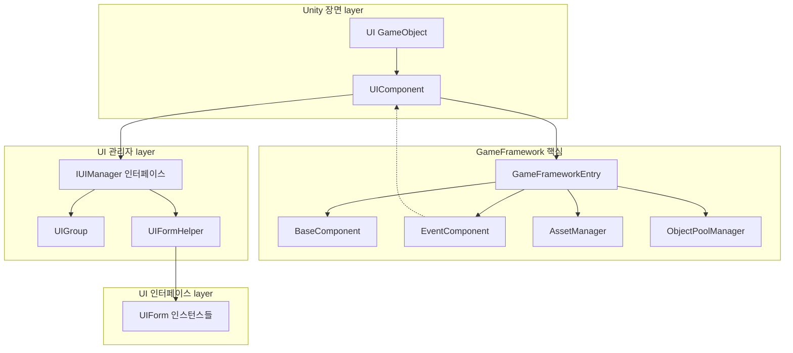
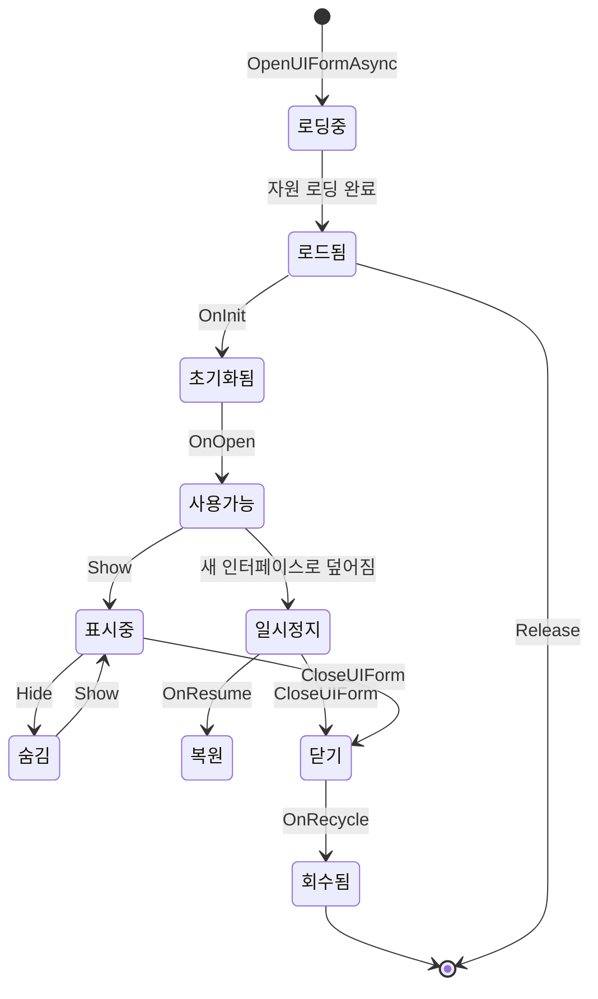

# UIComponent

UIComponent는 GameFrameX 프레임워크의 핵심UI 컴포넌트로, GameFrameworkComponent를 상속하며 게임 내 모든UI 인터페이스를 관리하는 데 사용됩니다. IUIManager 인터페이스의 퍼사드 클래스로,简洁한 API를 통해UI 열기, 닫기, 가져오기 등의 작업을 수행하며, UGUI와 FairyGUI 두 가지 UI 시스템을 동시에 지원합니다.

## 개요

UIComponent는 Unity 게임 장면의 핵심 컴포넌트로, 전체UI 시스템의 관리 및 스케줄링을 담당합니다. 게임 프레임워크의 핵심 컴포넌트 중 하나로, 하위 IUIManager 구현을 캡슐화하여 더 사용하기 쉬운 API 인터페이스를 제공합니다.

**주요 기능:**
- UI 인터페이스의 비동기 열기 및 닫기
- UI 인터페이스의 쿼리 및 가져오기
- UI 그룹（UIGroup）관리
- UI 객체 풀 구성
- UI 이벤트 시스템
- UI 표시/숨김 애니메이션 제어

## 아키텍처

UIComponent는 전체 아키텍처에서 퍼사드（Facade） 역할을 하며, 하위의 IUIManager 구현을 캡슐화합니다.



## 속성

### 루트 노드 속성

| 속성 | 유형 | 설명 |
|------|------|------|
| `UGUIRoot` | Transform | UGUI 루트 노드 변환 컴포넌트 가져오기 |
| `FairyGUIRoot` | Transform | FairyGUI 루트 노드 변환 컴포넌트 가져오기 |

### 자동 회수 구성

| 속성 | 유형 | 기본값 | 설명 |
|------|------|--------|------|
| `EnableAutoReleaseUIForm` | bool | true | 자동 회수 인터페이스 활성화 여부 |
| `InstanceAutoReleaseInterval` | float | 60f | 인터페이스 인스턴스 객체 풀의 자동 해제 간격（초）|
| `InstanceCapacity` | int | 16 | 인터페이스 인스턴스 객체 풀의 용량 |
| `InstanceExpireTime` | float | 60f | 인터페이스 인스턴스 객체 풀 객체 만료 시간（초）|
| `RecycleInterval` | int | 60 | 인터페이스 회수 간격（초）|

### 애니메이션 구성

| 속성 | 유형 | 기본값 | 설명 |
|------|------|--------|------|
| `IsEnableUIShowAnimation` | bool | false | UI 표시 애니메이션 활성화 여부 |
| `IsEnableUIHideAnimation` | bool | false | UI 숨김 애니메이션 활성화 여부 |

### UI 그룹 수

| 속성 | 유형 | 설명 |
|------|------|------|
| `UIGroupCount` | int | 인터페이스 그룹 수 가져오기 |

## API 참고

### 인터페이스 열기

#### `OpenAsync<T>(object userData = null, bool isFullScreen = false): Task<T>`

제네릭 유형을 기반으로 UI 자원 경로를 자동 해석하여 비동기적으로 인터페이스를 엽니다.

**파일:** [Runtime/UIComponent.Open.cs](https://github.com/GameFrameX/com.gameframex.unity.ui/blob/main/Runtime/UIComponent.Open.cs#L167-L191)

```csharp
// 사용 예제
var mainMenuForm = await this.OpenAsync<MainMenuUIForm>();
var settingsForm = await this.OpenAsync<SettingsUIForm>(userData, true);
```

**제네릭 매개변수:**
- `T`: UI의 구체적인 유형으로, IUIForm 인터페이스를 구현해야 합니다

**매개변수:**
- `userData` (object): UI에 전달할 사용자 데이터
- `isFullScreen` (bool): 전체 화면 표시 여부

**반환:** `Task<T>` - 열린 UI 인터페이스 인스턴스

---

#### `OpenAsync<T>(string uiFormAssetPath, bool pauseCoveredUIForm, object userData = null, bool isFullScreen = false): Task<T>`

자원 경로를 지정하고 덮어지는 인터페이스를 일시 정지할지 여부를 지정하여 비동기적으로 인터페이스를 엽니다.

**파일:** [Runtime/UIComponent.Open.cs](https://github.com/GameFrameX/com.gameframex.unity.ui/blob/main/Runtime/UIComponent.Open.cs#L152-L155)

```csharp
// 사용 예제
var form = await this.OpenAsync<MainMenuUIForm>("Assets/UI/MainMenu.prefab", true);
```

**매개변수:**
- `uiFormAssetPath` (string): UI 자원 경로
- `pauseCoveredUIForm` (bool): 덮어지는 인터페이스 일시 정지 여부
- `userData` (object): UI에 전달할 사용자 데이터
- `isFullScreen` (bool): 전체 화면 표시 여부

---

#### `OpenFullScreenAsync<T>(object userData = null): Task<T>`

비동기적으로 전체 화면 UI를 엽니다.

**파일:** [Runtime/UIComponent.Open.cs](https://github.com/GameFrameX/com.gameframex.unity.ui/blob/main/Runtime/UIComponent.Open.cs#L63-L68)

```csharp
var dialog = await this.OpenFullScreenAsync<DialogUIForm>(userData);
```

---

#### `OpenUIAsync(string uiFormAssetPath, Type uiFormType, bool pauseCoveredUIForm, object userData = null, bool isFullScreen = false): Task<IUIForm>`

Type 유형을 사용하여 비동기적으로 UI를 엽니다.

**파일:** [Runtime/UIComponent.Open.cs](https://github.com/GameFrameX/com.gameframex.unity.ui/blob/main/Runtime/UIComponent.Open.cs#L83-L86)

---

### 인터페이스 닫기

#### `CloseUIForm(int serialId, bool isNowRecycle = false): void`

시퀀스 번호로 인터페이스를 닫습니다.

**파일:** [Runtime/UIComponent.Close.cs](https://github.com/GameFrameX/com.gameframex.unity.ui/blob/main/Runtime/UIComponent.Close.cs#L43-L46)

```csharp
// 사용 예제
this.CloseUIForm(serialId);
this.CloseUIForm(serialId, true); // 즉시 회수
```

**매개변수:**
- `serialId` (int): 닫을 인터페이스의 시퀀스 번호
- `isNowRecycle` (bool): 즉시 회수 여부, 기본값 false

---

#### `CloseUIForm(IUIForm uiForm, bool isNowRecycle = false): void`

UI 인스턴스로 인터페이스를 닫습니다.

**파일:** [Runtime/UIComponent.Close.cs](https://github.com/GameFrameX/com.gameframex.unity.ui/blob/main/Runtime/UIComponent.Close.cs#L72-L75)

---

#### `CloseUIForm<T>(object userData = null, bool isNowRecycle = false): void where T : IUIForm`

유형으로 인터페이스를 닫습니다.

**파일:** [Runtime/UIComponent.Close.cs](https://github.com/GameFrameX/com.gameframex.unity.ui/blob/main/Runtime/UIComponent.Close.cs#L89-L92)

---

#### `CloseAllLoadedUIForms(bool isNowRecycle = false): void`

로드된 모든 인터페이스를 닫습니다.

**파일:** [Runtime/UIComponent.Close.cs](https://github.com/GameFrameX/com.gameframex.unity.ui/blob/main/Runtime/UIComponent.Close.cs#L131-L134)

---

#### `CloseAllLoadingUIForms(): void`

로딩 중인 모든 인터페이스를 닫습니다.

**파일:** [Runtime/UIComponent.Close.cs](https://github.com/GameFrameX/com.gameframex.unity.ui/blob/main/Runtime/UIComponent.Close.cs#L171-L174)

---

#### `ReleaseAllLoadedUIForms(bool isNowRecycle = false, object userData = null): void`

로드된 모든 인터페이스를 해제합니다.

**파일:** [Runtime/UIComponent.Close.cs](https://github.com/GameFrameX/com.gameframex.unity.ui/blob/main/Runtime/UIComponent.Close.cs#L145-L148)

---

#### `CloseUIGroup(string uiGroupName, object userData = null): void`

지정UI 그룹의 모든 인터페이스를 닫습니다.

**파일:** [Runtime/UIComponent.Close.cs](https://github.com/GameFrameX/com.gameframex.unity.ui/blob/main/Runtime/UIComponent.Close.cs#L118-L121)

---

### 인터페이스 가져오기

#### `GetUIForm(int serialId): IUIForm`

시퀀스 번호로 인터페이스를 가져옵니다.

**파일:** [Runtime/UIComponent.Get.cs](https://github.com/GameFrameX/com.gameframex.unity.ui/blob/main/Runtime/UIComponent.Get.cs#L47-L50)

```csharp
var form = this.GetUIForm(serialId);
```

---

#### `GetUIForm(string uiFormAssetName): IUIForm`

자원 이름으로 인터페이스를 가져옵니다.

**파일:** [Runtime/UIComponent.Get.cs](https://github.com/GameFrameX/com.gameframex.unity.ui/blob/main/Runtime/UIComponent.Get.cs#L61-L64)

---

#### `GetUIForms(string uiFormAssetName): IUIForm[]`

모든 지정 자원 이름의 인터페이스 배열을 가져옵니다.

**파일:** [Runtime/UIComponent.Get.cs](https://github.com/GameFrameX/com.gameframex.unity.ui/blob/main/Runtime/UIComponent.Get.cs#L75-L85)

---

#### `GetLoaded<T>(): T where T : class, IUIForm`

유형으로 로드된 인터페이스를 가져오며, 첫 번째 일치 인스턴스를 반환합니다.

**파일:** [Runtime/UIComponent.Get.cs](https://github.com/GameFrameX/com.gameframex.unity.ui/blob/main/Runtime/UIComponent.Get.cs#L238-L251)

```csharp
var mainMenu = this.GetLoaded<MainMenuUIForm>();
```

---

#### `GetLoadedList<T>(): List<T> where T : class, IUIForm`

지정 유형의 모든 로드된 인터페이스 목록을 가져옵니다.

**파일:** [Runtime/UIComponent.Get.cs](https://github.com/GameFrameX/com.gameframex.unity.ui/blob/main/Runtime/UIComponent.Get.cs#L120-L134)

---

#### `GetLoadedAndShowing<T>(): T where T : class, IUIForm`

로드되고 표시 중인 UI를 가져옵니다.

**파일:** [Runtime/UIComponent.Get.cs](https://github.com/GameFrameX/com.gameframex.unity.ui/blob/main/Runtime/UIComponent.Get.cs#L168-L181)

---

#### `GetAllLoadedUIForms(): IUIForm[]`

로드된 모든 인터페이스를 가져옵니다.

**파일:** [Runtime/UIComponent.Get.cs](https://github.com/GameFrameX/com.gameframex.unity.ui/blob/main/Runtime/UIComponent.Get.cs#L261-L271)

---

#### `GetAllLoadingUIFormSerialIds(): int[]`

로딩 중인 모든 인터페이스의 시퀀스 번호를 가져옵니다.

**파일:** [Runtime/UIComponent.Get.cs](https://github.com/GameFrameX/com.gameframex.unity.ui/blob/main/Runtime/UIComponent.Get.cs#L305-L308)

---

### 상태 쿼리

#### `HasUIForm(int serialId): bool`

지정 시퀀스 번호의 인터페이스 존재 여부를 확인합니다.

**파일:** [Runtime/UIComponent.cs](https://github.com/GameFrameX/com.gameframex.unity.ui/blob/main/Runtime/UIComponent.cs#L542-L545)

---

#### `HasUIForm(string uiFormAssetName): bool`

지정 자원 이름의 인터페이스 존재 여부를 확인합니다.

**파일:** [Runtime/UIComponent.cs](https://github.com/GameFrameX/com.gameframex.unity.ui/blob/main/Runtime/UIComponent.cs#L556-L559)

---

#### `IsLoadingUIForm(int serialId): bool`

인터페이스가 로딩 중인지 확인합니다（시퀀스 번호로）.

**파일:** [Runtime/UIComponent.cs](https://github.com/GameFrameX/com.gameframex.unity.ui/blob/main/Runtime/UIComponent.cs#L570-L573)

---

#### `IsLoadingUIForm(string uiFormAssetName): bool`

인터페이스가 로딩 중인지 확인합니다（자원 이름으로）.

**파일:** [Runtime/UIComponent.cs](https://github.com/GameFrameX/com.gameframex.unity.ui/blob/main/Runtime/UIComponent.cs#L584-L587)

---

#### `IsValidUIForm(IUIForm uiForm): bool`

인터페이스가 유효한지 확인합니다.

**파일:** [Runtime/UIComponent.cs](https://github.com/GameFrameX/com.gameframex.unity.ui/blob/main/Runtime/UIComponent.cs#L598-L601)

---

#### `HasLoadedAndShowing(string uiFormAssetName): bool`

로드되고 표시 중인 UI 존재 여부를 확인합니다.

**파일:** [Runtime/UIComponent.Get.cs](https://github.com/GameFrameX/com.gameframex.unity.ui/blob/main/Runtime/UIComponent.Get.cs#L192-L204)

---

### UI 그룹 관리

#### `HasUIGroup(string uiGroupName): bool`

지정 UI 그룹 존재 여부를 확인합니다.

**파일:** [Runtime/UIComponent.IUIGroup.cs](https://github.com/GameFrameX/com.gameframex.unity.ui/blob/main/Runtime/UIComponent.IUIGroup.cs#L46-L49)

---

#### `GetUIGroup(string uiGroupName): IUIGroup`

지정 이름의 UI 그룹을 가져옵니다.

**파일:** [Runtime/UIComponent.IUIGroup.cs](https://github.com/GameFrameX/com.gameframex.unity.ui/blob/main/Runtime/UIComponent.IUIGroup.cs#L60-L63)

---

#### `GetAllUIGroups(): IUIGroup[]`

모든 UI 그룹을 가져옵니다.

**파일:** [Runtime/UIComponent.IUIGroup.cs](https://github.com/GameFrameX/com.gameframex.unity.ui/blob/main/Runtime/UIComponent.IUIGroup.cs#L73-L76)

---

#### `AddUIGroup(string uiGroupName): bool`

UI 그룹을 추가합니다（기본 깊이 0）.

**파일:** [Runtime/UIComponent.IUIGroup.cs](https://github.com/GameFrameX/com.gameframex.unity.ui/blob/main/Runtime/UIComponent.IUIGroup.cs#L100-L103)

---

#### `AddUIGroup(string uiGroupName, int depth): bool`

지정 깊이로 UI 그룹을 추가합니다.

**파일:** [Runtime/UIComponent.IUIGroup.cs](https://github.com/GameFrameX/com.gameframex.unity.ui/blob/main/Runtime/UIComponent.IUIGroup.cs#L115-L147)

---

### 인터페이스 활성화

#### `RefocusUIForm(UIForm uiForm): void`

지정 인터페이스를 활성화합니다.

**파일:** [Runtime/UIComponent.cs](https://github.com/GameFrameX/com.gameframex.unity.ui/blob/main/Runtime/UIComponent.cs#L612-L615)

```csharp
this.RefocusUIForm(mainMenuForm);
```

---

#### `RefocusUIForm(UIForm uiForm, object userData): void`

지정 인터페이스를 활성화하고 사용자 데이터를 전달합니다.

**파일:** [Runtime/UIComponent.cs](https://github.com/GameFrameX/com.gameframex.unity.ui/blob/main/Runtime/UIComponent.cs#L626-L629)

---

### 인스턴스 잠금

#### `SetUIFormInstanceLocked(UIForm uiForm, bool locked): void`

인터페이스 인스턴스의 잠금 상태를 설정합니다.

**파일:** [Runtime/UIComponent.cs](https://github.com/GameFrameX/com.gameframex.unity.ui/blob/main/Runtime/UIComponent.cs#L640-L649)

---

### 애니메이션 처리

#### `SetShowUIFormHandler(IUIFormShowHandler uiFormShowHandler): void`

UI 표시 애니메이션 처리 인터페이스를 설정합니다.

**파일:** [Runtime/UIComponent.cs](https://github.com/GameFrameX/com.gameframex.unity.ui/blob/main/Runtime/UIComponent.cs#L668-L671)

---

#### `SetHideUIFormHandler(IUIFormHideHandler uiFormHideHandler): void`

UI 숨김 애니메이션 처리 인터페이스를 설정합니다.

**파일:** [Runtime/UIComponent.cs](https://github.com/GameFrameX/com.gameframex.unity.ui/blob/main/Runtime/UIComponent.cs#L673-L677)

---

## UI 인터페이스 생명주기

UI 인터페이스는 시스템에서 완전한 생명주기를 가지며, 다음은 각 상태 간의 전환 관계입니다:



### 생명주기 콜백

| 콜백 메서드 | 호출 타이밍 | 설명 |
|---------|---------|------|
| `OnAwake()` | Unity Awake 시 | 인터페이스 깨우기로, 이벤트 구독 초기화에 사용 가능 |
| `OnInit()` | 인터페이스 최초 초기화 | 한 번만 호출되며,视图 초기화에 사용 가능 |
| `OnOpen(object userData)` | 인터페이스 열릴 때 | 매번 열 때 호출되며, userData를 수신할 수 있습니다 |
| `BindEvent()` | 이벤트 바인딩 시 | 인터페이스에 필요한 이벤트 바인딩 |
| `LoadData()` | 데이터 로딩 시 | 인터페이스에 필요한 데이터 로딩 |
| `OnUpdate()` | 매 프레임 업데이트 | 인터페이스 폴링 |
| `OnClose(bool isShutdown, object userData)` | 인터페이스 닫힐 때 | 닫기 시 자원 정리 |
| `OnRecycle()` | 인터페이스 회수 시 | 회수 전 상태 초기화 |
| `UpdateLocalization()` | 언어 변경 시 | 현지화 텍스트 업데이트 |

## 구성 옵션

| 구성 항목 | 유형 | 기본값 | 설명 |
|--------|------|--------|------|
| `EnableOpenUIFormSuccessEvent` | bool | true | 인터페이스 열기 성공 이벤트 활성화 여부 |
| `EnableOpenUIFormFailureEvent` | bool | true | 인터페이스 열기 실패 이벤트 활성화 여부 |
| `EnableCloseUIFormCompleteEvent` | bool | true | 인터페이스 닫기 완료 이벤트 활성화 여부 |
| `EnableAutoReleaseUIForm` | bool | true | 자동 회수 인터페이스 활성화 여부 |
| `IsEnableUIShowAnimation` | bool | false | UI 표시 애니메이션 활성화 여부 |
| `IsEnableUIHideAnimation` | bool | false | UI 숨김 애니메이션 활성화 여부 |
| `InstanceAutoReleaseInterval` | float | 60f | 자동 해제 간격（초）|
| `InstanceCapacity` | int | 16 | 객체 풀 용량 |
| `InstanceExpireTime` | float | 60f | 객체 만료 시간（초）|
| `RecycleInterval` | int | 60 | 회수 간격（초）|
| `m_UIFormHelperTypeName` | string | FairyGUIFormHelper | UI 폼 보조기 유형 이름 |
| `m_UIGroupHelperTypeName` | string | FairyGUIUIGroupHelper | UI 그룹 보조기 유형 이름 |

## 관련 링크

- [UIForm](./5-api-reference.ui-form) - UI 인터페이스 기본 클래스
- [IUIManager](./5-api-reference.iuimanager) - UI 관리자 인터페이스
- [IUIGroup](./5-api-reference.iuigroup) - UI 그룹 인터페이스
- [핵심 개념 - UI 컴포넌트](./4-core-concepts.ui-component) - UI 컴포넌트 핵심 개념
- [핵심 개념 - UI 창체](./4-core-concepts.ui-form) - UI 창체 핵심 개념
- [핵심 개념 - UI 그룹 시스템](./4-core-concepts.ui-group) - UI 그룹 시스템 핵심 개념
- [이벤트 시스템](./6-event-system) - UI 이벤트 시스템