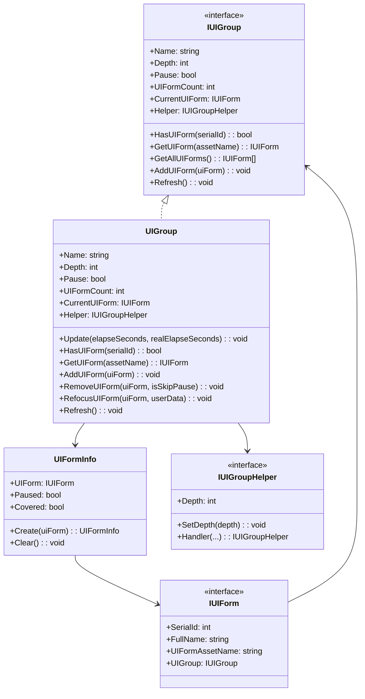
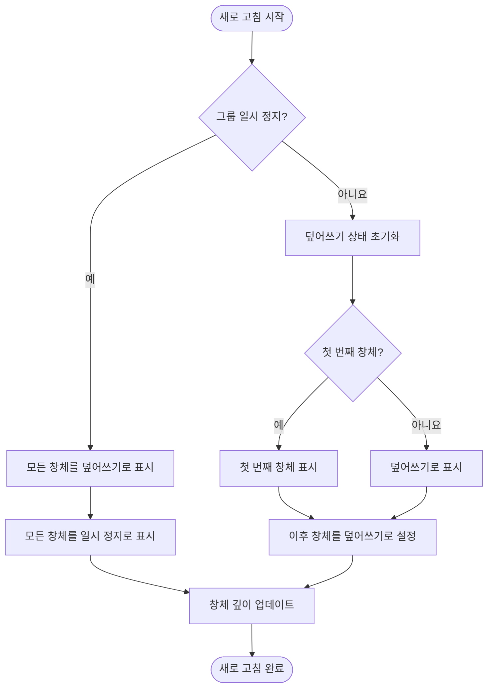
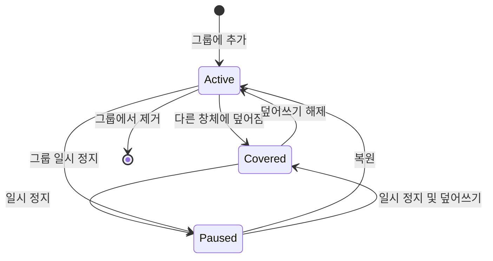

# IUIGroup

인터페이스 그룹 인터페이스로, UI 그룹 관리의 기본 작업을 정의합니다.

## 개요

`IUIGroup`는 GameFrameX UI 시스템의 핵심 인터페이스 중 하나로,一组 관련 UI 창체를 관리하는 데 사용됩니다. UI 창체의 쿼리, 추가, 제거, 새로 고침 등의 작업을 제공하며, 동시에 깊이 관리 및 일시 정지/복원 기능을 지원합니다.

**설계 의도**: UI 그룹 시스템을 통해 개발자는 UI 창체를 논리적으로 그룹화할 수 있으며, 각 그룹은 깊이, 일시 정지 상태 및 표시 순서를 독립적으로 제어할 수 있습니다. 예를 들어, "메인 메뉴 UI", "게임 내 UI", "팝업 UI"를 각각 다른 그룹에 배치하여 관리 및 제어를 편리하게 할 수 있습니다.

## 아키텍처



**아키텍처 설명**:
- `IUIGroup`는 UI 그룹의 추상 인터페이스를 정의합니다
- `UIGroup`는 인터페이스의 구체 구현으로, `GameFrameworkLinkedList<UIFormInfo>`를 사용하여 UI 창체 리스트를 내부적으로 유지합니다
- `UIFormInfo`는 각 UI 창체의 상태 정보（일시 정지/덮어쓰기 상태）를 저장합니다
- `IUIGroupHelper`는 플랫폼별 UI 그룹 렌더링 로직을 처리합니다

## 핵심 흐름

### UI 그룹 새로 고침 흐름

UI 그룹 속성（깊이, 일시 정지 상태）변경 시 새로 고침 흐름이 트리거되어 그룹 내 모든 UI 창체 상태를 업데이트합니다.



**새로 고침 로직 설명**:
1. 그룹이 일시 정지 상태이면 모든 UI 창체가 "덮어쓰기" 및 "일시 정지"로 표시됩니다
2. 그룹이 일시 정지되지 않으면 첫 번째 UI 창체가 표시되고（덮어쓰기 상태 해제）, 이후 창체는 덮어쓰기로 표시됩니다
3. 새로 고침 과정에서 각 UI 창체의 깊이 정보가 업데이트됩니다

### UI 창체 생명주기 상태



## 속성 상세

### Name

```csharp
string Name { get; }
```

UI 그룹 이름을 가져옵니다. 이 이름은 UI 관리자에서 해당 그룹을 고유하게 식별합니다.

### Depth

```csharp
int Depth { get; set; }
```

UI 그룹 깊이를 가져오거나 설정합니다. 깊이 값은 UI 그룹의 렌더링 순서를 결정하며, 깊이 값이 큰 그룹이 깊이 값이 작은 그룹 위에 렌더링됩니다.

### Pause

```csharp
bool Pause { get; set; }
```

UI 그룹의 일시 정지 여부를 가져오거나 설정합니다. 일시 정지가 `true`일 때 그룹 내 모든 UI 창체가 일시 정지되어 사용자 상호작용에 응답하지 않습니다.

### UIFormCount

```csharp
int UIFormCount { get; }
```

UI 그룹 내 UI 창체 수를 가져옵니다.

### CurrentUIForm

```csharp
IUIForm CurrentUIForm { get; }
```

현재 최상위（마지막으로 추가）UI 창체를 가져옵니다.

### Helper

```csharp
IUIGroupHelper Helper { get; }
```

UI 그룹 보조기를 가져오며, 플랫폼별 UI 그룹 작업을 처리하는 데 사용됩니다.

## 메서드 상세

### HasUIForm

```csharp
bool HasUIForm(int serialId);
bool HasUIForm(string uiFormAssetName);
```

UI 그룹에서 지정된 UI 창체 존재 여부를 확인합니다.

**매개변수**:
- `serialId` (int): UI 창체의 시퀀스 번호
- `uiFormAssetName` (string): UI 창체의 자원 이름

**반환값**: 지정된 UI 창체 존재 여부

### GetUIForm

```csharp
IUIForm GetUIForm(int serialId);
IUIForm GetUIForm(string uiFormAssetName);
```

UI 그룹에서 UI 창체를 가져옵니다.

**매개변수**:
- `serialId` (int): UI 창체의 시퀀스 번호
- `uiFormAssetName` (string): UI 창체의 자원 이름

**반환값**: 가져올 UI 창체, 존재하지 않으면 null

### GetUIForms

```csharp
IUIForm[] GetUIForms(string uiFormAssetName);
void GetUIForms(string uiFormAssetName, List<IUIForm> results);
```

UI 그룹에서 모든 지정 자원 이름의 UI 창체를 가져옵니다（여러 인스턴스일 수 있음）.

**매개변수**:
- `uiFormAssetName` (string): UI 창체의 자원 이름
- `results` (`List<IUIForm>`): 결과를 저장할 리스트

### GetAllUIForms

```csharp
IUIForm[] GetAllUIForms();
void GetAllUIForms(List<IUIForm> results);
```

UI 그룹의 모든 UI 창체를 가져옵니다.

**매개변수**:
- `results` (`List<IUIForm>`): 결과를 저장할 리스트

### AddUIForm

```csharp
void AddUIForm(IUIForm uiForm);
```

UI 그룹에 UI 창체를 추가합니다. 새로 추가된 창체는 현재 창체（최상위）가 됩니다.

**매개변수**:
- `uiForm` (IUIForm): 추가할 UI 창체

### InternalHasInstanceUIForm

```csharp
bool InternalHasInstanceUIForm(string uiFormAssetName, IUIForm uiForm);
```

UI 그룹에서 지정된 UI 창체 인스턴스 존재 여부를 확인합니다（내부 사용）.

**매개변수**:
- `uiFormAssetName` (string): UI 창체의 자원 이름
- `uiForm` (IUIForm): 확인할 UI 창체 인스턴스

**반환값**: 지정된 UI 창체 인스턴스 존재 여부

### Refresh

```csharp
void Refresh();
```

UI 그룹을 새로 고칩니다. 그룹의 깊이 또는 일시 정지 상태가 변경되면 이 메서드를 호출하여 그룹 내 모든 UI 창체 상태를 업데이트합니다.

## 사용 예제

### UI 그룹 가져오기 및 창체 쿼리

```csharp
// UI 관리자를 통해 UI 그룹 가져오기
var uiGroup = uiManager.GetUIGroup("MainMenuGroup");

// 그룹에서 지정 창체 존재 여부 확인
bool exists = uiGroup.HasUIForm("TestForm");

// 현재 창체 가져오기
var currentForm = uiGroup.CurrentUIForm;

// 모든 창체 가져오기
var allForms = uiGroup.GetAllUIForms();
```
> Source: [IUIGroup.cs](https://github.com/GameFrameX/com.gameframex.unity.ui/blob/main/Runtime/UI/IUIGroup.cs#L42-L197)

### UI 그룹 상태 수정

```csharp
var uiGroup = uiManager.GetUIGroup("DialogGroup");

// 그룹 깊이 설정
uiGroup.Depth = 10;

// 그룹 일시 정지（모든 창체가 일시 정지됨）
uiGroup.Pause = true;

// 그룹 상태 새로 고침
uiGroup.Refresh();
```
> Source: [UIGroup.cs](https://github.com/GameFrameX/com.gameframex.unity.ui/blob/main/Runtime/UI/UIGroup.cs#L106-L142)

### UI 창체 관리

```csharp
var uiGroup = uiManager.GetUIGroup("DefaultGroup");

// 그룹에 창체 추가
uiGroup.AddUIForm(uiForm);

// 그룹 새로 고침
uiGroup.Refresh();

// 창체 가져오기
var form = uiGroup.GetUIForm("MyForm");
```
> Source: [UIGroup.cs](https://github.com/GameFrameX/com.gameframex.unity.ui/blob/main/Runtime/UI/UIGroup.cs#L439-L442)

## 관련 링크

- [UIForm](./5-api-reference.ui-form) - UI 창체 인터페이스
- [IUIManager](./5-api-reference.iuimanager) - UI 관리자 인터페이스
- [UI 그룹 시스템](../4-core-concepts.ui-group) - UI 그룹 시스템 핵심 개념
- [UI 그룹 계층](../7-ui-group-hierarchy) - UI 그룹 계층 구성