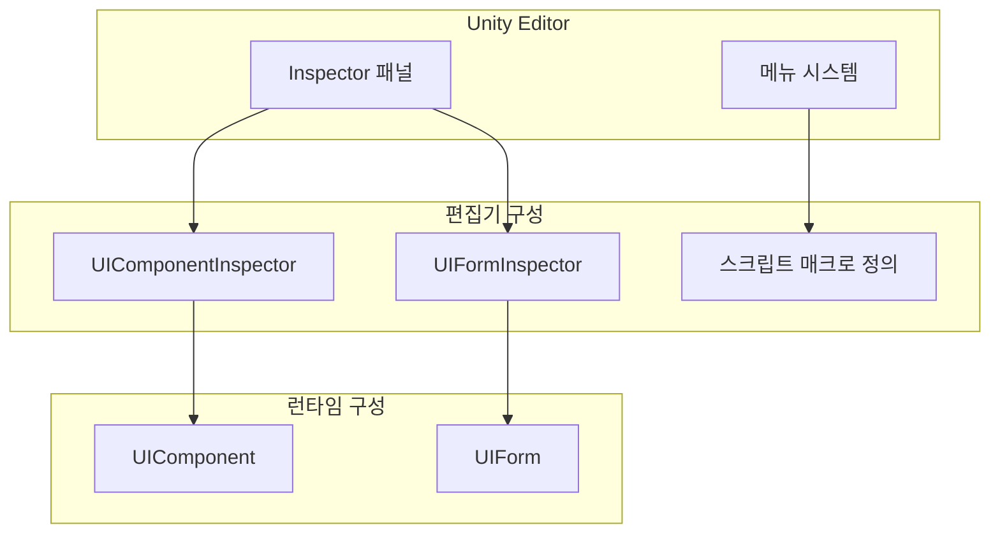
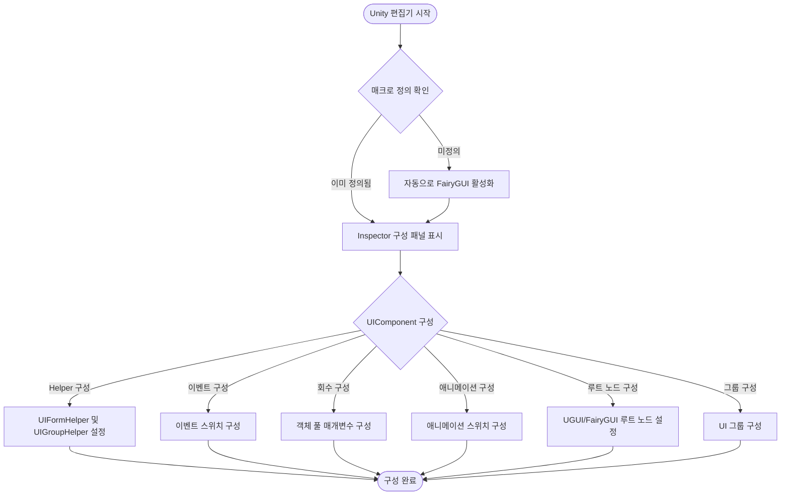

# 편집기 구성

GameFrameX UI 시스템은 Unity 편집기 구성 기능을 제공하여, 개발자가 Inspector 패널 및 메뉴 옵션을 통해 UI 시스템의 다양한 매개변수를 유연하게 구성할 수 있도록 합니다.

## 개요

편집기 구성은 GameFrameX UI 시스템의 중요한 구성 부분으로, 두 가지 주요 구성 방식을 제공합니다:

1. **Inspector 패널 구성**: Unity 편집기의 Inspector 패널을 통해 UI 컴포넌트 및 창체를 직접 구성
2. **스크립트 매크로 정의 전환**: 메뉴를 통해 다양한 UI 엔진（UGUI 또는 FairyGUI）切换

이러한 설계使得 UI 시스템의 구성이 직관적이고 편리해지며, 코드 작성 없이 대부분의 구성 작업을 완료할 수 있습니다.

## UI 컴포넌트 구성

UIComponent는 UI 시스템의 핵심 컴포넌트로, `UIComponentInspector`를 통해 Inspector 패널에서 구성됩니다.

### 구성 인터페이스 개요

```csharp
[CustomEditor(typeof(UIComponent))]
internal sealed class UIComponentInspector : ComponentTypeComponentInspector
```
> Source: [UIComponentInspector.cs](https://github.com/GameFrameX/com.gameframex.unity.ui/blob/main/Editor/UIComponentInspector.cs#L38-L40)

### Helper 구성

Inspector 패널에서 다음 Helper 클래스를 구성할 수 있습니다:

| 구성 항목 | 유형 | 설명 |
|--------|------|------|
| UIForm Helper | UIFormHelperBase | UI 창체 로딩 보조기 |
| UIGroup Helper | UIGroupHelperBase | UI 그룹 보조기 |

```csharp
private HelperInfo<UIFormHelperBase> m_UIFormHelperInfo = new HelperInfo<UIFormHelperBase>("UIForm");
private HelperInfo<UIGroupHelperBase> m_UIGroupHelperInfo = new HelperInfo<UIGroupHelperBase>("UIGroup");
```
> Source: [UIComponentInspector.cs](https://github.com/GameFrameX/com.gameframex.unity.ui/blob/main/Editor/UIComponentInspector.cs#L62-L63)

**중요한 알림**: UIForm Helper와 UIGroup Helper의 네임스페이스 접두사는 반드시 일치해야 하며, 그렇지 않으면 초기화 실패합니다.

## 이벤트 시스템 구성

UIComponent는 특정 UI 이벤트 구독을 제어하기 위해 다양한 이벤트 스위치를 제공합니다:

| 이벤트 구성 | 기본값 | 설명 |
|----------|--------|------|
| EnableOpenUIFormSuccessEvent | true | 열기 인터페이스 성공 이벤트 활성화 |
| EnableOpenUIFormFailureEvent | true | 열기 인터페이스 실패 이벤트 활성화 |
| EnableCloseUIFormCompleteEvent | true | 닫기 인터페이스 완료 이벤트 활성화 |

```csharp
[SerializeField] private bool m_EnableOpenUIFormSuccessEvent = true;
[SerializeField] private bool m_EnableOpenUIFormFailureEvent = true;
[SerializeField] private bool m_EnableCloseUIFormCompleteEvent = true;
```
> Source: [UIComponent.cs](https://github.com/GameFrameX/com.gameframex.unity.ui/blob/main/Runtime/UIComponent.cs#L62-L86)

### 구성 설명

- **열기 인터페이스 성공 이벤트 활성화**: 활성화하면 인터페이스가 성공적으로 열릴 때 해당 이벤트가 트리거됩니다
- **열기 인터페이스 실패 이벤트 활성화**: 활성화하면 인터페이스 열기 실패 시 해당 이벤트가 트리거됩니다
- **닫기 인터페이스 완료 이벤트 활성화**: 활성화하면 인터페이스 닫기 완료 시 해당 이벤트가 트리거됩니다

## 자동 회수 구성

UIComponent는 완전한 객체 풀 및 자동 회수 메커니즘 구성을 제공합니다:

### 회수 설정

| 구성 항목 | 유형 | 기본값 | 설명 |
|--------|------|--------|------|
| EnableAutoReleaseUIForm | bool | true | 자동 회수 인터페이스 활성화 여부 |
| RecycleInterval | int | 60 | 인터페이스 회수 간격（초）, 범위 10-600 |
| InstanceAutoReleaseInterval | float | 60f | 인스턴스 자동 해제 간격（초）|
| InstanceCapacity | int | 16 | 인스턴스 객체 풀 용량 |
| InstanceExpireTime | float | 60f | 인스턴스 만료 시간（초）|

```csharp
[SerializeField] private bool m_EnableAutoReleaseUIForm = true;
[SerializeField] private float m_InstanceAutoReleaseInterval = 60f;
[SerializeField] private int m_InstanceCapacity = 16;
[SerializeField] private float m_InstanceExpireTime = 60f;
[SerializeField] private int m_RecycleInterval = 60;
```
> Source: [UIComponent.cs](https://github.com/GameFrameX/com.gameframex.unity.ui/blob/main/Runtime/UIComponent.cs#L77-L141)

### 구성 설명

- **EnableAutoReleaseUIForm**: 비활성화하면 인터페이스 닫을 때 자원이 자동으로 해제되지 않으며, 캐시 재활용 시나리오에 적용됩니다
- **RecycleInterval**: 객체 풀의 사용 가능한 객체를 자동으로 회수하는 시간 간격을 설정하며, 범위는 10-600초입니다
- **InstanceAutoReleaseInterval**: 인터페이스 인스턴스 객체 풀의 사용 가능한 객체 자동 해제 간격（초）
- **InstanceCapacity**: 인터페이스 인스턴스 객체 풀의 용량으로, 풀에서 캐시할 수 있는 최대 인터페이스 인스턴스 수입니다
- **InstanceExpireTime**: 인터페이스 인스턴스 객체 풀의 객체 만료 시간（초）으로, 인터페이스 닫은 후 이 시간 내에 재사용할 수 있습니다

## 애니메이션 구성

UIComponent는 인터페이스 열기 및 닫기 시 애니메이션 효과를 지원합니다:

| 구성 항목 | 유형 | 기본값 | 설명 |
|--------|------|--------|------|
| IsEnableUIShowAnimation | bool | false | 인터페이스 표시 애니메이션 활성화 여부 |
| IsEnableUIHideAnimation | bool | false | 인터페이스 숨김 애니메이션 활성화 여부 |

```csharp
[SerializeField] private bool m_IsEnableUIShowAnimation = false;
[SerializeField] private bool m_IsEnableUIHideAnimation = false;
```
> Source: [UIComponent.cs](https://github.com/GameFrameX/com.gameframex.unity.ui/blob/main/Runtime/UIComponent.cs#L95-L104)

## UI 루트 노드 구성

다른 UI 엔진에 따라 해당 루트 노드를 구성해야 합니다:

### UGUI 루트 노드

```csharp
[SerializeField] private Transform m_InstanceUGUIRoot = null;
```
> Source: [UIComponent.cs](https://github.com/GameFrameX/com.gameframex.unity.ui/blob/main/Runtime/UIComponent.cs#L152)

### FairyGUI 루트 노드

```csharp
[SerializeField] private Transform m_InstanceFairyGUIRoot = null;
```
> Source: [UIComponent.cs](https://github.com/GameFrameX/com.gameframex.unity.ui/blob/main/Runtime/UIComponent.cs#L161)

## UI 그룹 구성

UIComponent는 여러 UI 그룹（UIGroup）구성을 지원하며, 각 그룹은 독립적인 이름과 깊이를 설정할 수 있습니다:

```csharp
[SerializeField] private UIGroup[] m_UIGroups = new UIGroup[]
{
    new UIGroup(UIGroupConstants.Hidden.Depth, UIGroupConstants.Hidden.Name),
};
```
> Source: [UIComponent.cs](https://github.com/GameFrameX/com.gameframex.unity.ui/blob/main/Runtime/UIComponent.cs#L206-L208)

**중요한 알림**:
- 반드시 하나 이상의 UIGroup를 설정해야 합니다
- 여러 UIGroup가 동일한 Depth（깊이）설정되지 않도록 강력히 권장합니다

## UI 창체 구성

UIForm은 UI 시스템의 창체 기본 클래스로, `UIFormInspector`를 통해 Inspector 패널에서 구성됩니다:

### 창체 기본 속성

| 속성 | 유형 | 설명 |
|------|------|------|
| FullName | string | 창체 완전한 이름 |
| SerialId | int | 창체 시퀀스 ID |
| Available | bool | 창체 사용 가능 여부 |
| Visible | bool | 창체 표시 여부 |
| IsInit | bool | 창체 초기화 여부 |
| IsDisableRecycling | bool | 회수 비활성화 여부 |
| IsDisableClosing | bool | 닫기 비활성화 여부 |
| DepthInUIGroup | int | UI 그룹 내의 깊이 |
| PauseCoveredUIForm | bool | 덮어질 때 일시 정지 여부 |

```csharp
[CustomEditor(typeof(UIForm), true)]
internal sealed class UIFormInspector : GameFrameworkInspector
```
> Source: [UIFormInspector.cs](https://github.com/GameFrameX/com.gameframex.unity.ui/blob/main/Editor/UIFormInspector.cs#L41-L42)

### 창체 애니메이션 속성

| 속성 | 유형 | 설명 |
|------|------|------|
| EnableShowAnimation | bool | 표시 애니메이션 활성화 여부 |
| ShowAnimationName | string | 표시 애니메이션 이름 |
| EnableHideAnimation | bool | 숨김 애니메이션 활성화 여부 |
| HideAnimationName | string | 숨김 애니메이션 이름 |

## 스크립트 매크로 정의 구성

GameFrameX UI 시스템은 UGUI와 FairyGUI 두 가지 UI 엔진을 지원합니다. 스크립트 매크로 정의를 통해 다른 엔진을 전환할 수 있습니다.

### 매크로 정의 기호

| 매크로 정의 | 설명 |
|--------|------|
| ENABLE_UI_UGUI | UGUI 어댑터 활성화 |
| ENABLE_UI_FAIRYGUI | FairyGUI 어댑터 활성화 |

```csharp
public const string UGUIScriptingDefineSymbol = "ENABLE_UI_UGUI";
public const string FairyGUIScriptingDefineSymbol = "ENABLE_UI_FAIRYGUI";
```
> Source: [UISystemScriptingDefineSymbols.cs](https://github.com/GameFrameX/com.gameframex.unity.ui/blob/main/Editor/UISystemScriptingDefineSymbols.cs#L42-L43)

### UI 엔진 전환

Unity 편집기에서 메뉴를 통해 UI 엔진을 전환할 수 있습니다:

1. 메뉴 열기: **GameFrameX → Scripting Define Symbols**
2. 필요한 UI 시스템 선택:
   - **Enable UGUI(开启UGUI适配)** - UGUI로 전환
   - **Enable FairyGUI(开启FairyGUI适配)** - FairyGUI로 전환

```csharp
[MenuItem("GameFrameX/Scripting Define Symbols/Enable UGUI(开启UGUI适配)", false, 1000)]
public static void EnableUGUISystem()
{
    ScriptingDefineSymbols.RemoveScriptingDefineSymbol(FairyGUIScriptingDefineSymbol);
    ScriptingDefineSymbols.AddScriptingDefineSymbol(UGUIScriptingDefineSymbol);
}

[MenuItem("GameFrameX/Scripting Define Symbols/Enable FairyGUI(开启FairyGUI适配)", false, 1001)]
public static void EnableFairyGUISystem()
{
    ScriptingDefineSymbols.RemoveScriptingDefineSymbol(UGUIScriptingDefineSymbol);
    ScriptingDefineSymbols.AddScriptingDefineSymbol(FairyGUIScriptingDefineSymbol);
}
```
> Source: [UISystemScriptingDefineSymbols.cs](https://github.com/GameFrameX/com.gameframex.unity.ui/blob/main/Editor/UISystemScriptingDefineSymbols.cs#L48-L63)

### 자동 감지

편집기가 로드될 때 UI 시스템의 매크로 정의 기호가 정의되었는지 확인하는 자동 감지 메커니즘이 제공됩니다:

```csharp
[InitializeOnLoadMethod]
static void Run()
{
    var hasUGUIScriptingDefineSymbol = ScriptingDefineSymbols.HasScriptingDefineSymbol(...);
    var hasFairyGUIScriptingDefineSymbol = ScriptingDefineSymbols.HasScriptingDefineSymbol(...);
    
    if (!(hasFairyGUIScriptingDefineSymbol || hasUGUIScriptingDefineSymbol))
    {
        EditorUtility.DisplayDialog("UI 시스템의 매크로 정의가 감지되지 않았습니다", "FairyGUI UI 시스템이 자동으로 활성화됩니다", "알겠습니다");
        UISystemScriptingDefineSymbols.EnableFairyGUISystem();
    }
}
```
> Source: [UISystemScriptingDefineCheckHandler.cs](https://github.com/GameFrameX/com.gameframex.unity.ui/blob/main/Editor/UISystemScriptingDefineCheckHandler.cs#L15-L47)

어떤 UI 시스템의 매크로 정의도 감지되지 않으면 시스템이 자동으로 FairyGUI를 기본 엔진으로 활성화합니다.

## UI 구성 특성

`OptionUIConfigAttribute` 특성 클래스는 FairyGUI와 UGUI 두 프레임워크를 지원하기 위해 UI 구성을 표시하는 데 사용됩니다:

```csharp
[AttributeUsage(AttributeTargets.Class)]
public sealed class OptionUIConfigAttribute : Attribute
{
    public string PackageName { get; private set; }  // FairyGUI 패키지 이름
    public string Path { get; private set; }         // UGUI 자원 경로
    public bool IsResource { get; private set; }    // 자원 경로 여부인지
}
```
> Source: [OptionUIConfigAttribute.cs](https://github.com/GameFrameX/com.gameframex.unity.ui/blob/main/Runtime/Attribute/OptionUIConfigAttribute.cs#L44-L74)

### 사용 예제

```csharp
// FairyGUI 구성
[OptionUIConfigAttribute("MyFairyGUIPackage")]
public class MyUIForm : UIForm { }

// UGUI 프리팹 경로 구성
[OptionUIConfigAttribute("Assets/Prefabs/UI/")]
public class MyUIForm : UIForm { }

// UGUI 자원 경로 구성
[OptionUIConfigAttribute(true)]  // isResource = true
public class MyUIForm : UIForm { }
```

## 아키텍처 diagram



## 구성 흐름도



## 일반 구성 문제

### 1. Helper 네임스페이스 불일치

**문제**: 초기화 실패, Helper 설정 오류提示

**해결 방안**: UIForm Helper와 UIGroup Helper의 네임스페이스 접두사가 일치하는지 확인합니다

### 2. UI 그룹 깊이 중복

**문제**: 여러 UI 그룹이 동일한 깊이 값으로 설정됨

**해결 방안**: Inspector 패널에서 각 UI 그룹에 다른 Depth 값 설정합니다

### 3. 루트 노드 미설정

**문제**: 런타임 시 루트 노드 설정 오류提示

**해결 방안**: Inspector 패널에서 UGUI Root 또는 FairyGUI Root를 올바르게 설정합니다

## 관련 링크

- [UI 컴포넌트](./4-core-concepts.ui-component)
- [UI 창체](./4-core-concepts.ui-form)
- [UI 그룹 시스템](./4-core-concepts.ui-group)
- [객체 풀 관리](./4-core-concepts.object-pool)
- [UI 속성](./8-configuration.attributes)
- [플랫폼 지원](./9-platforms)