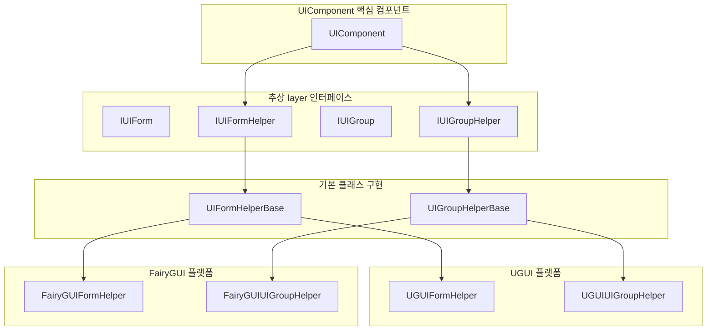
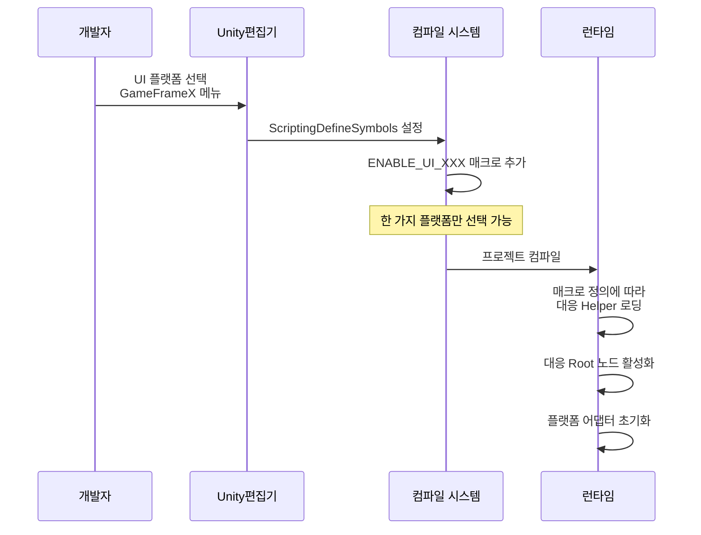

# 플랫폼 지원

GameFrameX UI 시스템은 다양한 UI 렌더링 플랫폼을 지원하며, 통합된 인터페이스 추상을 통해 개발자가 서로 다른 UI 시스템 간에 유연하게 전환할 수 있으며, 비지니스 코드의 일관성을 유지할 수 있습니다.

## 개요

GameFrameX UI 프레임워크는 플랫폼 독립적인 설계 철학을 채택하며, 추상层（Helper 인터페이스）를 통해 서로 다른 UI 시스템의 구현 차이를 격리합니다. 현재 두 가지 주요 UI 플랫폼을 지원합니다:

| UI 플랫폼 | 매크로 정의 기호 | 설명 |
|---------|------------|------|
| **UGUI** | `ENABLE_UI_UGUI` | Unity 공식 내장 UI 시스템 |
| **FairyGUI** | `ENABLE_UI_FAIRYGUI` | 전문 서드파티 UI 솔루션 |

이러한 설계使得 비지니스 로직 코드는 수정할 필요가 없으며, 매크로 정의 전환만으로 서로 다른 UI 시스템 간에 마이그레이션할 수 있어 플랫폼 전환 비용을 효과적으로 줄입니다.

## 아키텍처 설계



### 핵심 컴포넌트 설명

| 컴포넌트 | 책임 |
|------|------|
| **UIComponent** | UI 핵심 관리자로, 각 Helper의 협조 작업을 조정합니다 |
| **IUIFormHelper** | UI 창체 보조기 인터페이스로, 창체의 생성, 인스턴스화 및 해제를 정의합니다 |
| **IUIGroupHelper** | UI 그룹 보조기 인터페이스로, 그룹의 관리 및 깊이 제어를 정의합니다 |
| **UIFormHelperBase** | 창체 보조기의 추상 기본 클래스로, 플랫폼 독립적인 통합된 구현을 제공합니다 |
| **UIGroupHelperBase** | 그룹 보조기의 추상 기본 클래스로, 플랫폼 독립적인 통합된 구현을 제공합니다 |

## 플랫폼 전환 구성

### 스크립트 매크로 정의 통해 전환

Unity 편집기에서 메뉴를 통해 UI 플랫폼을 구성합니다:

```
GameFrameX → Scripting Define Symbols → Enable UGUI(开启UGUI适配)
GameFrameX → Scripting Define Symbols → Enable FairyGUI(开启FairyGUI适配)
```

> Source: [UISystemScriptingDefineSymbols.cs](https://github.com/GameFrameX/com.gameframex.unity.ui/blob/main/Editor/UISystemScriptingDefineSymbols.cs#L42-L63)

매크로 정의 기호 설명:

| 매크로 정의 | 역할 |
|--------|------|
| `ENABLE_UI_UGUI` | UGUI 플랫폼 지원 활성화 |
| `ENABLE_UI_FAIRYGUI` | FairyGUI 플랫폼 지원 활성화 |

전환 원리:
```csharp
public static void EnableUGUISystem()
{
    ScriptingDefineSymbols.RemoveScriptingDefineSymbol(FairyGUIScriptingDefineSymbol);
    ScriptingDefineSymbols.AddScriptingDefineSymbol(UGUIScriptingDefineSymbol);
}

public static void EnableFairyGUISystem()
{
    ScriptingDefineSymbols.RemoveScriptingDefineSymbol(UGUIScriptingDefineSymbol);
    ScriptingDefineSymbols.AddScriptingDefineSymbol(FairyGUIScriptingDefineSymbol);
}
```
> Source: [UISystemScriptingDefineSymbols.cs](https://github.com/GameFrameX/com.gameframex.unity.ui/blob/main/Editor/UISystemScriptingDefineSymbols.cs#L49-L63)

### 런타임 플랫폼 어댑터

UIComponent는 런타임 시 조건부 컴파일을 통해 해당 플랫폼을 자동으로 어댑터합니다:

```csharp
protected override void Awake()
{
    // ...
    var namespaceName = ImplementationComponentType.Namespace;

#if ENABLE_UI_FAIRYGUI
    if (!namespaceName.StartsWithFast("GameFrameX.UI.FairyGUI.Runtime"))
    {
        Debug.LogError("UI 컴포넌트의 ComponentType 설정 오류. UI 시스템과 일치하는 컴포넌트를 설정하세요.");
        return;
    }

    if (m_InstanceFairyGUIRoot == null)
    {
        Debug.LogError("UI 컴포넌트의 FAIRY GUI Root 설정 오류. 설정하세요.");
        return;
    }

    m_InstanceFairyGUIRoot.gameObject.SetActive(true);
    if (m_InstanceUGUIRoot != null)
    {
        m_InstanceUGUIRoot.gameObject.SetActive(false);
    }

#elif ENABLE_UI_UGUI
    if (!namespaceName.StartsWithFast("GameFrameX.UI.UGUI.Runtime"))
    {
        Debug.LogError("UI 컴포넌트의 ComponentType 설정 오류. UI 시스템과 일치하는 컴포넌트를 설정하세요.");
        return;
    }

    if (m_InstanceUGUIRoot == null)
    {
        Debug.LogError("UI 컴포넌트의 UGUI Root 설정 오류. 설정하세요.");
        return;
    }

    m_InstanceUGUIRoot.gameObject.SetActive(true);
#endif
}
```
> Source: [UIComponent.cs](https://github.com/GameFrameX/com.gameframex.unity.ui/blob/main/Runtime/UIComponent.cs#L370-L416)

## 루트 노드 구성

각 UI 플랫폼은 해당 플랫폼에서 생성된 UI 인터페이스를 장착하는 독립적인 루트 노드（Root Transform）를 구성해야 합니다.

| 속성 | 유형 | 설명 |
|------|------|------|
| `UGUIRoot` | `Transform` | UGUI 인터페이스의 루트 노드 |
| `FairyGUIRoot` | `Transform` | FairyGUI 인터페이스의 루트 노드 |

```csharp
/// UGUI 루트 노드 변환 컴포넌트 가져오기.
public Transform UGUIRoot
{
    get { return m_InstanceUGUIRoot; }
}

/// FairyGUI 루트 노드 변환 컴포넌트 가져오기.
public Transform FairyGUIRoot
{
    get { return m_InstanceFairyGUIRoot; }
}
```
> Source: [UIComponent.cs](https://github.com/GameFrameX/com.gameframex.unity.ui/blob/main/Runtime/UIComponent.cs#L235-L249)

### 구성 예제

Unity 편집기에서 루트 노드를 구성합니다:

1. `UGUIRoot`라는 이름의 빈 GameObject를 생성하고, Layer를 `UI`로 설정합니다
2. `FairyGUIRoot`라는 이름의 빈 GameObject를 생성합니다
3. UIComponent 컴포넌트에서 이 두 GameObject를 각각 해당 속성에 할당합니다

```csharp
[SerializeField] private Transform m_InstanceUGUIRoot = null;
[SerializeField] private Transform m_InstanceFairyGUIRoot = null;
```
> Source: [UIComponent.cs](https://github.com/GameFrameX/com.gameframex.unity.ui/blob/main/Runtime/UIComponent.cs#L151-L161)

## Helper 구성

UI 시스템은 Helper（보조기）를 통해 플랫폼별 기능을 구현합니다:

### UIFormHelper 구성

UI 창체의 인스턴스화, 생성 및 해제를 담당합니다:

| 플랫폼 | 기본 유형 이름 |
|------|--------------|
| FairyGUI | `GameFrameX.UI.FairyGUI.Runtime.FairyGUIFormHelper` |
| UGUI | `GameFrameX.UI.UGUI.Runtime.UGUIFormHelper` |

```csharp
[SerializeField] private string m_UIFormHelperTypeName = "GameFrameX.UI.FairyGUI.Runtime.FairyGUIFormHelper";
[SerializeField] private UIFormHelperBase m_CustomUIFormHelper = null;
```
> Source: [UIComponent.cs](https://github.com/GameFrameX/com.gameframex.unity.ui/blob/main/Runtime/UIComponent.cs#L169-L179)

### UIGroupHelper 구성

UI 그룹의 관리 및 깊이 제어를 담당합니다:

| 플랫폼 | 기본 유형 이름 |
|------|--------------|
| FairyGUI | `GameFrameX.UI.FairyGUI.Runtime.FairyGUIUIGroupHelper` |
| UGUI | `GameFrameX.UI.UGUI.Runtime.UGUIUIGroupHelper` |

```csharp
[SerializeField] private string m_UIGroupHelperTypeName = "GameFrameX.UI.FairyGUI.Runtime.FairyGUIUIGroupHelper";
[SerializeField] private UIGroupHelperBase m_CustomUIGroupHelper = null;
```
> Source: [UIComponent.cs](https://github.com/GameFrameX/com.gameframex.unity.ui/blob/main/Runtime/UIComponent.cs#L187-L197)

## 추상 기본 클래스 설계

### UIFormHelperBase

```csharp
public abstract class UIFormHelperBase : MonoBehaviour, IUIFormHelper
{
    /// 인스턴스화 인터페이스
    public abstract object InstantiateUIForm(object uiFormAsset);

    /// 생성 인터페이스
    public abstract IUIForm CreateUIForm(object uiFormInstance, Type uiFormType, object userData);

    /// 해제 인터페이스
    public abstract void ReleaseUIForm(object uiFormAsset, object uiFormInstance, object assetHandle, string uiFormAssetPath, string uiFormAssetName);
}
```
> Source: [UIFormHelperBase.cs](https://github.com/GameFrameX/com.gameframex.unity.ui/blob/main/Runtime/UIFormHelperBase.cs#L42-L81)

### UIGroupHelperBase

```csharp
public abstract class UIGroupHelperBase : MonoBehaviour, IUIGroupHelper
{
    /// 인터페이스 그룹 깊이 가져오기
    public abstract int Depth { get; protected set; }

    /// 인터페이스 그룹 깊이 설정
    public abstract void SetDepth(int depth);

    /// 인터페이스 그룹 생성
    public abstract IUIGroupHelper Handler(Transform root, string groupName, string uiGroupHelperTypeName, IUIGroupHelper customUIGroupHelper, int depth = 0);
}
```
> Source: [UIGroupHelperBase.cs](https://github.com/GameFrameX/com.gameframex.unity.ui/blob/main/Runtime/UIGroupHelperBase.cs#L41-L77)

## 플랫폼 전환 흐름



## 사용자 정의 Helper 개발

사용자 정의 UI 플랫폼을 구현해야 하는 경우 다음 단계에 따라 확장할 수 있습니다:

### 1. 사용자 정의 Helper 클래스 생성

```csharp
namespace GameFrameX.UI.Custom.Runtime
{
    public class CustomUIFormHelper : UIFormHelperBase
    {
        public override object InstantiateUIForm(object uiFormAsset)
        {
            // 인스턴스화 로직 구현
        }

        public override IUIForm CreateUIForm(object uiFormInstance, Type uiFormType, object userData)
        {
            // 생성 로직 구현
        }

        public override void ReleaseUIForm(object uiFormAsset, object uiFormInstance, object assetHandle, string uiFormAssetPath, string uiFormAssetName)
        {
            // 해제 로직 구현
        }
    }
}
```

### 2. 사용자 정의 Helper 구성

UIComponent 컴포넌트에서 사용자 정의 Helper 설정:

- `Custom UIForm Helper` 속성 설정
- 네임스페이스가 ComponentType과 일치하는지 확인

### 3. 매크로 정의 추가

`Project Settings → Player → Other Settings → Scripting Define Symbols`에서 사용자 정의 플랫폼의 매크로 정의（예: `ENABLE_UI_CUSTOM`）를 추가하고, 코드에서 조건부 컴파일을 사용합니다.

## 일반 문제

### Q1: 플랫폼 전환 후 "ComponentType 설정 오류" 발생

**원인**: ComponentType의 네임스페이스가 현재 활성화된 매크로 정의와 일치하지 않습니다.

**해결 방안**:
- UGUI 사용 시 ComponentType이 `GameFrameX.UI.UGUI.Runtime`에서 상속되는지 확인
- FairyGUI 사용 시 ComponentType이 `GameFrameX.UI.FairyGUI.Runtime`에서 상속되는지 확인

### Q2: UI 인터페이스가 표시되지만 클릭이 반응하지 않음

**원인**: 해당 플랫폼의 Root 노드가 올바르게 설정되지 않았습니다.

**해결 방안**:
- UGUI Root 또는 FairyGUI Root가 올바르게 할당되었는지 확인
- 루트 노드의 Layer 설정이 올바른지 확인（UGUI는 일반적으로 "UI" 레이어 사용）

### Q3: UGUI와 FairyGUI를 동시에 지원하려면 어떻게 해야 합니까?

**현재 설계는 두 플랫폼을 동시에 활성화하는 것을 지원하지 않습니다**. 이중 플랫폼 지원이 필요한 경우 다음 권장 사항을 따르세요:
- 서로 다른 버전의 클라이언트를 패키징합니다
- 또는 런타임에 동적으로 전환하도록 프레임워크를自行 확장합니다

## 관련 링크

- [UI 컴포넌트](./4-core-concepts.ui-component) - UI 컴포넌트 핵심 개념
- [UI 창체](./4-core-concepts.ui-form) - UI 창체 개발 가이드
- [UI 그룹 시스템](./4-core-concepts.ui-group) - UI 그룹 계층 관리
- [API 참고 - UIComponent](./5-api-reference.ui-component) - UIComponent 완전한 API
- [API 참고 - IUIManager](./5-api-reference.iuimanager) - UI 관리자 인터페이스