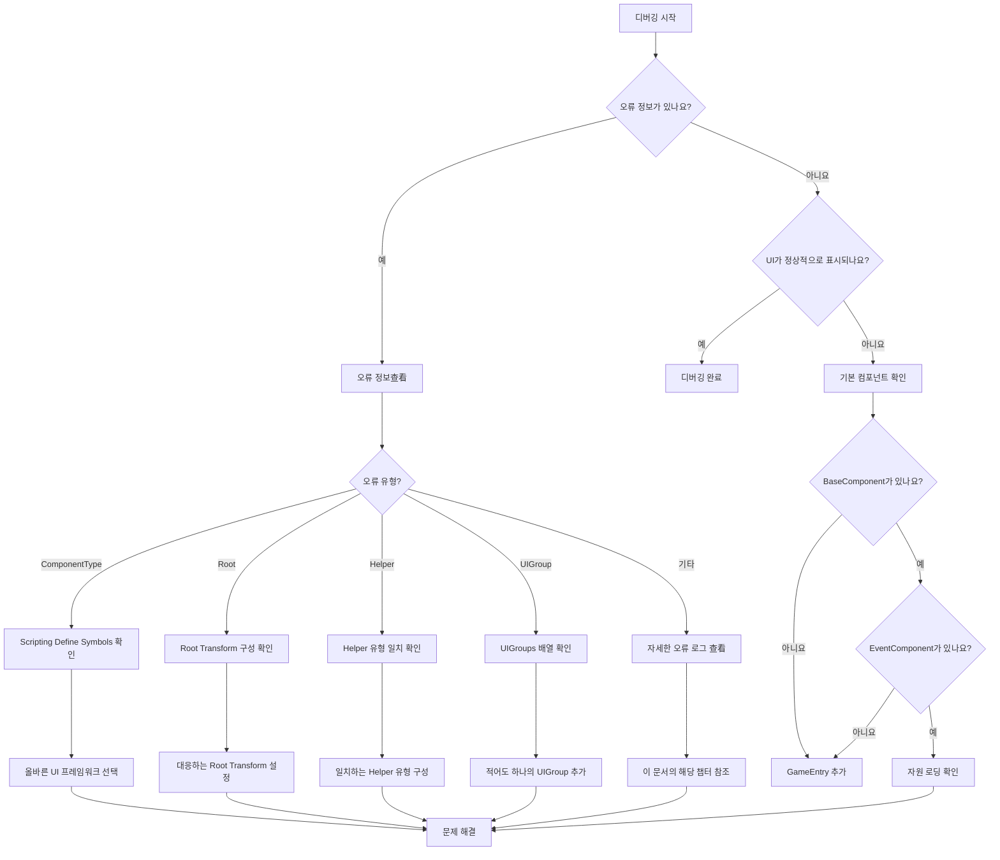

# 일반 문제

이 문서는 GameFrameX UI 프레임워크 사용 시 흔히 발생하는 오류 시나리오, 원인 분석 및 해결 방안을 나열합니다.

## 개요

GameFrameX UI 프레임워크는 UGUI와 FairyGUI 두 가지 UI 솔루션을 지원하는 모듈식 시스템입니다. 다양한 구성 옵션과 플랫폼별 설정이 존재하여, 개발자가 통합 과정에서 다양한 구성 오류에 직면할 수 있습니다. 이 문서는 개발자가 일반적인 문제를 빠르게 위치시키고 해결하는 데 도움이 되는 것을 목표로 합니다.

## 일반 문제 목록

### 1. UI 컴포넌트 유형 불일치

**오류 정보:**
```
UI 컴포넌트의 ComponentType 설정 오류. UI 시스템과 일치하는 컴포넌트를 설정하세요.
```

**원인 분석:**
이 오류는 `UIComponent`의 `ComponentType` 설정이 프로젝트의 Scripting Define Symbols와 일치하지 않을 때 발생합니다. 예를 들어, 프로젝트에서 `ENABLE_UI_FAIRYGUI`가 활성화되어 있지만 `ComponentType`은 UGUI 구현 클래스로 설정된 경우입니다.

**해결 방안:**
1. 프로젝트에서 사용하는 UI 프레임워크（UGUI 또는 FairyGUI）確認
2. 메뉴 `GameFrameX → Scripting Define Symbols` 열기
3. 대응하는 UI 프레임워크 선택:
   - `Enable UGUI(开启UGUI适配)` 선택하여 UGUI 사용
   - `Enable FairyGUI(开启FairyGUI适配)` 선택하여 FairyGUI 사용
4. `UIComponent`의 `ComponentType`이 활성화된 프레임워크와 일치하는지 확인

> Source: [Runtime/UIComponent.cs](https://github.com/GameFrameX/com.gameframex.unity.ui/blob/main/Runtime/UIComponent.cs#L378-L400)

---

### 2. Root 변환 미설정

**오류 정보:**
```
UI 컴포넌트의 FAIRY GUI Root 설정 오류. 설정하세요.
UI 컴포넌트의 UGUI Root 설정 오류. 설정하세요.
```

**원인 분석:**
`UIComponent`는 UI 루트 노드의 Transform을 지정해야 합니다. FairyGUI 사용 시 `FairyGUI Root`를 설정해야 하고, UGUI 사용 시 `UGUI Root`를 설정해야 합니다.

**해결 방안:**
1. 장면에 빈 GameObject를 UI 루트 노드로 생성
2. `UIComponent` 컴포넌트의 Inspector 패널에서:
   - FairyGUI 사용 시: `FairyGUI Root`를 FairyGUI 컨테이너 Transform으로 설정
   - UGUI 사용 시: `UGUI Root`를 Canvas 또는 UI 컨테이너 Transform으로 설정

```csharp
// 예제: 런타임에서 Root 동적 설정（권장하지 않음, 디버깅 전용）
var uiComponent = gameObject.GetComponent<UIComponent>();
// 편집기에서 올바르게 Root를 구성해야 합니다
```

> Source: [Runtime/UIComponent.cs](https://github.com/GameFrameX/com.gameframex.unity.ui/blob/main/Runtime/UIComponent.cs#L385-L389)

---

### 3. UI Form Helper 유형 불일치

**오류 정보:**
```
UI 컴포넌트의 UI Form Helper 설정 오류. ComponentType 유형과 일치하도록 설정하세요.
```

**원인 분석:**
`UI Form Helper`의 유형은 `ComponentType`과 일치해야 합니다. FairyGUI를 사용했지만 UGUI의 Helper를 설정하면 이 오류가 발생합니다.

**해결 방안:**
1. `UIComponent`의 Inspector 패널에서
2. `UI Form Helper Type Name` 필드 찾기
3. 사용하는 UI 프레임워크에 따라 올바른 유형 선택:
   - FairyGUI: `GameFrameX.UI.FairyGUI.Runtime.FairyGUIFormHelper`
   - UGUI: `GameFrameX.UI.UGUI.Runtime.UGUIFormHelper`

> Source: [Runtime/UIComponent.cs](https://github.com/GameFrameX/com.gameframex.unity.ui/blob/main/Runtime/UIComponent.cs#L417-L421)

---

### 4. UI Group Helper 유형 불일치

**오류 정보:**
```
UI 컴포넌트의 UI Group Helper 설정 오류. ComponentType 유형과 일치하도록 설정하세요.
```

**원인 분석:**
`UI Group Helper`도 `ComponentType`과 일치해야 하며, UI Form Helper와 유사합니다.

**해결 방안:**
1. `UIComponent`의 Inspector 패널에서
2. `UI Group Helper Type Name` 필드 찾기
3. 사용하는 UI 프레임워크에 따라 올바른 유형 선택:
   - FairyGUI: `GameFrameX.UI.FairyGUI.Runtime.FairyGUIUIGroupHelper`
   - UGUI: `GameFrameX.UI.UGUI.Runtime.UGUIUIGroupHelper`

> Source: [Runtime/UIComponent.cs](https://github.com/GameFrameX/com.gameframex.unity.ui/blob/main/Runtime/UIComponent.cs#L423-L427)

---

### 5. UI Group 미구성

**오류 정보:**
```
반드시 하나 이상의 UIGroup를 설정해야 합니다.
```

**원인 분석:**
`UIComponent`는 적어도 하나의 UI Group을 구성해야 하며, 그렇지 않으면 UI 창체의 계층 및 표시를 올바르게 관리할 수 없습니다.

**해결 방안:**
1. `UIComponent`의 Inspector 패널에서
2. `UIGroups` 배열 찾기
3. `+`를 클릭하여 적어도 하나의 UI Group 추가
4. 각 Group에 대해:
   - `GroupName`: 그룹 이름（비어 있을 수 없음）
   - `Depth`: 표시 우선순위（다른 그룹은 다른 Depth 설정 권장）

> Source: [Editor/UIComponentInspector.cs](https://github.com/GameFrameX/com.gameframex.unity.ui/blob/main/Editor/UIComponentInspector.cs#L169-L172)

---

### 6. Scripting Define Symbol 미설정

**오류 현상:**
UI 시스템이 전혀 작동하지 않고, 콘솔에 오류 정보가 없거나上述 구성 오류가 표시됩니다.

**원인 분석:**
프로젝트에서 `ENABLE_UI_UGUI`와 `ENABLE_UI_FAIRYGUI` 모두 활성화되지 않아, UI 시스템의 조건부 컴파일 코드가 올바르게 컴파일되지 않습니다.

**해결 방안:**
1. Unity 메뉴 `GameFrameX → Scripting Define Symbols` 열기
2. 하나의 UI 프레임워크 선택:
   - `Enable UGUI(开启UGUI适配)` - UGUI 지원 활성화
   - `Enable FairyGUI(开启FairyGUI适配)` - FairyGUI 지원 활성화
3. 프로젝트 다시 컴파일

> Source: [Editor/UISystemScriptingDefineSymbols.cs](https://github.com/GameFrameX/com.gameframex.unity.ui/blob/main/Editor/UISystemScriptingDefineSymbols.cs#L42-L63)

---

### 7. 기본 컴포넌트 누락

**오류 정보:**
```
Base component is invalid.
Event component is invalid.
```

**원인 분석:**
`UIComponent`는 `BaseComponent`와 `EventComponent`에 종속되며, 이러한 컴포넌트가 장면에 존재하지 않으면 UI 시스템이 정상적으로 작동하지 않습니다.

**해결 방안:**
1. 장면에 `GameEntry` 오브젝트가 존재하는지 확인
2. `GameEntry`에 다음 컴포넌트가 연결되어 있는지 확인:
   - `BaseComponent`（GameFrameX 핵심 컴포넌트）
   - `EventComponent`（이벤트 시스템 컴포넌트）

```csharp
// 컴포넌트 존재 여부 확인하는 예제 코드
var baseComponent = GameEntry.GetComponent<BaseComponent>();
if (baseComponent == null)
{
    Debug.LogError("BaseComponent를 찾을 수 없습니다. GameEntry가 존재하는지 확인하세요.");
}

var eventComponent = GameEntry.GetComponent<EventComponent>();
if (eventComponent == null)
{
    Debug.LogError("EventComponent를 찾을 수 없습니다. GameEntry가 존재하는지 확인하세요.");
}
```

> Source: [Runtime/UIComponent.cs](https://github.com/GameFrameX/com.gameframex.unity.ui/blob/main/Runtime/UIComponent.cs#L462-L474)

---

### 8. UI Form 열기 실패

**오류 정보:**
```
Open UI form failure, asset name '{0}', pause covered UI form '{1}', error message '{2}'.
Can not find UI form '{0}'.
```

**원인 분석:**
1. UI Form 자원 경로가 올바르지 않음
2. UI Form 자원이 해당 경로에 없음
3. UI Form Helper 구성 오류

**해결 방안:**
1. UI Form의 자원 경로가 올바른지 확인
2. `OptionUIConfigAttribute` 구성 확인:
   - FairyGUI: 올바른 `PackageName` 설정
   - UGUI: 올바른 자원 `Path` 설정
3. 자원이 자원 관리 시스템에 추가되었는지 확인

```csharp
// 올바른 UI Form 구성 예제
[OptionUIConfigAttribute(packageName = "MyFairyGUIPackage")]
public class MyUIForm : UIForm
{
    // ...
}

// 또는 UGUI 버전
[OptionUIConfigAttribute(path = "UI/Prefabs/MyForm")]
public class MyUIForm : UIForm
{
    // ...
}
```

> Source: [Runtime/BaseUIManager.Open.cs](https://github.com/GameFrameX/com.gameframex.unity.ui/blob/main/Runtime/BaseUIManager.Open.cs)

---

### 9. OptionUIConfigAttribute 구성 오류

**오류 정보:**
```
PackageName or Path is null
```

**원인 분석:**
`OptionUIConfigAttribute`는 `packageName`（FairyGUI）또는 `path`（UGUI）중 하나 이상을 제공해야 하며, 둘 다 비어 있을 수 없습니다.

**해결 방안:**
UI Form 클래스의 특성 구성이 올바른지 확인:

```csharp
// 오류 예제 - 예외 발생
[OptionUIConfigAttribute()]  // 오류: 둘 다 비어 있음
public class BadUIForm : UIForm { }

// 올바른 예제 - FairyGUI
[OptionUIConfigAttribute(packageName = "MainPackage")]
public class FairyGUIForm : UIForm { }

// 올바른 예제 - UGUI
[OptionUIConfigAttribute(path = "UI/Forms/MainForm")]
public class UGUIForm : UIForm { }
```

> Source: [Runtime/Attribute/OptionUIConfigAttribute.cs](https://github.com/GameFrameX/com.gameframex.unity.ui/blob/main/Runtime/Attribute/OptionUIConfigAttribute.cs#L86-L93)

---

### 10. UI Group 존재하지 않음

**오류 정보:**
```
UI group '{0}' is not exist.
```

**원인 분석:**
존재하지 않는 UI Group을 열거나 조작하려고 시도했습니다.

**해결 방안:**
1. `UIComponent`에서 필요한 UI Group을 미리 구성
2. UI Form 열 때 기존 Group 이름 사용

```csharp
// 기존 UI Group 올바르게 사용
UIManager.Instance.OpenUIForm<MyForm>("MainGroup", userData: null);
```

> Source: [Runtime/BaseUIManager.UIGroup.cs](https://github.com/GameFrameX/com.gameframex.unity.ui/blob/main/Runtime/BaseUIManager.UIGroup.cs#L159-L162)

---

## 디버깅 기술

### 상세 로그 활성화

더 자세한 런타임 정보를 얻으려면 구성을 통해 활성화할 수 있습니다:

```csharp
// 시작 시 더 자세한 로그 수준 설정
Log.SetLogHelper(new UnityLogHelper());
Log.AddDebuger();
```

### UI 컴포넌트 상태 확인

```csharp
// UIComponent 가져와서 상태 확인
var uiComponent = GameEntry.GetComponent<UIComponent>();
if (uiComponent == null)
{
    Debug.LogError("UIComponent를 찾을 수 없습니다.");
    return;
}

// UI Group 수 확인
Debug.Log($"UI Group 수: {uiComponent.UIGroupCount}");
```

### 이벤트 구독 문제 조사

UI 이벤트가 트리거되지 않으면 구독이 올바른지 확인:

```csharp
// 올바른 타이밍에 이벤트 구독
void OnOpenUIFormSuccess(object sender, OpenUIFormSuccessEventArgs e)
{
    Debug.Log($"UI Form 열기 성공: {e.UIFormAssetName}");
}

// 이벤트 구독
UIManager.Instance.OpenUIFormSuccess += OnOpenUIFormSuccess;
```

---

## 일반 오류 흐름도



---

## 관련 링크

- [UI 컴포넌트](./4-core-concepts.ui-component) - UIComponent 핵심 개념
- [UI 창체](./4-core-concepts.ui-form) - UIForm 창체 개념
- [UI 그룹 시스템](./4-core-concepts.ui-group) - UI Group 계층 관리
- [편집기 구성](./8-configuration.editor) - 편집기 구성 옵션
- [UI 속성](./8-configuration.attributes) - UI 속성 구성
- [플랫폼 지원](./9-platforms) - 플랫폼 관련 구성