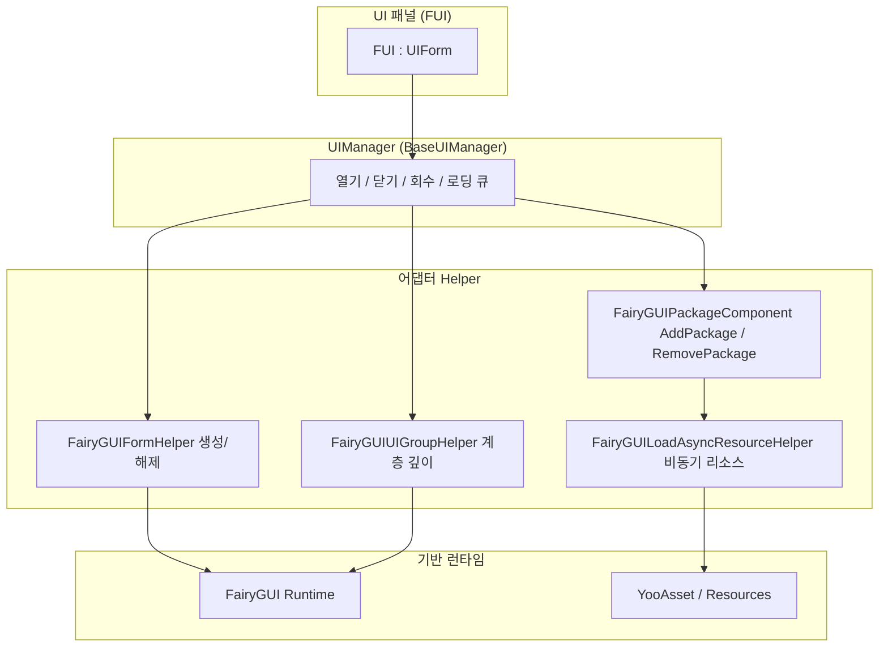

# 개요: GameFrameX UI FairyGUI란 무엇인가

GameFrameX UI FairyGUI는 Unity UI 어댑터 계층으로, [FairyGUI](https://www.fairygui.com/) 프레임워크를 GameFrameX 모듈형 게임 프레임워크에 캡슐화하여 통일된 UI 라이프사이클 관리(열기, 닫기, 회수, 애니메이션)와 YooAsset 기반 비동기 리소스 로딩을 제공합니다. 패널 클래스가 `FUI` 기본 클래스를 상속하기만 하면 동일한 API로 FairyGUI UI를 관리할 수 있으며, 오브젝트 풀 재사용, 싱글톤 중복 제거, 로딩 큐잉 등 바로 사용할 수 있는 기능을 얻을 수 있습니다.

## 빠른 시작

### 1단계: 패키지 설치

Unity 프로젝트의 `Packages/manifest.json`을 편집하여 `scopedRegistries`와 의존성을 추가합니다(현재 버전은 3.4.3):

```json
{
  "scopedRegistries": [
    {
      "name": "GameFrameX",
      "url": "https://gameframex.upm.alianblank.uk",
      "scopes": [
        "com.gameframex"
      ]
    }
  ],
  "dependencies": {
    "com.gameframex.unity.ui.fairygui": "3.4.3"
  }
}
```

`scopes`는 어떤 패키지가 이 registry에서 해석되는지 결정합니다: `com.gameframex`로 시작하는 패키지만 이곳에서 가져옵니다.

아래 방법 중 하나로 설치할 수도 있습니다:

- `manifest.json`의 `dependencies`에 Git 주소를 직접 작성: `"com.gameframex.unity.ui.fairygui": "https://github.com/gameframex/com.gameframex.unity.ui.fairygui.git"`
- Unity **Package Manager**에서 **Add package from git URL**을 선택하고 `https://github.com/gameframex/com.gameframex.unity.ui.fairygui.git` 입력
- 저장소를 Unity 프로젝트의 `Packages` 디렉토리에 클론하면 자동으로 로드됨

Source: [README.md](https://github.com/GameFrameX/com.gameframex.unity.ui.fairygui/blob/main/README.md#L67-L100)

### 2단계: UI 패널 작성

모든 FairyGUI 패널은 `FUI` 기본 클래스를 상속합니다. C# 특성(Attribute)만으로 표시/숨김 애니메이션을 구성할 수 있어 추가 코드를 작성할 필요가 없습니다:

```csharp
[OptionUIShowAnimation(typeof(FadeInAnimation))]
[OptionUIHideAnimation(typeof(FadeOutAnimation))]
public class AnimatedPanel : FUI { }
```

Source: [README.md](https://github.com/GameFrameX/com.gameframex.unity.ui.fairygui/blob/main/README.md#L101-L111)

`FUI`는 `UIForm`을 상속하며, FairyGUI의 `GObject`를 속성으로 노출합니다. 프레임워크는 UI를 표시할 때 `GObject`, 애니메이션 스위치 및 애니메이션 이름을 표시 핸들러에 전달합니다:

```csharp
[UnityEngine.Scripting.Preserve]
public class FUI : UIForm
{
    [UnityEngine.Scripting.Preserve]
    public GObject GObject { get; private set; }

    [UnityEngine.Scripting.Preserve]
    public override void Show(IUIFormShowHandler handler, Action complete)
    {
        if (handler != null)
        {
            handler.Handler(GObject, EnableShowAnimation, ShowAnimationName, complete);
        }
        // ...
    }
}
```

Source: [Runtime/FUI.cs](https://github.com/GameFrameX/com.gameframex.unity.ui.fairygui/blob/main/Runtime/FUI.cs#L42-L80)

(주: 위 속성에 표시된 `UnityEngine.Scripture.Preserve`는 발췌본 그대로이며, 소스 코드의 실제 표기는 `UnityEngine.Scripting.Preserve`로, IL2CPP 스트리핑을 방지하는 데 사용됩니다.)

### 3단계: UIManager 초기화 및 사용

`UIManager`는 핵심 관리자로, 내부적으로 `GameEntry`에서 `FairyGUIPackageComponent`를 가져와 FairyGUI 패키지의 로드 및 언로드를 관리합니다:

```csharp
[UnityEngine.Scripting.Preserve]
internal sealed partial class UIManager : BaseUIManager
{
    [UnityEngine.Scripting.Preserve]
    private FairyGUIPackageComponent FairyGuiPackage { get; set; }

    [UnityEngine.Scripting.Preserve]
    public override void SetResourceManager(IAssetManager assetManager)
    {
        base.SetResourceManager(assetManager);
        FairyGuiPackage = GameEntry.GetComponent<FairyGUIPackageComponent>();
        GameFrameworkGuard.NotNull(FairyGuiPackage, nameof(FairyGuiPackage));
    }
}
```

Source: [Runtime/UIManager.cs](https://github.com/GameFrameX/com.gameframex.unity.ui.fairygui/blob/main/Runtime/UIManager.cs#L42-L92)

초기화 시 씬에 `FairyGUIPackageComponent`가 없으면 `GameFrameworkGuard.NotNull`이 즉시 예외를 던집니다 — `SetResourceManager`를 호출하기 전에 이 컴포넌트를 먼저 추가해 두세요.

### 4단계(선택 사항): 경로로 GObject 찾기

```csharp
// 특정 GObject의 계층 경로 가져오기
string path = gObject.GetUIPath();

// 경로로 GObject를 역조회
GObject obj = FairyGUIPathFinderHelper.GetUIFromPath("GRoot/Group/MyButton");
```

Source: [README.md](https://github.com/GameFrameX/com.gameframex.unity.ui.fairygui/blob/main/README.md#L113-L120)

## 작동 원리 요약

전체 패키지는 계층 구조로 협력합니다: `UIManager`가 열기/닫기/회수 및 로딩 큐잉을 통합하여 스케줄링하고, 구체적인 작업은 각 Helper에 분배되며, 하위 계층은 FairyGUI 런타임과 YooAsset 리소스 시스템에 의존합니다:



각 컴포넌트의 역할 요약:

| 컴포넌트 | 유형 | 설명 |
|------|------|------|
| `UIManager` | `internal sealed partial class`, `BaseUIManager` 상속 | 중앙 UI 관리자로, UI의 열기, 닫기 및 회수 라이프사이클을 담당하며 `UIManager.cs` / `UIManager.Open.cs` / `UIManager.Close.cs` 여러 partial 파일로 분할되어 있음 |
| `FUI` | `public class`, `UIForm` 상속 | 모든 FairyGUI 패널의 기본 클래스로, `GObject`와 가시성 콜백을 노출하며 패널은 이 클래스를 상속함 |
| `FairyGUIPackageComponent` | MonoBehaviour | FairyGUI 패키지의 로드 및 언로드 관리 |
| `FairyGUIFormHelper` | Helper | UI 인스턴스화, 생성 및 해제 담당 |
| `FairyGUIUIGroupHelper` | Helper | UI 그룹의 깊이 및 계층 관리 |
| `FairyGUILoadAsyncResourceHelper` | Helper | FairyGUI의 리소스 요청을 YooAsset 비동기 로딩에 연결 |
| `FairyGUIPathFinderHelper` | Helper | 경로 기반 GObject 조회 도구 |
| `BindablePropertyExtension` | 확장 | MVVM 바인딩 지원, `BindableProperty` 이벤트 자동 정리 |

Source: [Runtime/UIManager.cs](https://github.com/GameFrameX/com.gameframex.unity.ui.fairygui/blob/main/Runtime/UIManager.cs#L34-L92) · [Runtime/FUI.cs](https://github.com/GameFrameX/com.gameframex.unity.ui.fairygui/blob/main/Runtime/FUI.cs#L34-L53) · [README.md](https://github.com/GameFrameX/com.gameframex.unity.ui.fairygui/blob/main/README.md#L40-L65)

핵심 기능 요약:

- **완전한 UI 라이프사이클** — 통일된 API로 열기, 닫기, 회수 및 애니메이션
- **비동기 리소스 로딩** — YooAsset 기반 FairyGUI 패키지 및 리소스 비동기 로딩
- **오브젝트 풀 재사용** — UI 인스턴스를 풀에 넣어 재사용하여 GC 할당 감소
- **싱글톤 중복 제거** — 동일한 UI의 중복 생성 자동 방지
- **로딩 큐잉** — 동일한 UI에 대한 동시 열기 요청 병합
- **특성 기반 구성** — C# 특성으로 UI 그룹, 표시/숨김 애니메이션 제어
- **MVVM 바인딩 지원** — `BindablePropertyExtension`이 바인딩 이벤트 자동 정리
- **이중 리소스 채널** — `Resources.Load`와 YooAsset AssetBundle 동시 지원
- **IL2CPP 안전성** — `Preserve` 특성으로 코드 스트리핑 방지

## 다음 단계

- 전체 설치 방법 및 추가 사용 예제: [README.md](https://github.com/GameFrameX/com.gameframex.unity.ui.fairygui/blob/main/README.md)
- 공식 문서(각 모듈의 상세 설명 포함): https://gameframex.doc.alianblank.com
- 버전 이력: 저장소 루트 디렉토리의 `CHANGELOG.md`
- 커뮤니티 그룹: QQ 467608841 / 233840761