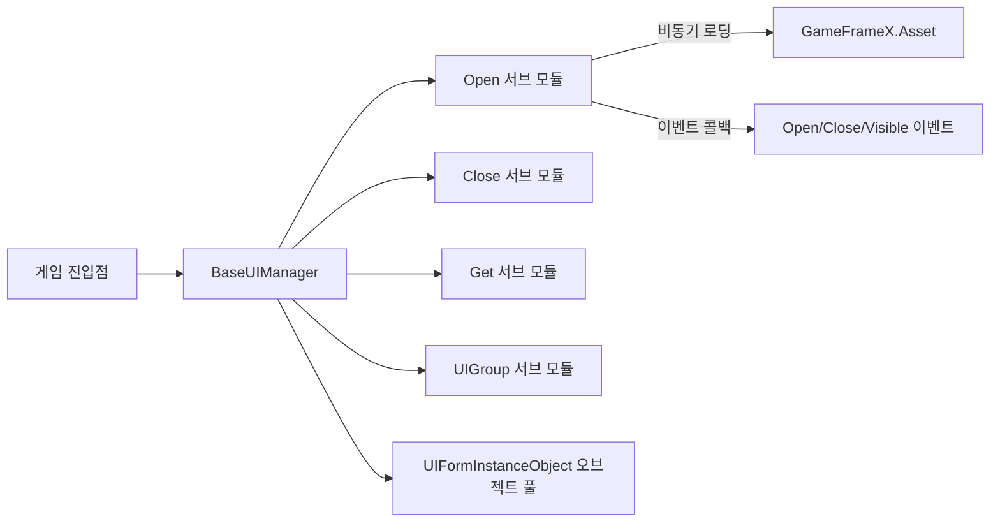

# 프레임워크 소개

GameFrameX.UI는 GameFrameX 게임 개발 프레임워크의 UI 서브 모듈로, 통합된 UI 관리 인터페이스를 제공하며 UGUI와 FairyGUI 두 가지 UI 방식을 지원합니다. UI 그룹화, 오브젝트 풀, 라이프사이클 이벤트 등 자주 사용되는 기능을 내장하고 있어 Unity 상업용 프로젝트의 기본 UI 레이어로 적합합니다.

## 빠른 시작

다음 세 단계를 완료하면 Unity 프로젝트에서 UI 모듈을 활성화할 수 있습니다.

1. Package Manager를 통해 패키지 추가: Unity에서 **Window → Package Manager → + → Add package from git URL**을 선택하고 다음을 입력합니다:
   ```
   https://github.com/gameframex/com.gameframex.unity.ui.git
   ```
   또는 프로젝트의 `Packages/manifest.json` 파일에 있는 `dependencies`에 동일한 URL을 추가합니다.
2. `BaseUIManager`를 상속하는 매니저 클래스를 생성하고(또는 프레임워크에 내장된 `UIManager`를 직접 사용), 게임 시작 진입점에서 모듈 등록을 완료하면 프레임워크가 자동으로 UI 서브 시스템을 초기화합니다.
3. 각 UI Prefab용 `IUIForm` 구현 스크립트를 작성하고, `[OptionUIGroup]` 등의 어트리뷰트로 그룹, 표시/숨김 애니메이션, 다중 인스턴스 정책을 지정한 후 `OpenUIForm`을 호출하면 UI를 열 수 있습니다.

## 동작 원리 요약

핵심 진입점은 `BaseUIManager`이며, 로딩, 회수, 그룹화, 이벤트라는 네 가지 서브 기능을 통합하고 있고, 이는 네 개의 분할 파일에 대응합니다:
[BaseUIManager.cs](https://github.com/GameFrameX/com.gameframex.unity.ui/blob/main/Runtime/BaseUIManager.cs#L39-L80)는 매니저의 기본 구조를 정의하고;
[BaseUIManager.Open.cs](https://github.com/GameFrameX/com.gameframex.unity.ui/blob/main/Runtime/BaseUIManager.Open.cs#L36-L60)는 UI를 여는 이벤트와 메서드를 제공하며;
`BaseUIManager.Close.cs`는 닫기를 처리하고;
`BaseUIManager.Get.cs`는 일련번호로 UI를 가져오며;
`BaseUIManager.UIGroup.cs`는 UI 그룹의 루트 노드를 관리합니다.



UI 인스턴스는 [BaseUIManager.UIFormInstanceObject.cs](https://github.com/GameFrameX/com.gameframex.unity.ui/blob/main/Runtime/BaseUIManager.UIFormInstanceObject.cs)를 통해 오브젝트 풀을 유지 관리하며, 유휴 인스턴스는 `m_RecycleInterval`(기본값 60초)에 따라 자동으로 회수됩니다. 로딩 중인 인스턴스는 `m_UIFormsBeingLoaded` 딕셔너리를 통해 추적됩니다.

## 주요 기능

| 기능 | 설명 | 핵심 파일 |
|------|------|----------|
| 통합 UI 인터페이스 | 하나의 `IUIManager`로 UGUI와 FairyGUI 동시 지원 | [BaseUIManager.cs](https://github.com/GameFrameX/com.gameframex.unity.ui/blob/main/Runtime/BaseUIManager.cs#L39-L80) |
| 그룹 관리 | 어트리뷰트로 UI가 속한 그룹을 선언하면 해당 루트 노드 자동 생성 | [Runtime/Attribute/OptionUIGroupAttribute.cs](https://github.com/GameFrameX/com.gameframex.unity.ui/blob/main/Runtime/Attribute/OptionUIGroupAttribute.cs) |
| 오브젝트 풀 | 유휴 인스턴스를 자동으로 재사용하여 잦은 UI 열기/닫기의 오버헤드 절감 | [BaseUIManager.UIFormInstanceObject.cs](https://github.com/GameFrameX/com.gameframex.unity.ui/blob/main/Runtime/BaseUIManager.UIFormInstanceObject.cs) |
| 표시/숨김 애니메이션 | 어트리뷰트로 열기/닫기 애니메이션 구성 | [OptionUIShowAnimationAttribute.cs](https://github.com/GameFrameX/com.gameframex.unity.ui/blob/main/Runtime/Attribute/OptionUIShowAnimationAttribute.cs),[OptionUIHideAnimationAttribute.cs](https://github.com/GameFrameX/com.gameframex.unity.ui/blob/main/Runtime/Attribute/OptionUIHideAnimationAttribute.cs) |
| 다중 인스턴스 제어 | 어트리뷰트로 동일한 UI의 다중 인스턴스 허용 여부 선언 | [OptionUIAllowMultiInstanceAttribute.cs](https://github.com/GameFrameX/com.gameframex.unity.ui/blob/main/Runtime/Attribute/OptionUIAllowMultiInstanceAttribute.cs) |
| 포괄적인 이벤트 | 열기 성공/실패, 닫기, 가시성 변경 등 이벤트 제공 | [EventArgs/OpenUIFormSuccessEventArgs.cs](https://github.com/GameFrameX/com.gameframex.unity.ui/blob/main/Runtime/EventArgs/OpenUIFormSuccessEventArgs.cs) 등 |

## 에디터 확장

모듈에는 Unity 에디터 검사 기능이 포함되어 있어 스크립트 매크로 정의를 자동으로 주입하고, 런타임에 컴포넌트가 누락되어 발생하는 오류를 방지합니다. 자세한 내용은 [Editor/UISystemScriptingDefineSymbols.cs](https://github.com/GameFrameX/com.gameframex.unity.ui/blob/main/Editor/UISystemScriptingDefineSymbols.cs) 및 [Editor/UISystemScriptingDefineCheckHandler.cs](https://github.com/GameFrameX/com.gameframex.unity.ui/blob/main/Editor/UISystemScriptingDefineCheckHandler.cs)를 참조하세요.
UI Prefab의 커스텀 인스펙터는 [Editor/UIFormInspector.cs](https://github.com/GameFrameX/com.gameframex.unity.ui/blob/main/Editor/UIFormInspector.cs)에 있으며, UIComponent 인스펙터는 [Editor/UIComponentInspector.cs](https://github.com/GameFrameX/com.gameframex.unity.ui/blob/main/Editor/UIComponentInspector.cs)를 참조하세요.

## 버전

현재 최신 버전과 변경 이력은 [CHANGELOG.md](https://github.com/GameFrameX/com.gameframex.unity.ui/blob/main/CHANGELOG.md)에서 확인할 수 있습니다.

## 관련 링크

- UI 그룹 설정에 대한 자세한 내용은 《UI 그룹》을 참조하세요
- UI 열기와 라이프사이클에 대한 내용은 《UI 열기/닫기》를 참조하세요
- 이벤트 구독 예제는 《UI 이벤트》를 참조하세요
- 공식 문서 사이트: https://gameframex.doc.alianblank.com/