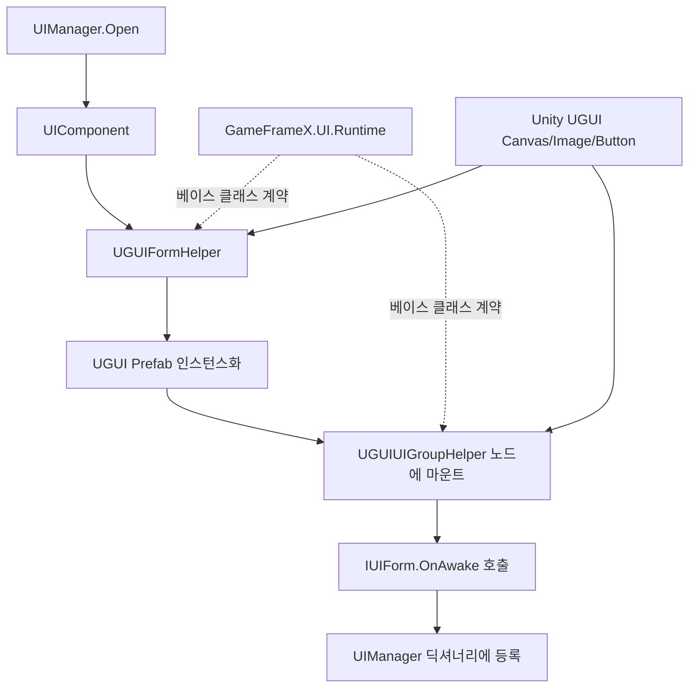

# 동작 원리: UGUI와 GameFrameX UI 시스템의 어댑터 관계

이 패키지는 GameFrameX UI Runtime이 Unity UGUI 백엔드에서 동작하는 공식 어댑터 레이어입니다. `UIFormHelperBase`, `UIGroupHelperBase` 등의 추상 베이스 클래스를 구현하여, UGUI의 `GameObject` / `Canvas` / `RectTransform`를 프레임워크의 `UIComponent` / `UIManager` 생명주기에 연결합니다. 이를 통해 게임 비즈니스 코드를 수정하지 않고도 서로 다른 UI 백엔드를 교체하거나 공존시킬 수 있습니다.

## 어댑터 레이어 개요

| 어댑터 클래스 | 상속하는 베이스 클래스 | 역할 |
|--------|------------|------|
| `UGUIFormHelper` | `UIFormHelperBase` | UI 폼의 인스턴스화, 생성, 해제 처리; UI 그룹 마운트 및 애니메이션 스위치 처리 |
| `UGUIUIGroupHelper` | `UIGroupHelperBase` | UI 그룹의 깊이(`z = depth * 1000`) 및 노드 계층 관리 |
| `UGUICodeGenerator` (Editor) | — | Prefab 필드와 바인딩된 UI 코드를 원클릭으로 생성 |
| `UGUIComponentInspector` (Editor) | — | Inspector에서 컴포넌트 참조를 시각적으로 바인딩 |
| `UGUIButtonExtension` / `UGUIImageExtension` / `RectTransformExtension` | — | UGUI 네이티브 컴포넌트의 확장 메서드 |
| `UIImage` | `Image` | UGUI `Image`에 비동기 로드 및 교체 기능 추가 |
| `UIManager` / `UGUI` | — | 프레임워크 측 런타임 진입점 및 추상 UI 베이스 클래스 |

## 동작 원리 빠른 개요



전체 체인에서 프레임워크 측은 `IUIForm`, `IUIGroup`이라는 두 가지 추상만 보며, UGUI 어댑터 레이어가 Unity 네이티브 타입을 이 추상들로 변환하는 역할을 합니다. 반대로 비즈니스 스크립트는 `UGUI` 추상 베이스 클래스만 상속하면, 백엔드와 무관한 OnAwake / OnShow / OnHide 등의 콜백을 받을 수 있습니다.

## 핵심 어댑터 포인트

### 1. UI 폼 인스턴스화

`UGUIFormHelper.InstantiateUIForm`은 리소스 객체를 그대로 반환하며, 실제 GameObject는 상위 리소스 파이프라인에서 비동기로 로드하여 전달합니다. `CreateUIForm`은 `uiFormInstance as GameObject`을 UGUI 노드로 강제 형변환하고, `GetOrAddComponent`를 통해 비즈니스 스크립트를 부착합니다.

```csharp
// Source: Runtime/UGUIFormHelper.cs#L74-L78
[UnityEngine.Scripting.Preserve]
public override object InstantiateUIForm(object uiFormAsset)
{
    return (UnityEngine.Object)uiFormAsset;
}
```

### 2. UI 폼 마운트 및 그룹 소속

`CreateUIForm`은 타입에 있는 `OptionUIGroupAttribute`, `OptionUIShowAnimationAttribute`, `OptionUIHideAnimationAttribute`를 읽으며, 표시되지 않은 경우 `UIComponent` 전역 스위치를 사용합니다. 최종적으로 노드의 `Transform.SetParent(helper.transform)`을 해당 UI 그룹에 설정하고 `localScale`을 정규화합니다.

```csharp
// Source: Runtime/UGUIFormHelper.cs#L91-L163
[UnityEngine.Scripting.Preserve]
public override IUIForm CreateUIForm(object uiFormInstance, Type uiFormType, object userData)
{
    var uiGameObject = uiFormInstance as GameObject;
    if (uiGameObject == null)
    {
        Log.Error($"UI form instance type {uiFormType} is invalid.");
        return null;
    }

    var componentType = uiGameObject.GetOrAddComponent(uiFormType);
    if (!(componentType is IUIForm uiForm))
    {
        Log.Error($"UI form instance type {uiFormType} is invalid.");
        return null;
    }

    if (uiForm.IsAwake == false)
    {
        uiForm.OnAwake();
    }
    // ... 그룹 마운트 및 애니메이션 설정 생략 ...
    uiTransform.SetParent(helper.transform);
    uiTransform.localScale = Vector3.one;
    return uiForm;
}
```

### 3. UI 그룹 깊이 제어

UGUI는 `Canvas`의 렌더링 순서 또는 노드 Z 값을 통해 전후 레이어를 제어하며, 어댑터 레이어는 가장 직접적인 방식을 선택했습니다: `localPosition.z = depth * 1000`로 설정하며, 각 그룹은 1000 단위씩 떨어져 있어 서로 다른 그룹 간에 가려짐이 발생하지 않습니다.

```csharp
// Source: Runtime/UGUIUIGroupHelper.cs#L65-L70
[UnityEngine.Scripting.Preserve]
public override void SetDepth(int depth)
{
    Depth = depth;
    transform.localPosition = new Vector3(0, 0, depth * 1000);
}
```

### 4. 추상 UI 베이스 클래스

비즈니스 스크립트가 `UGUI`를 상속한 후, `UGUIComponent` / `UGUIElementPropertyAttribute`를 통해 Prefab의 UGUI 컨트롤과 바인딩됩니다. 프레임워크는 `OnAwake` 단계에서 필드 주입을 완료하며, 런타임에 `OnShow`, `OnHide`, `OnClose` 등의 생명주기를 호출합니다.

## 다음 단계

- 첫 번째 UI를 마운트하고 여는 방법을 알고 싶다면 《빠른 시작》을 참조하세요
- Prefab과 동기화된 UI 코드를 에디터에서 원클릭으로 생성하고 싶다면 《방법: UGUI 코드 생성기 사용》을 참조하세요
- 사용자 정의 UI 백엔드(예: FairyGUI / UI Toolkit)를 원한다면, `UIFormHelperBase` / `UIGroupHelperBase`를 재사용하면 됩니다