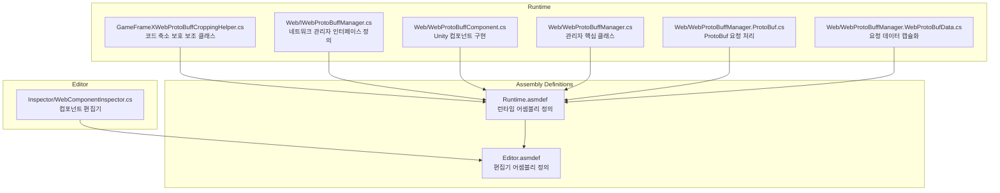
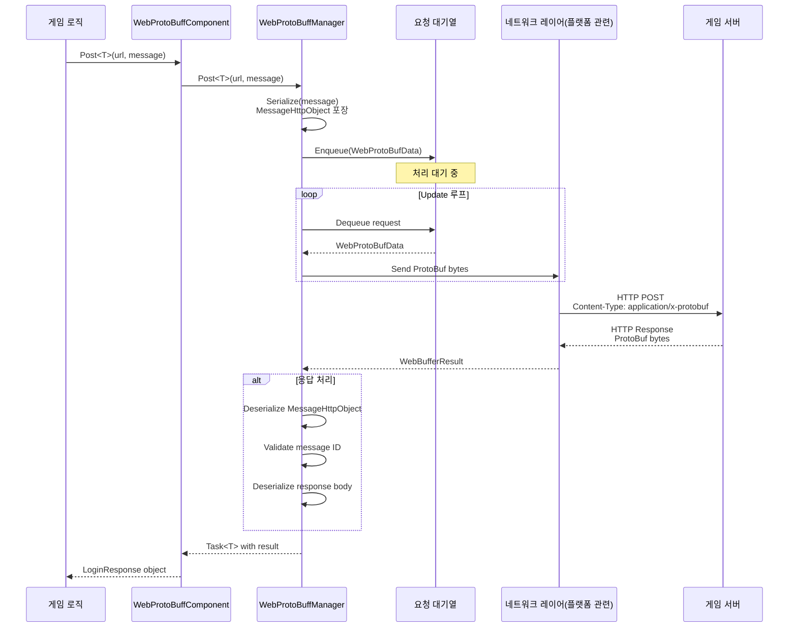
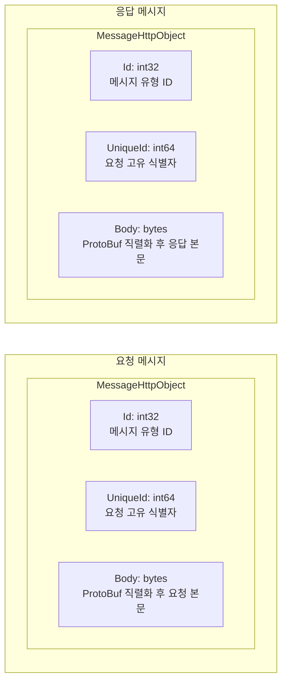

# 플러그인 소개

GameFrameX Web ProtoBuff 플러그인은 Unity 게임을 위해 설계된 네트워크 요청 컴포넌트로, Protocol Buffer (ProtoBuf)를 기반으로 효율적이고 유형 안전한 HTTP 통신 기능을 제공합니다.

## 개요

Web ProtoBuff 컴포넌트(WebProtoBuffComponent)는 GameFrameX 게임 프레임워크의 핵심 네트워크 모듈 중 하나로, Protocol Buffer 형식의 네트워크 요청을 처리하는 데 전문화되어 있습니다. 현대 게임 개발에서 ProtoBuf는 효율적인 직렬화 능력과 콤팩트한 데이터 전송 형식으로 인해 클라이언트와 서버 간 통신에 널리 사용됩니다.

이 플러그인의 주요 책임은 다음과 같습니다:

- **ProtoBuf 메시지 직렬화/역직렬화**: C# 객체를 ProtoBuf 바이트 스트림으로 자동 직렬화하고, 응답에서 대응하는 메시지 객체를 역직렬화합니다
- **비동기 네트워크 요청**: `Task<T>` 기반 비동기 API로, async/await 모드를 지원하며 Unity의 코루틴 시스템과 완벽하게 통합됩니다
- **요청 대기열 관리**: 내부적으로 대기열 메커니즘을 사용하여 송신 대기 중인 요청을 관리하며, 연결 수 제한과 요청 우선순위를 지원합니다
- **크로스 플랫폼 지원**: 다양한 플랫폼(WebGL, Standalone, 모바일)에 대한 네트워크 구현을 제공합니다
- **타임아웃 제어**: 구성 가능한 타임아웃 시간으로 요청이 무한 대기하는 것을 방지합니다

### 핵심 가치

1. **유형 안전성**: 제네릭 메커니즘을 통해 요청 및 응답 유형의 정확성을 컴파일 시에 보장합니다
2. **효율적인 전송**: ProtoBuf의 이진 형식은 JSON보다 더 콤팩트하며 직렬화/역직렬화 속도가 더 빠릅니다
3. **사용 편의성**: 간결한 API 설계로 개발자는业务 로직에만 집중하면 되며底层 네트워크 세부 사항을 처리할 필요가 없습니다
4. **프레임워크 통합**: GameFrameX 프레임워크와 깊이 통합되어 프레임워크의 디자인 규범과 수명 주기 관리를 따릅니다

## 아키텍처

### 컴포넌트 아키텍처

Web ProtoBuff 컴포넌트의 GameFrameX 프레임워크 내 아키텍처 레벨은 다음과 같습니다:

```mermaid
flowchart TD
    subgraph Client["클라이언트 레이어"]
        GameLogic[게임 로직 코드]
    end

    subgraph Component["컴포넌트 레이어"]
        WebProtoBuffComponent[WebProtoBuffComponent]
    end

    subgraph Module["모듈 레이어"]
        IWebProtoBuffManager[IWebProtoBuffManager 인터페이스]
        WebProtoBuffManager[WebProtoBuffManager 구현]
    end

    subgraph Framework["프레임워크 레이어"]
        GameFrameworkEntry[GameFrameworkEntry]
        GameFrameworkModule[GameFrameworkModule 베이스 클래스]
    end

    subgraph Network["네트워크 레이어"]
        WebGL[UnityWebRequest<br/>WebGL 플랫폼]
        HttpClient[HttpWebRequest<br/>기타 플랫폼]
    end

    subgraph Data["데이터 레이어"]
        Serializer[SerializerHelper<br/>ProtoBuf 직렬화]
        ProtoHandler[ProtoMessageIdHandler<br/>메시지 ID 처리]
    end

    GameLogic --> WebProtoBuffComponent
    WebProtoBuffComponent --> IWebProtoBuffManager
    IWebProtoBuffManager <|.. WebProtoBuffManager
    WebProtoBuffManager --> GameFrameworkEntry
    WebProtoBuffManager --> GameFrameworkModule
    WebProtoBuffManager --> WebGL
    WebProtoBuffManager --> HttpClient
    WebProtoBuffManager --> Serializer
    WebProtoBuffManager --> ProtoHandler
```

**아키텍처 설명:**

1. **클라이언트 레이어**: 게임业务 로직 코드가 WebProtoBuffComponent를 호출하여 네트워크 요청을发起합니다
2. **컴포넌트 레이어**: WebProtoBuffComponent는 Unity 컴포넌트로,業務-Oriented API를 제공하고 개발자가 직접 상호작용하는 진입점입니다
3. **모듈 레이어**: IWebProtoBuffManager는 인터페이스 사양을 정의하고, WebProtoBuffManager는 구체적인 네트워크 요청 로직을 구현합니다
4. **프레임워크 레이어**: GameFrameworkEntry는 모듈의 생성과 초기화를 담당하고, GameFrameworkModule은 모듈의 기본 기능을 제공합니다
5. **네트워크 레이어**: 실행 플랫폼에 따라 적합한 네트워크 구현을 선택합니다 (WebGL은 UnityWebRequest, 기타 플랫폼은 HttpWebRequest 사용)
6. **데이터 레이어**: ProtoBuf 메시지의 직렬화/역직렬화와 메시지 유형 ID 매핑을 담당합니다

### 파일 구조

플러그인의 소스 코드 조직 구조는 다음과 같습니다:



### 핵심 클래스 설명

| 클래스명 | 책임 | 접근 수준 |
|------|------|----------|
| WebProtoBuffComponent | Unity 컴포넌트, 네트워크 요청 API를 외부에 제공 | public sealed |
| WebProtoBuffManager | 네트워크 요청의 구체 구현, 요청 대기열 및 처리 로직 관리 | public partial |
| WebProtoBufData | 단일 요청 데이터 캡슐화 (URL, 데이터, Task) | private sealed |
| IWebProtoBuffManager | 네트워크 관리자의 인터페이스 사양 정의 | public interface |

## 핵심 흐름

### 요청 처리 흐름

게임 코드가 `Post<T>` 메서드를 호출하여 ProtoBuf 요청을 보낼 때 전체 처리 흐름은 다음과 같습니다:



### 메시지 포장 형식

플러그인은 통신에 통일된 메시지 포장 형식을 사용합니다:



1. **Id**: 메시지 유형 식별자로, 올바른 분석기로 라우팅하는 데 사용됩니다
2. **UniqueId**: 요청의 고유 식별자로, 요청과 응답을 연결하는 데 사용됩니다
3. **Body**: ProtoBuf 직렬화後の 실제業務 데이터

## 기능 특성

### 1. Protocol Buffer 네이티브 지원

플러그인은 Protocol Buffer 메시지 형식을 네이티브로 지원하며, protobuf-net 라이브러리를 사용하여 직렬화합니다:

- 메시지 클래스는 `MessageObject` 베이스 클래스를 상속해야 합니다
- `[ProtoContract]`와 `[ProtoMember]` 속성으로 표시합니다
- 복잡한 중첩 유형과 컬렉션 유형을 지원합니다

### 2. 비동기 프로그래밍 모델

`Task<T>` 기반 비동기 API 설계:

- async/await 문법을 사용하여 코드가 간결하고 이해하기 쉽습니다
- 취소 작업(CancellationToken)을 지원합니다
- Unity의 수명 주기와 완벽하게 통합됩니다

### 3. 타임아웃 제어

구성 가능한 타임아웃 메커니즘:

- 기본 타임아웃 시간: 5초
- 컴포넌트 속성 또는 코드를 통해 동적으로 설정할 수 있습니다
- 다양한 요청에 대해異なる 타임아웃 설정 지원

### 4. 요청 대기열 관리

효율적인 요청 대기열 시스템:

- 대기열(WaitingQueue): 송신 대기 중인 요청 저장
- 송신 목록(SendingList): 처리 중인 요청
- 연결 수 제한: 기본적으로 서버당 최대 8개의 동시 연결

### 5. 크로스 플랫폼 호환성

다양한 플랫폼에 최적화된 구현 제공:

| 플랫폼 | 네트워크 구현 | 특징 |
|------|----------|------|
| WebGL | UnityWebRequest | 브라우저 호환성, 비동기 콜백 처리 필요 |
| Standalone | HttpWebRequest | .NET 표준 구현, 동기/비동기 지원 |
| iOS | HttpWebRequest | .NET 표준 구현 |
| Android | HttpWebRequest | .NET 표준 구현 |

## 사용 시나리오

Web ProtoBuff 컴포넌트는 다음 시나리오에 적합합니다:

1. **로그인 인증**: 사용자 이름 비밀번호 요청을 보내 인증 토큰을 가져옵니다
2. **데이터 동기화**: 서버에서 게임 구성, 플레이어 데이터 동기화
3. **리더보드**: 플레이어 리더보드 데이터 가져오기 및 제출
4. **멀티플레이어 전투**: 매칭 요청, 게임 결과 제출
5. **인앱 구매 검증**: 인앱 구매 인증서 검증
6. **소셜 기능**: 친구 목록 가져오기, 메시지 보내기

## 플랫폼 요구사항

`package.json` 구성에 따른:

- **Unity 버전**: 2019.4 이상
- **.NET 표준**: 2.1
- **의존 패키지**:
  - com.gameframex.unity (1.1.1+)
  - com.gameframex.unity.web (1.0.0+)
  - com.gameframex.unity.network (1.0.0+)
  - com.gameframex.unity.google.protobuf (1.0.0+)

## 관련 링크

- [기능 특성](./04.features) - 상세한 기능 특성 설명
- [설치 방식](./02.installation) - 플러그인 설치 튜토리얼
- [빠른 시작](./03.getting-started) - 빠르게 사용 시작하기
- [컴포넌트 아키텍처](./06.architecture) - 아키텍처 설계 상세
- [API 참조](./08.iwebprotobuffmanager) - 완전한 API 문서
- [컴포넌트 구성](./07.component-config) - 구성 옵션 설명
- [자주 묻는 질문](./14.troubleshooting) - 자주 묻는 문제 FAQ