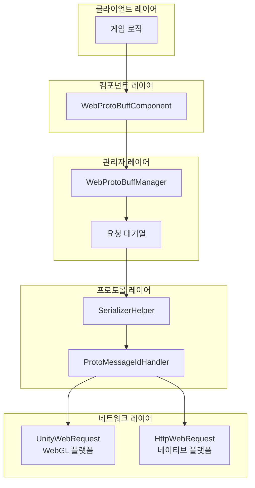
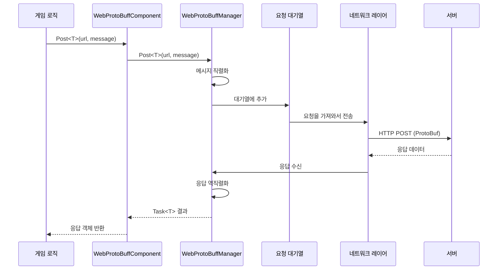

# 빠른 시작

Web ProtoBuff 컴포넌트는 GameFrameX 프레임워크의 네트워크 모듈로, Protocol Buffer 기반의 HTTP POST 요청을 처리합니다. 비동기 메시지 송수신 기능을 제공하며 ProtoBuf 메시지의 직렬화/역직렬화를 지원합니다.

## 개요

WebProtoBuffComponent는 Unity 게임 프레임워크의 네트워크 요청 컴포넌트로, Protocol Buffer 형식 데이터의 네트워크 전송 능력을 캡슐화합니다. 게임이 서버와 효율적인 데이터 교환이 필요할 때, 특히 ProtoBuf를 직렬화 형식으로 사용하는 경우 이 컴포넌트가 네트워크 요청 구현을 크게简化합니다.

### 핵심 기능

- **ProtoBuf 지원**: Protocol Buffer 메시지 형식의 직렬화/역직렬화를 네이티브로 지원합니다
- **비동기 API**: Task<T> 기반 비동기 프로그래밍 모델로, async/await 모드를 사용합니다
- **타임아웃 제어**: 구성 가능한 요청 타임아웃 시간
- **크로스 플랫폼**: Unity WebGL 및 네이티브 플랫폼(PC/iOS/Android) 호환
- **대기열 관리**: 내장 요청 대기열 및 동시성 제어

### 사용 시나리오

WebProtoBuffComponent는 다음 시나리오에 적합합니다:

1. **ProtoBuf 서버와 통신**: 서버가 Protocol Buffer를 데이터 교환 형식으로 사용합니다
2. **高性能 네트워크 요청**: ProtoBuf는 JSON보다 더 콤팩트하여 전송 효율이 높습니다
3. **비동기 데이터 가져오기**: 서버 응답을 기다리는 게임 로직
4. **크로스 플랫폼 배포**: 동일한 코드가 WebGL과 네이티브 플랫폼을 동시에 지원합니다

## 아키텍처

WebProtoBuffComponent는分层 아키텍처 설계를 채택하며, 각 레이어 책임이 명확합니다:



### 컴포넌트 설명

| 컴포넌트 | 설명 |
|------|------|
| WebProtoBuffComponent | Unity 컴포넌트로, GameObject에 붙여서 사용합니다 |
| WebProtoBuffManager | 핵심 관리자로, 요청 대기열 및 동시성 제어를 처리합니다 |
| WebProtoBufData | 요청 데이터 캡슐화로, URL, 직렬화 데이터, TaskCompletionSource를 포함합니다 |
| SerializerHelper | 직렬화/역직렬화 도우미 |
| ProtoMessageIdHandler | 메시지 ID 프로세서 |

## 작업 흐름

컴포넌트의 요청 처리 흐름은 다음과 같습니다:



### 흐름 설명

1. **요청发起**: 게임 로직이 컴포넌트의 Post<T> 메서드를 호출합니다
2. **메시지 포장**: MessageObject를 ProtoBuf 바이트 배열로 직렬화하여 MessageHttpObject에 포장합니다
3. **대기열 관리**: 요청이 대기열에 추가되어 송신을 기다립니다
4. **동시성 제어**: 동시에 최대 MaxConnectionPerServer(기본값 8)개의 요청을 송신합니다
5. **네트워크 송신**: 플랫폼에 따라 UnityWebRequest(WebGL) 또는 HttpWebRequest(네이티브)를 선택합니다
6. **응답 처리**: 서버 응답을 수신하여 대응하는 MessageObject로 역직렬화합니다

## 전제 조건

### 1. 의존 설치

Unity 프로젝트에 다음 의존이 설치되어 있는지 확인합니다:

- `com.gameframex.unity` (1.1.1+)
- `com.gameframex.unity.web` (1.0.0+)
- `com.gameframex.unity.network` (1.0.0+)
- `com.gameframex.unity.google.protobuf` (1.0.0+)

### 2. 컴파일 매크로 활성화

Unity 편집기에서 **Edit > Project Settings > Player**를 열고, **Scripting Define Symbols**에 다음을 추가합니다:

```
ENABLE_GAME_FRAME_X_WEB_PROTOBUF_NETWORK
```

> **주의**: 이 매크로 정의를 추가하지 않으면 Post<T> 메서드가 사용할 수 없습니다.

### 3. 컴포넌트 추가

Unity 씬에서 빈 GameObject를 생성한 다음 **Web ProtoBuff** 컴포넌트를 추가합니다:

```csharp
// 또는 코드를 통해 추가
var gameObject = new GameObject("WebProtoBuff");
var webComponent = gameObject.AddComponent<WebProtoBuffComponent>();
```

컴포넌트는 GameFrameXWebProtoBuffCroppingHelper에 자동으로 의존하여 IL2CPP 컴파일 시 유형이 잘리지 않도록 합니다.

## 메시지 정의

컴포넌트를 사용하기 전에 요청과 응답의 메시지 유형을 정의해야 합니다. 메시지 클래스는 MessageObject를 상속해야 하며, 응답 클래스는 IResponseMessage 인터페이스도 구현해야 합니다:

```csharp
using ProtoBuf;
using GameFrameX.Network.Runtime;

[ProtoContract]
public class LoginRequest : MessageObject
{
    [ProtoMember(1)]
    public string Username { get; set; }

    [ProtoMember(2)]
    public string Password { get; set; }
}

[ProtoContract]
public class LoginResponse : MessageObject, IResponseMessage
{
    [ProtoMember(1)]
    public bool Success { get; set; }

    [ProtoMember(2)]
    public string Token { get; set; }
}
```

> Source: [README.md](https://github.com/GameFrameX/com.gameframex.unity.web.protobuff/blob/main/README.md#L60-L88)

## 요청 송신

컴포넌트 인스턴스를 가져온 후 ProtoBuf 요청을 보낼 수 있습니다:

```csharp
using UnityEngine;
using GameFrameX.Web.ProtoBuff.Runtime;

public class LoginController : MonoBehaviour
{
    public WebProtoBuffComponent WebComponent;

    private async void Start()
    {
        var request = new LoginRequest
        {
            Username = "user",
            Password = "password"
        };

        string url = "http://api.example.com/login";

        try
        {
            LoginResponse response = await WebComponent.Post<LoginResponse>(url, request);

            if (response != null)
            {
                Debug.Log($"로그인 결과: {response.Success}, Token: {response.Token}");
            }
        }
        catch (System.Exception e)
        {
            Debug.LogError($"요청 실패: {e.Message}");
        }
    }
}
```

> Source: [README.md](https://github.com/GameFrameX/com.gameframex.unity.web.protobuff/blob/main/README.md#L94-L128)

## 구성 옵션

WebProtoBuffComponent는 다음 구성 가능한 속성을 제공합니다:

| 속성 | 유형 | 기본값 | 설명 |
|------|------|--------|------|
| Timeout | float | 5.0 | 요청 타임아웃 시간(초) |

Inspector 패널 또는 코드를 통해 구성할 수 있습니다:

```csharp
// 코드를 통해 타임아웃 시간 구성
webComponent.Timeout = 10f;
```

## 플랫폼 차이

컴포넌트는 대상 플랫폼에 따라 적합한 네트워크 구현을 자동으로 선택합니다:

| 플랫폼 | 네트워크 구현 | 설명 |
|------|----------|------|
| WebGL | UnityWebRequest | Unity 네이티브 WebGL 지원 |
| 기타 플랫폼 | HttpWebRequest | .NET 표준 HTTP 요청 |

두 구현 모두 동일한 API 인터페이스와 메시지 형식을 사용하므로 코드를 수정할 필요가 없습니다.

## 관련 링크

- [기본 예제](./11.basic-example) - 완전한 코드 예제
- [컴포넌트 아키텍처](./06.architecture) - 아키텍처 설계 심층 이해
- [API 참조](./08.iwebprotobuffmanager) - 완전한 API 문서
- [컴파일 매크로 정의](./13.compile-defines) - 매크로 정의 구성 상세
- [플랫폼 설명](./12.platform-info) - 각 플랫폼 지원 상세