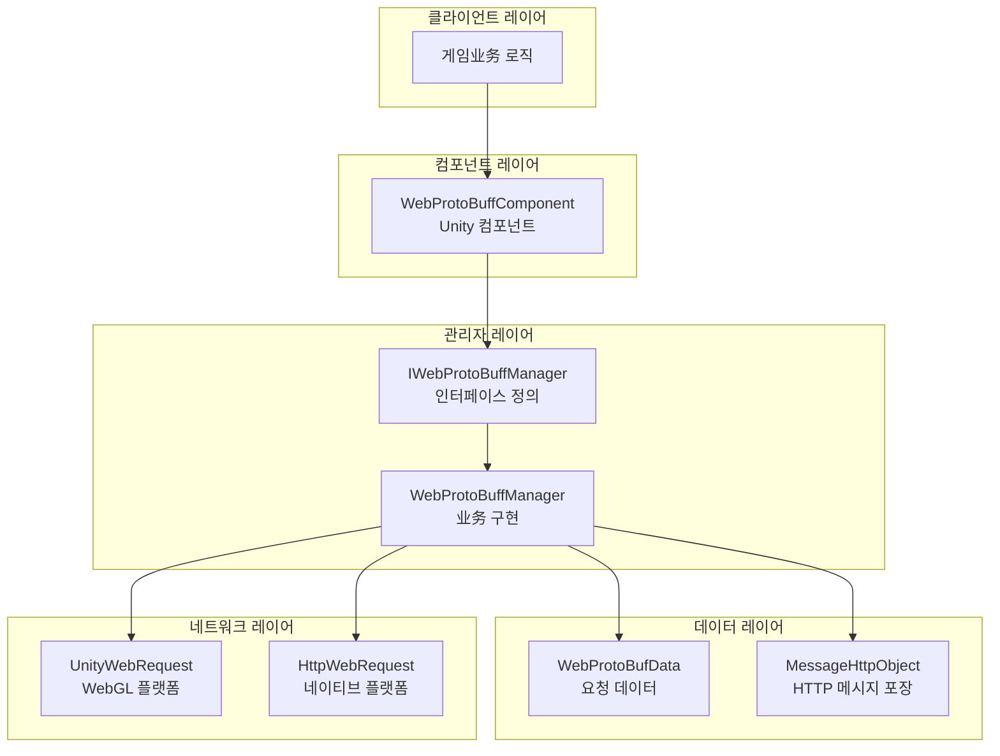
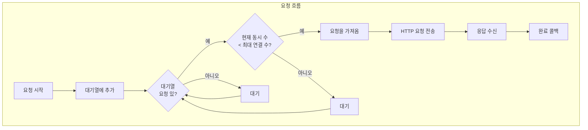
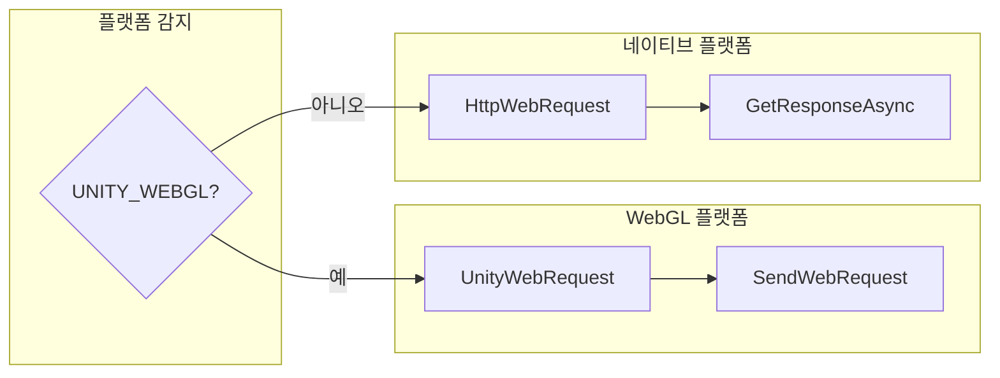

# 기능 특성

GameFrameX Web ProtoBuff 컴포넌트는 Protocol Buffer 기반의 HTTP 네트워크 요청 기능을 제공하며, 비동기 ProtoBuf 메시지 송수신을 지원하여 Unity 게임과 백엔드 서버 통신을 위한 경량 솔루션입니다.

## 개요

Web ProtoBuff 컴포넌트는 GameFrameX 게임 프레임워크의 네트워크 모듈 확장 버전으로, Protocol Buffer 형식의 네트워크 통신을 처리하는 데 전문화되어 있습니다. 전통적인 JSON/XML과 비교할 때 Protocol Buffer는 더 높은 직렬화 효율성과 더 작은 데이터 볼륨을 가지며 모바일 게임 시나리오의 네트워크 통신에 매우 적합합니다.

이 컴포넌트는 완전한 요청 관리 기능을 제공하며, 요청 대기열, 타임아웃 제어, 비동기 응답 처리 등의 특성을 포함하고, 동시에 Unity WebGL 플랫폼과 네이티브 플랫폼(PC/Android/iOS)의 네트워크 요청 호출을 지원합니다.

## 아키텍처 설계

컴포넌트는分层 아키텍처 설계를 채택하여 Unity 컴포넌트 레이어,业务 로직 레이어 및 네트워크 요청 레이어를 분리하여 코드가 명확하고 유지 관리가 용이하도록 합니다.



### 핵심 컴포넌트 설명

| 컴포넌트 | 책임 | 파일 위치 |
|------|------|----------|
| WebProtoBuffComponent | Unity 컴포넌트 레이어, Inspector 구성 및 외부 API 제공 | Runtime/Web/WebProtoBuffComponent.cs |
| IWebProtoBuffManager | 네트워크 관리자의 인터페이스 사양 정의 | Runtime/Web/IWebProtoBuffManager.cs |
| WebProtoBuffManager | 구체적인 ProtoBuf 요청 처리 로직 구현 | Runtime/Web/WebProtoBuffManager.cs |
| WebProtoBufData | 요청 데이터 및 관련 상태 캡슐화 | Runtime/Web/WebProtoBuffManager.WebProtoBufData.cs |

## 핵심 기능

### 1. Protocol Buffer 메시지 지원

컴포넌트는 Protocol Buffer 메시지 형식의 직렬화/역직렬화를 네이티브로 지원합니다. 요청 메시지와 응답 메시지는 모두 ProtoBuf 형식으로 전송되며, JSON 대비 30%-70%의 대역폭을 절약할 수 있습니다.

메시지 구조는 `MessageObject` 베이스 클래스를 채택하며, `[ProtoContract]`와 `[ProtoMember]` 속성 표시로 자동 직렬화를 구현합니다:

```csharp
[ProtoContract]
public class LoginRequest : MessageObject
{
    [ProtoMember(1)]
    public string Username { get; set; }

    [ProtoMember(2)]
    public string Password { get; set; }
}

[ProtoContract]
public class LoginResponse : MessageObject, IResponseMessage
{
    [ProtoMember(1)]
    public bool Success { get; set; }

    [ProtoMember(2)]
    public string Token { get; set; }
}
```
> Source: [WebProtoBuffManager.ProtoBuf.cs](https://github.com/GameFrameX/com.gameframex.unity.web.protobuff/blob/main/Runtime/Web/WebProtoBuffManager.ProtoBuf.cs#L178-L201)

컴포넌트는 요청에 `application/x-protobuf` Content-Type을 사용하여 서버가 ProtoBuf 형식 데이터를 올바르게 인식하고 처리할 수 있도록 합니다:

```csharp
private const string ProtoBufContentType = "application/x-protobuf";
```
> Source: [WebProtoBuffManager.ProtoBuf.cs](https://github.com/GameFrameX/com.gameframex.unity.web.protobuff/blob/main/Runtime/Web/WebProtoBuffManager.ProtoBuf.cs#L32)

### 2. 비동기 요청 처리

컴포넌트는 `Task<T>` 기반 비동기 프로그래밍 모드를 채택하며, `async/await` 문법을 지원하여 네트워크 요청 코드가 간결하고 이해하기 쉽습니다:

```csharp
public async void Login()
{
    var request = new LoginRequest
    {
        Username = "user",
        Password = "password"
    };

    string url = "http://api.example.com/login";

    try
    {
        LoginResponse response = await WebComponent.Post<LoginResponse>(url, request);

        if (response != null)
        {
            Debug.Log($"로그인 결과: {response.Success}, Token: {response.Token}");
        }
    }
    catch (System.Exception e)
    {
        Debug.LogError($"요청 실패: {e.Message}");
    }
}
```
> Source: [WebProtoBuffComponent.cs](https://github.com/GameFrameX/com.gameframex.unity.web.protobuff/blob/main/Runtime/Web/WebProtoBuffComponent.cs#L105-L108)

### 3. 요청 대기열 관리

컴포넌트는 내부적으로 요청 대기열을 유지하여 동시성 제어와 요청 우선순위 관리를 지원하여 네트워크 요청이 순서대로 진행되도록 합니다:



핵심 대기열 관리 로직:

```csharp
private readonly Queue<WebProtoBufData> m_WaitingProtoBufQueue = new Queue<WebProtoBufData>(256);
private readonly List<WebProtoBufData> m_SendingProtoBufList = new List<WebProtoBufData>(16);
```
> Source: [WebProtoBuffManager.ProtoBuf.cs](https://github.com/GameFrameX/com.gameframex.unity.web.protobuff/blob/main/Runtime/Web/WebProtoBuffManager.ProtoBuf.cs#L22-L27)

기본 최대 동시 연결 수는 8개입니다:

```csharp
public WebProtoBuffManager()
{
    MaxConnectionPerServer = 8;
    m_MemoryStream = new MemoryStream();
    Timeout = 5f;
}
```
> Source: [WebProtoBuffManager.cs](https://github.com/GameFrameX/com.gameframex.unity.web.protobuff/blob/main/Runtime/Web/WebProtoBuffManager.cs#L31-L36)

### 4. 타임아웃 제어

컴포넌트는 유연한 타임아웃 구성 메커니즘을 제공하며, Inspector 패널 또는 코드에서 동적으로 타임아웃 시간을 설정할 수 있습니다:

```csharp
[SerializeField] [Tooltip("타임아웃 시간. 단위: 초")]
private float m_Timeout = 5f;

public float Timeout
{
    get { return m_WebProtoBuffManager.Timeout; }
    set { m_WebProtoBuffManager.Timeout = m_Timeout = value; }
}
```
> Source: [WebProtoBuffComponent.cs](https://github.com/GameFrameX/com.gameframex.unity.web.protobuff/blob/main/Runtime/Web/WebProtoBuffComponent.cs#L60-L71)

Inspector 패널은 0-120초의 타임아웃 슬라이더 설정을 지원합니다:

```csharp
float timeout = EditorGUILayout.Slider("Timeout", m_Timeout.floatValue, 0f, 120f);
```
> Source: [WebComponentInspector.cs](https://github.com/GameFrameX/com.gameframex.unity.web.protobuff/blob/main/Editor/Inspector/WebComponentInspector.cs#L23)

### 5. 디버깅 로그

컴포넌트는 선택적 디버깅 로그 기능을 제공하여 개발자가 네트워크 요청의 송수신 과정을 추적할 수 있도록 합니다:

```csharp
private void DebugSendLog(MessageObject messageObject)
{
#if ENABLE_GAMEFRAMEX_WEB_SEND_LOG
    var messageId = ProtoMessageIdHandler.GetReqMessageIdByType(messageObject.GetType());
    Log.Debug($"메시지 전송 ID:[{messageId},{messageObject.UniqueId},{messageObject.GetType().Name}] 메시지 내용:{GameFrameX.Runtime.Utility.Json.ToJson(messageObject)}");
#endif
}

private void DebugReceiveLog(MessageObject messageObject)
{
#if ENABLE_GAMEFRAMEX_WEB_RECEIVE_LOG
    var messageId = ProtoMessageIdHandler.GetReqMessageIdByType(messageObject.GetType());
    Log.Debug($"메시지 수신 ID:[{messageId},{messageObject.UniqueId},{messageObject.GetType().Name}] 메시지 내용:{GameFrameX.Runtime.Utility.Json.ToJson(messageObject)}");
#endif
}
```
> Source: [WebProtoBuffManager.ProtoBuf.cs](https://github.com/GameFrameX/com.gameframex.unity.web.protobuff/blob/main/Runtime/Web/WebProtoBuffManager.ProtoBuf.cs#L227-L241)

로그를 활성화하려면 Unity Player Settings에 컴파일 매크로를 추가해야 합니다:
- `ENABLE_GAMEFRAMEX_WEB_SEND_LOG` - 송신 로그 활성화
- `ENABLE_GAMEFRAMEX_WEB_RECEIVE_LOG` - 수신 로그 활성화

### 6. 크로스 플랫폼 지원

컴포넌트는 다양한 Unity 플랫폼에 차별화된 네트워크 구현을 제공합니다:



WebGL 플랫폼은 Unity 내장 `UnityWebRequest`를 사용합니다:

```csharp
#if UNITY_WEBGL
UnityEngine.Networking.UnityWebRequest unityWebRequest;
if (webData.IsGet)
{
    unityWebRequest = UnityEngine.Networking.UnityWebRequest.Get(webData.URL);
}
else
{
    unityWebRequest = UnityEngine.Networking.UnityWebRequest.Post(webData.URL, string.Empty);
}

unityWebRequest.timeout = (int)RequestTimeout.TotalSeconds;
unityWebRequest.SetRequestHeader("Content-Type", ProtoBufContentType);
byte[] postData = webData.SendData;
unityWebRequest.uploadHandler = new UnityEngine.Networking.UploadHandlerRaw(postData);
```
> Source: [WebProtoBuffManager.ProtoBuf.cs](https://github.com/GameFrameX/com.gameframex.unity.web.protobuff/blob/main/Runtime/Web/WebProtoBuffManager.ProtoBuf.cs#L87-L103)

네이티브 플랫폼은 .NET의 `HttpWebRequest`를 사용합니다:

```csharp
#else
try
{
    HttpWebRequest request = WebRequest.CreateHttp(webData.URL);
    request.Method = webData.IsGet ? WebRequestMethods.Http.Get : WebRequestMethods.Http.Post;
    request.Timeout = (int)RequestTimeout.TotalMilliseconds;
    request.ContentType = ProtoBufContentType;
    // ... 송수신 로직
}
```
> Source: [WebProtoBuffManager.ProtoBuf.cs](https://github.com/GameFrameX/com.gameframex.unity.web.protobuff/blob/main/Runtime/Web/WebProtoBuffManager.ProtoBuf.cs#L118-L130)

### 7. 메시지 ID 매핑

컴포넌트는 `ProtoMessageIdHandler`를 통해 메시지 유형과 ID의 매핑을 구현하여 클라이언트와 서버가 통일된 프로토콜 식별자를 사용하도록 합니다:

```csharp
var id = ProtoMessageIdHandler.GetReqMessageIdByType(message.GetType());
MessageHttpObject messageHttpObject = new MessageHttpObject
{
    Id = id,
    UniqueId = message.UniqueId,
    Body = SerializerHelper.Serialize(message),
};
```
> Source: [WebProtoBuffManager.ProtoBuf.cs](https://github.com/GameFrameX/com.gameframex.unity.web.protobuff/blob/main/Runtime/Web/WebProtoBuffManager.ProtoBuf.cs#L214-L221)

## 메시지 포장 형식

컴포넌트는 `MessageHttpObject`를 사용하여 ProtoBuf 메시지를 포장하며, 메시지 ID, 고유 식별자 및 메시지 본문을 포함합니다:

```csharp
MessageHttpObject messageHttpObject = new MessageHttpObject
{
    Id = id,
    UniqueId = message.UniqueId,
    Body = SerializerHelper.Serialize(message),
};
var sendData = SerializerHelper.Serialize(messageHttpObject);
```
> Source: [WebProtoBuffManager.ProtoBuf.cs](https://github.com/GameFrameX/com.gameframex.unity.web.protobuff/blob/main/Runtime/Web/WebProtoBuffManager.ProtoBuf.cs#L215-L221)

이 포장 형식은 서버의 라우팅과 메시지 분배를 용이하게 하며, 동시에 요청의 고유 위치(UniqueId)를 지원합니다.

## 사용 제한

컴포넌트의 ProtoBuf 기능은 컴파일 매크로를 통해 활성화해야 합니다. Unity Player Settings에 다음 매크로 정의를 추가해야 합니다:

```
ENABLE_GAME_FRAME_X_WEB_PROTOBUF_NETWORK
```

이 매크로가 정의되지 않으면 `Post<T>` 메서드가 비활성화되어 프로덕션 환경에서 실수로 구성되지 않은 기능을 호출하는 것을 방지합니다.

```csharp
#if ENABLE_GAME_FRAME_X_WEB_PROTOBUF_NETWORK
public Task<T> Post<T>(string url, GameFrameX.Network.Runtime.MessageObject message) where T : GameFrameX.Network.Runtime.MessageObject, GameFrameX.Network.Runtime.IResponseMessage
{
    return m_WebProtoBuffManager.Post<T>(url, message);
}
#endif
```
> Source: [WebProtoBuffComponent.cs](https://github.com/GameFrameX/com.gameframex.unity.web.protobuff/blob/main/Runtime/Web/WebProtoBuffComponent.cs#L92-L109)

## 리소스 정리

컴포넌트가 닫힐 때 모든 요청 리소스를 자동으로 정리하여 메모리 누수를 방지합니다:

```csharp
protected override void Shutdown()
{
    ShutdownProtoBuf();
    m_MemoryStream.Dispose();
}

private void ShutdownProtoBuf()
{
    while (m_WaitingProtoBufQueue.Count > 0)
    {
        var webData = m_WaitingProtoBufQueue.Dequeue();
        webData.Dispose();
    }
    // ... 송신 중인 요청 정리
}
```
> Source: [WebProtoBuffManager.cs](https://github.com/GameFrameX/com.gameframex.unity.web.protobuff/blob/main/Runtime/Web/WebProtoBuffManager.cs#L75-L79) 및 [WebProtoBuffManager.ProtoBuf.cs](https://github.com/GameFrameX/com.gameframex.unity.web.protobuff/blob/main/Runtime/Web/WebProtoBuffManager.ProtoBuf.cs#L60-L79)

## 관련 링크

- [플러그인 소개](./01.overview) - 플러그인의 기본 정보 이해
- [빠른 시작](./03.getting-started) - 컴포넌트 사용 시작
- [기본 예제](./11.basic-example) - 완전한 코드 예제 보기
- [컴포넌트 아키텍처](./06.architecture) - 아키텍처 설계 심층 이해
- [API 참조](./09.webprotobuffcomponent) - 완전한 API 문서
- [컴포넌트 구성](./07.component-config) - 구성 옵션 상세
- [컴파일 매크로 정의](./13.compile-defines) - 컴파일 매크로 사용 설명
- [플랫폼 설명](./12.platform-info) - 플랫폼 호환성 설명