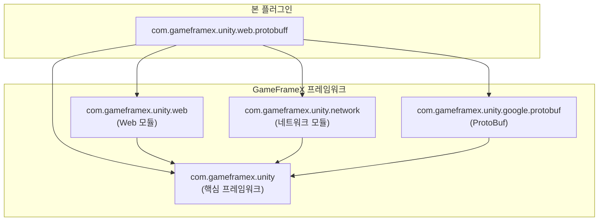
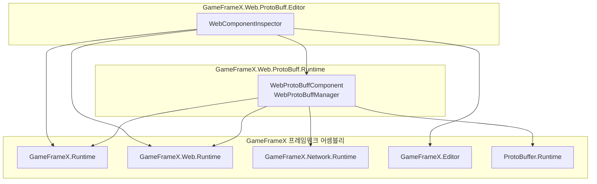
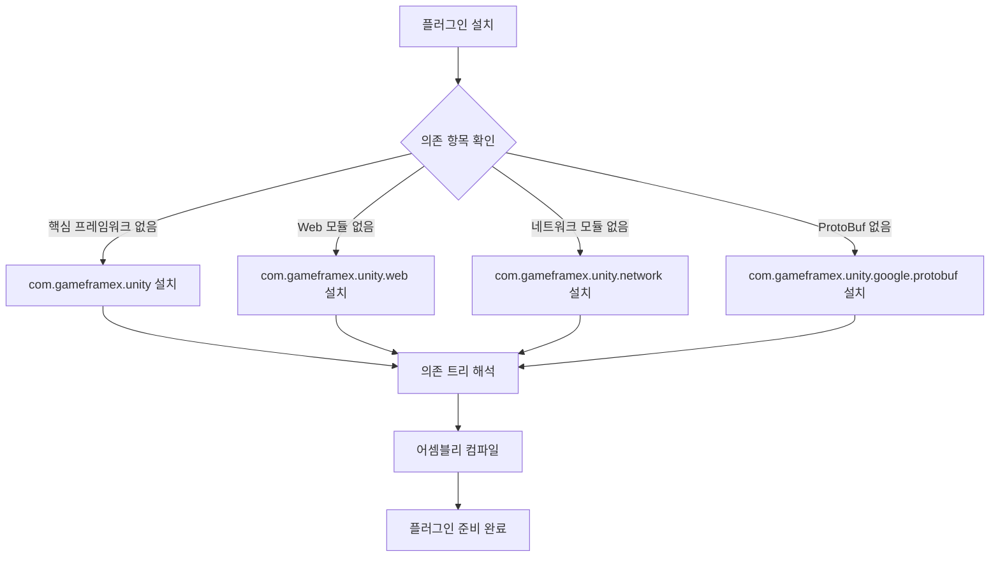

# 의존 항목

이 문서는 GameFrameX Web ProtoBuff 플러그인의 의존 항목을 소개하며, 런타임 의존, 개발 의존 및 어셈블리 참조 관계를 포함합니다.

## 개요

Web ProtoBuff 플러그인은 GameFrameX 프레임워크 생태계의 일원으로, Protocol Buffer 기반 HTTP 네트워크 요청 기능을 구현하기 위해 프레임워크의 기타 핵심 모듈에 의존합니다. 이러한 의존 항목을 이해하는 것은 올바른 설치, 구성 및 문제 해결에 중요합니다.

## 런타임 의존

플러그인의 런타임 의존은 `package.json` 파일에 정의되어 있으며, Unity Package Manager가 자동으로解析하고 설치합니다.

```json
{
  "dependencies": {
    "com.gameframex.unity": "1.1.1",
    "com.gameframex.unity.web": "1.0.0",
    "com.gameframex.unity.network": "1.0.0",
    "com.gameframex.unity.google.protobuf": "1.0.0"
  }
}
```

> Source: [package.json](https://github.com/GameFrameX/com.gameframex.unity.web.protobuff/blob/main/package.json#L23-L28)

### 의존 항목 설명

| 의존 패키지 | 버전 | 설명 |
|--------|------|------|
| `com.gameframex.unity` | 1.1.1 | GameFrameX 핵심 프레임워크로, 기본 컴포넌트 시스템과 모듈 관리 기능을 제공합니다 |
| `com.gameframex.unity.web` | 1.0.0 | Web 네트워크 기초 모듈로, HTTP 요청의底层 구현을 제공합니다 |
| `com.gameframex.unity.network` | 1.0.0 | 네트워크 메시지 모듈로, `MessageObject` 베이스 클래스와 메시지 직렬화 지원을 제공합니다 |
| `com.gameframex.unity.google.protobuf` | 1.0.0 | Google Protocol Buffers 지원으로, ProtoBuf 메시지의 직렬화/역직렬화 기능을 제공합니다 |

### 의존 관계도



**설계 의도**: 플러그인은分层 아키텍처를 채택하여底层이 핵심 프레임워크에 의존하고, 상위가 Web와 Network 모듈에 의존하여 구체적인 네트워크 요청 기능을 구현합니다. 이러한 의존 설계는 코드의 모듈화와 재사용성을 보장합니다.

## 어셈블리 참조

Unity Package Manager가 관리하는 패키지 의존 외에, 플러그인은 Assembly Definition 파일을 통해 어셈블리 수준의 참조 관계를 정의합니다.

### Runtime 어셈블리

`Runtime/GameFrameX.Web.ProtoBuff.Runtime.asmdef` 파일은 런타임 어셈블리의 참조를 정의합니다:

```json
{
  "name": "GameFrameX.Web.ProtoBuff.Runtime",
  "references": [
    "GameFrameX.Runtime",
    "GameFrameX.Web.Runtime",
    "GameFrameX.Network.Runtime",
    "ProtoBuffer.Runtime"
  ],
  "versionDefines": [
    {
      "name": "com.gameframex.unity.network",
      "define": "ENABLE_GAME_FRAME_X_WEB_PROTOBUF_NETWORK"
    }
  ]
}
```

> Source: [Runtime/GameFrameX.Web.ProtoBuff.Runtime.asmdef](https://github.com/GameFrameX/com.gameframex.unity.web.protobuff/blob/main/Runtime/GameFrameX.Web.ProtoBuff.Runtime.asmdef#L1-L25)

### Editor 어셈블리

`Editor/GameFrameX.Web.ProtoBuff.Editor.asmdef` 파일은 편집기 어셈블리의 참조를 정의합니다:

```json
{
  "name": "GameFrameX.Web.ProtoBuff.Editor",
  "references": [
    "GameFrameX.Web.Runtime",
    "GameFrameX.Web.ProtoBuff.Runtime",
    "GameFrameX.Editor",
    "GameFrameX.Runtime"
  ],
  "includePlatforms": ["Editor"]
}
```

> Source: [Editor/GameFrameX.Web.ProtoBuff.Editor.asmdef](https://github.com/GameFrameX/com.gameframex.unity.web.protobuff/blob/main/Editor/GameFrameX.Web.ProtoBuff.Editor.asmdef#L1-L11)

### 어셈블리 참조 관계



## 컴파일 매크로 정의

플러그인은 조건부 컴파일을 사용하여 ProtoBuf 네트워크 기능의 활성화 여부를 제어합니다. 다음 매크로 정의가 기능의 가용성을 제어합니다:

| 매크로 정의 | 제어 패키지 | 설명 |
|--------|--------|------|
| `ENABLE_GAME_FRAME_X_WEB_PROTOBUF_NETWORK` | com.gameframex.unity.network | ProtoBuf 네트워크 요청 기능 활성화 |

### 매크로 정의 구성 방법

Unity에서 컴파일 매크로 정의를 구성하는 단계:

1. Unity 편집기를 엽니다
2. **Edit** → **Project Settings** → **Player**로 이동합니다
3. **Player Settings** 창에서 **Other Settings** 탭을 선택합니다
4. **Scripting Define Symbols** 옵션을 찾습니다
5. 매크로 정의 추가: `ENABLE_GAME_FRAME_X_WEB_PROTOBUF_NETWORK`

> **주의**: 이 매크로 정의를 추가하지 않으면 `WebProtoBuffComponent`의 `Post<T>` 메서드가 사용할 수 없습니다.

```csharp
#if ENABLE_GAME_FRAME_X_WEB_PROTOBUF_NETWORK
/// <summary>
/// Protocol Buffer 메시지 송수신을 위한 POST 요청을 전송합니다.
/// 이 메서드는 ENABLE_GAME_FRAME_X_WEB_PROTOBUF_NETWORK 매크로가 활성화된 경우에만 사용할 수 있습니다.
/// </summary>
public Task<T> Post<T>(string url, GameFrameX.Network.Runtime.MessageObject message)
    where T : GameFrameX.Network.Runtime.MessageObject, GameFrameX.Network.Runtime.IResponseMessage
{
    return m_WebProtoBuffManager.Post<T>(url, message);
}
#endif
```

> Source: [Runtime/Web/WebProtoBuffComponent.cs](https://github.com/GameFrameX/com.gameframex.unity.web.protobuff/blob/main/Runtime/Web/WebProtoBuffComponent.cs#L92-L109)

## 의존 설치 흐름

프로젝트에 Web ProtoBuff 플러그인을 설치할 때 Unity Package Manager는 모든 필요한 의존 항목을 자동으로解析하고 설치합니다:



## 의존 버전 호환성

플러그인이 의존하는 버전 요구사항은 다음과 같습니다:

| 의존 항목 | 최저 버전 | 권장 버전 | 호환 Unity 버전 |
|--------|----------|----------|-----------------|
| com.gameframex.unity | 1.1.0 | 1.1.1 | 2019.4+ |
| com.gameframex.unity.web | 1.0.0 | 1.0.0 | 2019.4+ |
| com.gameframex.unity.network | 1.0.0 | 1.0.0 | 2019.4+ |
| com.gameframex.unity.google.protobuf | 1.0.0 | 1.0.0 | 2019.4+ |

> **팁**: `package.json`에 지정된 버전을 사용하면 최적의 호환성을 보장할 수 있습니다.

## 자주 묻는 의존 문제

### 문제: GameFrameX.Runtime을 찾을 수 없음

**증상**: 컴파일 오류提示找不到 `GameFrameX.Runtime` 네임스페이스

**솔루션**: `com.gameframex.unity` 핵심 패키지가 올바르게 설치되었는지 확인합니다

### 문제: Post 메서드가 사용할 수 없음

**증상**: `WebProtoBuffComponent.Post<T>` 메서드가 회색으로 표시되거나 호출할 수 없습니다

**솔루션**:
1. Player Settings에 `ENABLE_GAME_FRAME_X_WEB_PROTOBUF_NETWORK` 매크로 정의를 추가했는지 확인합니다
2. `com.gameframex.unity.network` 패키지가 설치되었는지 확인합니다

### 문제: ProtoBuf 직렬화 실패

**증상**: 요청 또는 응답 데이터를 올바르게 직렬화/역직렬화할 수 없습니다

**솔루션**:
1. `com.gameframex.unity.google.protobuf` 패키지가 설치되었는지 확인합니다
2. 메시지 클래스가 `[ProtoContract]`와 `[ProtoMember]` 속성으로 올바르게 표시되었는지 확인합니다

## 관련 링크

- [설치 방식](./02.installation) - 다양한 플러그인 설치 방법 이해
- [플러그인 소개](./01.overview) - 플러그인 기능 이해
- [컴포넌트 아키텍처](./06.architecture) - 컴포넌트 내부 아키텍처 이해