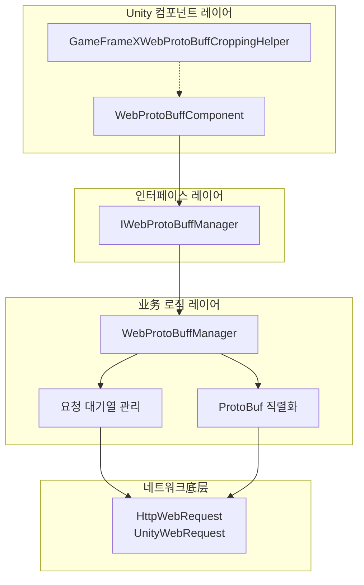
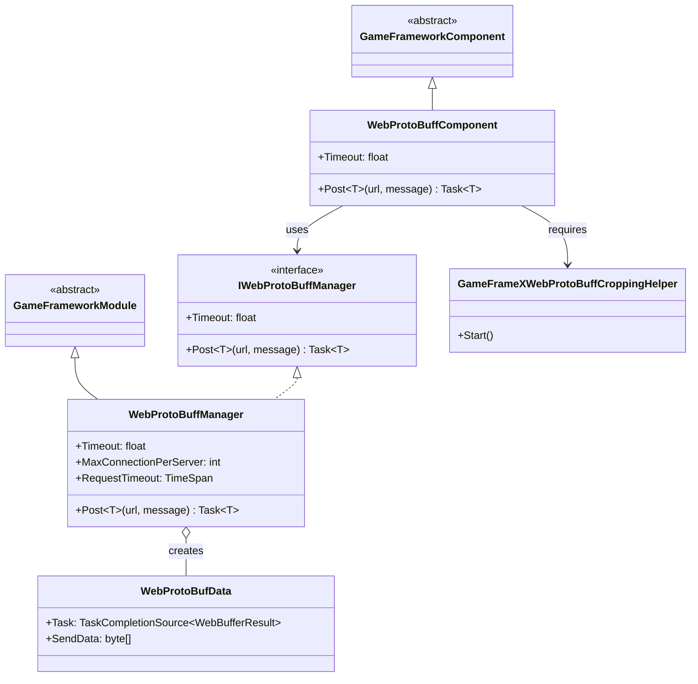
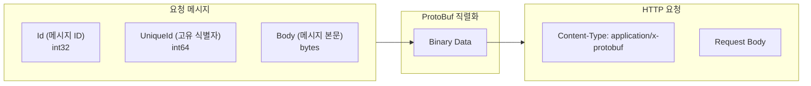
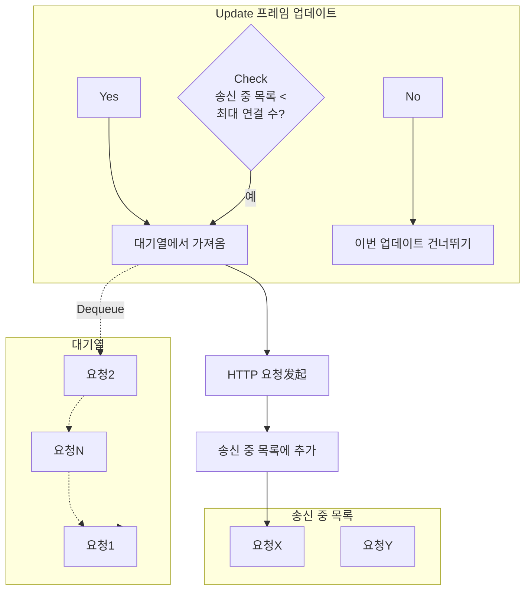

# 컴포넌트 아키텍처

Web ProtoBuff 컴포넌트는 GameFrameX 프레임워크에서 HTTP 요청과 Protocol Buffer 메시지 직렬화를 처리하기 위한 핵심 모듈입니다. 이 컴포넌트는 Unity 프로젝트에서 ProtoBuf 프로토콜을 지원하는 백엔드 서버와 효율적인 데이터 통신을 위한 고성능, 사용하기 쉬운 네트워크 통신 기능을 제공합니다.

## 개요

GameFrameX Web ProtoBuff 컴포넌트는分层 아키텍처 설계를 채택하여 Unity 컴포넌트 레이어,业务 로직 레이어와 네트워크底层 구현을 분리하여 더 나은 유지 관리성과 확장성을实现합니다.

이 컴포넌트의 핵심 기능은 다음과 같습니다:

- **Protocol Buffer 메시지 직렬화/역직렬화**: ProtoBuf 라이브러리를 사용하여 이진 데이터를 효율적으로 처리합니다
- **HTTP POST 요청**: 서버에 ProtoBuf 형식의 요청 메시지를 전송합니다
- **비동기 처리**: Task 비동기 모드를 기반으로하여 메인 스레드阻塞를 방지합니다
- **대기열 관리**: 요청 대기열 메커니즘을 사용하여 고并发 시나리오를 지원합니다
- **플랫폼 어댑터**: WebGL 플랫폼과 기타 Unity 플랫폼을 지원합니다

## 아키텍처 설계

컴포넌트는 전형적인 三层 아키텍처 설계를 채택하며, 각 레이어 책임이 명확합니다:



### 핵심 컴포넌트 설명

| 컴포넌트 | 유형 | 책임 |
|------|------|------|
| WebProtoBuffComponent | Unity 컴포넌트 | Unity GameObject 컴포넌트로, 외부 API 진입점을 제공합니다 |
| IWebProtoBuffManager | 인터페이스 | Web 요청 관리자의 추상 인터페이스를 정의합니다 |
| WebProtoBuffManager | 모듈 클래스 | 핵심业务 로직을 구현하며, 요청 대기열, ProtoBuf 처리를 포함합니다 |
| WebProtoBufData | 내부 클래스 | 단일 요청 데이터를 캡슐화하며, URL, 데이터, Task를 포함합니다 |
| GameFrameXWebProtoBuffCroppingHelper | 보조 클래스 | IL2CPP/AOT 코드 축소 지원 |

## 클래스 다이어그램 관계



## 요청 처리 흐름

클라이언트가 ProtoBuf 요청을 보낼 때 컴포넌트는 다음 흐름으로 처리합니다:

```mermaid
sequenceDiagram
    participant Client as 호출方
    participant Component as WebProtoBuffComponent
    participant Manager as WebProtoBuffManager
    participant Queue as 요청 대기열
    participant Network as 네트워크 레이어
    participant Server as 서버

    Client->>Component: Post&lt;T&gt;(url, message)
    Component->>Manager: Post&lt;T&gt;(url, message)

    Note over Manager: 1. 메시지 직렬화

    Manager->>Manager: SerializerHelper.Serialize(message)

    Note over Manager: 2. HTTP 포장 객체 구축

    Manager->>Manager: MessageHttpObject 생성<br/>(Id + UniqueId + Body)

    Note over Manager: 3. 다시 직렬화

    Manager->>Manager: SerializerHelper.Serialize(messageHttpObject)

    Note over Manager: 4. 요청 대기열에 추가

    Manager->>Queue: Enqueue(WebProtoBufData)
    Queue-->>Manager: 대기열에 추가됨

    Manager->>Network: 비동기 요청 전송

    Note over Network: 5. HTTP 요청 처리

    Network->>Server: POST /url<br/>Content-Type: application/x-protobuf
    Server-->>Network: HTTP Response (ProtoBuf)
    Network-->>Manager: WebBufferResult

    Note over Manager: 6. 응답 역직렬화

    Manager->>Manager: Deserialize&lt;MessageHttpObject&gt;()
    Manager->>Manager: Deserialize&lt;T&gt;(Body)

    Manager-->>Component: Task&lt;T&gt; Result
    Component-->>Client: Response Object
```

### 메시지 포장 형식

컴포넌트는 `MessageHttpObject`를 사용하여 ProtoBuf 메시지를二次 포장합니다:



## 요청 대기열 관리

컴포넌트는 이중 대기열 모드를 사용하여 네트워크 요청을 관리합니다:



**대기열 관리 규칙:**

- **대기열(m_WaitingProtoBufQueue)**: 모든 송신 대기 요청을 저장하며, FIFO 순서로 처리됩니다
- **송신 중 목록(m_SendingProtoBufList)**: 처리 중인 요청을 저장합니다
- **최대 동시 수(MaxConnectionPerServer)**: 기본값은 8개의 동시 연결입니다

## 플랫폼 어댑터

컴포넌트는 서로 다른 플랫폼에 대해 서로 다른 네트워크 구현을 사용합니다:

| 플랫폼 | 네트워크 구현 | 설명 |
|------|----------|------|
| WebGL | UnityWebRequest | Unity 네이티브 WebGL 네트워크 라이브러리 |
| 기타 플랫폼 | HttpWebRequest | .NET 표준 네트워크 라이브러리 |

```csharp
#if UNITY_WEBGL
        // WebGL 플랫폼: UnityWebRequest 사용
        unityWebRequest = UnityEngine.Networking.UnityWebRequest.Post(url, string.Empty);
#else
        // 기타 플랫폼: HttpWebRequest 사용
        var request = WebRequest.CreateHttp(url);
#endif
```
> Source: [WebProtoBuffManager.ProtoBuf.cs](https://github.com/GameFrameX/com.gameframex.unity.web.protobuff/blob/main/Runtime/Web/WebProtoBuffManager.ProtoBuf.cs#L87-L120)

## 컴파일 매크로 정의

컴포넌트 기능은 다음 컴파일 매크로에 의해 제어됩니다:

| 매크로 정의 | 기능 |
|--------|------|
| ENABLE_GAME_FRAME_X_WEB_PROTOBUF_NETWORK | ProtoBuf 네트워크 기능 활성화 |
| ENABLE_GAMEFRAMEX_WEB_SEND_LOG | 송신 로그 활성화 |
| ENABLE_GAMEFRAMEX_WEB_RECEIVE_LOG | 수신 로그 활성화 |

## 사용 예제

### 기본 사용법

Unity 씬에 WebProtoBuffComponent 컴포넌트를 추가한 후 다음 방식으로 요청을 보낼 수 있습니다:

```csharp
// 컴포넌트 가져오기
var webComponent = UnityEngine.SceneManagement.SceneManager
    .GetActiveScene()
    .GetRootGameObjects()
    .SelectMany(go => go.GetComponentsInChildren<WebProtoBuffComponent>())
    .FirstOrDefault();

// ProtoBuf 요청 보내기
var request = new LoginRequest { Username = "test", Password = "123456" };
var response = await webComponent.Post<LoginResponse>("http://localhost:8080/api/login", request);
```
> Source: [WebProtoBuffComponent.cs](https://github.com/GameFrameX/com.gameframex.unity.web.protobuff/blob/main/Runtime/Web/WebProtoBuffComponent.cs#L105-L108)

### 컴포넌트 초기화

컴포넌트는 Awake 단계에서 초기화를 완료합니다:

```csharp
protected override void Awake()
{
    // 구현 클래스 유형 설정
    ImplementationComponentType = Utility.Assembly.GetType(componentType);
    InterfaceComponentType = typeof(IWebProtoBuffManager);

    base.Awake();

    // 관리자 인스턴스 가져오기
    m_WebProtoBuffManager = GameFrameworkEntry.GetModule<IWebProtoBuffManager>();

    // 타임아웃 시간 설정
    m_WebProtoBuffManager.Timeout = m_Timeout;
}
```
> Source: [WebProtoBuffComponent.cs](https://github.com/GameFrameX/com.gameframex.unity.web.protobuff/blob/main/Runtime/Web/WebProtoBuffComponent.cs#L77-L90)

## 구성 옵션

| 구성항목 | 유형 | 기본값 | 설명 |
|--------|------|--------|------|
| Timeout | float | 5.0 | 요청 타임아웃 시간(초) |
| MaxConnectionPerServer | int | 8 | 단일 서버 최대 동시 연결 수 |

## 관련 링크

- [플러그인 소개](../01.overview)
- [기능 특성](../04.features)
- [WebProtoBuffComponent API 참조](../09.webprotobuffcomponent)
- [IWebProtoBuffManager API 참조](../08.iwebprotobuffmanager)
- [메시지 정의](./10.message-definition)
- [컴포넌트 구성](./07.component-config)
- [컴파일 매크로 정의](./13.compile-defines)