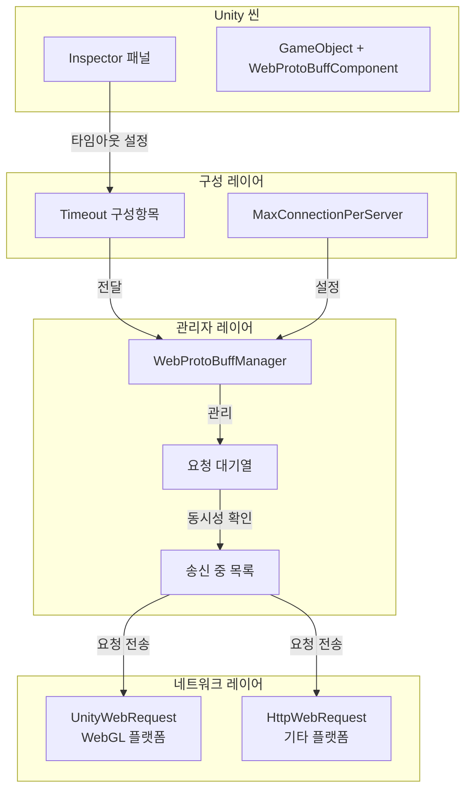

# 컴포넌트 구성

이 문서는 WebProtoBuffComponent 컴포넌트의 각 구성 항목과 사용 방법을 상세히 소개합니다.

## 개요

WebProtoBuffComponent는 GameFrameX 프레임워크에서 Web 요청을 처리하는 핵심 컴포넌트로, HTTP POST 요청을 지원하며 Protocol Buffer를 사용하여 메시지를 직렬화합니다. 이 컴포넌트는 GameFrameworkComponent를 상속하며 Unity 컴포넌트로 씬에 추가할 수 있으며, WebProtoBuffManager를 통해 구체적인 네트워크 요청 로직을 구현합니다.

컴포넌트 구성은 주로 두 가지 유형으로 나뉩니다:
1. **런타임 구성** - 코드를 통해 런타임에서 설정합니다
2. **편집기 구성** - Unity Inspector 패널을 통해 편집기에서 구성합니다

## 구성 옵션 상세

### Timeout (타임아웃 시간)

| 속성 | 설명 |
|------|------|
| 유형 | float |
| 기본값 | 5초 |
| 유효 범위 | 0 - 120초 |
| 구성 위치 | Inspector 패널 / 코드 |

**기능 설명:**
Timeout 구성은 네트워크 요청의 타임아웃 시간을 설정하는 데 사용됩니다. 요청이 지정된 시간 내에 완료되지 않으면 시스템이 자동으로 해당 요청을 종료하고超时 오류를 반환합니다. 이는 네트워크 요청이 무한 대기하는 것을 방지하는 데 중요합니다.

**Inspector에서 구성:**

```csharp
// WebComponentInspector.cs의 구성 UI
float timeout = EditorGUILayout.Slider("Timeout", m_Timeout.floatValue, 0f, 120f);
```
> Source: [WebComponentInspector.cs](https://github.com/GameFrameX/com.gameframex.unity.web.protobuff/blob/main/Editor/Inspector/WebComponentInspector.cs#L23)

**코드를 통해 구성:**

```csharp
// 컴포넌트 속성을 통해 타임아웃 시간 설정
var webComponent = gameObject.GetComponent<WebProtoBuffComponent>();
webComponent.Timeout = 10f; // 10초로 설정
```
> Source: [WebProtoBuffComponent.cs](https://github.com/GameFrameX/com.gameframex.unity.web.protobuff/blob/main/Runtime/Web/WebProtoBuffComponent.cs#L67-L71)

**내부 구현:**

```csharp
// WebProtoBuffManager.cs의 타임아웃 설정
public float Timeout
{
    get { return m_Timeout; }
    set
    {
        m_Timeout = value;
        RequestTimeout = TimeSpan.FromSeconds(value);
    }
}
```
> Source: [WebProtoBuffManager.cs](https://github.com/GameFrameX/com.gameframex.unity.web.protobuff/blob/main/Runtime/Web/WebProtoBuffManager.cs#L41-L49)

### MaxConnectionPerServer (최대 연결 수)

| 속성 | 설명 |
|------|------|
| 유형 | int |
| 기본값 | 8 |
| 구성 위치 | 코드 |

**기능 설명:**
MaxConnectionPerServer는 단일 서버에 대한 최대 동시 연결 수를 제어하는 데 사용됩니다. 이 구성은 요청 대기열 처리 전략에 영향을 미치며,已有 연결 수가 이 값보다 작을 때만 대기열에서 새 요청을 가져와서 처리합니다.

**내부 구현:**

```csharp
// 생성자에서 기본값 설정
public WebProtoBuffManager()
{
    MaxConnectionPerServer = 8;
    m_MemoryStream = new MemoryStream();
    Timeout = 5f;
}
```
> Source: [WebProtoBuffManager.cs](https://github.com/GameFrameX/com.gameframex.unity.web.protobuff/blob/main/Runtime/Web/WebProtoBuffManager.cs#L30-L36)

**대기열 처리 로직:**

```csharp
// ProtoBuf 요청 대기열 업데이트 처리
void UpdateProtoBuf(float elapseSeconds, float realElapseSeconds)
{
    lock (m_StringBuilder)
    {
        if (m_SendingProtoBufList.Count < MaxConnectionPerServer)
        {
            if (m_WaitingProtoBufQueue.Count > 0)
            {
                var webProtoBufData = m_WaitingProtoBufQueue.Dequeue();
                MakeProtoBufBytesRequest(webProtoBufData);
                m_SendingProtoBufList.Add(webProtoBufData);
            }
        }
    }
}
```
> Source: [WebProtoBuffManager.ProtoBuf.cs](https://github.com/GameFrameX/com.gameframex.unity.web.protobuff/blob/main/Runtime/Web/WebProtoBuffManager.ProtoBuf.cs#L39-L55)

### Content-Type (내용 유형)

| 속성 | 설명 |
|------|------|
| 유형 | string |
| 값 | application/x-protobuf |
| 구성 위치 | 코드 (고정) |

**기능 설명:**
컴포넌트는 ProtoBuf 메시지 전송을 위해 고정된 내용 유형 `application/x-protobuf`를 사용합니다. 이는 ProtoBuf의 표준 내용 유형으로, 서버가 요청 본문이 Protocol Buffer 형식임을 인식하도록 합니다.

**내부 구현:**

```csharp
// ProtoBuf 내용 유형常量
private const string ProtoBufContentType = "application/x-protobuf";
```
> Source: [WebProtoBuffManager.ProtoBuf.cs](https://github.com/GameFrameX/com.gameframex.unity.web.protobuff/blob/main/Runtime/Web/WebProtoBuffManager.ProtoBuf.cs#L32)

## 구성 아키텍처



## Unity Editor에서 구성

### 컴포넌트 추가

1. Unity 씬에서 빈 GameObject를 생성하거나 기존 GameObject를 선택합니다
2. Inspector 패널에서 **Add Component** 버튼을 클릭합니다
3. "Web ProtoBuff"를 검색하여 선택하여 추가합니다
4. 컴포넌트가 자동으로 의존하는 GameFrameXWebProtoBuffCroppingHelper를 추가합니다

### 타임아웃 시간 구성

컴포넌트 추가 후 Inspector 패널에서 Timeout 슬라이더를 볼 수 있습니다:

```csharp
// 컴포넌트 정의
[DisallowMultipleComponent]
[AddComponentMenu("GameFrameX/Web ProtoBuff")]
[UnityEngine.Scripting.Preserve]
[RequireComponent(typeof(GameFrameXWebProtoBuffCroppingHelper))]
public sealed class WebProtoBuffComponent : GameFrameworkComponent
```
> Source: [WebProtoBuffComponent.cs](https://github.com/GameFrameX/com.gameframex.unity.web.protobuff/blob/main/Runtime/Web/WebProtoBuffComponent.cs#L46-L49)

Inspector의 구성 인터페이스는 런타임에서 동적으로 타임아웃 시간을 수정할 수 있습니다:

```csharp
public override void OnInspectorGUI()
{
    base.OnInspectorGUI();
    serializedObject.Update();

    WebProtoBuffComponent t = (WebProtoBuffComponent)target;
    float timeout = EditorGUILayout.Slider("Timeout", m_Timeout.floatValue, 0f, 120f);
    if (timeout != m_Timeout.floatValue)
    {
        if (EditorApplication.isPlaying)
        {
            t.Timeout = timeout;  // 런타임 동적 수정
        }
        else
        {
            m_Timeout.floatValue = timeout;  // 편집기에서 수정
        }
    }
    // ...
}
```
> Source: [WebComponentInspector.cs](https://github.com/GameFrameX/com.gameframex.unity.web.protobuff/blob/main/Editor/Inspector/WebComponentInspector.cs#L17-L37)

## 런타임 구성 예제

### 코드를 통해 타임아웃 설정

```csharp
using GameFrameX.Web.ProtoBuff.Runtime;

// 컴포넌트 인스턴스 가져오기
var webComponent = gameObject.GetComponent<WebProtoBuffComponent>();

// 타임아웃 시간 설정(초)
webComponent.Timeout = 15f;

// 현재 타임아웃 구성 가져오기
float currentTimeout = webComponent.Timeout;
Debug.Log($"현재 타임아웃 시간: {currentTimeout}초");
```
> Source: [WebProtoBuffComponent.cs](https://github.com/GameFrameX/com.gameframex.unity.web.protobuff/blob/main/Runtime/Web/WebProtoBuffComponent.cs#L67-L71)

### Manager를 통해 직접 구성

```csharp
using GameFrameX.Web.ProtoBuff.Runtime;

// 프레임워크를 통해 관리자 가져오기
var manager = GameFrameworkEntry.GetModule<IWebProtoBuffManager>();

// 타임아웃 시간 설정
manager.Timeout = 30f;

// 관리자 인스턴스 가져오기
var webManager = manager as WebProtoBuffManager;

// 최대 연결 수 설정
webManager.MaxConnectionPerServer = 16;
```
> Source: [WebProtoBuffManager.cs](https://github.com/GameFrameX/com.gameframex.unity.web.protobuff/blob/main/Runtime/Web/WebProtoBuffManager.cs#L41-L54)

## 구성 기본값 요약

| 구성항목 | 유형 | 기본값 | 설명 |
|--------|------|--------|------|
| Timeout | float | 5f | 요청 타임아웃 시간(초) |
| MaxConnectionPerServer | int | 8 | 단일 서버 최대 동시 수 |
| RequestTimeout | TimeSpan | 5초 | 내부에서 사용하는 타임아웃 객체 |
| ContentType | string | application/x-protobuf | 요청 내용 유형 |

## 구성 모범 사례

### 1. 타임아웃 시간 선택

- **짧은 타임아웃(1-5초)**: 실시간성이 높은 게임 조작 요청에 적합합니다
- **중간 타임아웃(5-15초)**: 일반적인 게임 데이터 동기화에 적합합니다
- **긴 타임아웃(15-30초)**: 대용량 파일 다운로드 또는 복잡한 데이터 요청에 적합합니다

### 2. 동시 연결 수 설정

- **낮은 동시성(4-8)**: 모바일 장치 또는 네트워크 환경이 불안정한 경우에 적합합니다
- **중간 동시성(8-16)**: 대부분의 시나리오에 적합합니다
- **높은 동시성(16+)**: 서버 지원이 필요하며高速 네트워크 환경에 적합합니다

### 3. 동적 조정

컴포넌트는 런타임에서 타임아웃 시간을 동적으로 조정하는 것을 지원합니다:

```csharp
public class NetworkConfigManager
{
    private WebProtoBuffComponent _webComponent;

    // 네트워크 상태에 따라 타임아웃 동적 조정
    public void AdjustTimeoutForNetworkCondition(bool isPoorNetwork)
    {
        if (_webComponent == null) return;

        // 네트워크状况가 좋지 않으면 타임아웃 시간 늘리기
        _webComponent.Timeout = isPoorNetwork ? 30f : 10f;
    }
}
```

## 관련 링크

- [빠른 시작](./03.getting-started)
- [기본 예제](./11.basic-example)
- [컴포넌트 아키텍처](./06.architecture)
- [API 참조 - WebProtoBuffComponent](./09.webprotobuffcomponent)
- [API 참조 - IWebProtoBuffManager](./08.iwebprotobuffmanager)
- [컴파일 매크로 정의](./13.compile-defines)