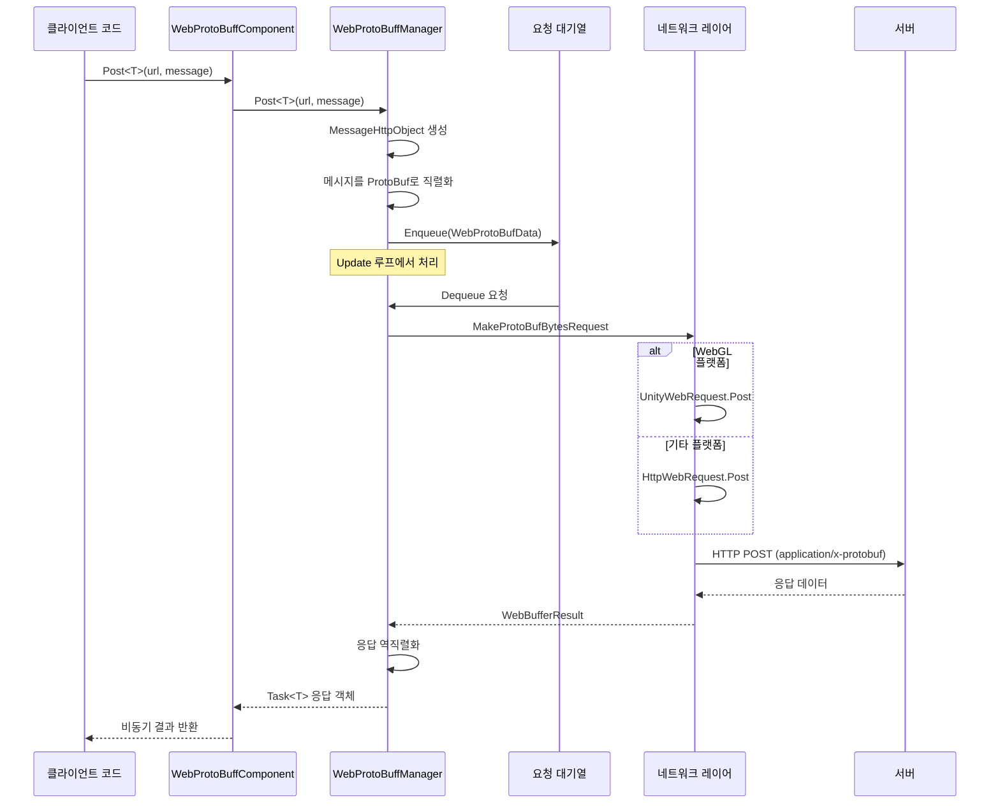

# IWebProtoBuffManager

WebProtoBuffManager 인터페이스는 Web 요청의 Protobuf 네트워크 통신 기능을 정의하며, HTTP POST 요청의 송수신을 지원합니다.

## 개요

`IWebProtoBuffManager`는 GameFrameX Web ProtoBuff 모듈의 핵심 인터페이스로, Protocol Buffer 직렬화 형식의 HTTP 네트워크 요청을 처리합니다. 이 인터페이스는 GameFramework의 모듈 시스템에서 상속하며, 통일된 네트워크 요청 추상화를 제공합니다.

**설계 의도**: 이 인터페이스는底层 네트워크 요청의 복잡성을 캡슐화하여, ProtoBuf 메시지를 보내고 대응 유형의 응답을 수신하기 위한 간결한 제네릭 메서드를 제공합니다. 대기열 관리 메커니즘을 통해 요청의 배치 처리를 구현하며, 동시에 WebGL과 기타 플랫폼의 차별화된 구현을 지원합니다.

## 아키텍처

```mermaid
graph TD
    subgraph Client["클라이언트 레이어"]
        WebProtoBuffComponent["WebProtoBuffComponent<br/>컴포넌트 포장"]
    end

    subgraph Manager["관리 레이어"]
        IWebProtoBuffManager["IWebProtoBuffManager<br/>인터페이스 정의"]
        WebProtoBuffManager["WebProtoBuffManager<br/>구현 클래스"]
    end

    subgraph Data["데이터 레이어"]
        MessageObject["MessageObject<br/>메시지 베이스 클래스"]
        MessageHttpObject["MessageHttpObject<br/>HTTP 메시지 포장"]
        WebProtoBufData["WebProtoBufData<br/>요청 데이터"]
    end

    subgraph Network["네트워크 레이어"]
        Queue["요청 대기열<br/>m_WaitingProtoBufQueue"]
        SendingList["송신 중 목록<br/>m_SendingProtoBufList"]
        UnityWebRequest["UnityWebRequest<br/>WebGL 플랫폼"]
        HttpWebRequest["HttpWebRequest<br/>기타 플랫폼"]
    end

    WebProtoBuffComponent -->|호출| IWebProtoBuffManager
    IWebProtoBuffManager <|--|구현| WebProtoBuffManager
    WebProtoBuffManager -->|직렬화/역직렬화| MessageObject
    WebProtoBuffManager -->|관리| WebProtoBufData
    WebProtoBuffManager -->|대기열| Queue
    WebProtoBuffManager -->|송신| SendingList
    WebProtoBuffManager -->|플랫폼 판단| UnityWebRequest
    WebProtoBuffManager -->|플랫폼 판단| HttpWebRequest
```

### 컴포넌트 설명

| 컴포넌트 | 역할 | 설명 |
|------|------|------|
| WebProtoBuffComponent | 컴포넌트 포장 | Unity 컴포넌트로, IWebProtoBuffManager 접근을 캡슐화합니다 |
| IWebProtoBuffManager | 인터페이스 정의 | Protobuf 네트워크 요청의 핵심 API를 정의합니다 |
| WebProtoBuffManager | 구현 클래스 | 구체적인 구현을 포함하며, 대기열 관리와 플랫폼 어댑터를 포함합니다 |
| MessageObject | 메시지 베이스 클래스 | 모든 Protobuf 메시지의 베이스 유형입니다 |
| MessageHttpObject | HTTP 포장 | 메시지 ID, UniqueId, Body를 포함하는 포장입니다 |

## 핵심 흐름



### 요청 처리 흐름

1. **요청 생성**: 클라이언트가 `Post<T>` 메서드를 호출하여 URL과 메시지 객체를 전달합니다
2. **메시지 포장**: 사용자 메시지를 `MessageHttpObject`로 포장하며, 메시지 ID와 직렬화된 Body를 포함합니다
3. **대기열 관리**: 요청이 대기열에 들어가고, Update 루프가 동시성 제한에 따라 처리합니다
4. **네트워크 송신**: 플랫폼에 따라 `UnityWebRequest`(WebGL) 또는 `HttpWebRequest`(기타 플랫폼)를 선택합니다
5. **응답 처리**: 서버 응답을 수신한 후 대응하는 Protobuf 객체로 역직렬화하여 반환합니다

## 인터페이스 정의

### `Post<T>(string url, MessageObject message): Task<T>`

Protobuf 메시지의 POST 요청을 보내고 지정된 유형의 응답을 수신합니다.

**주의**: 이 메서드는 `ENABLE_GAME_FRAME_X_WEB_PROTOBUF_NETWORK` 매크로가 정의된 경우에만 사용할 수 있습니다.

**매개변수:**
- `url` (string): 대상 서버의 URL 주소입니다
- `message` (MessageObject): 보내려는 Protobuf 메시지 객체로, MessageObject를 상속해야 합니다

**제네릭 매개변수:**
- `T`: 반환 데이터 유형으로, MessageObject를 상속하고 IResponseMessage 인터페이스를 구현해야 합니다

**반환:** `Task<T>` - 비동기 작업으로, 완료 시 서버에서 수신한 응답 데이터를 포함합니다

**구현 코드 예제:**

```csharp
// Runtime/Web/WebProtoBuffManager.ProtoBuf.cs#L178-L201
public async Task<T> Post<T>(string url, MessageObject message) where T : MessageObject, IResponseMessage
{
    DebugSendLog(message);
    var webBufferResult = await PostInner(url, message);
    if (webBufferResult.IsNotNull())
    {
        var messageObjectHttp = SerializerHelper.Deserialize<MessageHttpObject>(webBufferResult.Result);
        if (messageObjectHttp.IsNotNull() && messageObjectHttp.Id != default)
        {
            var messageType = ProtoMessageIdHandler.GetRespTypeById(messageObjectHttp.Id);
            if (messageType != typeof(T))
            {
                Log.Error($"응답 메시지 유형이 유효하지 않습니다. 예상: '{typeof(T).FullName}', 실제: '{messageType.FullName}'.");
                return default;
            }

            var messageObject = SerializerHelper.Deserialize<T>(messageObjectHttp.Body);
            DebugReceiveLog(messageObject);
            return messageObject;
        }
    }

    return default;
}
```
> Source: [WebProtoBuffManager.ProtoBuf.cs](https://github.com/GameFrameX/com.gameframex.unity.web.protobuff/blob/main/Runtime/Web/WebProtoBuffManager.ProtoBuf.cs#L178-L201)

### `Timeout: float`

POST 요청의 타임아웃 시간(초)을 가져오거나 설정합니다.

**속성 유형:** `float`

**기본값:** `5f` (5초)

**설명:** 요청의 타임아웃 시간을 설정하면 실제 `RequestTimeout` 속성이 대응하는 `TimeSpan` 값으로 동기화되어 업데이트됩니다.

**구현 코드 예제:**

```csharp
// Runtime/Web/WebProtoBuffManager.cs#L41-L49
public float Timeout
{
    get { return m_Timeout; }
    set
    {
        m_Timeout = value;
        RequestTimeout = TimeSpan.FromSeconds(value);
    }
}
```
> Source: [WebProtoBuffManager.cs](https://github.com/GameFrameX/com.gameframex.unity.web.protobuff/blob/main/Runtime/Web/WebProtoBuffManager.cs#L41-L49)

## 속성 참조

| 속성 | 유형 | 기본값 | 설명 |
|------|--------|------|------|
| Timeout | float | 5f | 요청 타임아웃 시간(초) |
| MaxConnectionPerServer | int | 8 | 각 서버의 최대 동시 연결 수 |
| RequestTimeout | TimeSpan | 5초 | 실제 요청 타임아웃 시간 객체 |

## 사용 예제

### 기본 사용법

WebProtoBuffComponent를 통해 Protobuf 요청을 보냅니다:

```csharp
// 요청 메시지 정의
public class LoginRequest : MessageObject
{
    public string Username { get; set; }
    public string Password { get; set; }
}

// 응답 메시지 정의
public class LoginResponse : MessageObject, IResponseMessage
{
    public int ErrorCode { get; set; }
    public string Token { get; set; }
}

// 요청 전송
var webComponent = UnityEngine.GameObject.FindObjectOfType<WebProtoBuffComponent>();
var request = new LoginRequest { Username = "user", Password = "pass" };
LoginResponse response = await webComponent.Post<LoginResponse>("http://example.com/api/login", request);
```
> Source: [WebProtoBuffComponent.cs](https://github.com/GameFrameX/com.gameframex.unity.web.protobuff/blob/main/Runtime/Web/WebProtoBuffComponent.cs#L105-L108)

### 타임아웃 설정

```csharp
// 타임아웃 시간을 10초로 설정
var webComponent = UnityEngine.GameObject.FindObjectOfType<WebProtoBuffComponent>();
webComponent.Timeout = 10f;
```

### 동시성 제어

WebProtoBuffManager는 대기열을 사용하여 요청을 관리하며, 기본 최대 동시数は 8입니다:

```csharp
// 관리자를 통해 최대 연결 수 설정
var manager = GameFrameworkEntry.GetModule<IWebProtoBuffManager>();
// MaxConnectionPerServer 속성은 구현 클래스에서 볼 수 있습니다
if (manager is WebProtoBuffManager webManager)
{
    webManager.MaxConnectionPerServer = 16;
}
```

## 플랫폼 차이

### WebGL 플랫폼

WebGL 플랫폼에서 Unity의 `UnityWebRequest`를 사용하여 네트워크 요청을 처리합니다:

```csharp
// Runtime/Web/WebProtoBuffManager.ProtoBuf.cs#L87-L116
UnityEngine.Networking.UnityWebRequest unityWebRequest;
if (webData.IsGet)
{
    unityWebRequest = UnityEngine.Networking.UnityWebRequest.Get(webData.URL);
}
else
{
    unityWebRequest = UnityEngine.Networking.UnityWebRequest.Post(webData.URL, string.Empty);
}

unityWebRequest.timeout = (int)RequestTimeout.TotalSeconds;
unityWebRequest.SetRequestHeader("Content-Type", ProtoBufContentType);
byte[] postData = webData.SendData;
unityWebRequest.uploadHandler = new UnityEngine.Networking.UploadHandlerRaw(postData);
```
> Source: [WebProtoBuffManager.ProtoBuf.cs](https://github.com/GameFrameX/com.gameframex.unity.web.protobuff/blob/main/Runtime/Web/WebProtoBuffManager.ProtoBuf.cs#L87-L116)

### 기타 플랫폼

비 WebGL 플랫폼에서 .NET의 `HttpWebRequest`를 사용합니다:

```csharp
// Runtime/Web/WebProtoBuffManager.ProtoBuf.cs#L118-L164
HttpWebRequest request = WebRequest.CreateHttp(webData.URL);
request.Method = webData.IsGet ? WebRequestMethods.Http.Get : WebRequestMethods.Http.Post;
request.Timeout = (int)RequestTimeout.TotalMilliseconds;
request.ContentType = ProtoBufContentType;
byte[] postData = webData.SendData;
request.ContentLength = postData.Length;
using (Stream requestStream = request.GetRequestStream())
{
    await requestStream.WriteAsync(postData, 0, postData.Length);
}
```
> Source: [WebProtoBuffManager.ProtoBuf.cs](https://github.com/GameFrameX/com.gameframex.unity.web.protobuff/blob/main/Runtime/Web/WebProtoBuffManager.ProtoBuf.cs#L118-L164)

## 컴파일 매크로 정의

`Post<T>` 메서드를 사용하려면 다음 컴파일 매크로를 정의해야 합니다:

| 매크로 이름 | 설명 |
|--------|------|
| ENABLE_GAME_FRAME_X_WEB_PROTOBUF_NETWORK | Protobuf 네트워크 기능 활성화 |

Unity의 **Player Settings** → **Scripting Define Symbols**에서 해당 매크로 정의를 추가하면 완전한 Protobuf 네트워크 기능을 사용할 수 있습니다.

## 관련 링크

- [WebProtoBuffComponent](./09.webprotobuffcomponent) - Unity 컴포넌트 포장
- [컴포넌트 구성](./07.component-config) - 구성 옵션 설명
- [컴파일 매크로 정의](./13.compile-defines) - 매크로 정의 상세 설명
- [빠른 시작](./03.getting-started) - 빠르게 시작하기 가이드