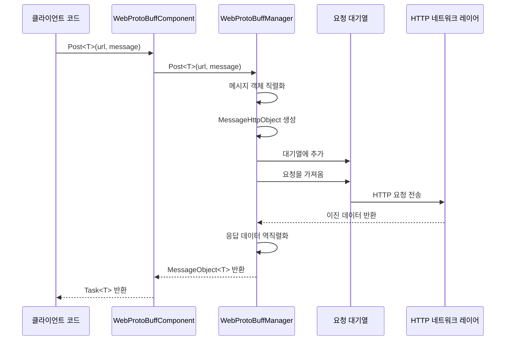
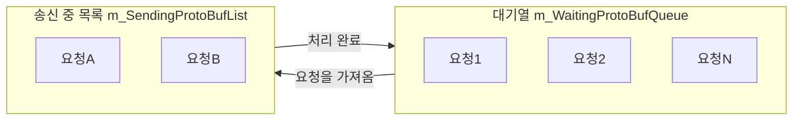

# WebProtoBuffComponent

WebProtoBuffComponent는 GameFrameX 프레임워크의 네트워크 요청 컴포넌트로, Protocol Buffer (ProtoBuf) 기반의 HTTP POST 요청을 처리합니다. 완전한 ProtoBuf 메시지 직렬화/역직렬화 기능을 제공하며 비동기 요청 처리와 타임아웃 제어를 지원합니다.

## 개요

WebProtoBuffComponent는 GameFrameworkComponent를 상속하며, Unity Game Framework에서 ProtoBuf 네트워크 통신을 처리하는 핵심 컴포넌트입니다. 이 컴포넌트는 HTTP 요청의底层 구현을 캡슐화하여 간결한 `Post<T>` 메서드를 제공하여 ProtoBuf 형식의 요청을 보내고 응답을 수신합니다.

**주요 책임:**
- ProtoBuf 네트워크 요청의 수명 주기 관리
- 요청 메시지의 직렬화와 응답 메시지의 역직렬화 처리
- 비동기 요청 처리 능력 제공
- 요청 타임아웃 시간 제어

**사용 시나리오:**
- 백엔드 서버와 ProtoBuf 형식의 데이터 교환
- 효율적인 직렬화/역직렬화가 필요한 네트워크 통신
- Unity WebGL 플랫폼의 네트워크 요청

## 아키텍처

```mermaid
flowchart TD
    subgraph Client["클라이언트 레이어"]
        GameObject[Unity GameObject]
    end

    subgraph Component["컴포넌트 레이어"]
        WebProtoBuff[WebProtoBuffComponent]
    end

    subgraph Manager["관리 레이어"]
        IWebProtoBuff[IWebProtoBuffManager]
        WebProtoBuffMgr[WebProtoBuffManager]
    end

    subgraph Data["데이터 레이어"]
        MessageObject[MessageObject]
        IResponse[IResponseMessage]
        WebProtoBufData[WebProtoBufData]
    end

    subgraph Network["네트워크 레이어"]
        UnityWeb[UnityWebRequest<br/>WebGL 플랫폼]
        HttpWeb[HttpWebRequest<br/>기타 플랫폼]
    end

    GameObject --> WebProtoBuff
    WebProtoBuff --> IWebProtoBuff
    IWebProtoBuff <|.. WebProtoBuffMgr
    WebProtoBuffMgr --> MessageObject
    WebProtoBuffMgr --> IResponse
    WebProtoBuffMgr --> WebProtoBufData
    WebProtoBufData --> UnityWeb
    WebProtoBufData --> HttpWeb
```

**아키텍처 설명:**
- **컴포넌트 레이어(WebProtoBuffComponent)**: Unity 컴포넌트로, 관리자를 초기화하고公共 API를 노출합니다
- **관리 레이어(IWebProtoBuffManager/WebProtoBuffManager)**: 요청의 대기열 관리, 직렬화/역직렬화 처리를 구현합니다
- **데이터 레이어**: 요청과 응답의 데이터 구조를 정의합니다
- **네트워크 레이어**: 플랫폼에 따라 다른 HTTP 요청 구현(WebGL은 UnityWebRequest, 기타 플랫폼은 HttpWebRequest)을 선택합니다

## 핵심 흐름



**흐름 설명:**
1. 클라이언트가 `Post<T>` 메서드를 호출하여 요청을发起합니다
2. 컴포넌트가 요청을 관리자에게 전달합니다
3. 관리자가 메시지 객체를 ProtoBuf 형식으로 직렬화합니다
4. HTTP 포장 객체를 생성하여 요청 대기열에 추가합니다
5. Update 루프가 대기열에서 요청을 가져와서 보냅니다
6. 응답을 수신한 후 역직렬화합니다
7. 제네릭 유형의 메시지 객체를 반환합니다

## API 참조

### 속성

#### `Timeout`

```csharp
public float Timeout { get; set; }
```

요청 타임아웃 시간(초)을 가져오거나 설정합니다. 요청이 이 시간 내에 완료되지 않으면 자동으로 종료됩니다.

**기본값:** 5f

**예시:**
```csharp
var component = gameObject.GetComponent<WebProtoBuffComponent>();
component.Timeout = 10f; // 10초 타임아웃 설정
```

> Source: [WebProtoBuffComponent.cs](https://github.com/GameFrameX/com.gameframex.unity.web.protobuff/blob/main/Runtime/Web/WebProtoBuffComponent.cs#L67-L71)

---

### 메서드

#### `Post<T>`

```csharp
public Task<T> Post<T>(string url, GameFrameX.Network.Runtime.MessageObject message)
    where T : GameFrameX.Network.Runtime.MessageObject, GameFrameX.Network.Runtime.IResponseMessage
```

POST 요청을 보내 Protocol Buffer 메시지를 송수신합니다.

**매개변수:**
- `url` (string): 대상 서버의 URL 주소입니다
- `message` (MessageObject): 보낼 Protocol Buffer 메시지 객체로, MessageObject를 상속해야 합니다

**반환:** `Task<T>` - 비동기 작업으로, 완료 시 서버에서 수신한 ProtoBuf 응답 데이터를 포함합니다

**유형 매개변수:**
- `T`: 반환 데이터 유형으로, MessageObject를 상속하고 IResponseMessage 인터페이스를 구현해야 합니다

**사용 조건:** `ENABLE_GAME_FRAME_X_WEB_PROTOBUF_NETWORK` 매크로 정의가 활성화된 경우에만 사용할 수 있습니다

**예시:**
```csharp
// 요청 메시지 정의
[ProtoContract]
public class LoginRequest : MessageObject
{
    [ProtoMember(1)]
    public string Username { get; set; }

    [ProtoMember(2)]
    public string Password { get; set; }
}

// 응답 메시지 정의
[ProtoContract]
public class LoginResponse : MessageObject, IResponseMessage
{
    [ProtoMember(1)]
    public bool Success { get; set; }

    [ProtoMember(2)]
    public string Token { get; set; }
}

// 요청 전송
var request = new LoginRequest
{
    Username = "user",
    Password = "password"
};

var response = await webComponent.Post<LoginResponse>("http://api.example.com/login", request);
if (response?.Success == true)
{
    Debug.Log($"로그인 성공, Token: {response.Token}");
}
```

> Source: [WebProtoBuffComponent.cs](https://github.com/GameFrameX/com.gameframex.unity.web.protobuff/blob/main/Runtime/Web/WebProtoBuffComponent.cs#L105-L108)

---

### 내부 메서드

#### `Awake`

```csharp
protected override void Awake()
```

컴포넌트 초기화 메서드입니다. 게임 객체가 로드될 때 호출되며, Web 관리자를 초기화하고 타임아웃 시간을 설정합니다.

> Source: [WebProtoBuffComponent.cs](https://github.com/GameFrameX/com.gameframex.unity.web.protobuff/blob/main/Runtime/Web/WebProtoBuffComponent.cs#L77-L90)

---

## 내부 구현 상세

### 요청 대기열 관리

WebProtoBuffManager는 두 개의 대기열을 사용하여 요청을 관리합니다:



- **m_WaitingProtoBufQueue**: 처리 대기 중인 요청을 저장합니다 (초기 용량 256)
- **m_SendingProtoBufList**: 처리 중인 요청을 저장합니다 (초기 용량 16)

**처리 로직:**
```csharp
// 처리 중인 요청 수가 최대 연결 수보다 작으면 대기열에서 요청을 가져옴
if (m_SendingProtoBufList.Count < MaxConnectionPerServer)
{
    if (m_WaitingProtoBufQueue.Count > 0)
    {
        var webProtoBufData = m_WaitingProtoBufQueue.Dequeue();
        MakeProtoBufBytesRequest(webProtoBufData);
        m_SendingProtoBufList.Add(webProtoBufData);
    }
}
```

> Source: [WebProtoBuffManager.ProtoBuf.cs](https://github.com/GameFrameX/com.gameframex.unity.web.protobuff/blob/main/Runtime/Web/WebProtoBuffManager.ProtoBuf.cs#L39-L55)

### 플랫폼 차별화 처리

컴포넌트는 서로 다른 플랫폼에 대해 서로 다른 HTTP 구현을 사용합니다:

| 플랫폼 | HTTP 구현 | 특징 |
|------|-----------|------|
| WebGL | UnityWebRequest | 브라우저 보안 제한으로, Unity의 비동기 API를 사용합니다 |
| 기타 플랫폼 | HttpWebRequest | 완전한 .NET HttpWebRequest 지원 |

**WebGL 구현:**
```csharp
#if UNITY_WEBGL
UnityEngine.Networking.UnityWebRequest unityWebRequest = UnityEngine.Networking.UnityWebRequest.Post(url, string.Empty);
unityWebRequest.timeout = (int)RequestTimeout.TotalSeconds;
unityWebRequest.SetRequestHeader("Content-Type", ProtoBufContentType);
byte[] postData = webData.SendData;
unityWebRequest.uploadHandler = new UnityEngine.Networking.UploadHandlerRaw(postData);
```

> Source: [WebProtoBuffManager.ProtoBuf.cs](https://github.com/GameFrameX/com.gameframex.unity.web.protobuff/blob/main/Runtime/Web/WebProtoBuffManager.ProtoBuf.cs#L87-L116)

### ProtoBuf 직렬화 흐름

1. 클라이언트가 MessageObject를 전달합니다
2. ProtoMessageIdHandler를 통해 메시지 ID를 가져옵니다
3. MessageHttpObject 포장 객체를 생성합니다 (ID, UniqueId, Body 포함)
4. SerializerHelper를 사용하여 전체 객체를 바이트 배열로 직렬화합니다
5. HTTP 요청을 보냅니다

**응답 처리:**
1. 서버 반환 이진 데이터를 수신합니다
2. MessageHttpObject로 역직렬화합니다
3. 메시지 ID가 예상 유형과 일치하는지 검증합니다
4. Body를 대상 유형 T로 역직렬화합니다

> Source: [WebProtoBuffManager.ProtoBuf.cs](https://github.com/GameFrameX/com.gameframex.unity.web.protobuff/blob/main/Runtime/Web/WebProtoBuffManager.ProtoBuf.cs#L178-L201)

---

## 관련 링크

- [IWebProtoBuffManager](./08.iwebprotobuffmanager) - Web ProtoBuff 관리자 인터페이스
- [컴포넌트 구성](./07.component-config) - WebProtoBuffComponent 구성 설명
- [컴파일 매크로 정의](./13.compile-defines) - ENABLE_GAME_FRAME_X_WEB_PROTOBUF_NETWORK 매크로 정의 설명
- [플랫폼 설명](./12.platform-info) - 플랫폼 지원 설명
- [빠른 시작](./03.getting-started) - 빠르게 사용 시작하기