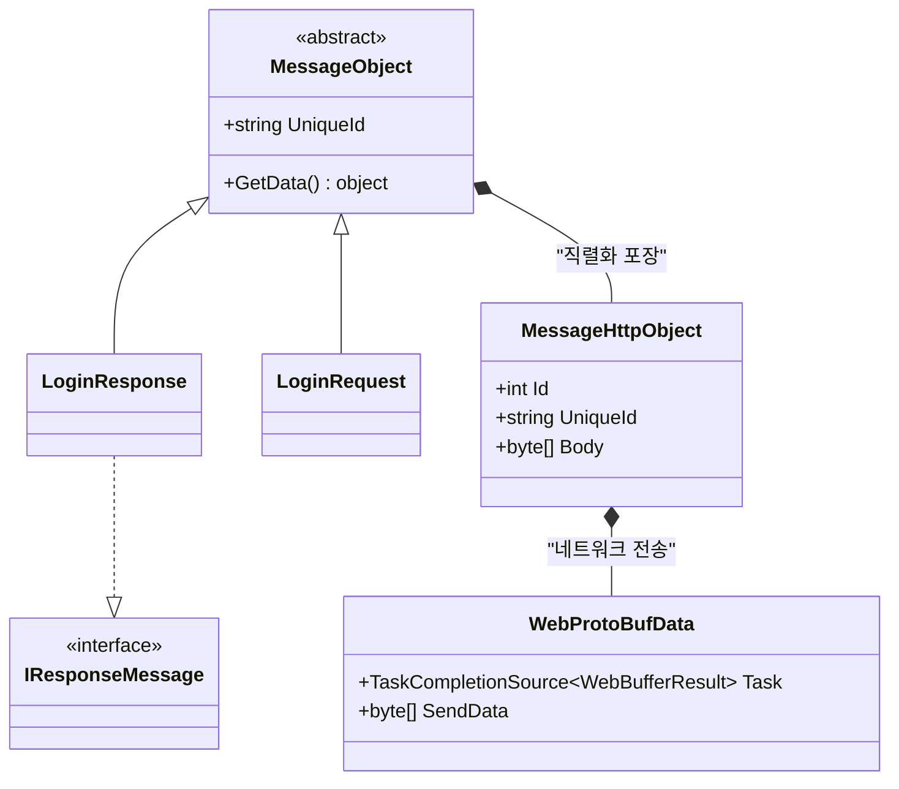
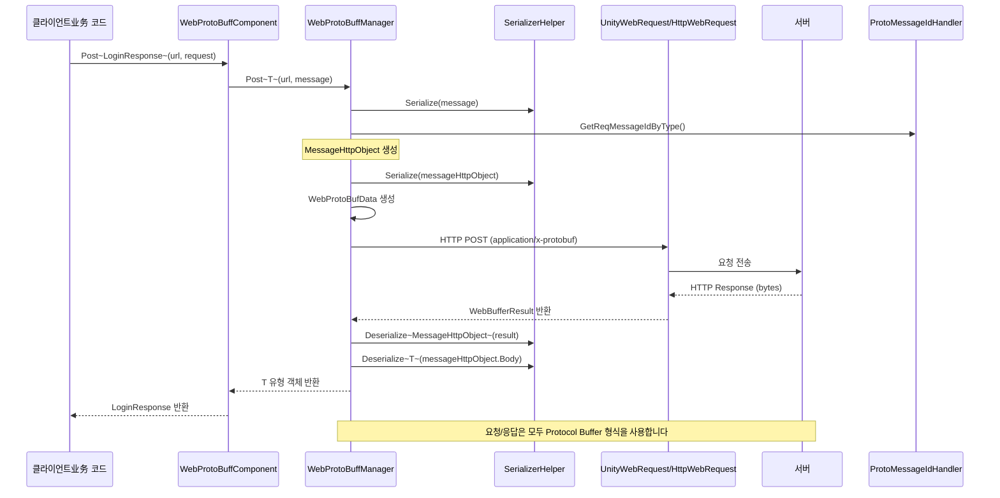

# 메시지 정의

이 문서는 GameFrameX Web ProtoBuff 플러그인의 메시지 정의 메커니즘을 소개하며, 메시지 베이스 클래스, HTTP 메시지 포장 및 Protocol Buffer 메시지의 구조 정의를 포함합니다.

## 개요

Web ProtoBuff 플러그인은 **protobuf-net** 라이브러리를 기반으로 Protocol Buffer 메시지의 직렬화와 역직렬화를 구현합니다. 메시지 시스템은分层 설계를 채택합니다:

- **베이스 레이어**: `MessageObject` - 모든 메시지의 베이스 클래스입니다
- **전송 레이어**: `MessageHttpObject` - HTTP 전송을 위한 메시지 포장기입니다
- **응용 레이어**: 사용자 정의业务 메시지 클래스입니다

이러한 설계는业务 로직과 네트워크 전송의 분리を実現하여 개발자가业务 메시지 정의에만 집중할 수 있게 하며底层 네트워크 통신 세부 사항을 처리할 필요가 없습니다.

## 메시지 아키텍처



### 핵심 컴포넌트 설명

| 컴포넌트 | 네임스페이스 | 설명 |
|------|----------|------|
| `MessageObject` | GameFrameX.Network.Runtime | 모든 ProtoBuf 메시지의 추상 베이스 클래스입니다 |
| `IResponseMessage` | GameFrameX.Network.Runtime | 응답 메시지 인터페이스로, 메시지 유형이 응답임을 나타냅니다 |
| `MessageHttpObject` | GameFrameX.Network.Runtime | HTTP 전송 포장기로, 메시지 ID와 메시지 본문을 포함합니다 |
| `WebProtoBufData` | GameFrameX.Web.ProtoBuff.Runtime | 내부 요청 데이터 클래스로, 요청 대기열을 관리합니다 |

## 메시지 직렬화 흐름



### 흐름 설명

1. **메시지 생성**: 클라이언트가 `MessageObject`를 상속하는 요청 메시지 객체를 생성합니다
2. **메시지 포장**:业务 메시지를 바이트 배열로 직렬화하여 `MessageHttpObject`에 포장합니다
3. **메시지 ID**: `ProtoMessageIdHandler`를 통해 메시지 유형에 대응하는 고유 ID를 가져옵니다
4. **네트워크 전송**: HTTP POST 메서드를 사용하며, Content-Type을 `application/x-protobuf`로 설정합니다
5. **응답 처리**: 서버가 반환한 데이터는 먼저 `MessageHttpObject`로 역직렬화한 후, 다시业务 응답 메시지로 역직렬화합니다

## 메시지 정의 예제

### 요청 메시지 정의

요청 메시지는 `MessageObject` 베이스 클래스를 상속해야 하며, `ProtoContract`와 `ProtoMember` 속성으로 표시해야 합니다:

```csharp
using ProtoBuf;
using GameFrameX.Network.Runtime;

[ProtoContract]
public class LoginRequest : MessageObject
{
    [ProtoMember(1)]
    public string Username { get; set; }

    [ProtoMember(2)]
    public string Password { get; set; }

    [ProtoMember(3)]
    public string DeviceId { get; set; }
}
```
> Source: [README.md](https://github.com/GameFrameX/com.gameframex.unity.web.protobuff/blob/main/README.md#L66-L77)

### 응답 메시지 정의

응답 메시지는 `MessageObject`를 상속하는 동시에 `IResponseMessage` 인터페이스도 구현해야 합니다:

```csharp
using ProtoBuf;
using GameFrameX.Network.Runtime;

[ProtoContract]
public class LoginResponse : MessageObject, IResponseMessage
{
    [ProtoMember(1)]
    public bool Success { get; set; }

    [ProtoMember(2)]
    public string Token { get; set; }

    [ProtoMember(3)]
    public string Message { get; set; }
}
```
> Source: [README.md](https://github.com/GameFrameX/com.gameframex.unity.web.protobuff/blob/main/README.md#L79-L88)

### 완전 사용 예제

```csharp
using UnityEngine;
using GameFrameX.Web.ProtoBuff.Runtime;

public class LoginController : MonoBehaviour
{
    public WebProtoBuffComponent WebComponent;

    private async void Start()
    {
        var request = new LoginRequest
        {
            Username = "user",
            Password = "password"
        };

        string url = "http://api.example.com/login";

        try
        {
            // 요청을 보내고 결과를 기다립니다
            LoginResponse response = await WebComponent.Post<LoginResponse>(url, request);

            if (response != null)
            {
                Debug.Log($"로그인 결과: {response.Success}, Token: {response.Token}");
            }
        }
        catch (System.Exception e)
        {
            Debug.LogError($"요청 실패: {e.Message}");
        }
    }
}
```
> Source: [README.md](https://github.com/GameFrameX/com.gameframex.unity.web.protobuff/blob/main/README.md#L98-L127)

## ProtoBuf 속성 설명

### 자주 사용되는 속성

| 속성 | 역할 | 주의사항 |
|------|------|----------|
| `[ProtoContract]` | 클래스를 ProtoBuf 직렬화 대상으로 표시합니다 | 클래스 선언 위에 반드시 추가해야 합니다 |
| `[ProtoMember(n)]` | 속성을 직렬화 구성원으로 표시하며, n은 필드 번호입니다 | 번호는 클래스 내에서 고유해야 하며, 1부터 시작하여 연속적으로编号하는 것을 권장합니다 |
| `[ProtoIgnore]` | 속성이 직렬화에 참여하지 않음을 표시합니다 | 네트워크 전송이 필요하지 않은 속성에 사용합니다 |

### 메시지 설계 원칙

1. **필드 번호 고유성**: 각 `[ProtoMember]`의 번호는 클래스 내에서 고유해야 합니다
2. **번호 연속성**: 1부터 시작하여 연속적으로编号하면 확장성이 좋아집니다
3. **유형 호환성**: 필드 유형 변경 후에도 후방 호환성을 유지해야 합니다
4. **명명 규범**: 속성은 PascalCase로 명명하며 ProtoBuf가 자동으로 변환합니다

## HTTP 메시지 포장

`MessageHttpObject`는 HTTP 전송을 위한 메시지 포장 클래스로, 구조는 다음과 같습니다:

```csharp
public class MessageHttpObject
{
    /// <summary>
    /// 메시지 유형 ID로, 메시지 종류를 식별하는 데 사용됩니다
    /// </summary>
    public int Id { get; set; }

    /// <summary>
    /// 메시지 고유 식별자로, 요청/응답 매칭에 사용됩니다
    /// </summary>
    public string UniqueId { get; set; }

    /// <summary>
    /// 메시지 본문 바이트 배열로, 실제業務 데이터를 포함합니다
    /// </summary>
    public byte[] Body { get; set; }
}
```

요청을 보낼 때 플러그인은 다음 직렬화 단계를 실행합니다:

```csharp
// WebProtoBuffManager.ProtoBuf.cs에서 가져옴
var id = ProtoMessageIdHandler.GetReqMessageIdByType(message.GetType());
MessageHttpObject messageHttpObject = new MessageHttpObject
{
    Id = id,
    UniqueId = message.UniqueId,
    Body = SerializerHelper.Serialize(message),
};
var sendData = SerializerHelper.Serialize(messageHttpObject);
```
> Source: [Runtime/Web/WebProtoBuffManager.ProtoBuf.cs#L214-L221](https://github.com/GameFrameX/com.gameframex.unity.web.protobuff/blob/main/Runtime/Web/WebProtoBuffManager.ProtoBuf.cs#L214-L221)

## 관련 링크

- [컴포넌트 아키텍처](./06.architecture) - WebProtoBuffComponent의 아키텍처 설계 이해
- [빠른 시작](./03.getting-started) - Web ProtoBuff 컴포넌트 사용 시작
- [API 참조 - WebProtoBuffComponent](./09.webprotobuffcomponent) - 컴포넌트 완전한 API 문서
- [API 참조 - IWebProtoBuffManager](./08.iwebprotobuffmanager) - 관리자 인터페이스 문서
- [컴파일 매크로 정의](./13.compile-defines) - ProtoBuf 네트워크 기능을 활성화하는 방법