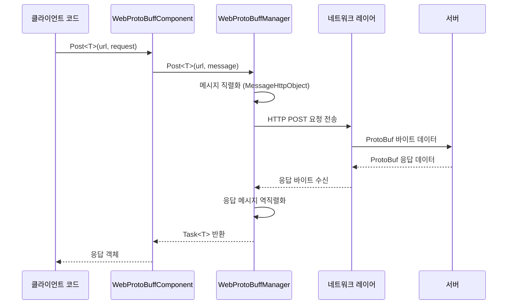

# 기본 예제

이 섹션은 Web ProtoBuff 플러그인의 기본 사용 예제를 제공하여 개발자가 빠르게 시작하고 핵심 사용법을 이해할 수 있도록 돕습니다.

## 개요

Web ProtoBuff 컴포넌트는 GameFrameX 프레임워크의 네트워크 요청 모듈로, Protocol Buffer 형식의 HTTP POST 요청을 처리합니다. 이 컴포넌트는 다음과 같은 핵심 기능을 제공합니다:

- **ProtoBuf 직렬화**: 메시지 객체를 바이트 데이터로 자동 직렬화하여 보냅니다
- **비동기 요청**: Task<T> 기반 비동기 API로, async/await 모드를 지원합니다
- **크로스 플랫폼 지원**: Unity WebGL 및 네이티브 플랫폼 호환
- **타임아웃 제어**: 요청 타임아웃 시간 구성 가능

## 빠른 흐름

다음 흐름도는 WebProtoBuffComponent를 사용하여 요청을 보내는 기본 흐름을 보여줍니다:



## 메시지 정의 예제

Web ProtoBuff를 사용하기 전에 요청과 응답의 ProtoBuf 메시지 유형을 정의해야 합니다.

### 요청 메시지 정의

```csharp
using ProtoBuf;
using GameFrameX.Network.Runtime;

[ProtoContract]
public class LoginRequest : MessageObject
{
    [ProtoMember(1)]
    public string Username { get; set; }

    [ProtoMember(2)]
    public string Password { get; set; }
}
```
> Source: [README.md](https://github.com/GameFrameX/com.gameframex.unity.web.protobuff/blob/main/README.md#L65-L77)

### 응답 메시지 정의

```csharp
using ProtoBuf;
using GameFrameX.Network.Runtime;

[ProtoContract]
public class LoginResponse : MessageObject, IResponseMessage
{
    [ProtoMember(1)]
    public bool Success { get; set; }

    [ProtoMember(2)]
    public string Token { get; set; }
}
```
> Source: [README.md](https://github.com/GameFrameX/com.gameframex.unity.web.protobuff/blob/main/README.md#L79-L88)

**핵심 포인트:**
- `[ProtoContract]` 속성을 사용하여 클래스를 ProtoBuf 계약으로 표시합니다
- `[ProtoMember(N)]` 속성을 사용하여 직렬화할 속성을 표시합니다
- 요청 메시지는 `MessageObject`만 상속하면 됩니다
- 응답 메시지는 `MessageObject`를 상속하고 `IResponseMessage` 인터페이스도 구현해야 합니다

## 요청 전송 예제

### 완전 사용 예제

다음은 Unity 스크립트에서 WebProtoBuffComponent를 사용하여 로그인 요청을 보내는 완전한 예제입니다:

```csharp
using UnityEngine;
using GameFrameX.Web.ProtoBuff.Runtime;

public class LoginController : MonoBehaviour
{
    public WebProtoBuffComponent WebComponent;

    private async void Start()
    {
        var request = new LoginRequest
        {
            Username = "user",
            Password = "password"
        };

        string url = "http://api.example.com/login";

        try
        {
            // 요청을 보내고 결과를 기다립니다
            LoginResponse response = await WebComponent.Post<LoginResponse>(url, request);

            if (response != null)
            {
                Debug.Log($"로그인 결과: {response.Success}, Token: {response.Token}");
            }
        }
        catch (System.Exception e)
        {
            Debug.LogError($"요청 실패: {e.Message}");
        }
    }
}
```
> Source: [README.md](https://github.com/GameFrameX/com.gameframex.unity.web.protobuff/blob/main/README.md#L94-L128)

### 컴포넌트 인스턴스 가져오기

Unity 씬에서 WebProtoBuffComponent는 게임 프레임워크 컴포넌트로 사용됩니다. 일반적으로 다음 방식으로 인스턴스를 가져옵니다:

```csharp
// 방식 1: 씬의 컴포넌트 참조를 통해 (Inspector에서 구성 필요)
public WebProtoBuffComponent webProtoBuffComponent;

// 방식 2: 프레임워크를 통해 가져오기
var webComponent = UnityGameFramework.Runtime.GameEntry.GetComponent<WebProtoBuffComponent>();
```

### 타임아웃 설정

컴포넌트의 Timeout 속성을 통해 요청 타임아웃 시간(초)을 설정할 수 있습니다:

```csharp
// 타임아웃을 10초로 설정
webProtoBuffComponent.Timeout = 10f;
```
> Source: [WebProtoBuffComponent.cs](https://github.com/GameFrameX/com.gameframex.unity.web.protobuff/blob/main/Runtime/Web/WebProtoBuffComponent.cs#L67-L71)

## 기능 활성화

### 컴파일 매크로 정의

ProtoBuff 네트워크 기능을 사용하려면 Unity에서 컴파일 매크로를 활성화해야 합니다. **Edit > Project Settings > Player**를 열고, **Scripting Define Symbols**에 다음을 추가합니다:

```
ENABLE_GAME_FRAME_X_WEB_PROTOBUF_NETWORK
```

> **주의**: 이 매크로 정의는 선택 사항입니다. 매크로를 추가하지 않으면 Post<T> 메서드가 비활성화되고 컴포넌트는 기본 기능만 유지합니다.

이 매크로 정의는 프로젝트가 `com.gameframex.unity.network` 패키지에 의존할 때 어셈블리 정의 파일을 통해 자동으로도 정의될 수 있습니다.

## 데이터 형식 설명

### 요청 데이터 형식

보내는 요청 데이터는 `MessageHttpObject` 포장 형식을 사용합니다:

```csharp
MessageHttpObject messageHttpObject = new MessageHttpObject
{
    Id = messageId,           // 메시지 유형 식별자
    UniqueId = uniqueId,      // 고유 요청 식별자
    Body = serializedBody    // 직렬화된 메시지 본문
};
```
> Source: [WebProtoBuffManager.ProtoBuf.cs](https://github.com/GameFrameX/com.gameframex.unity.web.protobuff/blob/main/Runtime/Web/WebProtoBuffManager.ProtoBuf.cs#L214-L221)

### HTTP 요청 헤더

- **Content-Type**: `application/x-protobuf`
- **요청 메서드**: POST
- **타임아웃 제어**: RequestTimeout 속성을 통해 설정합니다

## 오류 처리

실제 응용에서 다음 일반적인 오류를 처리해야 합니다:

```csharp
try
{
    var response = await WebComponent.Post<LoginResponse>(url, request);

    if (response == null)
    {
        Debug.LogWarning("응답이 null입니다 - 서버에 연결할 수 없을 수 있습니다");
        return;
    }

    //业务 로직 처리
}
catch (TimeoutException e)
{
    Debug.LogError($"요청 타임아웃: {e.Message}");
}
catch (WebException e)
{
    Debug.LogError($"네트워크 오류: {e.Status} - {e.Message}");
}
catch (System.Exception e)
{
    Debug.LogError($"예상치 못한 오류: {e.Message}");
}
```

## 디버깅 로그

플러그인은 메시지 송수신에 대한 디버깅 로그 기능을 제공하여 개발 디버깅을 지원합니다:

- **송신 로그 활성화**: `ENABLE_GAMEFRAMEX_WEB_SEND_LOG` 매크로 정의
- **수신 로그 활성화**: `ENABLE_GAMEFRAMEX_WEB_RECEIVE_LOG` 매크로 정의

로그 출력 형식 예시:
```
메시지 전송 ID:[1001,uuid123,LoginRequest] 메시지 내용:{...}
메시지 수신 ID:[1001,uuid123,LoginResponse] 메시지 내용:{...}
```
> Source: [WebProtoBuffManager.ProtoBuf.cs](https://github.com/GameFrameX/com.gameframex.unity.web.protobuff/blob/main/Runtime/Web/WebProtoBuffManager.ProtoBuf.cs#L227-L241)

## 관련 링크

- [빠른 시작](./03.getting-started) - 빠른 시작 단계 이해
- [컴포넌트 아키텍처](./06.architecture) - 아키텍처 설계 심층 이해
- [메시지 정의](./10.message-definition) - ProtoBuf 메시지 상세
- [API 참조 - WebProtoBuffComponent](./09.webprotobuffcomponent) - 완전한 API 문서
- [컴파일 매크로 정의](./13.compile-defines) - 컴파일 옵션 구성