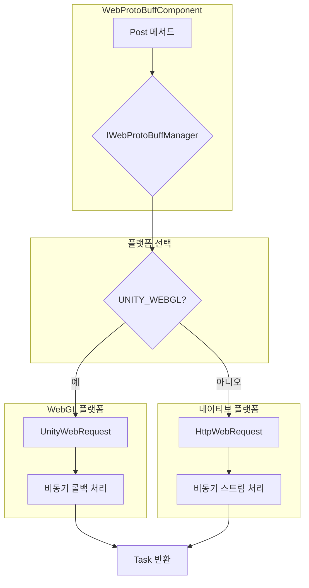

# 플랫폼 설명

이 문서는 GameFrameX Web ProtoBuff 컴포넌트의 다양한 Unity 플랫폼에서의 지원 상황, 플랫폼별 구현 차이 및 각 플랫폼의 구성 요구사항을 상세히 소개합니다.

## 개요

GameFrameX Web ProtoBuff 컴포넌트는 여러 Unity 플랫폼에서 원활하게 실행되도록 설계된 크로스 플랫폼 HTTP 네트워크 요청 컴포넌트입니다. 이 컴포넌트는 대상 플랫폼에 따라 가장 적합한 네트워크 요청 구현 방식을 자동으로 선택합니다.

컴포넌트의 핵심 설계 철학은 통일된 API 인터페이스를 제공하는 동시에 각 플랫폼의 네이티브 네트워크 능력을 활용하여 최상의 성능과 호환성을 달성하는 것입니다.

## 지원 플랫폼

이 컴포넌트는 다음 Unity 플랫폼을 지원합니다:

| 플랫폼 | 지원 상태 | 네트워크 구현 방식 | 설명 |
|------|---------|-------------|------|
| **WebGL** | 완전히 지원 | UnityWebRequest | 브라우저 환경 전용 구현 |
| **Windows** | 완전히 지원 | HttpWebRequest | .NET 표준 HTTP 클라이언트 |
| **macOS** | 완전히 지원 | HttpWebRequest | .NET 표준 HTTP 클라이언트 |
| **Linux** | 완전히 지원 | HttpWebRequest | .NET 표준 HTTP 클라이언트 |
| **Android** | 완전히 지원 | HttpWebRequest | .NET 표준 HTTP 클라이언트 |
| **iOS** | 완전히 지원 | HttpWebRequest | .NET 표준 HTTP 클라이언트 |
| **Switch** | 완전히 지원 | HttpWebRequest | .NET 표준 HTTP 클라이언트 |
| **PS4/PS5** | 완전히 지원 | HttpWebRequest | .NET 표준 HTTP 클라이언트 |
| **Xbox** | 완전히 지원 | HttpWebRequest | .NET 표준 HTTP 클라이언트 |

## 플랫폼 아키텍처

컴포넌트는 조건부 컴파일 방식을 사용하여 크로스 플랫폼을 지원하며, `UNITY_WEBGL` 매크로를 통해 WebGL 플랫폼과 기타 플랫폼을 구분합니다.



### 플랫폼 선택 로직 설명

컴포넌트는 런타임 시 컴파일기의 조건부 컴파일 지시문을 통해 적합한 네트워크 구현을 선택합니다:

- **WebGL 플랫폼**: Unity가 제공하는 `UnityEngine.Networking.UnityWebRequest`를 사용하며, 이는 WebGL 환경에서 유일하게 사용 가능한 HTTP 요청 방식입니다
- **기타 모든 플랫폼**: `System.Net.HttpWebRequest`를 사용하며, 이는 .NET 표준 HTTP 요청 구현입니다

## 플랫폼별 구현 차이

### WebGL 플랫폼 구현

WebGL 플랫폼의 구현은 `Runtime/Web/WebProtoBuffManager.ProtoBuf.cs` 파일의 87-116행에 위치합니다. 이 구현은 Unity의 `UnityWebRequest` 클래스를 사용합니다.

```csharp
#if UNITY_WEBGL
    UnityEngine.Networking.UnityWebRequest unityWebRequest;
    if (webData.IsGet)
    {
        unityWebRequest = UnityEngine.Networking.UnityWebRequest.Get(webData.URL);
    }
    else
    {
        unityWebRequest = UnityEngine.Networking.UnityWebRequest.Post(webData.URL, string.Empty);
    }

    unityWebRequest.timeout = (int)RequestTimeout.TotalSeconds;
    {
        unityWebRequest.SetRequestHeader("Content-Type", ProtoBufContentType);
        byte[] postData = webData.SendData;
        unityWebRequest.uploadHandler = new UnityEngine.Networking.UploadHandlerRaw(postData);
    }

    var asyncOperation = unityWebRequest.SendWebRequest();
    asyncOperation.completed += (asyncOperation2) =>
    {
        m_SendingProtoBufList.Remove(webData);
        if (unityWebRequest.isNetworkError || unityWebRequest.isHttpError || unityWebRequest.error != null)
        {
            webData.Task.TrySetException(new Exception(unityWebRequest.error));
            return;
        }

        webData.Task.SetResult(new WebBufferResult(webData.UserData, unityWebRequest.downloadHandler.data));
    };
#endif
```
> Source: [WebProtoBuffManager.ProtoBuf.cs](https://github.com/GameFrameX/com.gameframex.unity.web.protobuff/blob/main/Runtime/Web/WebProtoBuffManager.ProtoBuf.cs#L87-L116)

**WebGL 구현 특징:**
- 콜백 함수를 사용하여 비동기 완료 이벤트를 처리합니다
- `SendWebRequest()` 메서드를 사용하여 요청을 보냅니다
- 오류 감지에 `isNetworkError`, `isHttpError` 및 `error` 속성을 사용합니다
- 내용 유형을 `application/x-protobuf`로 설정합니다

### 네이티브 플랫폼 구현

네이티브 플랫폼의 구현은 같은 파일의 117-165행에 있으며, .NET의 `HttpWebRequest` 클래스를 사용합니다:

```csharp
#else
    try
    {
        HttpWebRequest request = WebRequest.CreateHttp(webData.URL);
        request.Method = webData.IsGet ? WebRequestMethods.Http.Get : WebRequestMethods.Http.Post;
        request.Timeout = (int)RequestTimeout.TotalMilliseconds;
        request.ContentType = ProtoBufContentType;
        byte[] postData = webData.SendData;
        request.ContentLength = postData.Length;
        using (Stream requestStream = request.GetRequestStream())
        {
            await requestStream.WriteAsync(postData, 0, postData.Length);
        }

        using (HttpWebResponse response = (HttpWebResponse)await request.GetResponseAsync())
        {
            using (Stream responseStream = response.GetResponseStream())
            {
                m_MemoryStream.SetLength(response.ContentLength);
                m_MemoryStream.Position = 0;
                await responseStream.CopyToAsync(m_MemoryStream);
                webData.Task.SetResult(new WebBufferResult(webData.UserData, m_MemoryStream.ToArray()));
            }
        }
    }
    catch (WebException e)
    {
        if (e.Status == WebExceptionStatus.Timeout)
        {
            webData.Task.SetException(new TimeoutException(e.Message));
            return;
        }
        webData.Task.SetException(e);
    }
    // ... 더 많은 예외 처리
#endif
```
> Source: [WebProtoBuffManager.ProtoBuf.cs](https://github.com/GameFrameX/com.gameframex.unity.web.protobuff/blob/main/Runtime/Web/WebProtoBuffManager.ProtoBuf.cs#L117-L165)

**네이티브 플랫폼 구현 특징:**
- async/await 모드를 사용하여 비동기 작업을 처리합니다
- 완전한 .NET 예외 처리 메커니즘을 지원합니다
- 타임아웃 예외(TimeoutException)의 전문 처리를 포함합니다
- 메모리 스트림을 사용하여 응답 데이터를 처리합니다

## 내용 유형

어떤 플랫폼에서 실행되든 컴포넌트는 동일한 내용 유형 `application/x-protobuf`를 사용합니다:

```csharp
private const string ProtoBufContentType = "application/x-protobuf";
```
> Source: [WebProtoBuffManager.ProtoBuf.cs](https://github.com/GameFrameX/com.gameframex.unity.web.protobuff/blob/main/Runtime/Web/WebProtoBuffManager.ProtoBuf.cs#L32)

이 내용 유형은 Protocol Buffer의 표준 HTTP 전송 유형으로, 서버가 ProtoBuf 형식의 요청과 응답 데이터를 올바르게 인식하고 처리할 수 있도록 합니다.

## 컴파일 매크로 정의

컴포넌트는 `versionDefines`를 통해 컴파일 매크로를 자동으로 관리합니다:

```json
{
  "versionDefines": [
    {
      "name": "com.gameframex.unity.network",
      "expression": "",
      "define": "ENABLE_GAME_FRAME_X_WEB_PROTOBUF_NETWORK"
    }
  ]
}
```
> Source: [GameFrameX.Web.ProtoBuff.Runtime.asmdef](https://github.com/GameFrameX/com.gameframex.unity.web.protobuff/blob/main/Runtime/GameFrameX.Web.ProtoBuff.Runtime.asmdef#L17-L23)

프로젝트에 `com.gameframex.unity.network` 패키지가 설치되면 시스템이 자동으로 `ENABLE_GAME_FRAME_X_WEB_PROTOBUF_NETWORK` 매크로를 정의하여 ProtoBuff 네트워크 기능을 활성화합니다.

## 플랫폼별 주의사항

### WebGL 플랫폼

1. **브라우저 제한**: WebGL은 브라우저 환경에서 실행되어 브라우저의 동종 원본 정책 (Same-Origin Policy)의 제한을 받습니다
2. **비동기 모드**: WebGL은 멀티스레드를 지원하지 않아 컴포넌트가 콜백 함수 모드를 사용하여 비동기 완료 이벤트를 처리합니다
3. **타임아웃 동작**: UnityWebRequest의 타임아웃 설정은 WebGL 플랫폼에서 브라우저 구현의 제한을 받을 수 있습니다
4. **HTTPS 지원**: WebGL은 HTTPS 프로토콜을 완전히 지원하지만 서버가 유효한 SSL 인증서를 구성해야 합니다

### 네이티브 플랫폼

1. **스레드 안전**: 네이티브 플랫폼은 완전한 멀티스레딩 작업을 지원하며 async/await 모드를 사용합니다
2. **타임아웃 처리**: 더 정밀한 타임아웃 제어를 지원하며, 연결 타임아웃과 읽기 타임아웃을 포함합니다
3. **프록시 지원**: 시스템 프록시를 통한 네트워크 요청을 지원합니다
4. **SSL/TLS**: 완전한 SSL/TLS 프로토콜 스택을 지원합니다

## 의존 항목

각 플랫폼이 공유하는 핵심 의존 항목:

| 의존 패키지 | 버전 | 설명 |
|--------|------|------|
| com.gameframex.unity | 1.1.1 | 핵심 프레임워크 |
| com.gameframex.unity.web | 1.0.0 | Web 기본 컴포넌트 |
| com.gameframex.unity.network | 1.0.0 | 네트워크 모듈 (ProtoBuff 기능 활성화) |
| com.gameframex.unity.google.protobuf | 1.0.0 | Google Protobuf 직렬화 라이브러리 |

> 상세 의존 정보는 [의존 항목](./05.dependencies) 문서를 참조하세요.

## 플랫폼 선택 권장

프로젝트 요구에 따라 적합한 대상 플랫폼을 선택합니다:

| 시나리오 | 권장 플랫폼 | 이유 |
|------|---------|------|
| **웹 게임** | WebGL | 브라우저에서 직접 실행, 플러그인 불필요 |
| **모바일 게임** | Android/iOS | 성능 최상, 완전한 네트워크 기능 |
| **PC 클라이언트** | Windows/macOS/Linux | 개발 디버깅 편리 |
| **콘솔 게임** | PS4/PS5/Xbox/Switch | 상용 콘솔 플랫폼 지원 |

## 관련 링크

- [컴포넌트 구성](./07.component-config)
- [컴파일 매크로 정의](./13.compile-defines)
- [빠른 시작](./03.getting-started)
- [API 참조 - WebProtoBuffComponent](./09.webprotobuffcomponent)
- [API 참조 - IWebProtoBuffManager](./08.iwebprotobuffmanager)
- [GitHub 저장소](https://github.com/GameFrameX/com.gameframex.unity.web.protobuff.git)