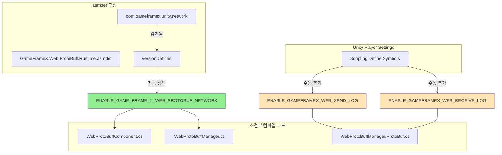

# 컴파일 매크로 정의

컴파일 매크로 정의(Compile Defines)는 코드 컴파일 동작을 제어하는 중요한 메커니즘으로, 전처리기 지시문을 통해 조건부 컴파일을 구현합니다. 이 문서는 Web ProtoBuff 컴포넌트에서 사용하는 모든 컴파일 매크로 정의와 구성 방법을 상세히 소개합니다.

## 개요

Web ProtoBuff 컴포넌트는 컴파일 매크로 정의를 사용하여 기능 모듈의 활성화와 비활성화를 제어합니다. 이러한 설계는 다음 이점을 제공합니다:

- **조건부 컴파일**: 서로 다른 컴파일 환경에 따라 특정 기능을 활성화 또는 비활성화합니다
- **의존 관리**: 버전 정의(versionDefines)를 통해 기능 의존을 자동으로 관리합니다
- **디버깅 지원**: 독립적인 디버깅 로그 스위치를 제공하여 정식 发布 버전에 영향을 주지 않습니다

## 컴파일 매크로 정의 상세

### ENABLE_GAME_FRAME_X_WEB_PROTOBUF_NETWORK

**기능 설명**

이는 Web ProtoBuff 컴포넌트의 핵심 컴파일 매크로 정의로, Protocol Buffer 네트워크 요청 기능의 가용성을 제어합니다. 이 매크로를 활성화하면 컴포넌트가 `Post<T>` 메서드를 노출하여 개발자가 Protocol Buffer 형식의 메시지를 보내고 받을 수 있습니다.

> 이 매크로 정의는 `Runtime/GameFrameX.Web.ProtoBuff.Runtime.asmdef` 파일에서 버전 정의(versionDefines)를 통해 자동으로 관리됩니다:
> Source: [GameFrameX.Web.ProtoBuff.Runtime.asmdef](https://github.com/GameFrameX/com.gameframex.unity.web.protobuff/blob/main/Runtime/GameFrameX.Web.ProtoBuff.Runtime.asmdef#L17-L22)

**의존 조건**

이 매크로의 활성화는 `com.gameframex.unity.network` 패키지의 존재에 의존합니다. 프로젝트에서 GameFrameX Network 런타임 패키지를 참조하면 asmdef가 자동으로 이 매크로를 정의합니다:

```json
"versionDefines": [
    {
      "name": "com.gameframex.unity.network",
      "expression": "",
      "define": "ENABLE_GAME_FRAME_X_WEB_PROTOBUF_NETWORK"
    }
]
```

**영향받는 코드**

다음 코드 조각은 조건부 컴파일 사용 방식을 보여줍니다:

```csharp
// WebProtoBuffComponent.cs
#if ENABLE_GAME_FRAME_X_WEB_PROTOBUF_NETWORK
        /// <summary>
        /// Protocol Buffer 메시지 송수신을 위한 POST 요청을 전송합니다.
        /// 이 메서드는 ENABLE_GAME_FRAME_X_WEB_PROTOBUF_NETWORK 매크로가 활성화된 경우에만 사용할 수 있습니다.
        /// </summary>
        public Task<T> Post<T>(string url, GameFrameX.Network.Runtime.MessageObject message)
            where T : GameFrameX.Network.Runtime.MessageObject, GameFrameX.Network.Runtime.IResponseMessage
        {
            return m_WebProtoBuffManager.Post<T>(url, message);
        }
#endif
```
> Source: [WebProtoBuffComponent.cs](https://github.com/GameFrameX/com.gameframex.unity.web.protobuff/blob/main/Runtime/Web/WebProtoBuffComponent.cs#L92-L109)

```csharp
// IWebProtoBuffManager.cs
#if ENABLE_GAME_FRAME_X_WEB_PROTOBUF_NETWORK
        /// <summary>
        /// Protobuf 메시지의 POST 요청을 전송하고 지정된 유형의 응답을 수신합니다
        /// </summary>
        Task<T> Post<T>(string url, GameFrameX.Network.Runtime.MessageObject message)
            where T : GameFrameX.Network.Runtime.MessageObject, GameFrameX.Network.Runtime.IResponseMessage;
#endif
```
> Source: [IWebProtoBuffManager.cs](https://github.com/GameFrameX/com.gameframex.unity.web.protobuff/blob/main/Runtime/Web/IWebProtoBuffManager.cs#L11-L24)

### ENABLE_GAMEFRAMEX_WEB_RECEIVE_LOG

**기능 설명**

디버깅 로그 매크로로, 런타임에 수신한 Protocol Buffer 메시지 로그를 출력합니다. 활성화되면 컴포넌트가 서버 응답을 수신할 때 메시지의 ID, 고유 식별자, 유형 이름 및 메시지 내용을 자동으로 기록합니다.

**使用方法**

Unity의 **Player Settings** → **Scripting Define Symbols**에서 이 매크로 정의를 추가하면 수신 로그 기능이 활성화됩니다:

```
ENABLE_GAMEFRAMEX_WEB_RECEIVE_LOG
```

**코드 구현**

```csharp
private void DebugReceiveLog(MessageObject messageObject)
{
#if ENABLE_GAMEFRAMEX_WEB_RECEIVE_LOG
            var messageId = ProtoMessageIdHandler.GetReqMessageIdByType(messageObject.GetType());
            Log.Debug($"메시지 수신 ID:[{messageId},{messageObject.UniqueId},{messageObject.GetType().Name}] 메시지 내용:{GameFrameX.Runtime.Utility.Json.ToJson(messageObject)}");
#endif
}
```
> Source: [WebProtoBuffManager.ProtoBuf.cs](https://github.com/GameFrameX/com.gameframex.unity.web.protobuff/blob/main/Runtime/Web/WebProtoBuffManager.ProtoBuf.cs#L227-L233)

### ENABLE_GAMEFRAMEX_WEB_SEND_LOG

**기능 설명**

디버깅 로그 매크로로, 런타임에 전송한 Protocol Buffer 메시지 로그를 출력합니다. 활성화되면 컴포넌트가 요청을 보낼 때 메시지의 ID, 고유 식별자, 유형 이름 및 메시지 내용을 자동으로 기록합니다.

**使用方法**

Unity의 **Player Settings** → **Scripting Define Symbols**에서 이 매크로 정의를 추가하면 전송 로그 기능이 활성화됩니다:

```
ENABLE_GAMEFRAMEX_WEB_SEND_LOG
```

**코드 구현**

```csharp
private void DebugSendLog(MessageObject messageObject)
{
#if ENABLE_GAMEFRAMEX_WEB_SEND_LOG
            var messageId = ProtoMessageIdHandler.GetReqMessageIdByType(messageObject.GetType());
            Log.Debug($"메시지 전송 ID:[{messageId},{messageObject.UniqueId},{messageObject.GetType().Name}] 메시지 내용:{GameFrameX.Runtime.Utility.Json.ToJson(messageObject)}");
#endif
}
```
> Source: [WebProtoBuffManager.ProtoBuf.cs](https://github.com/GameFrameX/com.gameframex.unity.web.protobuff/blob/main/Runtime/Web/WebProtoBuffManager.ProtoBuf.cs#L235-L241)

## 컴파일 매크로 정의 아키텍처

다음 Mermaid 차트는 컴파일 매크로 정의와 코드 모듈 간의 관계를 보여줍니다:



## 구성 가이드

### 자동 관리 매크로 정의

핵심 기능 매크로 `ENABLE_GAME_FRAME_X_WEB_PROTOBUF_NETWORK`는 asmdef에서 자동으로 관리되므로 프로젝트에 `com.gameframex.unity.network` 패키지가 올바르게 설치되었는지 확인하기만 하면 됩니다.

설치 단계:
1. `manifest.json`의 `dependencies`에 다음을 추가합니다:
   ```json
   "com.gameframex.unity.network": "https://github.com/GameFrameX/com.gameframex.unity.network.git"
   ```
2. Unity Package Manager가 설치를 완료할 때까지 기다립니다
3. 프로젝트를 컴파일하면 매크로가 자동으로 적용됩니다

### 수동으로 매크로 정의 추가

디버깅 로그 매크로는 수동으로 Unity에서 구성해야 합니다:

1. Unity 편집기를 엽니다
2. 메뉴 모음에서 **Edit** → **Project Settings** → **Player**를 선택합니다
3. **Player Settings** 창에서 **Other Settings** 탭을 선택합니다
4. **Scripting Define Symbols** 필드를 찾습니다
5. 필요한 매크로 정의를 추가합니다 (여러 매크로는 세미콜론으로分隔)

```text
ENABLE_GAMEFRAMEX_WEB_SEND_LOG;ENABLE_GAMEFRAMEX_WEB_RECEIVE_LOG
```

### 권장 매크로 정의 구성

| 구축 유형 | 권장 매크로 정의 |
|----------|-------------|
| 개발 디버깅 | `ENABLE_GAMEFRAMEX_WEB_SEND_LOG;ENABLE_GAMEFRAMEX_WEB_RECEIVE_LOG` |
| 테스트 发布 | (핵심 매크로만, asmdef에서 자동 관리) |
| 정식 发布 | (추가 매크로 정의 없음) |

## 컴파일 매크로 정의 요약 표

| 매크로 정의 이름 | 작용 범위 | 관리 방식 | 용도 |
|------------|----------|----------|------|
| `ENABLE_GAME_FRAME_X_WEB_PROTOBUF_NETWORK` | 핵심 기능 | asmdef 자동 관리 | Protocol Buffer 네트워크 요청 기능 활성화 |
| `ENABLE_GAMEFRAMEX_WEB_SEND_LOG` | 디버깅 기능 | 수동 구성 | 메시지 전송 로그 활성화 |
| `ENABLE_GAMEFRAMEX_WEB_RECEIVE_LOG` | 디버깅 기능 | 수동 구성 | 메시지 수신 로그 활성화 |
| `UNITY_WEBGL` | 플랫폼 특정 | Unity 자동 정의 | WebGL 플랫폼 전용 코드 |

## 자주 묻는 문제

### Q: 매크로 정의를 추가한 후 코드가 적용되지 않습니다?

**솔루션**:
1. 올바른 플랫폼(Platform)에서 매크로 정의를 추가했는지 확인합니다
2. 매크로를 추가한 후 프로젝트를 다시 컴파일합니다 (메뉴: **Build Settings** → **Build** 또는 **Compile**)
3. 여러 겹의 중첩 `#if` 조건이 있는지 확인하며, 외부 조건이 내부 조건을 차단했을 수 있습니다

### Q: 디버깅 로그가 출력되지 않습니다?

**솔루션**:
1. Player Settings에 `ENABLE_GAMEFRAMEX_WEB_SEND_LOG` 또는 `ENABLE_GAMEFRAMEX_WEB_RECEIVE_LOG`가 올바르게 추가되었는지 확인합니다
2. Unity의 로그 수준 설정을 확인하여 Debug 로그가 보이는지 확인합니다
3. 네트워크 요청이 실제로 송수신 중인지 확인합니다

### Q: Post<T> 메서드가 사용할 수 없습니다?

**솔루션**:
1. `com.gameframex.unity.network` 패키지가 올바르게 설치되었는지 확인합니다
2. `ENABLE_GAME_FRAME_X_WEB_PROTOBUF_NETWORK` 매크로가 활성화되었는지 확인합니다
3. WebProtoBuffComponent 컴포넌트가 씬에 올바르게 추가되었는지 확인합니다

## 관련 링크

- [컴포넌트 구성](./07.component-config)
- [플랫폼 설명](./12.platform-info)
- [플러그인 소개](./01.overview)
- [빠른 시작](./03.getting-started)