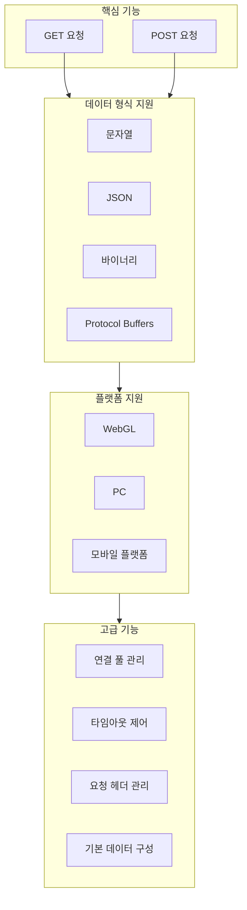
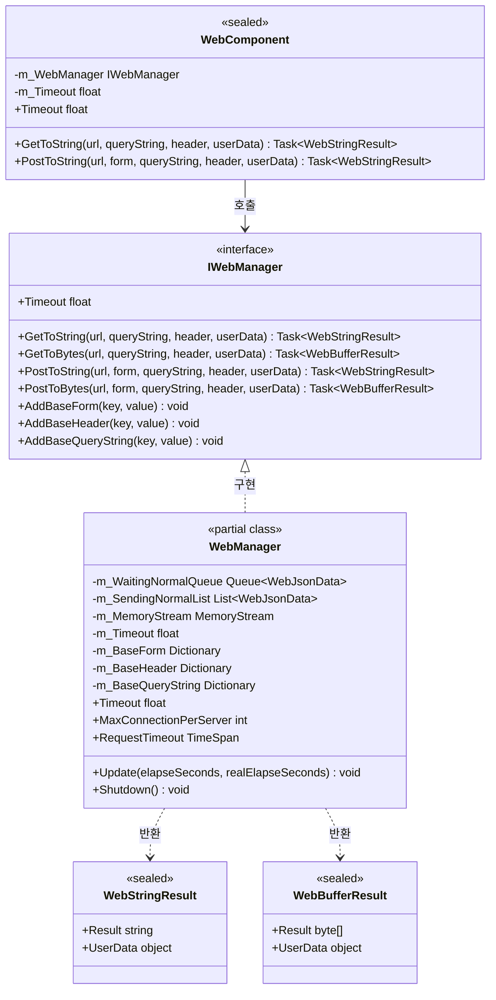
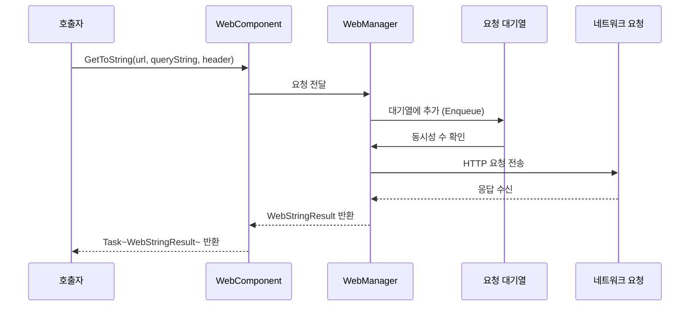

# 플러그인 소개

GameFrameX Web 컴포넌트는高性能(고성능)의 Unity HTTP 네트워크 요청 라이브러리로, 다양한 네트워크 요청 시나리오를 처리하기 위한简洁하고 사용하기 쉬운 API를 제공합니다. GET, POST 요청을 지원하며, 문자열, JSON, 바이너리 데이터 등 다양한 형식을 처리할 수 있습니다.

## 개요

GameFrameX Web은 GameFrameX 게임 프레임워크 체계의 네트워크 기능 모듈로, Unity 게임 개발자를 위해 설계되었습니다. 이 플러그인은 완전한 HTTP 클라이언트 솔루션을 제공하여 개발자가 클라이언트와 서버 간의 통신 요구사항을 빠르게 구현할 수 있도록 도와줍니다.

GameFrameX 프레임워크의 핵심 컴포넌트 중 하나인 Web 컴포넌트는 다른 모듈(Network, Data, Procedure 등)과 긴밀하게 협력하여 완전한 게임 백엔드 통신 체계를 공동으로 구축합니다. 간단한 데이터 가져오기부터 복잡한 바이너리 파일 업로드까지, Web 컴포넌트는 안정적이고 효율적인 네트워크 요청 서비스를 제공할 수 있습니다.

### 설계 목표

GameFrameX Web 컴포넌트의 설계는 다음 핵심 철학을 따릅니다:

1. **简洁하고 사용하기 쉬움**: 명확한 API 인터페이스를 제공하여 개발자가底层(저수준) 구현 세부 사항을 알 필요 없이 사용할 수 있습니다
2. **高性能(고성능)**: C# Task 비동기 모드를 기반으로하며 멀티스레드 이점을 충분히 활용합니다
3. **크로스 플랫폼**: 통일된 인터페이스로 다양한 실행 플랫폼(WebGL, PC, 모바일)에 적합합니다
4. **확장 가능**: 모듈화 설계로 사용자 정의 데이터 직렬화 및 요청 처리를 지원합니다

## 핵심 특성

GameFrameX Web 컴포넌트는 다양한 네트워크 요청 시나리오의 요구를 충족하는 풍부한 기능 특성을 제공합니다:



### 비동기 처리

현대 C# 비동기 프로그래밍 모드(async/await)를 기반으로 하며, 개발자는清晰하고简洁한(간결한) 비동기 코드를 작성할 수 있어 전통적인 콜백 지옥 문제를 피할 수 있습니다:

```csharp
// 비동기로 문자열 데이터 가져오기
string result = await webManager.GetToString("https://api.example.com/data");
Debug.Log("Response: " + result);
```

> Source: [README.md](https://github.com/GameFrameX/com.gameframex.unity.web/blob/main/README.md#L66-L68)

### 다양한 데이터 형식 지원

다양한 데이터 형식의 요청 및 응답 처리를 지원합니다:

- **문자열 형식**: 간단한 텍스트 데이터 교환에 적합
- **JSON 형식**: 프론트엔드와 백엔드 데이터 교환에 광범위하게 사용되며, 자동 직렬화/역직렬화
- **바이너리 형식**: 파일 다운로드, 이미지 로딩 등의 시나리오에 적합
- **Protocol Buffers**: 효율적인 바이너리 직렬화로高性能 시나리오에 적합

### 연결 풀 관리

내장 지능형 연결 재사용 메커니즘으로, `MaxConnectionPerServer` 속성을 통해 단일 서버의 최대 동시 연결 수를 제어하여 연결이 너무 많아 서버에 부담이 가거나 성능 문제가 발생하는 것을 방지합니다. 기본값은 8개의 동시 연결입니다.

## 아키텍처 설계

GameFrameX Web 컴포넌트는 코드의 모듈화와 유지 관리성을 보장하기 위해分层 아키텍처 설계(계층화 아키텍처 설계)를 채택합니다:



### 핵심 컴포넌트 설명

| 컴포넌트 | 유형 | 책임 |
|------|------|------|
| **IWebManager** | 인터페이스 | Web 요청의 추상 인터페이스를 정의하며, 모든 HTTP 요청 작업을 통일 관리합니다 |
| **WebManager** | 클래스 | 핵심 구현 클래스로, `GameFrameworkModule`을 상속하며 완전한 요청 로직을 구현합니다 |
| **WebComponent** | Unity 컴포넌트 | `IWebManager`의 Unity 컴포넌트 캡슐화이며, 씬 오브젝트에서 사용하기 편리합니다 |
| **WebStringResult** | 결과 클래스 | 문자열 유형의 요청 결과를 캡슐화합니다 |
| **WebBufferResult** | 결과 클래스 | 바이트 배열 유형의 요청 결과를 캡슐화합니다 |

### 요청 처리 흐름



## 플랫폼 지원

GameFrameX Web 컴포넌트는 다양한 Unity 플랫폼에 대해 차별화된 구현을 제공하여 다양한 실행 환경에서 모두 정상 작동하도록 보장합니다:

| 플랫폼 | 구현 방식 | 특수 설명 |
|------|----------|----------|
| **WebGL** | UnityWebRequest | 멀티스레드를 지원하지 않으며, 모든 요청이 메인 스레드에서 처리됩니다 |
| **PC** | HttpWebRequest | .NET 네이티브 네트워크 라이브러리를 사용합니다 |
| **Android** | HttpWebRequest | .NET 네이티브 네트워크 라이브러리를 사용합니다 |
| **iOS** | HttpWebRequest | .NET 네이티브 네트워크 라이브러리를 사용합니다 |

### 플랫폼 차이 처리

컴포넌트 내부에서는 조건부 컴파일 지시문 `#if UNITY_WEBGL`을 통해 적합한 네트워크 구현을 자동으로 선택합니다:

```csharp
#if UNITY_WEBGL
using UnityEngine.Networking;
// WebGL 플랫폼은 UnityWebRequest 사용
UnityWebRequest unityWebRequest = UnityWebRequest.Get(webJsonData.URL);
#else
// 다른 플랫폼은 HttpWebRequest 사용
HttpWebRequest request = WebRequest.CreateHttp(webJsonData.URL);
#endif
```

> Source: [WebManager.cs](https://github.com/GameFrameX/com.gameframex.unity.web/blob/main/Runtime/Web/WebManager.cs#L213-L260)

## 빠른 시작

### 설치

Git URL을 통해 설치 (권장):

1. Unity 편집기에서 Package Manager 열기
2. "+" 버튼을 클릭하여 "Add package from git URL" 선택
3. 다음 URL 입력:
   ```
   https://github.com/gameframex/com.gameframex.unity.web.git
   ```

### 기본 사용법

```csharp
using GameFrameX.Web.Runtime;
using System.Threading.Tasks;
using System.Collections.Generic;

public class WebExample : MonoBehaviour
{
    private IWebManager webManager;

    private async void Start()
    {
        // Web 관리자 인스턴스 가져오기
        webManager = GameFrameworkEntry.GetModule<IWebManager>();

        // GET 요청을 보내 문자열 가져오기
        string result = await webManager.GetToString("https://api.example.com/data");
        Debug.Log("GET Response: " + result);

        // POST 요청을 보내 폼 데이터 포함
        var formData = new Dictionary<string, string>
        {
            { "username", "testuser" },
            { "password", "testpass" }
        };

        string postResult = await webManager.PostToString("https://api.example.com/login", formData);
        Debug.Log("POST Response: " + postResult);
    }
}
```

> Source: [README.md](https://github.com/GameFrameX/com.gameframex.unity.web/blob/main/README.md#L52-L81)

### WebComponent 사용

`WebComponent` 방식을 사용하는 것을 권장하며, Unity 컴포넌트로 게임 오브젝트에 직접 추가할 수 있습니다:

```csharp
using GameFrameX.Web.Runtime;
using System.Threading.Tasks;
using System.Collections.Generic;

public class MyWebService : MonoBehaviour
{
    private WebComponent webComponent;

    private void Awake()
    {
        webComponent = gameObject.GetOrAddComponent<WebComponent>();
    }

    public async Task<string> GetUserDataAsync(string userId)
    {
        var queryParams = new Dictionary<string, string>
        {
            { "userId", userId }
        };

        var headers = new Dictionary<string, string>
        {
            { "Authorization", "Bearer your-token-here" }
        };

        return await webComponent.GetToString(
            "https://api.example.com/users",
            queryParams,
            headers
        );
    }
}
```

> Source: [README.md](https://github.com/GameFrameX/com.gameframex.unity.web/blob/main/README.md#L90-L123)

## 구성 옵션

GameFrameX Web 컴포넌트는 다양한 구성 옵션을 제공합니다:

| 구성항목 | 유형 | 기본값 | 설명 |
|--------|------|--------|------|
| `Timeout` | float | 5.0초 | 요청 타임아웃 시간 |
| `MaxConnectionPerServer` | int | 8 | 각 서버의 최대 동시 연결 수 |
| `RequestTimeout` | TimeSpan | 5초 | 요청 타임아웃 시간 (TimeSpan 유형) |

### 코드 구성 예제

```csharp
private void ConfigureWebManager()
{
    var webManager = GameFrameworkEntry.GetModule<IWebManager>();

    // 요청 타임아웃을 60초로 설정
    webManager.Timeout = 60f;

    // 최대 동시 연결 수를 16으로 설정
    webManager.MaxConnectionPerServer = 16;
}
```

> Source: [README.md](https://github.com/GameFrameX/com.gameframex.unity.web/blob/main/README.md#L292-L306)

## 버전 정보

- **현재 버전**: 1.3.3
- **Unity 버전 요구사항**: 2019.4+
- **라이선스**: MIT / Apache License 2.0 이중 라이선스

## 관련 링크

- [설치 방식](./02.installation)
- [기본 사용법](./03.getting-started)
- [WebComponent 사용](./08.web-component)
- [WebManager 아키텍처](./05.web-manager)
- [요청 결과 유형](./06.result-types)
- [IWebManager 인터페이스](./04.iwebmanager-interface)
- [WebComponent 컴포넌트](./08.web-component)
- [타임아웃 구성](./10.timeout-settings)
- [기본 데이터 구성](./07.base-data)
- [플랫폼 차이 설명](./09.platform-differences)
- [자주 묻는 질문](./11.troubleshooting)
