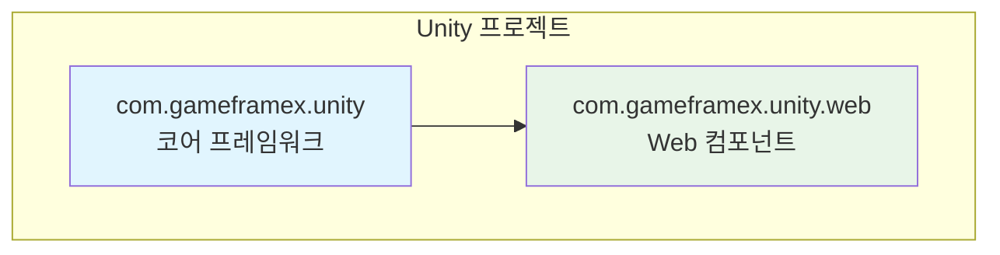
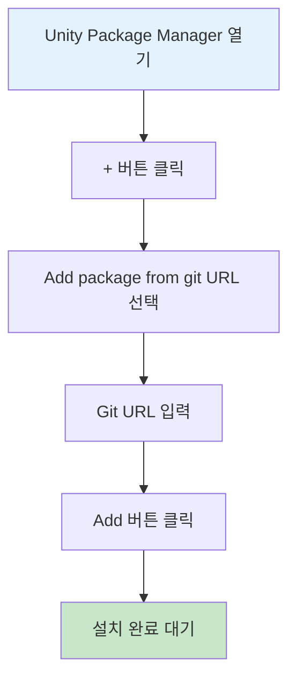
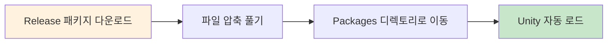

# 설치 방식

GameFrameX Web 컴포넌트는 다양한 설치 방식을 지원하여 다양한 프로젝트 요구와 워크플로우에 적응합니다. 이 문서는 세 가지 권장 설치 방법을 상세히 소개합니다.

## 개요

GameFrameX Web은高性能(고성능)의 Unity HTTP 네트워크 요청 라이브러리로, C# Task 비동기 모드를 기반으로 구축되어 GET, POST 요청을 지원하며 문자열, JSON, 바이너리 데이터 등 다양한 형식을 처리할 수 있습니다. 이 컴포넌트는 GameFrameX 코어 프레임워크(com.gameframex.unity)에 의존하므로, 설치 시 프로젝트가 코어 프레임워크를 올바르게 구성했는지 확인해야 합니다.



## 설치 전 준비

GameFrameX Web 컴포넌트를 설치하기 전에 개발 환경이 다음 요구사항을 충족하는지 확인하세요:

| 요구사항 | 최소 버전 | 설명 |
|------|---------|------|
| Unity 편집기 | 2019.4+ | LTS 버전을 권장합니다 |
| .NET Standard | 2.0+ | 스크립트 런타임 버전 |
| Git | 임의 버전 | 클론 또는 Git URL 추가용 |

> **팁**: Unity 2020.3 LTS 이상을 사용하여 최상의 호환성을 얻는 것을 권장합니다.

## 설치 방식

### 방식 1: Git URL을 통해 설치 (권장)

최신 버전을 쉽게 가져오고 업데이트할 수 있는 가장 권장되는 설치 방식입니다.

**작업 단계:**

1. Unity 편집기에서 **Package Manager** 창을 엽니다
2. 왼쪽 상단의 **"+"** 버튼을 클릭합니다
3. 드롭다운 메뉴에서 **"Add package from git URL..."** 을 선택합니다
4. 입력 상자에 다음 URL을 붙여넣습니다:
   ```
   https://github.com/gameframex/com.gameframex.unity.web.git
   ```
5. **"Add"** 버튼을 클릭하여 설치가 완료될 때까지 기다립니다



> **Source**: [README.md](https://github.com/GameFrameX/com.gameframex.unity.web/blob/main/README.md#L20-L27)

**장점:**
- 업스트림 업데이트를 자동으로 추적합니다
- 간단하고 빠른 원클릭 설치
- 버전 관리에 편리합니다

### 방식 2: manifest.json을 통해 설치

정확한 의존성 버전을 제어하거나 여러 GameFrameX 컴포넌트를 동시에 설치해야 하는 시나리오에 적합합니다.

**작업 단계:**

1. 프로젝트의 `Packages/manifest.json` 파일을 찾아 엽니다
2. `dependencies` 노드에 다음 내용을 추가합니다:

```json
{
  "dependencies": {
    "com.gameframex.unity.web": "https://github.com/gameframex/com.gameframex.unity.web.git",
    "com.gameframex.unity": "https://github.com/gameframex/com.gameframex.unity.git"
  }
}
```

> **Source**: [README.md](https://github.com/GameFrameX/com.gameframex.unity.web/blob/main/README.md#L29-L40)

**설명:**
- 코어 의존성으로 `com.gameframex.unity`을 함께 추가해야 합니다
- 구체적인 버전 번호를 지정할 수 있습니다, 예: `"com.gameframex.unity.web": "1.3.0"`
- manifest.json을 수정한 후 Unity가 자동으로 의존성을 분석하여 설치합니다

**버전 형식 설명:**

| 버전 형식 | 예시 | 설명 |
|---------|------|------|
| 최신 메인 버전 | `1.3.3` | 정확한 버전 |
| Git URL | `https://github.com/...git` | 항상 최신 버전 가져오기 |
| 브랜치 | `#develop` | 지정 브랜치 가져오기 |

### 방식 3: 수동 설치

네트워크에 접근할 수 없거나 오프라인 사용이 필요한 시나리오에 적합합니다.

**작업 단계:**

1. GitHub releases 페이지에서 최신 버전의 릴리스 패키지를 다운로드합니다:
   - [Releases 페이지](https://github.com/GameFrameX/com.gameframex.unity.web/releases)
2. 다운로드한 릴리스 패키지의 압축을 풉니다
3. 압축을 푼 폴더를 프로젝트의 `Packages` 디렉토리로 이동합니다
4. Unity가 자동으로 패키지를 인식하여 로드합니다



> **Source**: [README.md](https://github.com/GameFrameX/com.gameframex.unity.web/blob/main/README.md#L42-L46)

**주의사항:**
- 수동으로 설치한 패키지는 자동 업데이트를 수신하지 않습니다
- 새 버전을 수동으로 다운로드하여 교체해야 합니다
- 폴더 이름이 패키지 이름과 일치하는지 확인하세요 (com.gameframex.unity.web)

## 설치 후 검증

설치가 완료된 후 다음 방법으로 성공 여부를 확인할 수 있습니다:

### Package Manager 확인

Unity에서 **Window > Package Manager**를 열고, `GameFrameX Web`이 목록에 나타나는지, 상태가 **"In Project"**로 표시되는지 확인합니다.

### 어셈블리 참조 확인

간단한 테스트 스크립트를 생성하여 네임스페이스를 정상적으로 참조할 수 있는지 확인합니다:

```csharp
using GameFrameX.Web.Runtime;

public class VerifyInstall : MonoBehaviour
{
    private IWebManager webManager;

    void Start()
    {
        // Web 관리자 인스턴스 가져오기 시도
        webManager = GameFrameworkEntry.GetModule<IWebManager>();

        if (webManager != null)
        {
            Debug.Log("GameFrameX Web 설치 성공!");
        }
    }
}
```

### 의존 항목 확인

다음 의존 항목이 올바르게 설치되었는지 확인합니다:

| 의존 패키지 | 필수 | 설명 |
|--------|------|------|
| com.gameframex.unity | ✅ 필수 | 코어 프레임워크 |
| GameFrameX.Network.Runtime | ✅ 필수 | 네트워크 기초 라이브러리 |
| ProtoBuffer.Runtime | ✅ 필수 | Protobuf 지원 |

## 제거 방식

GameFrameX Web 컴포넌트를 제거해야 하는 경우, 설치 방식에 따라 해당 제거 방법을 선택하세요:

### Package Manager를 통해 제거

1. **Window > Package Manager** 열기
2. 목록에서 **Game Frame X Web** 찾기
3. 오른쪽의 **"Remove"** 버튼 클릭

### manifest.json을 통해 제거

`Packages/manifest.json`의 `dependencies`에서 해당 줄을 제거합니다:

```json
{
  "dependencies": {
    "com.gameframex.unity.web": "https://github.com/gameframex/com.gameframex.unity.web.git"
    // 위 줄 제거
  }
}
```

### 수동 제거

`Packages/com.gameframex.unity.web` 폴더를 직접 삭제하면 됩니다.

## 자주 묻는 질문

### Q1: 설치 후 의존성 누락 안내가 표시되면 어떻게 해야 합니까?

코어 프레임워크가 올바르게 설치되지 않았기 때문입니다. 먼저 `com.gameframex.unity`을 설치하세요:

```
https://github.com/gameframex/com.gameframex.unity.git
```

### Q2: Git URL 설치가 실패하면 어떻게 해결합니까?

1. 네트워크 연결이 정상인지 확인합니다
2. 프록시 또는 VPN 사용을 시도합니다
3. Git이 올바르게 설치되어 있고 시스템 PATH에 있는지 확인합니다

### Q3: 특정 버전을 설치하려면 어떻게 해야 합니까?

manifest.json에서 버전 번호를 지정합니다:

```json
{
  "dependencies": {
    "com.gameframex.unity.web": "1.3.3"
  }
}
```

## 관련 링크

- [플러그인 소개](./01.overview)
- [빠른 시작 - 기본 사용법](./03.getting-started)
- [빠른 시작 - WebComponent 사용](./08.web-component)
- [GitHub 저장소](https://github.com/GameFrameX/com.gameframex.unity.web.git)
- [공식 문서](https://gameframex.doc.alianblank.com)
- [문제 보고](https://github.com/GameFrameX/com.gameframex.unity.web/issues)
