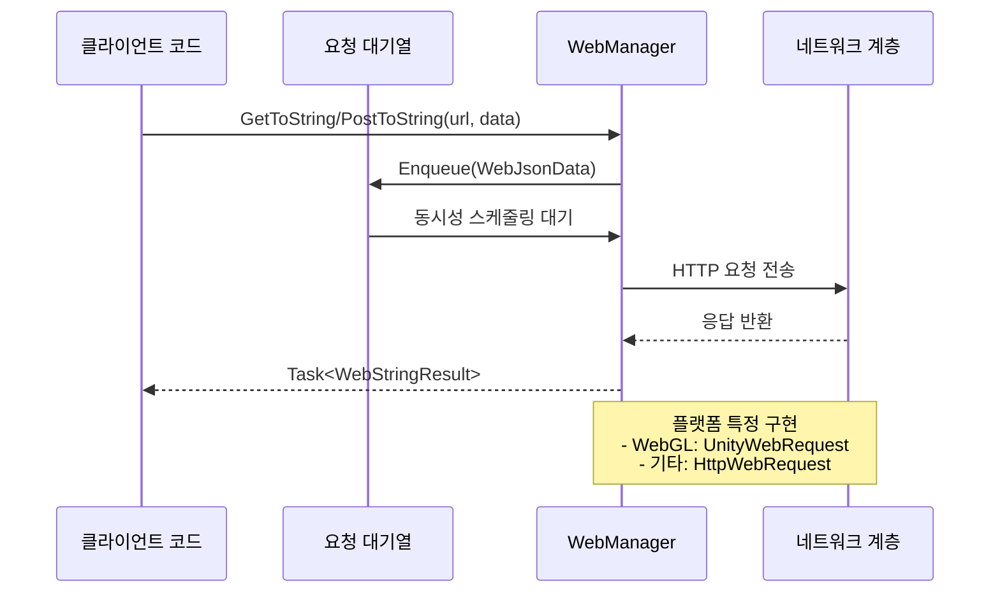

# 기본 사용법

이 문서는 GameFrameX Web 컴포넌트의 기본 사용 방법을 소개하여, 개발자가 HTTP 네트워크 요청 개발을 빠르게 시작할 수 있도록 돕습니다.

## 개요

GameFrameX Web 컴포넌트는简洁하고 사용하기 쉬운 HTTP 요청 기능을 제공하며, GET, POST 요청을 지원하며 문자열, JSON, 바이너리 데이터 등 다양한 형식을 처리할 수 있습니다. 이 컴포넌트는 C# Task 비동기 모드로 개발되어 async/await 문법을 지원하며高性能의(고성능) 비블로킹 요청 처리를 제공합니다.

사용하기 전에 Web 컴포넌트가 올바르게 설치되고 구성되었는지 확인하세요. 자세한 내용은 [설치 방식](./02.installation)을 참조하세요.

## WebManager 인스턴스 가져오기

Web 컴포넌트를 사용하는 첫 번째 단계는 `IWebManager` 인스턴스를 가져오는 것입니다. 인스턴스를 가져오는 두 가지 주요 방식이 있습니다:

### 방식 1: GameFrameworkEntry를 통해 가져오기 (권장)

GameFramework 프레임워크의 진입점을 통해 Web 관리자 인스턴스를 가져오며, 가장 일반적인 방식입니다:

```csharp
using GameFrameX.Web.Runtime;
using GameFrameX.Runtime;
using System.Threading.Tasks;

public class WebExample : MonoBehaviour
{
    private IWebManager webManager;

    private async void Start()
    {
        // Web 관리자 인스턴스 가져오기
        webManager = GameFrameworkEntry.GetModule<IWebManager>();

        // GET 요청 전송
        var result = await webManager.GetToString("https://api.example.com/data");
        Debug.Log("Response: " + result.Result);
    }
}
```

> Source: [README.md](https://github.com/GameFrameX/com.gameframex.unity.web/blob/main/README.md#L52-L81)

### 방식 2: WebComponent 컴포넌트를 통해 가져오기

Unity 씬에서 WebComponent 컴포넌트를 생성하고, 컴포넌트 방식으로 사용합니다:

```csharp
using GameFrameX.Web.Runtime;
using System.Threading.Tasks;
using System.Collections.Generic;

public class MyWebService : MonoBehaviour
{
    private WebComponent webComponent;

    private void Awake()
    {
        // WebComponent 컴포넌트 가져오기 또는 추가
        webComponent = gameObject.GetOrAddComponent<WebComponent>();
    }

    public async Task<string> GetUserDataAsync(string userId)
    {
        var queryParams = new Dictionary<string, string>
        {
            { "userId", userId }
        };

        var headers = new Dictionary<string, string>
        {
            { "Authorization", "Bearer your-token-here" }
        };

        var result = await webComponent.GetToString(
            "https://api.example.com/users",
            queryParams,
            headers
        );

        return result.Result;
    }
}
```

> Source: [README.md](https://github.com/GameFrameX/com.gameframex.unity.web/blob/main/README.md#L83-L123)

## GET 요청 전송

GET 요청은 서버에서 데이터를 가져오는 데 사용되며, WebManager는 다양한 시나리오 요구를 충족하는 다양한 오버로드 메서드를 제공합니다.

### 간단한 GET 요청

가장 기본적인 GET 요청으로, URL만 제공하면 됩니다:

```csharp
// 문자열 응답 가져오기
var stringResult = await webManager.GetToString("https://api.example.com/data");
Debug.Log("Response: " + stringResult.Result);

// 바이트 배열 응답 가져오기 (이미지, 파일 등 바이너리 데이터 다운로드에 적합)
var bufferResult = await webManager.GetToBytes("https://api.example.com/image.png");
byte[] imageData = bufferResult.Result;
```

> Source: [IWebManager.cs](https://github.com/GameFrameX/com.gameframex.unity.web/blob/main/Runtime/Web/IWebManager.cs#L18-L26)

### 쿼리 매개변수가 포함된 GET 요청

Dictionary를 통해 URL 쿼리 매개변수를 전달합니다:

```csharp
var queryParams = new Dictionary<string, string>
{
    { "page", "1" },
    { "pageSize", "20" },
    { "category", "book" }
};

var result = await webManager.GetToString(
    "https://api.example.com/products",
    queryParams
);
```

> Source: [IWebManager.cs](https://github.com/GameFrameX/com.gameframex.unity.web/blob/main/Runtime/Web/IWebManager.cs#L35-L45)

### 요청 헤더가 포함된 GET 요청

인증 또는 특수 헤더 정보가 필요한 시나리오에서 사용합니다:

```csharp
var queryParams = new Dictionary<string, string>
{
    { "id", "12345" }
};

var headers = new Dictionary<string, string>
{
    { "Authorization", "Bearer your-access-token" },
    { "Accept", "application/json" },
    { "Language", "zh-CN" }
};

var result = await webManager.GetToString(
    "https://api.example.com/user/profile",
    queryParams,
    headers
);
```

> Source: [IWebManager.cs](https://github.com/GameFrameX/com.gameframex.unity.web/blob/main/Runtime/Web/IWebManager.cs#L56-L67)

## POST 요청 전송

POST 요청은 서버에 데이터를 제출하는 데 사용되며, 폼 데이터와 JSON 형식을 지원합니다.

### 간단한 POST 요청

가장 기본적인 POST 폼 요청:

```csharp
var formData = new Dictionary<string, object>
{
    { "username", "testuser" },
    { "password", "testpass" }
};

var result = await webManager.PostToString(
    "https://api.example.com/login",
    formData
);

Debug.Log("Login result: " + result.Result);
```

> Source: [IWebManager.cs](https://github.com/GameFrameX/com.gameframex.unity.web/blob/main/Runtime/Web/IWebManager.cs#L77-L87)

### 쿼리 매개변수가 포함된 POST 요청

URL 쿼리 매개변수와 폼 데이터를 동시에 사용합니다:

```csharp
var formData = new Dictionary<string, object>
{
    { "title", "My Article" },
    { "content", "Article content here..." },
    { "author", "John Doe" }
};

var queryParams = new Dictionary<string, string>
{
    { "draft", "true" }  // URL 쿼리 매개변수
};

var result = await webManager.PostToString(
    "https://api.example.com/articles",
    formData,
    queryParams
);
```

> Source: [IWebManager.cs](https://github.com/GameFrameX/com.gameframex.unity.web/blob/main/Runtime/Web/IWebManager.cs#L87-L97)

### 요청 헤더가 포함된 POST 요청

완전한 요청 헤더 정보가 포함된 POST 요청을 전송합니다:

```csharp
var formData = new Dictionary<string, object>
{
    { "data", "some value" }
};

var queryParams = new Dictionary<string, string>
{
    { "action", "update" }
};

var headers = new Dictionary<string, string>
{
    { "Authorization", "Bearer your-token" },
    { "Content-Type", "application/json" },
    { "X-Request-ID", Guid.NewGuid().ToString() }
};

var result = await webManager.PostToString(
    "https://api.example.com/data",
    formData,
    queryParams,
    headers
);
```

> Source: [IWebManager.cs](https://github.com/GameFrameX/com.gameframex.unity.web/blob/main/Runtime/Web/IWebManager.cs#L98)

### 바이너리 데이터 업로드

바이트 배열(파일, 바이너리 스트림 등)을 업로드합니다:

```csharp
public async Task UploadBinaryDataAsync(byte[] fileData, string fileName)
{
    var queryParams = new Dictionary<string, string>
    {
        { "fileName", fileName }
    };

    var headers = new Dictionary<string, string>
    {
        { "Content-Type", "application/octet-stream" },
        { "Authorization", "Bearer your-token" }
    };

    var result = await webManager.PostToBytes(
        "https://api.example.com/upload",
        fileData,
        queryParams,
        headers
    );

    if (result.Result != null && result.Result.Length > 0)
    {
        Debug.Log("Upload successful!");
    }
}
```

> Source: [README.md](https://github.com/GameFrameX/com.gameframex.unity.web/blob/main/README.md#L188-L217)

## 요청 결과 처리

WebManager의 요청 메서드는 두 가지 결과 유형을 반환합니다: `WebStringResult`와 `WebBufferResult`.

### WebStringResult (문자열 결과)

텍스트 응답 처리에 사용되며, JSON 문자열, HTML 등에 적합합니다:

```csharp
var result = await webManager.GetToString("https://api.example.com/data");

// 응답 내용 가져오기
string responseText = result.Result;

// 요청 시 전달된 사용자 정의 데이터 가져오기
object userData = result.UserData;

// 결과 출력
Debug.Log($"Response: {result}");
```

> Source: [WebStringResult.cs](https://github.com/GameFrameX/com.gameframex.unity.web/blob/main/Runtime/Web/WebStringResult.cs#L15-L38)

### WebBufferResult (바이트 배열 결과)

바이너리 응답 처리에 사용되며, 이미지, 오디오, 파일 등에 적합합니다:

```csharp
var result = await webManager.GetToBytes("https://api.example.com/image.png");

// 바이너리 데이터 가져오기
byte[] data = result.Result;

// 요청 시 전달된 사용자 정의 데이터 가져오기
object userData = result.UserData;

// 데이터가 있는지 확인
if (data != null && data.Length > 0)
{
    Debug.Log($"Downloaded {data.Length} bytes");
}
```

> Source: [WebBufferResult.cs](https://github.com/GameFrameX/com.gameframex.unity.web/blob/main/Runtime/Web/WebBufferResult.cs#L1-L21)

### UserData를 사용하여 컨텍스트 전달

요청 시 사용자 정의 데이터를 전달하여 결과에서 가져와 요청 출처를 식별하거나 컨텍스트를 전달할 수 있습니다:

```csharp
// 요청 시 컨텍스트 데이터 전달
var requestContext = new { requestId = Guid.NewGuid(), source = "ProfileScreen" };

var result = await webManager.GetToString(
    "https://api.example.com/user/123",
    requestContext  // 사용자 정의 데이터 전달
);

// 결과 처리 시 컨텍스트 가져오기
Debug.Log($"Request ID: {result.UserData}");
```

## 오류 처리

완벽한 오류 처리는 네트워크 요청 개발의 중요한 부분입니다. WebManager는 오류 유형을 나타내기 위해 다양한 유형의 예외를 throw합니다.

### 기본 오류 처리

```csharp
public async Task<string> SafeWebRequestAsync(string url)
{
    try
    {
        var result = await webManager.GetToString(url);
        return result.Result;
    }
    catch (Exception ex)
    {
        Debug.LogError($"Request failed: {ex.Message}");
        return null;
    }
}
```

### 특정 예외 유형 처리

```csharp
public async Task<string> HandleErrorsAsync(string url)
{
    try
    {
        return await webManager.GetToString(url);
    }
    catch (TimeoutException ex)
    {
        // 요청 타임아웃
        Debug.LogError($"요청 타임아웃: {ex.Message}");
        return null;
    }
    catch (WebException ex)
    {
        switch (ex.Status)
        {
            case WebExceptionStatus.Timeout:
                Debug.LogError("요청 타임아웃");
                break;
            case WebExceptionStatus.ConnectFailure:
                Debug.LogError("연결 실패");
                break;
            case WebExceptionStatus.ProtocolError:
                Debug.LogError($"프로토콜 오류: {ex.Message}");
                break;
            default:
                Debug.LogError($"네트워크 오류: {ex.Message}");
                break;
        }
        return null;
    }
    catch (IOException ex)
    {
        Debug.LogError($"IO 오류: {ex.Message}");
        return null;
    }
    catch (Exception ex)
    {
        Debug.LogError($"알 수 없는 오류: {ex.Message}");
        return null;
    }
}
```

> Source: [WebManager.cs](https://github.com/GameFrameX/com.gameframex.unity.web/blob/main/Runtime/Web/WebManager.cs#L298-L324)

### UnityWebRequest 오류 (WebGL 플랫폼)

WebGL 플랫폼에서 오류는 UnityWebRequest를 통해 반환됩니다:

```csharp
// WebGL 플랫폼의 오류 처리 예제
// UnityWebRequest는 isNetworkError 또는 isHttpError를 반환합니다
```

> Source: [WebManager.cs](https://github.com/GameFrameX/com.gameframex.unity.web/blob/main/Runtime/Web/WebManager.cs#L246-L252)

## 기본 데이터 관리

WebManager는 기본 데이터(Base Data) 설정을 지원하며, 이 데이터는 모든 요청에 자동으로 추가되어 인증 정보, 버전 번호 등을 통일하여 전달해야 하는 시나리오에 적합합니다.

### 기본 폼 데이터 추가

```csharp
// 기본 폼 데이터 추가, 모든 POST 요청이 자동으로 이 데이터를 포함합니다
webManager.AddBaseForm("appVersion", "1.0.0");
webManager.AddBaseForm("platform", "iOS");

// 요청 전송 시 기본 폼 데이터가 자동으로 병합됩니다
var formData = new Dictionary<string, object>
{
    { "username", "testuser" }
};

// 실제 전송되는 폼: { "appVersion": "1.0.0", "platform": "iOS", "username": "testuser" }
var result = await webManager.PostToString("https://api.example.com/login", formData);
```

> Source: [WebManager.cs](https://github.com/GameFrameX/com.gameframex.unity.web/blob/main/Runtime/Web/WebManager.cs#L591-L594)

### 기본 요청 헤더 추가

```csharp
// 기본 요청 헤더 추가
webManager.AddBaseHeader("Authorization", "Bearer your-default-token");
webManager.AddBaseHeader("X-App-ID", "com.example.myapp");
webManager.AddBaseHeader("Accept", "application/json");

// 요청 전송 시 기본 요청 헤더가 모든 요청에 자동으로 병합됩니다
var result = await webManager.GetToString("https://api.example.com/data");
```

> Source: [WebManager.cs](https://github.com/GameFrameX/com.gameframex.unity.web/blob/main/Runtime/Web/WebManager.cs#L621-L624)

### 기본 쿼리 문자열 추가

```csharp
// 기본 쿼리 문자열 추가
webManager.AddBaseQueryString("lang", "zh-CN");
webManager.AddBaseQueryString("v", "1.0.0");

// 요청 전송 시 기본 쿼리 문자열이 URL에 자동으로附加(추가)됩니다
var result = await webManager.GetToString("https://api.example.com/products");

// 실제 요청 URL: https://api.example.com/products?lang=zh-CN&v=1.0.0
```

> Source: [WebManager.cs](https://github.com/GameFrameX/com.gameframex.unity.web/blob/main/Runtime/Web/WebManager.cs#L651-L654)

### 기본 데이터 관리

```csharp
// 지정된 기본 데이터 제거
webManager.RemoveBaseForm("appVersion");
webManager.RemoveBaseHeader("Authorization");
webManager.RemoveBaseQueryString("lang");

// 모든 기본 데이터 지우기
webManager.ClearBaseForm();
webManager.ClearBaseHeader();
webManager.ClearBaseQueryString();
```

> Source: [WebManager.cs](https://github.com/GameFrameX/com.gameframex.unity.web/blob/main/Runtime/Web/WebManager.cs#L600-L674)

## 요청 흐름 개요

WebManager 내부에서는 대기열 메커니즘을 사용하여 요청을 관리하며 동시성 제어를 지원합니다. 다음은 요청 처리의 기본 흐름입니다:



## 관련 링크

- [플러그인 소개](./01.overview) - Web 컴포넌트의 전체 아키텍처와 특성 이해
- [설치 방식](./02.installation) - 상세 설치 단계
- [WebComponent 사용](./08.web-component) - WebComponent 컴포넌트 심층 이해
- [WebManager 아키텍처](./05.web-manager) - WebManager 내부 아키텍처 심층 이해
- [요청 결과 유형](./06.result-types) - 결과 유형 정의 상세히 알아보기
- [IWebManager 인터페이스](./04.iwebmanager-interface) - 완전한 API 인터페이스 문서
- [WebComponent 컴포넌트](./08.web-component) - WebComponent 컴포넌트 상세 문서
- [타임아웃 구성](./10.timeout-settings) - 요청 타임아웃 구성
- [기본 데이터 구성](./07.base-data) - 기본 데이터 관리 상세
- [플랫폼 차이 설명](./09.platform-differences) - 다양한 플랫폼의 차이 설명
- [자주 묻는 질문](./11.troubleshooting) - 자주 묻는 질문 FAQ
