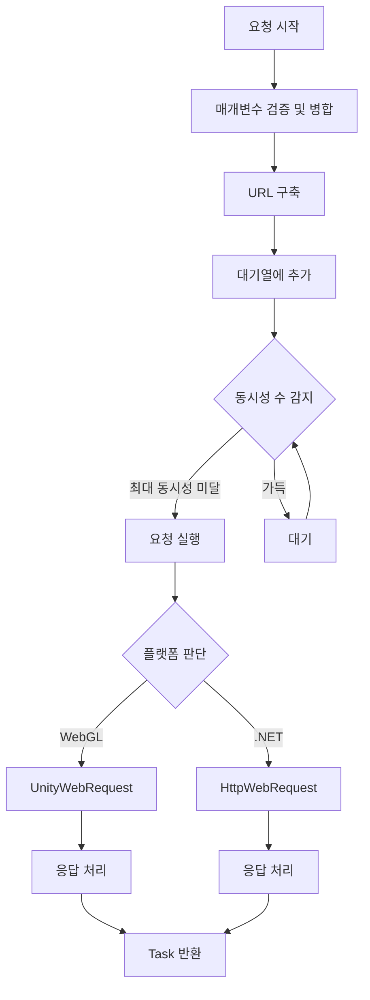

# IWebManager 인터페이스

IWebManager는 GameFrameX Web 플러그인의 핵심 인터페이스로, 통일된 HTTP GET 및 POST 요청 기능을 제공합니다. 이 인터페이스는底层(저수준) 네트워크 요청 구현의 세부 사항을 캡슐화하며, 다양한 요청 매개변수 조합을 지원하고 기본 데이터 관리 기능을 제공합니다.

## 개요

IWebManager 인터페이스는 Web 요청 관리자의 계약 규범을 정의하며, 주요 책임을 담당합니다:

1. **HTTP 요청 처리**: GET과 POST 두 가지 HTTP 메서드의 비동기 요청 지원을 제공합니다
2. **응답 유형 지원**: 문자열과 바이트 배열 두 가지 응답 형식을 지원합니다
3. **요청 매개변수 관리**: 쿼리 매개변수, HTTP 요청 헤더, 폼 데이터의 유연한 조합을 지원합니다
4. **기본 데이터 재사용**: 전역 기본 데이터 구성을 제공하며, 모든 요청에 자동으로 기본 데이터를 병합합니다
5. **타임아웃 제어**: 구성 가능한 타임아웃 시간 설정을 제공합니다

이 인터페이스의 기본 구현은 `WebManager` 클래스이며, `GameFrameworkModule`을 상속하여 GameFrameX 프레임워크의 핵심 모듈 중 하나입니다.

> **설계 의도**: IWebManager는 대기열식 요청 관리 메커니즘을 채택하여, 대기 대기열과 전송 목록을 통해 요청의 버퍼링과 동시성 제어를 구현합니다. 기본 최대 동시성은 8개의 연결이며, 서버 تحمل(부담) 능력에 따라 조정할 수 있습니다.

## 아키텍처 설계

### 핵심 컴포넌트 관계

```mermaid
graph TD
    subgraph Client["호출자"]
        UC[WebComponent]
    end

    subgraph Contract["인터페이스 계약"]
        IM[IWebManager]
    end

    subgraph Core["핵심 구현"]
        WM[WebManager]
        subgraph Manager["관리자"]
            Q[Queue Manager]
            M[Data Merger]
            UH[URL Handler]
        end
    end

    subgraph Result["결과 유형"]
        WSR[WebStringResult]
        WBR[WebBufferResult]
    end

    subgraph Platform["플랫폼 어댑터]
        UWR[UnityWebRequest<br/>WebGL 플랫폼]
        HWR[HttpWebRequest<br/>.NET 플랫폼]
    end

    UC -->|사용| IM
    IM -->|구현| WM
    WM --> Q
    WM --> M
    WM --> UH
    Q --> WSR
    Q --> WBR
    UH --> UWR
    UH --> HWR
```

### 요청 처리 흐름



## API 참조

### 요청 메서드

#### GET 요청

##### `GetToString(url: string, userData?: object): Task<WebStringResult>`

간단한 GET 요청을 전송하여 문자열 형식의 응답 결과를 반환합니다.

**매개변수:**
- `url` (string): 요청 대상 URL 주소
- `userData` (object, 선택): 사용자 정의 데이터로, 응답 결과에서 원본대로 반환됩니다

**반환:** `Task<WebStringResult>` - 문자열 결과를 포함하는 비동기 작업

**예제:**
```csharp
var webManager = GameFrameworkEntry.GetModule<IWebManager>();
var result = await webManager.GetToString("https://api.example.com/data");
Debug.Log(result.Result);
```
> Source: [IWebManager.cs](https://github.com/GameFrameX/com.gameframex.unity.web/blob/main/Runtime/Web/IWebManager.cs#L18)

---

##### `GetToString(url: string, queryString: Dictionary<string, string>, userData?: object): Task<WebStringResult>`

쿼리 매개변수가 포함된 GET 요청을 전송하여 문자열 형식의 응답 결과를 반환합니다.

---

##### `GetToString(url: string, queryString: Dictionary<string, string>, header: Dictionary<string, string>, userData?: object): Task<WebStringResult>`

쿼리 매개변수와 요청 헤더가 포함된 GET 요청을 전송하여 문자열 형식의 응답 결과를 반환합니다.

---

##### `GetToBytes(url: string, userData?: object): Task<WebBufferResult>`

간단한 GET 요청을 전송하여 바이트 배열 형식의 응답 결과를 반환합니다. 이미지, 오디오 등의 바이너리 데이터 다운로드에 적합합니다.

**예제:**
```csharp
var webManager = GameFrameworkEntry.GetModule<IWebManager>();
var result = await webManager.GetToBytes("https://api.example.com/image.png");
byte[] imageData = result.Result;
```
> Source: [IWebManager.cs](https://github.com/GameFrameX/com.gameframex.unity.web/blob/main/Runtime/Web/IWebManager.cs#L26)

---

##### `GetToBytes(url: string, queryString: Dictionary<string, string>, userData?: object): Task<WebBufferResult>`

쿼리 매개변수가 포함된 GET 요청을 전송하여 바이트 배열 형식의 응답 결과를 반환합니다.

---

##### `GetToBytes(url: string, queryString: Dictionary<string, string>, header: Dictionary<string, string>, userData?: object): Task<WebBufferResult>`

쿼리 매개변수와 요청 헤더가 포함된 GET 요청을 전송하여 바이트 배열 형식의 응답 결과를 반환합니다.

---

#### POST 요청

##### `PostToString(url: string, from?: Dictionary<string, object>, userData?: object): Task<WebStringResult>`

간단한 POST 요청을 전송하여 문자열 형식의 응답 결과를 반환합니다. 폼 데이터는 JSON 형식으로 전송됩니다.

**예제:**
```csharp
var webManager = GameFrameworkEntry.GetModule<IWebManager>();
var formData = new Dictionary<string, object>
{
    { "username", "testuser" },
    { "password", "password123" }
};
var result = await webManager.PostToString("https://api.example.com/login", formData);
```
> Source: [IWebManager.cs](https://github.com/GameFrameX/com.gameframex.unity.web/blob/main/Runtime/Web/IWebManager.cs#L77)

---

##### `PostToString(url: string, from: Dictionary<string, object>, queryString: Dictionary<string, string>, userData?: object): Task<WebStringResult>`

쿼리 매개변수가 포함된 POST 요청을 전송하여 문자열 형식의 응답 결과를 반환합니다.

---

##### `PostToString(url: string, from: Dictionary<string, object>, queryString: Dictionary<string, string>, header: Dictionary<string, string>, userData?: object): Task<WebStringResult>`

쿼리 매개변수와 요청 헤더가 포함된 POST 요청을 전송하여 문자열 형식의 응답 결과를 반환합니다. 이것은 기능이 가장 완전한 POST 문자열 요청 오버로드입니다.

---

##### `PostToBytes(url: string, from: Dictionary<string, object>, userData?: object): Task<WebBufferResult>`

간단한 POST 요청을 전송하여 바이트 배열 형식의 응답 결과를 반환합니다. 바이너리 데이터의 업로드/다운로드 시나리오 처리에 적합합니다.

---

##### `PostToBytes(url: string, from: Dictionary<string, object>, queryString: Dictionary<string, string>, userData?: object): Task<WebBufferResult>`

쿼리 매개변수가 포함된 POST 요청을 전송하여 바이트 배열 형식의 응답 결과를 반환합니다.

---

##### `PostToBytes(url: string, from: Dictionary<string, object>, queryString: Dictionary<string, string>, header: Dictionary<string, string>, userData?: object): Task<WebBufferResult>`

쿼리 매개변수와 요청 헤더가 포함된 POST 요청을 전송하여 바이트 배열 형식의 응답 결과를 반환합니다.

---

##### `PostToBytes(url: string, from: byte[], queryString: Dictionary<string, string>, header: Dictionary<string, string>, userData?: object): Task<WebBufferResult>`

원시 바이트 배열의 POST 요청을 전송하여 바이트 배열 형식의 응답 결과를 반환합니다. ProtoBuf 등의 바이너리 프로토콜 통신에 적합합니다.

**설계 의도**: 이 메서드는 ProtoBuf 직렬화된 요청 본문과 같은 바이너리 데이터 요청 전송 전용이며, Content-Type이 `application/octet-stream`으로 설정됩니다.

---

### 구성 속성

#### `Timeout: float`

요청 타임아웃 시간 (단위: 초)을 가져오거나 설정합니다.

**기본값:** `5.0`

**예제:**
```csharp
var webManager = GameFrameworkEntry.GetModule<IWebManager>();
webManager.Timeout = 10f; // 타임아웃 시간을 10초로 설정
```
> Source: [IWebManager.cs](https://github.com/GameFrameX/com.gameframex.unity.web/blob/main/Runtime/Web/IWebManager.cs#L144)

---

### 기본 데이터 관리

기본 데이터 관리 기능을 통해 전역 폼 데이터, 요청 헤더, 쿼리 매개변수를 구성할 수 있으며, 이 데이터는 각 요청 시 자동으로 요청 매개변수와 병합됩니다. 이는 인증 토큰, 장치 정보 등의 범용 데이터를 전달해야 하는 시나리오에 매우 유용합니다.

#### 폼 데이터 관리

##### `AddBaseForm(key: string, value: object): void`

기본 폼 데이터를 추가하며, 이 데이터는 각 POST 요청 시 자동으로 요청 본문에 병합됩니다.

**예제:**
```csharp
var webManager = GameFrameworkEntry.GetModule<IWebManager>();
// 전역 애플리케이션 정보 추가
webManager.AddBaseForm("app_version", "1.0.0");
webManager.AddBaseForm("device_id", "ABC123");
```
> Source: [IWebManager.cs](https://github.com/GameFrameX/com.gameframex.unity.web/blob/main/Runtime/Web/IWebManager.cs#L151)

---

##### `RemoveBaseForm(key: string): void`

지정된 기본 폼 데이터를 제거합니다.

---

##### `ClearBaseForm(): void`

모든 기본 폼 데이터를 지웁니다.

---

#### 요청 헤더 관리

##### `AddBaseHeader(key: string, value: string): void`

기본 요청 헤더 데이터를 추가하며, 이 데이터는 각 HTTP 요청 시 자동으로 요청 헤더에 병합됩니다.

**예제:**
```csharp
var webManager = GameFrameworkEntry.GetModule<IWebManager>();
webManager.AddBaseHeader("Authorization", "Bearer token123");
webManager.AddBaseHeader("Accept-Language", "zh-CN");
```
> Source: [IWebManager.cs](https://github.com/GameFrameX/com.gameframex.unity.web/blob/main/Runtime/Web/IWebManager.cs#L169)

---

##### `RemoveBaseHeader(key: string): void`

지정된 기본 요청 헤더 데이터를 제거합니다.

---

##### `ClearBaseHeader(): void`

모든 기본 요청 헤더 데이터를 지웁니다.

---

#### 쿼리 매개변수 관리

##### `AddBaseQueryString(key: string, value: string): void`

기본 쿼리 매개변수 데이터를 추가하며, 이 매개변수는 각 요청의 URL 뒤에 자동으로附加(추가)됩니다.

**예제:**
```csharp
var webManager = GameFrameworkEntry.GetModule<IWebManager>();
webManager.AddBaseQueryString("platform", "android");
webManager.AddBaseQueryString("channel", "official");
```
> Source: [IWebManager.cs](https://github.com/GameFrameX/com.gameframex.unity.web/blob/main/Runtime/Web/IWebManager.cs#L187)

---

##### `RemoveBaseQueryString(key: string): void`

지정된 기본 쿼리 매개변수 데이터를 제거합니다.

---

##### `ClearBaseQueryString(): void`

모든 기본 쿼리 매개변수 데이터를 지웁니다.

---

## 응답 결과 유형

### WebStringResult

문자열 응답 결과 유형으로, GetToString 및 PostToString 메서드의 반환 값에 사용됩니다.

**속성:**
| 속성 | 유형 | 설명 |
|------|------|------|
| Result | string | 서버가 반환한 문자열 내용 |
| UserData | object | 요청 시 전달된 사용자 정의 데이터 |

**예제:**
```csharp
var result = await webManager.GetToString("https://api.example.com/data");
// 응답 내용 접근
string content = result.Result;
// 요청 시 전달된 사용자 정의 데이터 접근
object userData = result.UserData;
```
> Source: [WebStringResult.cs](https://github.com/GameFrameX/com.gameframex.unity.web/blob/main/Runtime/Web/WebStringResult.cs#L1-L39)

---

### WebBufferResult

바이트 배열 응답 결과 유형으로, GetToBytes 및 PostToBytes 메서드의 반환 값에 사용됩니다.

**속성:**
| 속성 | 유형 | 설명 |
|------|------|------|
| Result | byte[] | 서버가 반환한 바이트 배열 내용 |
| UserData | object | 요청 시 전달된 사용자 정의 데이터 |

**예제:**
```csharp
var result = await webManager.GetToBytes("https://api.example.com/file");
// 응답 바이트 배열 접근
byte[] data = result.Result;
```
> Source: [WebBufferResult.cs](https://github.com/GameFrameX/com.gameframex.unity.web/blob/main/Runtime/Web/WebBufferResult.cs#L1-L21)

---

## 오류 처리

WebManager는 요청 과정에서 다음 예외를 throw할 수 있습니다:

| 예외 유형 | 트리거 조건 |
|----------|----------|
| TimeoutException | 요청 타임아웃 (WebExceptionStatus.Timeout) |
| WebException | 네트워크 오류 또는 HTTP 오류 |
| IOException | I/O 작업 오류 |
| Exception | 기타 알 수 없는 오류 |

**예제 - 오류 처리:**
```csharp
try
{
    var result = await webManager.GetToString("https://api.example.com/data");
    Debug.Log(result.Result);
}
catch (TimeoutException ex)
{
    Debug.LogError($"요청 타임아웃: {ex.Message}");
}
catch (WebException ex)
{
    Debug.LogError($"네트워크 오류: {ex.Message}");
}
catch (Exception ex)
{
    Debug.LogError($"알 수 없는 오류: {ex.Message}");
}
```
> Source: [WebManager.cs](https://github.com/GameFrameX/com.gameframex.unity.web/blob/main/Runtime/Web/WebManager.cs#L298-L324)

---

## 플랫폼 차이

IWebManager 인터페이스는 다양한 플랫폼에서 서로 다른底层(저수준) 구현을 가집니다:

| 플랫폼 |底层 구현 | 인증서 처리 |
|------|----------|----------|
| WebGL | UnityWebRequest | 기본적으로 인증서 검증 건너뛰기 (DefaultBypassCertificate) |
| 기타 플랫폼 (.NET) | HttpWebRequest | 시스템 기본 인증서 사용 |

> **주의**: WebGL 플랫폼에서 인증서 검증은 기본적으로 개발 디버깅을 위해 건너뛰어집니다. 운영 환경에서 인증서 검증을 활성화해야 하는 경우 [플랫폼 차이 설명](./09.platform-differences) 문서를 참조하세요.

---

## 관련 링크

- [WebComponent 컴포넌트](./08.web-component) - Unity 컴포넌트 캡슐화
- [WebManager 아키텍처](./05.web-manager) - 핵심 아키텍처 상세
- [요청 결과 유형](./06.result-types) - 결과 유형 상세
- [타임아웃 구성](./10.timeout-settings) - 타임아웃 구성 상세
- [기본 데이터 구성](./07.base-data) - 기본 데이터 구성 상세
- [플랫폼 차이 설명](./09.platform-differences) - 플랫폼 차이 상세
