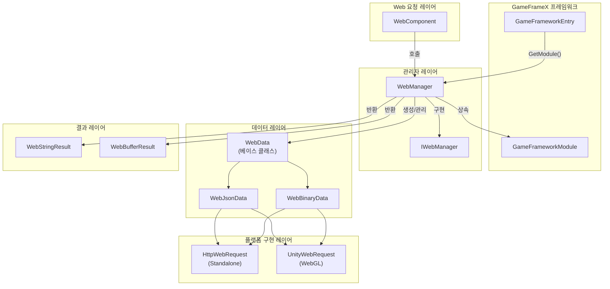
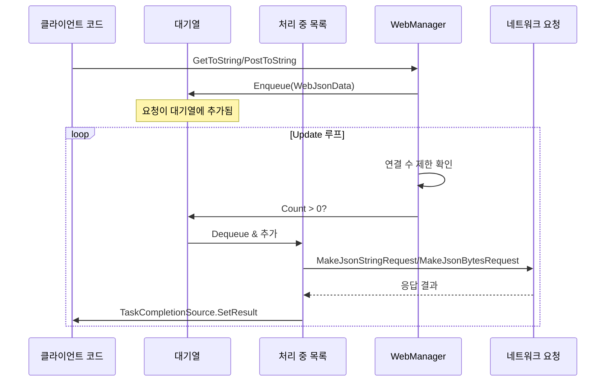
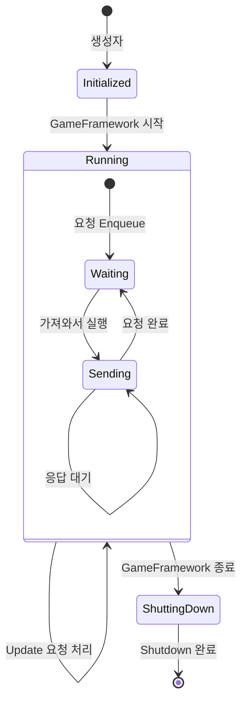
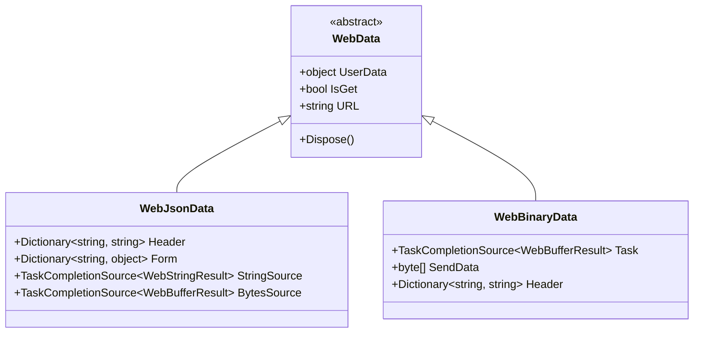

# WebManager 아키텍처

WebManager는 GameFrameX 프레임워크의 Web 요청 관리 모듈로, 모든 HTTP GET 및 POST 요청을 처리합니다. 대기열식 요청 처리 메커니즘을 채택하며, 연결 수 제한을 지원하고 크로스 플랫폼(Standalone 및 WebGL)을 제공합니다.

## 개요

WebManager는 GameFrameX 프레임워크의 핵심 모듈 중 하나로,底层 HTTP 요청 구현을 캡슐화하여 게임 애플리케이션에 통일된 네트워크 요청 진입점을 제공합니다. 설계 목표는 다음과 같습니다:

- **통일 인터페이스**: 일관된 GET/POST 요청 메서드 제공
- **비동기 처리**: Task 기반 비동기 프로그래밍 모델
- **연결 관리**: 각 서버 최대 연결 수 제한 지원
- **크로스 플랫폼**: Standalone 및 WebGL 플랫폼 호환
- **기본 데이터**: 전역 요청 헤더, 쿼리 매개변수 및 폼 데이터 지원

WebManager는 `GameFrameworkModule`을 상속하며, GameFrameX 프레임워크 수명 주기 관리의 일부입니다. 게임 초기화 시 자동으로 생성되고 게임 종료 시 자동으로 리소스를 정리합니다.

## 아키텍처 설계

### 전체 아키텍처도



### 핵심 컴포넌트

#### IWebManager 인터페이스

`IWebManager` 인터페이스는 Web 요청 관리자의 모든 공용 메서드를 정의하며, WebManager의 추상 계약입니다. 인터페이스는 다양한 요청 시나리오를 지원하는 여러 오버로드 메서드를 제공합니다:

> 자세한 인터페이스 정의는 [IWebManager 인터페이스](./04.iwebmanager-interface)를 참조하세요.

#### WebManager 구현 클래스

`WebManager`는 `IWebManager` 인터페이스의 구체 구현으로, `GameFrameworkModule`을 상속합니다. 부분 클래스(partial class) 방식을 채택하여 코드를 구성하며, 다양한 기능 모듈을 여러 파일로 분리합니다:

| 파일 | 책임 |
|------|------|
| WebManager.cs | 주요 구현: 대기열 관리, 요청 처리, 기본 데이터 병합 |
| WebManager.WebData.cs | WebData 베이스 클래스 정의 |
| WebManager.WebJsonData.cs | JSON 요청 데이터 클래스 |
| WebManager.WebBinary.cs | Binary/ProtoBuf 요청 처리 |

```csharp
public partial class WebManager : GameFrameworkModule, IWebManager
{
    // 처리 대기 중인 일반 요청 대기열
    private readonly Queue<WebJsonData> m_WaitingNormalQueue = new Queue<WebJsonData>(256);

    // 처리 중인 일반 요청 목록
    private readonly List<WebJsonData> m_SendingNormalList = new List<WebJsonData>(16);

    // 각 서버의 최대 연결 수
    public int MaxConnectionPerServer { get; set; }
}
```
> Source: [WebManager.cs](https://github.com/GameFrameX/com.gameframex.unity.web/blob/main/Runtime/Web/WebManager.cs#L20-L29)

#### WebComponent 컴포넌트

`WebComponent`는 Unity 컴포넌트 캡슐화로, `IWebManager`와 동일한 메서드 시그니처를 제공하지만 Unity 컴포넌트 방식으로 게임 로직 레이어에 노출됩니다. `Awake` 단계에서 WebManager 인스턴스를 가져옵니다:

```csharp
protected override void Awake()
{
    ImplementationComponentType = Utility.Assembly.GetType(componentType);
    InterfaceComponentType = typeof(IWebManager);
    base.Awake();
    m_WebManager = GameFrameworkEntry.GetModule<IWebManager>();
}
```
> Source: [WebComponent.cs](https://github.com/GameFrameX/com.gameframex.unity.web/blob/main/Runtime/Web/WebComponent.cs#L76-L89)

## 요청 처리 흐름

### 요청 대기열 메커니즘

WebManager는 생산자-소비자 패턴을 채택하여 요청을 처리합니다:



### 요청 처리 Update 루프

WebManager는 각 프레임의 `Update` 메서드에서 대기 중인 요청을 확인하고 처리합니다:

```csharp
protected override void Update(float elapseSeconds, float realElapseSeconds)
{
    lock (m_StringBuilder)
    {
        // 최대 연결 수에 도달했는지 확인
        if (m_SendingNormalList.Count < MaxConnectionPerServer)
        {
            // 대기열에서 요청을 가져옴
            if (m_WaitingNormalQueue.Count > 0)
            {
                var webJsonData = m_WaitingNormalQueue.Dequeue();

                // 반환 유형에 따라 처리 메서드 선택
                if (webJsonData.UniTaskCompletionStringSource != null)
                {
                    MakeJsonStringRequest(webJsonData);
                }
                else
                {
                    MakeJsonBytesRequest(webJsonData);
                }

                // 처리 중 목록으로 이동
                m_SendingNormalList.Add(webJsonData);
            }
        }

        // 동시에 Binary 요청도 처리
        UpdateBinary(elapseSeconds, realElapseSeconds);
    }
}
```
> Source: [WebManager.cs](https://github.com/GameFrameX/com.gameframex.unity.web/blob/main/Runtime/Web/WebManager.cs#L81-L107)

### 연결 수 제한 메커니즘

`MaxConnectionPerServer` 속성을 통해 동시에 동일한 서버에 보내는 요청 수를 제어합니다:

- **기본값**: 8개의 연결
- **설계 목적**: 요청이 너무 많아 서버에 부담이 가거나 클라이언트 리소스가 고갈되는 것을 방지
- **작동 방식**: `m_SendingNormalList.Count < MaxConnectionPerServer`일 때만 대기열에서 새 요청을 가져옴

### 데이터 병합 메커니즘

WebManager는 전역 요청 매개변수 설정을 허용하는 기본 데이터(Base Data) 기능을 제공합니다:

```csharp
// 기본 폼 데이터 - 모든 요청이携带(포함)함
private readonly Dictionary<string, object> m_BaseForm = new Dictionary<string, object>(64);

// 기본 요청 헤더 - 모든 요청이携带(포함)함
private readonly Dictionary<string, string> m_BaseHeader = new Dictionary<string, string>(64);

// 기본 쿼리 매개변수 - 모든 요청이携带(포함)함
private readonly Dictionary<string, string> m_BaseQueryString = new Dictionary<string, string>(64);
```

요청을 보낼 때 기본 데이터와 요청 특정 데이터를 자동으로 병합합니다:

```csharp
private Dictionary<string, object> MergeForm(Dictionary<string, object> form)
{
    if (m_BaseForm.Count == 0)
    {
        return form;
    }

    // 기본 데이터 복사
    var result = new Dictionary<string, object>(m_BaseForm);

    // 외부 데이터로覆盖(덮어쓰기)/추가
    if (form != null)
    {
        foreach (var kv in form)
        {
            result[kv.Key] = kv.Value;
        }
    }

    return result;
}
```
> Source: [WebManager.cs](https://github.com/GameFrameX/com.gameframex.unity.web/blob/main/Runtime/Web/WebManager.cs#L685-L705)

## 플랫폼 차이 처리

### WebGL 플랫폼

WebGL 플랫폼에서 WebManager는 Unity의 `UnityWebRequest` API를 사용합니다:

```csharp
#if UNITY_WEBGL
using UnityEngine.Networking;

UnityWebRequest unityWebRequest;
if (webJsonData.IsGet)
{
    unityWebRequest = UnityWebRequest.Get(webJsonData.URL);
}
else
{
    unityWebRequest = UnityWebRequest.Post(webJsonData.URL, string.Empty);
}

unityWebRequest.certificateHandler = new DefaultBypassCertificate();
unityWebRequest.timeout = (int)RequestTimeout.TotalSeconds;
```

### Standalone 플랫폼

Standalone 플랫폼에서 .NET의 `HttpWebRequest` API를 사용합니다:

```csharp
HttpWebRequest request = WebRequest.CreateHttp(webJsonData.URL);
request.Method = webJsonData.IsGet ? WebRequestMethods.Http.Get : WebRequestMethods.Http.Post;
request.Timeout = (int)RequestTimeout.TotalMilliseconds;
```

### SSL 인증서 처리

WebGL 플랫폼은 `DefaultBypassCertificate` 클래스를 사용하여 SSL 인증서 검증을绕过(우회)합니다:

```csharp
public sealed class DefaultBypassCertificate : CertificateHandler
{
    protected override bool ValidateCertificate(byte[] certificateData)
    {
        return true;
    }
}
```
> Source: [DefaultBypassCertificate.cs](https://github.com/GameFrameX/com.gameframex.unity.web/blob/main/Runtime/Web/DefaultBypassCertificate.cs#L39-L45)

> **주의**: 프로덕션 환경에서 자체 서명 인증서를 사용할 때는 SSL 검증을 주의해서 처리하세요.

## 리소스 관리

### 수명 주기

WebManager의 리소스 관리는 세 단계로 나뉩니다:



### 리소스 정리

`Shutdown` 메서드에서 시스템은 모든 대기 중 및 처리 중인 요청을 정리합니다:

```csharp
protected override void Shutdown()
{
    // 대기열 정리
    while (m_WaitingNormalQueue.Count > 0)
    {
        var webData = m_WaitingNormalQueue.Dequeue();
        webData.Dispose();
    }

    // 처리 중 목록 정리
    while (m_SendingNormalList.Count > 0)
    {
        var webData = m_SendingNormalList[0];
        m_SendingNormalList.RemoveAt(0);
        webData.Dispose();
    }

    // 메모리 스트림 정리
    m_MemoryStream.Dispose();
}
```
> Source: [WebManager.cs](https://github.com/GameFrameX/com.gameframex.unity.web/blob/main/Runtime/Web/WebManager.cs#L112-L131)

## 요청 데이터 유형

WebManager는 계층화된 데이터 클래스 구조를 사용하여 요청 정보를 캡슐화합니다:



- **WebData**: 베이스 클래스로, 일반 속성(UserData, IsGet, URL)을 포함
- **WebJsonData**: JSON 형식 요청으로, 폼 데이터와 요청 헤더를 포함
- **WebBinaryData**: 이진/ProtoBuf 형식 요청

## 관련 링크

- [IWebManager 인터페이스](./04.iwebmanager-interface)
- [WebComponent 컴포넌트](./08.web-component)
- [요청 결과 유형](./06.result-types)
- [타임아웃 구성](./10.timeout-settings)
- [기본 데이터 구성](./07.base-data)
- [플랫폼 차이 설명](./09.platform-differences)