# 요청 결과 유형

GameFrameX Web 컴포넌트는 다양한 요청 결과 유형을 제공하여 HTTP 응답 데이터를 다양한 형식으로 캡슐화합니다. 이러한 결과 유형은 간결하게 설계되어 통일된 API 디자인 패턴을 따르며, 개발자가 비즈니스 요구에 따라 적절한 반환 유형을 선택할 수 있도록 도와줍니다.

## 개요

GameFrameX Web 컴포넌트에서 모든 HTTP 요청 메서드는 특정 결과 유형을 반환합니다. 요청 방식과 데이터 형식에 따라 개발자는 문자열 결과, 바이트 배열 결과 또는解析된 JSON 데이터 구조를 선택할 수 있습니다.

요청 결과 유형의 설계는 다음 원칙을 따릅니다:
- **단일 책임**: 각 결과 유형은 특정 형식 데이터 캡슐화만 담당
- **사용자 데이터 전달**: `UserData` 속성을 통해 요청과 응답 간 컨텍스트 데이터 전달 지원
- **예외 처리**: 요청 실패 시 예외 메커니즘을 통해 오류 정보를 전달하며, 오류 코드를 반환하지 않음

## 아키텍처 설계

요청 결과 유형은 전체 아키텍처에서 데이터 캡슐화 레이어 역할을 하며,底层 HTTP 응답을 비즈니스 레이어에서 직접 사용할 수 있는 객체로 변환합니다.

```mermaid
flowchart TD
    subgraph Client["클라이언트 코드"]
        Caller[호출자]
    end

    subgraph WebManager["WebManager 요청 처리"]
        ReqHandler[요청 프로세서]
        Queue[요청 대기열]
    end

    subgraph ResultTypes["결과 유형 레이어"]
        WSR[WebStringResult]
        WBR[WebBufferResult]
        HJR[HttpJsonResult]
        HJRD[HttpJsonResultData<T>]
        HJRH[HttpJsonResultHelper]
    end

    subgraph Platform["플랫폼 구현"]
        UnityWeb[UnityWebRequest<br/>WebGL 플랫폼]
        HttpWeb[HttpWebRequest<br/>PC/모바일 플랫폼]
    end

    Caller --> ReqHandler
    ReqHandler --> Queue
    Queue --> UnityWeb
    Queue --> HttpWeb
    UnityWeb --> WSR
    UnityWeb --> WBR
    HttpWeb --> WSR
    HttpWeb --> WBR
    WSR --> Caller
    WBR --> Caller
    HJR -.-> WSR
    HJRD -.-> HJR
    HJRH -.-> HJRD
```



### 각 컴포넌트 책임

| 컴포넌트 | 책임 |
|------|------|
| **WebStringResult** | 문자열 형식의 응답 데이터 캡슐화 |
| **WebBufferResult** | 이진 바이트 배열 응답 데이터 캡슐화 |
| **HttpJsonResult** | 표준 JSON 응답 구조 정의 (Code/Message/Data) |
| **`HttpJsonResultData<T>`** | 성공 플래그가 있는 제네릭 결과 래퍼 |
| **HttpJsonResultHelper** | JSON 문자열을 결과 객체로 변환하는 메서드 제공 |

## 핵심 결과 유형

### WebStringResult - 문자열 결과

`WebStringResult`는 문자열 내용 반환을 캡슐화하는 HTTP 응답에 사용되며, 순수 텍스트, HTML 또는 비구조화 텍스트 데이터 시나리오에 적합합니다.

```csharp
namespace GameFrameX.Web.Runtime
{
    [UnityEngine.Scripting.Preserve]
    public sealed class WebStringResult
    {
        [UnityEngine.Scripting.Preserve]
        public WebStringResult(object userData, string result)
        {
            UserData = userData;
            Result = result;
        }

        /// <summary>
        /// 요청이 반환한 문자열 결과를 가져옵니다
        /// </summary>
        public string Result { get; }

        /// <summary>
        /// 요청 시 전달된 사용자 정의 데이터를 가져오며, 요청 시 전달된 데이터가 그대로 반환됩니다
        /// </summary>
        public object UserData { get; }

        public override string ToString()
        {
            return $"[Result]:{Result}";
        }
    }
}
```

> Source: [WebStringResult.cs](https://github.com/GameFrameX/com.gameframex.unity.web/blob/main/Runtime/Web/WebStringResult.cs#L1-L40)

**속성 설명:**

| 속성 | 유형 | 설명 |
|------|------|------|
| `Result` | string | HTTP 응답이 반환한 문자열 내용 |
| `UserData` | object | 요청 시 전달된 사용자 정의 데이터로, 콜백에서 요청 컨텍스트 식별에 사용 |

### WebBufferResult - 이진 결과

`WebBufferResult`는 바이트 배열 반환을 캡슐화하는 HTTP 응답에 사용되며, 이미지, 파일, Protocol Buffers 등의 이진 데이터 시나리오에 적합합니다.

```csharp
namespace GameFrameX.Web.Runtime
{
    public sealed class WebBufferResult
    {
        public WebBufferResult(object userData, byte[] result)
        {
            UserData = userData;
            Result = result;
        }

        /// <summary>
        /// 요청 결과
        /// </summary>
        public byte[] Result { get; }

        /// <summary>
        /// 사용자 정의 데이터
        /// </summary>
        public object UserData { get; }
    }
}
```

> Source: [WebBufferResult.cs](https://github.com/GameFrameX/com.gameframex.unity.web/blob/main/Runtime/Web/WebBufferResult.cs#L1-L21)

**속성 설명:**

| 속성 | 유형 | 설명 |
|------|------|------|
| `Result` | byte[] | HTTP 응답이 반환한 바이트 배열로, 파일 다운로드, 이미지 로딩 등에 사용 가능 |
| `UserData` | object | 요청 시 전달된 사용자 정의 데이터 |

### HttpJsonResult - JSON 응답 구조

`HttpJsonResult`는 표준 JSON 응답 구조를 정의하며,服务端统一返回 형식을解析해야 하는 시나리오에 적합합니다. 많은 백엔드 API는 `{ "code": 0, "message": "success", "data": {...} }`와 같은 통일된 JSON 형식을 반환합니다.

```csharp
using Newtonsoft.Json;

namespace GameFrameX.Web.Runtime
{
    [UnityEngine.Scripting.Preserve]
    public sealed class HttpJsonResult
    {
        /// <summary>
        /// 응답 코드는 0이 성공입니다
        /// </summary>
        [JsonProperty(PropertyName = "code")]
        public int Code { get; set; }

        /// <summary>
        /// 응답 메시지
        /// </summary>
        [JsonProperty(PropertyName = "message")]
        public string Message { get; set; }

        /// <summary>
        /// 응답 데이터.
        /// </summary>
        [JsonProperty(PropertyName = "data")]
        public string Data { get; set; }

        public override string ToString()
        {
            return JsonConvert.SerializeObject(this);
        }
    }
}
```

> Source: [HttpJsonResult.cs](https://github.com/GameFrameX/com.gameframex.unity.web/blob/main/Runtime/Extensions/HttpJsonResult.cs#L1-L34)

**속성 설명:**

| 속성 | 유형 | JSON 필드 | 설명 |
|------|------|-----------|------|
| `Code` | int | code | 응답 상태 코드로, 0은 성공, 다른 값은 다양한 오류를 나타냄 |
| `Message` | string | message | 응답 설명 정보로, 일반적으로 오류 안내에 사용 |
| `Data` | string | data | 응답 데이터 내용으로, JSON 문자열 형식 |

### `HttpJsonResultData<T>` - 제네릭 결과 래퍼

`HttpJsonResultData<T>`는 제네릭 결과 유형으로, `HttpJsonResult`的基础上增加了成功标志와 형식화된 데이터 속성을 제공하여 강类型 결과 데이터를 직접 가져올 수 있습니다.

```csharp
namespace GameFrameX.Web.Runtime
{
    public sealed class HttpJsonResultData<T>
    {
        /// <summary>
        /// 성공 여부
        /// 요청이 성공적으로 실행되었는지 나타내며, 성공 시 true, 실패 시 false입니다.
        /// </summary>
        public bool IsSuccess { get; set; } = false;

        /// <summary>
        /// 응답 코드
        /// 요청 처리 결과를 나타내며, 0은 성공, 다른 값은 다양한 오류 유형을 나타냅니다.
        /// </summary>
        public int Code { get; set; }

        /// <summary>
        /// 데이터 객체
        /// 요청 성공 시 반환되는 데이터를 포함하며, 유형은 T입니다.
        /// 요청 실패 시 기본값 또는 null일 수 있습니다.
        /// </summary>
        public T Data { get; set; }
    }
}
```

> Source: [HttpJsonResultData.cs](https://github.com/GameFrameX/com.gameframex.unity.web/blob/main/Runtime/Extensions/HttpJsonResultData.cs#L1-L29)

**속성 설명:**

| 속성 | 유형 | 설명 |
|------|------|------|
| `IsSuccess` | bool | 요청이 성공적으로 완료되었는지를 나타내는 플래그 |
| `Code` | int | 응답 상태 코드로, HttpJsonResult.Code와 일치 |
| `Data` | T | 제네릭 데이터 객체로, JSON 역직렬화가 완료됨 |

### HttpJsonResultHelper - JSON解析 보조 클래스

`HttpJsonResultHelper`는 JSON 문자열을 강类型 `HttpJsonResultData<T>` 객체로 변환하는 확장 메서드를 제공하여, 원본 응답에서 비즈니스 객체로의 변환 과정을简化합니다.

```csharp
using System;
using GameFrameX.Runtime;
using Newtonsoft.Json;

namespace GameFrameX.Web.Runtime
{
    public static class HttpJsonResultHelper
    {
        /// <summary>
        /// JSON 문자열을 HttpJsonResultData&lt;T&gt; 객체로 변환합니다.
        /// 이 메서드는 주어진 JSON 문자열을 역직렬화하려고 시도하며, HTTP 응답의 상태 코드에 따라 IsSuccess 속성을 설정합니다.
        /// 요청이 성공하면 Data 속성에 역직렬화된 데이터 객체가 포함됩니다. 그렇지 않으면 Data는 기본값입니다.
        /// </summary>
        /// <typeparam name="T">역직렬화할 객체 유형으로, 클래스이고 매개변수 없는 생성자가 있어야 합니다.</typeparam>
        /// <param name="jsonResult">HTTP 응답을 포함하는 JSON 문자열입니다.</param>
        /// <returns>역직렬화 결과를 나타내는 HttpJsonResultData&lt;T&gt; 객체입니다.</returns>
        public static HttpJsonResultData<T> ToHttpJsonResultData<T>(this string jsonResult) where T : class, new()
        {
            HttpJsonResultData<T> resultData = new HttpJsonResultData<T>
            {
                IsSuccess = false,
            };
            try
            {
                var httpJsonResult = JsonConvert.DeserializeObject<HttpJsonResult>(jsonResult);
                if (httpJsonResult.Code != 0)
                {
                    resultData.Code = httpJsonResult.Code;
                    return resultData;
                }

                resultData.IsSuccess = true;
                resultData.Data = string.IsNullOrEmpty(httpJsonResult.Data) ? new T() : JsonConvert.DeserializeObject<T>(httpJsonResult.Data);
            }
            catch (Exception e)
            {
                Log.Error(e);
            }

            return resultData;
        }
    }
}
```

> Source: [HttpJsonResultHelper.cs](https://github.com/GameFrameX/com.gameframex.unity.web/blob/main/Runtime/Extensions/HttpJsonResultHelper.cs#L1-L50)

## 요청 흐름 및 결과 처리

IWebManager의 요청 메서드를 호출하면 요청부터 결과까지의 전체 흐름은 다음과 같습니다:

```mermaid
sequenceDiagram
    participant Client as 클라이언트 코드
    participant QM as WebManager
    participant Queue as 요청 대기열
    participant Platform as 플랫폼 레이어<br/>(UnityWebRequest/HttpWebRequest)
    participant Result as 결과 유형

    Client->>QM: GetToString(url, userData)
    QM->>Queue: Enqueue(WebJsonData)
    Queue->>Platform: 요청 처리
    Platform->>Result: new WebStringResult(userData, content)
    Result-->>Client: Task&lt;WebStringResult&gt; 완료
```

### 결과 유형 선택 가이드

| 시나리오 | 권장 결과 유형 | 설명 |
|------|-------------|------|
| 순수 텍스트 응답 가져오기 | `Task<WebStringResult>` | HTML, 순수 텍스트 등 비구조화 데이터에 적합 |
| 파일/이미지 다운로드 | `Task<WebBufferResult>` | 이진 데이터 처리에 적합 |
| 통일 JSON API | `WebStringResult` + `HttpJsonResultHelper` | 표준 JSON 응답 형식에 적합 |
| 강类型 JSON 데이터 | `WebStringResult` + `HttpJsonResultData<T>` | 유형 안전성이 필요한 시나리오에 적합 |

## 사용 예제

### 기본 문자열 요청

```csharp
using GameFrameX.Web.Runtime;
using GameFrameX.Runtime;
using System.Threading.Tasks;

public async Task<string> GetStringResult()
{
    IWebManager webManager = GameFrameworkEntry.GetModule<IWebManager>();

    // GET 요청 보내기
    var result = await webManager.GetToString("https://api.example.com/text");

    // 문자열 결과 가져오기
    string content = result.Result;

    // 요청 시 전달된 사용자 정의 데이터 가져오기
    object userData = result.UserData;

    return content;
}
```

> Source: [WebManager.cs](https://github.com/GameFrameX/com.gameframex.unity.web/blob/main/Runtime/Web/WebManager.cs#L140-L143)

### 이진 데이터 요청

```csharp
using GameFrameX.Web.Runtime;
using GameFrameX.Runtime;
using System.Threading.Tasks;

public async Task<byte[]> DownloadFile()
{
    IWebManager webManager = GameFrameworkEntry.GetModule<IWebManager>();

    // 바이트 배열 가져오기 위해 GET 요청 보내기
    var result = await webManager.GetToBytes("https://api.example.com/file/image.png");

    // 이진 데이터 가져오기
    byte[] data = result.Result;

    return data;
}
```

> Source: [WebManager.cs](https://github.com/GameFrameX/com.gameframex.unity.web/blob/main/Runtime/Web/WebManager.cs#L152-L155)

### JSON 응답 분석

```csharp
using GameFrameX.Web.Runtime;
using GameFrameX.Runtime;
using Newtonsoft.Json;
using System.Threading.Tasks;

// 응답 데이터 유형 정의
public class UserInfo
{
    [JsonProperty("id")]
    public int Id { get; set; }

    [JsonProperty("name")]
    public string Name { get; set; }

    [JsonProperty("email")]
    public string Email { get; set; }
}

public async Task<UserInfo> GetUserInfo()
{
    IWebManager webManager = GameFrameworkEntry.GetModule<IWebManager>();

    // 원본 JSON 문자열 가져오기
    var result = await webManager.GetToString("https://api.example.com/user/1");
    string jsonResponse = result.Result;

    // 보조 클래스를 사용하여 강类型 결과로 변환
    var jsonResult = jsonResponse.ToHttpJsonResultData<UserInfo>();

    // 요청 성공 여부 확인
    if (jsonResult.IsSuccess)
    {
        return jsonResult.Data;
    }
    else
    {
        Log.Error($"요청 실패, 오류 코드: {jsonResult.Code}");
        return null;
    }
}
```

> Source: [HttpJsonResultHelper.cs](https://github.com/GameFrameX/com.gameframex.unity.web/blob/main/Runtime/Extensions/HttpJsonResultHelper.cs#L20-L48)

### 사용자 데이터가 포함된 요청 추적

```csharp
using GameFrameX.Web.Runtime;
using GameFrameX.Runtime;
using System.Threading.Tasks;
using System.Collections.Generic;

public class RequestContext
{
    public string RequestId { get; set; }
    public string RequestType { get; set; }
}

public async Task TrackRequestWithUserData()
{
    IWebManager webManager = GameFrameworkEntry.GetModule<IWebManager>();

    // 요청 컨텍스트 생성
    var context = new RequestContext
    {
        RequestId = System.Guid.NewGuid().ToString(),
        RequestType = "UserInfo"
    };

    // 컨텍스트를 userData로 전달
    var result = await webManager.GetToString(
        "https://api.example.com/user/1",
        context  // 사용자 정의 데이터 전달
    );

    // 콜백에서 컨텍스트 정보 가져오기
    var returnedContext = result.UserData as RequestContext;
    if (returnedContext != null)
    {
        Log.Info($"요청 {returnedContext.RequestId} 완료");
    }
}
```

### 오류 처리

요청 실패 시 예외는 Task의 예외 메커니즘을 통해 전파됩니다. 호출处에서 try-catch 처리가 필요합니다:

```csharp
using GameFrameX.Web.Runtime;
using GameFrameX.Runtime;
using System;
using System.IO;
using System.Net;
using System.Threading.Tasks;

public async Task<string> SafeRequest(string url)
{
    IWebManager webManager = GameFrameworkEntry.GetModule<IWebManager>();

    try
    {
        var result = await webManager.GetToString(url);
        return result.Result;
    }
    catch (WebException ex) when (ex.Status == WebExceptionStatus.Timeout)
    {
        Log.Error($"요청超时: {url} - {ex.Message}");
        throw;
    }
    catch (IOException ex)
    {
        Log.Error($"네트워크 IO 오류: {url} - {ex.Message}");
        throw;
    }
    catch (Exception ex)
    {
        Log.Error($"요청 실패: {url} - {ex.Message}");
        throw;
    }
}
```

> Source: [WebManager.cs](https://github.com/GameFrameX/com.gameframex.unity.web/blob/main/Runtime/Web/WebManager.cs#L298-L324)

## API 참조

### WebStringResult

```csharp
namespace GameFrameX.Web.Runtime
{
    public sealed class WebStringResult
    {
        public WebStringResult(object userData, string result);

        // 속성
        public string Result { get; }
        public object UserData { get; }

        public override string ToString();
    }
}
```

### WebBufferResult

```csharp
namespace GameFrameX.Web.Runtime
{
    public sealed class WebBufferResult
    {
        public WebBufferResult(object userData, byte[] result);

        // 속성
        public byte[] Result { get; }
        public object UserData { get; }
    }
}
```

### HttpJsonResult

```csharp
namespace GameFrameX.Web.Runtime
{
    public sealed class HttpJsonResult
    {
        [JsonProperty("code")]
        public int Code { get; set; }

        [JsonProperty("message")]
        public string Message { get; set; }

        [JsonProperty("data")]
        public string Data { get; set; }
    }
}
```

### `HttpJsonResultData<T>`

```csharp
namespace GameFrameX.Web.Runtime
{
    public sealed class HttpJsonResultData<T>
    {
        public bool IsSuccess { get; set; }
        public int Code { get; set; }
        public T Data { get; set; }
    }
}
```

### HttpJsonResultHelper

```csharp
namespace GameFrameX.Web.Runtime
{
    public static class HttpJsonResultHelper
    {
        public static HttpJsonResultData<T> ToHttpJsonResultData<T>(
            this string jsonResult
        ) where T : class, new();
    }
}
```

## 관련 링크

- [WebManager 아키텍처](./05.web-manager) - WebManager의 전체 아키텍처 및 요청 처리 흐름 이해
- [IWebManager 인터페이스](./04.iwebmanager-interface) - 모든 HTTP 요청 메서드의 상세 API 확인
- [WebComponent 컴포넌트](./08.web-component) - WebComponent의 편리한 캡슐화 사용
- [타임아웃 구성](./10.timeout-settings) - 요청超时 시간 구성
- [기본 데이터 구성](./07.base-data) - 전역 요청 매개변수 구성