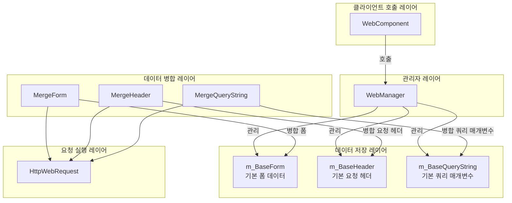
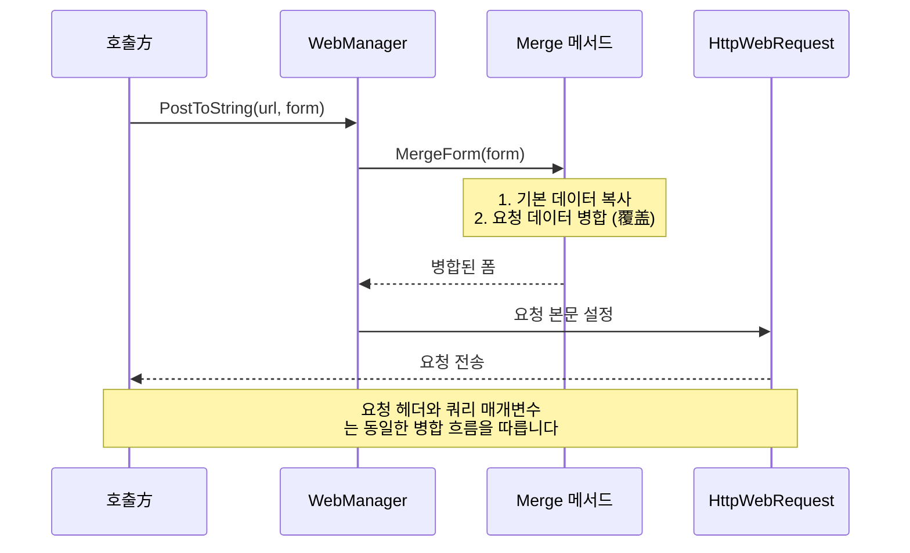
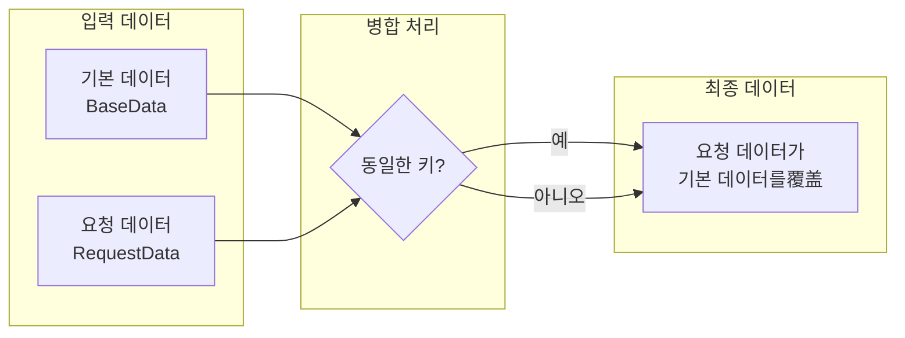

# 기본 데이터 구성

기본 데이터 구성 기능을 통해 개발자는 전역 범용 요청 매개변수를 설정할 수 있으며, 이러한 매개변수는 모든 HTTP 요청에 자동으로附加(추가)되어 매번 요청 시 반복 설정할 필요가 없습니다.

## 개요

WebComponent를 사용하여 HTTP 요청을 보낼 때, 많은 시나리오에서 모든 요청에 공통 매개변수를 추가해야 합니다, 예를 들어:

- **인증**: API Token, 사용자 세션 ID
- **애플리케이션 정보**: 애플리케이션 버전, 장치 플랫폼, 채널 식별자
- **범용 매개변수**: 언어 설정, 지역 코드

기본 데이터 구성은 이러한 요구를 해결하기 위해 설계되었습니다. 기본 데이터를 사전에 구성함으로써 개발자는 이러한 범용 매개변수를 한 번만 설정하면 되며, 이후 모든 요청이 자동으로 이 데이터를 포함하므로 코드가简化되고 반복 작업이 줄어듭니다.

### 설계 원리

기본 데이터는 "병합而非替换" 전략을 채택합니다:

1. **기본 데이터**는 초기화 시 한 번 설정되며, 전체 애플리케이션生命周期 동안 유지됩니다
2. **요청 데이터**는每次 요청 시 개별적으로 지정됩니다
3. **병합 시**: 요청 데이터에 기본 데이터와 동일한 키가 포함되어 있으면 요청 데이터가 기본 데이터를**覆盖**합니다
4. 이러한 설계는 기본 데이터의 편리성을 보장하면서도 개별 요청의 유연성을 유지합니다

## 아키텍처

기본 데이터 구성은 WebManager의 핵심 기능 중 하나로, 요청 처리 흐름과 긴밀하게 통합됩니다.



### 각 컴포넌트 책임

| 컴포넌트 | 책임 |
|------|------|
| WebComponent | Unity 컴포넌트 인터페이스를 제공하며, IWebManager 호출을代理합니다 |
| WebManager | 기본 데이터 관리 및 요청 병합 로직을 구현합니다 |
| m_BaseForm | 전역 폼 데이터 사전을 저장합니다 |
| m_BaseHeader | 전역 요청 헤더 사전을 저장합니다 |
| m_BaseQueryString | 전역 쿼리 매개변수 사전을 저장합니다 |
| Merge* 메서드 | 기본 데이터와 요청 데이터의 병합을 실행합니다 |

## 핵심 기능

WebManager는 세 가지 유형의 기본 데이터 관리 기능을 제공합니다:

### 1. 기본 폼 데이터 (Base Form)

기본 폼 데이터는 POST 요청의 요청 본문에 추가되며, 요청과 함께 전송해야 하는 범용 업무 매개변수에 적합합니다.

```csharp
// 기본 폼 데이터 추가
webComponent.AddBaseForm("app_version", "1.0.0");
webComponent.AddBaseForm("platform", "iOS");
webComponent.AddBaseForm("device_id", "ABC123");
```

> Source: [WebManager.cs](https://github.com/GameFrameX/com.gameframex.unity.web/blob/main/Runtime/Web/WebManager.cs#L591-L594)

### 2. 기본 요청 헤더 데이터 (Base Header)

기본 요청 헤더 데이터는 모든 HTTP 요청의 요청 헤더에 추가되며, 인증 및 내용 협상에 자주 사용됩니다.

```csharp
// 기본 요청 헤더 데이터 추가
webComponent.AddBaseHeader("Authorization", "Bearer token123");
webComponent.AddBaseHeader("Accept", "application/json");
webComponent.AddBaseHeader("X-Request-ID", Guid.NewGuid().ToString());
```

> Source: [WebManager.cs](https://github.com/GameFrameX/com.gameframex.unity.web/blob/main/Runtime/Web/WebManager.cs#L621-L624)

### 3. 기본 쿼리 매개변수 데이터 (Base Query String)

기본 쿼리 매개변수는 요청 URL 뒤에附加(추가)되며, API 버전, 언어 설정 등의 범용 매개변수에 적합합니다.

```csharp
// 기본 쿼리 매개변수 데이터 추가
webComponent.AddBaseQueryString("v", "2");
webComponent.AddBaseQueryString("lang", "zh-CN");
webComponent.AddBaseQueryString("timestamp", DateTimeOffset.Now.ToUnixTimeSeconds().ToString());
```

> Source: [WebManager.cs](https://github.com/GameFrameX/com.gameframex.unity.web/blob/main/Runtime/Web/WebManager.cs#L651-L654)

### 데이터 관리 메서드

각 기본 데이터 유형은 세 가지 관리 메서드를 제공합니다:

| 메서드 | 기능 | 설명 |
|------|------|------|
| Add* | 데이터 추가 | 키가 존재하면覆盖, 존재하지 않으면新增 |
| Remove* | 데이터 제거 | 지정된 키가 존재하지 않으면 조용히 무시 |
| Clear* | 데이터 비우기 | 해당 유형의 모든 기본 데이터를 한 번에 지웁니다 |

```csharp
// 개별 기본 데이터 제거
webComponent.RemoveBaseForm("device_id");

// 모든 기본 폼 데이터 지우기
webComponent.ClearBaseForm();

// 모든 기본 요청 헤더 지우기
webComponent.ClearBaseHeader();

// 모든 기본 쿼리 매개변수 지우기
webComponent.ClearBaseQueryString();
```

> Source: [IWebManager.cs](https://github.com/GameFrameX/com.gameframex.unity.web/blob/main/Runtime/Web/IWebManager.cs#L147-L198)

## 데이터 병합 흐름

HTTP 요청을 보낼 때 기본 데이터는 요청 매개변수와 자동으로 병합됩니다. 병합 메커니즘을 이해하면 이 기능을 더 잘 사용할 수 있습니다.



### 병합 우선순위



**병합 규칙**:
- 요청 데이터에 특정 키가 포함되어 있으면 해당 값이 기본 데이터의 동일 키 값을**覆盖**합니다
- 요청 데이터에 특정 키가 포함되어 있지 않으면 기본 데이터의 값이 사용됩니다
- 기본 데이터 자체는 수정되지 않습니다

### 병합 구현 예제

```csharp
/// <summary>
/// 폼 데이터 병합
/// </summary>
private Dictionary<string, object> MergeForm(Dictionary<string, object> form)
{
    if (m_BaseForm.Count == 0)
    {
        return form;
    }

    // 기본 데이터 복사
    var result = new Dictionary<string, object>(m_BaseForm);

    // 외부 데이터로覆盖/추가
    if (form != null)
    {
        foreach (var kv in form)
        {
            result[kv.Key] = kv.Value;
        }
    }

    return result;
}
```

> Source: [WebManager.cs](https://github.com/GameFrameX/com.gameframex.unity.web/blob/main/Runtime/Web/WebManager.cs#L685-L705)

## 사용 시나리오 예제

### 시나리오 1: 애플리케이션 시작 시 기본 데이터 초기화

게임 또는 애플리케이션 시작 시 전역 매개변수를 구성합니다:

```csharp
public class GameLauncher : MonoBehaviour
{
    private WebComponent _webComponent;

    private void Start()
    {
        _webComponent = GetComponent<WebComponent>();

        // 기본 쿼리 매개변수 구성
        _webComponent.AddBaseQueryString("v", "2.0.0");
        _webComponent.AddBaseQueryString("platform", Application.platform.ToString());

        // 기본 요청 헤더 구성
        _webComponent.AddBaseHeader("Authorization", $"Bearer {GetAuthToken()}");

        // 기본 폼 데이터 구성
        _webComponent.AddBaseForm("app_id", GetAppId());
    }

    private string GetAuthToken() { /* Token 가져오기 */ return "token"; }
    private string GetAppId() { /* AppID 가져오기 */ return "app123"; }
}
```

### 시나리오 2: API 요청 시 자동으로 기본 데이터携带

구성이 완료되면 이후 요청은 이러한 매개변수를 수동으로 추가할 필요가 없습니다:

```csharp
// 이후 요청은 이전에 설정된 기본 데이터를 자동으로携带합니다
// 최종 요청: POST /api/user/info?v=2.0.0&platform=iOS
//           Header: Authorization: Bearer token123
//           Body: {app_id: "app123", name: "test"}
var result = await _webComponent.PostToString(
    "https://api.example.com/api/user/info",
    new Dictionary<string, object> { { "name", "test" } }
);
```

### 시나리오 3: 일시적으로 기본 데이터覆盖

특정 요청에서 다른 값을 사용해야 하는 경우, 요청에서 직접 지정하면 됩니다:

```csharp
// 기본 데이터에 v=2.0.0이 설정되어 있어도 이 요청은 v=3.0.0을 사용합니다
var result = await _webComponent.PostToString(
    "https://api.example.com/api/v3/feature",
    new Dictionary<string, object> { { "name", "test" } },
    new Dictionary<string, string> { { "v", "3.0.0" } } // 기본 쿼리 매개변수覆盖
);
```

### 시나리오 4: 사용자 로그인 후 Token 업데이트

사용자 로그인 성공 후 인증 정보 업데이트:

```csharp
public async Task OnUserLogin(string newToken)
{
    // 이전 Token 제거
    _webComponent.RemoveBaseHeader("Authorization");

    // 새 Token 추가
    _webComponent.AddBaseHeader("Authorization", $"Bearer {newToken}");
}
```

### 시나리오 5: API 환경 전환

개발/프로덕션 환경 간 전환 시:

```csharp
public void SwitchEnvironment(bool isProduction)
{
    string baseUrl = isProduction
        ? "https://api.production.com"
        : "https://api.dev.com";

    // 비우고 기본 쿼리 매개변수 재설정
    _webComponent.ClearBaseQueryString();
    _webComponent.AddBaseQueryString("env", isProduction ? "prod" : "dev");
    _webComponent.AddBaseQueryString("debug", isProduction ? "false" : "true");
}
```

## API 참조

### IWebManager 인터페이스 메서드

다음 메서드는 `IWebManager` 인터페이스에 정의되어 있으며, `WebManager` 클래스가 구현합니다:

#### 폼 데이터 관리

| 메서드 | 설명 |
|------|------|
| `AddBaseForm(string key, object value)` | 기본 폼 데이터 추가 |
| `RemoveBaseForm(string key)` | 지정된 기본 폼 데이터 제거 |
| `ClearBaseForm()` | 모든 기본 폼 데이터 비우기 |

#### 요청 헤더 관리

| 메서드 | 설명 |
|------|------|
| `AddBaseHeader(string key, string value)` | 기본 요청 헤더 데이터 추가 |
| `RemoveBaseHeader(string key)` | 지정된 기본 요청 헤더 데이터 제거 |
| `ClearBaseHeader()` | 모든 기본 요청 헤더 데이터 비우기 |

#### 쿼리 매개변수 관리

| 메서드 | 설명 |
|------|------|
| `AddBaseQueryString(string key, string value)` | 기본 쿼리 매개변수 데이터 추가 |
| `RemoveBaseQueryString(string key)` | 지정된 기본 쿼리 매개변수 데이터 제거 |
| `ClearBaseQueryString()` | 모든 기본 쿼리 매개변수 데이터 비우기 |

> 완전한 IWebManager 인터페이스 정의는 [API 참조 - IWebManager 인터페이스](./04.iwebmanager-interface)를 참조하세요.

### WebComponent代理 메서드

`WebComponent`는 `GameFrameworkComponent`를 상속하며, 내부에 `IWebManager` 인스턴스를 보유하고 모든 기본 데이터 관리 메서드 호출을代理합니다. 사용 방식은 `IWebManager`를 직접 호출하는 것과 완전히 동일합니다.

> WebComponent의 완전한 설명은 [API 참조 - WebComponent 컴포넌트](./08.web-component)를 참조하세요.

## 관련 링크

- [타임아웃 구성](./10.timeout-settings) - 요청超时 시간 구성
- [IWebManager 인터페이스](./04.iwebmanager-interface) - Web 관리자의 완전한 인터페이스 정의
- [WebComponent 컴포넌트](./08.web-component) - Unity 컴포넌트 사용 설명
- [요청 결과 유형](./06.result-types) - 요청이 반환하는 결과 유형 이해