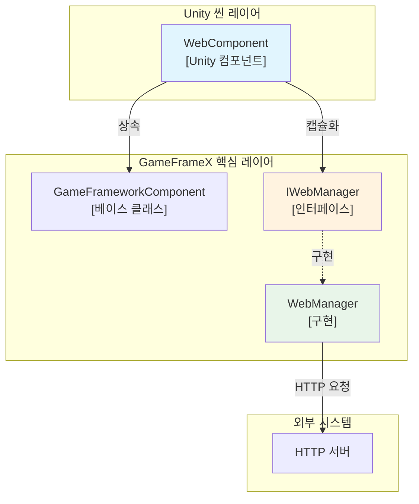
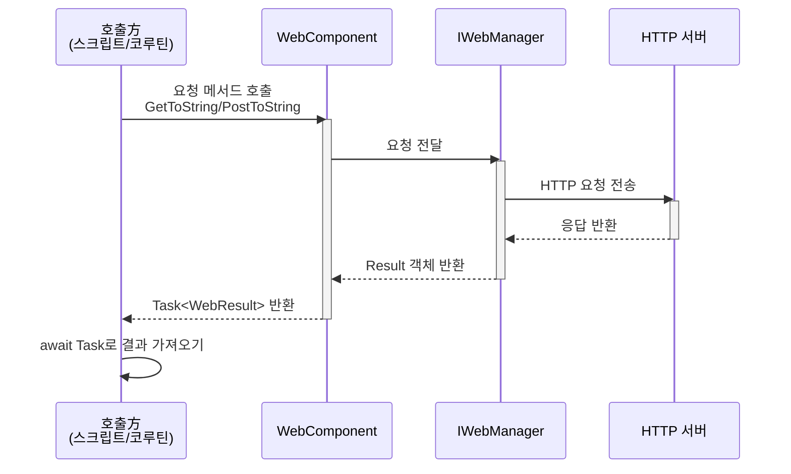
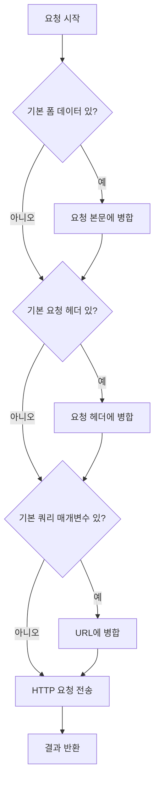

# WebComponent 컴포넌트

WebComponent는 GameFrameX 프레임워크가 제공하는 Unity 컴포넌트로, Unity 게임에서 HTTP 네트워크 요청 작업을简化합니다. 이 컴포넌트는 IWebManager 인터페이스를 캡슐화하여 Unity에 친숙한 비동기 요청 메서드를 제공합니다.

## 개요

WebComponent는 GameFrameworkComponent를 상속하는 Unity 컴포넌트로, Unity 씬에서 HTTP 네트워크 요청 기능을 제공하도록 설계되었습니다. 이 컴포넌트를 통해 개발자는 GET 및 POST 요청을 쉽게 보내고 문자열 또는 바이트 배열 형식의 응답 결과를 얻을 수 있습니다.

**주요 특성:**
- GET 및 POST 요청 지원
- 문자열과 바이트 배열 두 가지 응답 형식 지원
- 쿼리 매개변수, 요청 헤더 및 폼 데이터 구성 지원
-超时控制 메커니즘 제공
- 기본 데이터 구성을 지원하여 모든 요청에 범용 매개변수 추가 가능

## Architecture



**아키텍처 설명:**
- **WebComponent**: Unity 레이어의 컴포넌트로, GameObject에 붙여서 사용하며 간결한 API 제공
- **IWebManager**: 네트워크 요청 기능을 정의하는 인터페이스
- **WebManager**: IWebManager의 구체 구현으로, 실제 HTTP 통신 처리

## 핵심 기능

### HTTP 요청 메서드

WebComponent는 GET 및 POST 두 가지 요청 유형을 포괄하는 풍부한 HTTP 요청 메서드를 제공합니다:

#### GET 요청

```csharp
// 기본 GET 요청 - 문자열 반환
Task<WebStringResult> GetToString(string url, object userData = null)

// 쿼리 매개변수가 포함된 GET 요청 - 문자열 반환
Task<WebStringResult> GetToString(string url, Dictionary<string, string> queryString, object userData = null)

// 쿼리 매개변수와 요청 헤더가 포함된 GET 요청 - 문자열 반환
Task<WebStringResult> GetToString(string url, Dictionary<string, string> queryString, Dictionary<string, string> header, object userData = null)

// 기본 GET 요청 - 바이트 배열 반환
Task<WebBufferResult> GetToBytes(string url, object userData = null)

// 쿼리 매개변수가 포함된 GET 요청 - 바이트 배열 반환
Task<WebBufferResult> GetToBytes(string url, Dictionary<string, string> queryString, object userData = null)

// 쿼리 매개변수와 요청 헤더가 포함된 GET 요청 - 바이트 배열 반환
Task<WebBufferResult> GetToBytes(string url, Dictionary<string, string> queryString, Dictionary<string, string> header, object userData = null)
```

#### POST 요청

```csharp
// 기본 POST 요청 - 문자열 반환
Task<WebStringResult> PostToString(string url, Dictionary<string, object> from = null, object userData = null)

// 쿼리 매개변수가 포함된 POST 요청 - 문자열 반환
Task<WebStringResult> PostToString(string url, Dictionary<string, object> from, Dictionary<string, string> queryString, object userData = null)

// 쿼리 매개변수와 요청 헤더가 포함된 POST 요청 - 문자열 반환
Task<WebStringResult> PostToString(string url, Dictionary<string, object> from, Dictionary<string, string> queryString, Dictionary<string, string> header, object userData = null)

// 기본 POST 요청 - 바이트 배열 반환
Task<WebBufferResult> PostToBytes(string url, Dictionary<string, object> from, object userData = null)

// 쿼리 매개변수가 포함된 POST 요청 - 바이트 배열 반환
Task<WebBufferResult> PostToBytes(string url, Dictionary<string, object> from, Dictionary<string, string> queryString, object userData = null)

// 쿼리 매개변수와 요청 헤더가 포함된 POST 요청 - 바이트 배열 반환
Task<WebBufferResult> PostToBytes(string url, Dictionary<string, object> from, Dictionary<string, string> queryString, Dictionary<string, string> header, object userData = null)

// 바이트 배열 데이터 전송 POST 요청 - 바이트 배열 반환
Task<WebBufferResult> PostToBytes(string url, byte[] fromData, Dictionary<string, string> queryString, Dictionary<string, string> header, object userData = null)
```

### 기본 데이터 구성

WebComponent는 모든 요청에 자동으로 추가되는 기본 데이터를 구성하는 것을 지원하며, 인증 정보, 버전 번호 등을 통일하여 전달해야 하는 시나리오에 적합합니다:

```csharp
// 폼 데이터 관리
void AddBaseForm(string key, object value)
void RemoveBaseForm(string key)
void ClearBaseForm()

// 요청 헤더 관리
void AddBaseHeader(string key, string value)
void RemoveBaseHeader(string key)
void ClearBaseHeader()

// 쿼리 매개변수 관리
void AddBaseQueryString(string key, string value)
void RemoveBaseQueryString(string key)
void ClearBaseQueryString()
```

### 超时 구성

```csharp
//超时 시간 가져오기 또는 설정
public float Timeout
{
    get { return m_WebManager.Timeout; }
    set { m_WebManager.Timeout = m_Timeout = value; }
}
```

> Source: [WebComponent.cs](https://github.com/GameFrameX/com.gameframex.unity.web/blob/main/Runtime/Web/WebComponent.cs#L59-L70)

## Core Flow

### 요청 처리 흐름



### 기본 데이터 적용 흐름



## 사용 예제

### 기본 GET 요청

```csharp
using UnityEngine;
using GameFrameX.Web.Runtime;

public class ExampleScript : MonoBehaviour
{
    private WebComponent webComponent;

    private void Start()
    {
        // WebComponent 컴포넌트 가져오기
        webComponent = GetComponent<WebComponent>();

        // 간단한 GET 요청 전송
        _ = GetExample();
    }

    private async void GetExample()
    {
        var result = await webComponent.GetToString("https://api.example.com/data");
        if (!string.IsNullOrEmpty(result.Result))
        {
            Debug.Log($"GET 요청 성공: {result.Result}");
        }
    }
}
```

> Source: [WebComponent.cs](https://github.com/GameFrameX/com.gameframex.unity.web/blob/main/Runtime/Web/WebComponent.cs#L98-L101)

### 매개변수가 포함된 GET 요청

```csharp
// 쿼리 매개변수가 포함된 GET 요청
private async void GetWithQueryParams()
{
    var queryParams = new Dictionary<string, string>
    {
        { "page", "1" },
        { "limit", "10" }
    };

    var result = await webComponent.GetToString(
        "https://api.example.com/users",
        queryParams
    );
}

// 쿼리 매개변수와 사용자 정의 요청 헤더 포함
private async void GetWithHeaders()
{
    var queryParams = new Dictionary<string, string> { { "id", "123" } };
    var headers = new Dictionary<string, string>
    {
        { "Authorization", "Bearer token123" },
        { "Accept", "application/json" }
    };

    var result = await webComponent.GetToString(
        "https://api.example.com/protected",
        queryParams,
        headers
    );
}
```

> Source: [WebComponent.cs](https://github.com/GameFrameX/com.gameframex.unity.web/blob/main/Runtime/Web/WebComponent.cs#L110-L126)

### POST 요청 예제

```csharp
// POST 요청으로 폼 데이터 제출
private async void PostExample()
{
    var formData = new Dictionary<string, object>
    {
        { "username", "testuser" },
        { "password", "password123" }
    };

    var result = await webComponent.PostToString(
        "https://api.example.com/login",
        formData
    );

    Debug.Log($"POST 응답: {result.Result}");
}

// 완전한 매개변수가 포함된 POST 요청
private async void PostWithFullParams()
{
    var formData = new Dictionary<string, object>
    {
        { "title", "Hello World" },
        { "content", "This is a post content" }
    };

    var queryParams = new Dictionary<string, string>
    {
        { "format", "json" }
    };

    var headers = new Dictionary<string, string>
    {
        { "Content-Type", "application/x-www-form-urlencoded" }
    };

    var result = await webComponent.PostToString(
        "https://api.example.com/posts",
        formData,
        queryParams,
        headers
    );
}
```

> Source: [WebComponent.cs](https://github.com/GameFrameX/com.gameframex.unity.web/blob/main/Runtime/Web/WebComponent.cs#L175-L205)

### 기본 데이터 구성 사용

```csharp
// Start에서 기본 데이터 구성
private void Start()
{
    // 기본 요청 헤더 추가 (인증 정보 등)
    webComponent.AddBaseHeader("Authorization", "Bearer your-token");
    webComponent.AddBaseHeader("App-Version", "1.0.0");

    // 기본 쿼리 매개변수 추가
    webComponent.AddBaseQueryString("platform", "android");
    webComponent.AddBaseQueryString("language", "zh-CN");
}

// 이후 요청은 자동으로 이러한 기본 데이터를 포함합니다
private void MakeRequest()
{
    // 이 요청은 자동으로 다음을 포함합니다:
    // - Authorization: Bearer your-token
    // - App-Version: 1.0.0
    // - platform: android
    // - language: zh-CN
    webComponent.GetToString("https://api.example.com/data");
}

// 기본 데이터 정리
private void OnDestroy()
{
    webComponent.ClearBaseHeader();
    webComponent.ClearBaseQueryString();
}
```

> Source: [WebComponent.cs](https://github.com/GameFrameX/com.gameframex.unity.web/blob/main/Runtime/Web/WebComponent.cs#L262-L341)

### 이진 데이터 다운로드

```csharp
// 이미지 또는 기타 이진 데이터 다운로드
private async void DownloadImage()
{
    var result = await webComponent.GetToBytes("https://example.com/image.png");

    if (result.Result != null && result.Result.Length > 0)
    {
        // Texture2D 생성
        Texture2D texture = new Texture2D(2, 2);
        texture.LoadImage(result.Result);

        // Sprite에 적용
        Sprite sprite = Sprite.Create(
            texture,
            new Rect(0, 0, texture.width, texture.height),
            Vector2.one * 0.5f
        );

        Debug.Log($"이미지 다운로드 성공: {texture.width}x{texture.height}");
    }
}
```

> Source: [WebComponent.cs](https://github.com/GameFrameX/com.gameframex.unity.web/blob/main/Runtime/Web/WebComponent.cs#L136-L139)

## 컴포넌트 구성

### Unity 편집기에서 추가

1. Unity 씬에서 네트워크 기능을 추가해야 하는 GameObject를 생성하거나 선택합니다
2. **Component → GameFrameX → Web** 메뉴 항목을 선택합니다
3. WebComponent 컴포넌트가 선택된 GameObject에 추가됩니다

### Inspector 구성

Inspector 패널에서 다음 속성을 구성할 수 있습니다:

| 속성 | 유형 | 기본값 | 설명 |
|------|------|--------|------|
| Timeout | float | 5.0 | 요청超时 시간으로, 단위는 초입니다 |

```csharp
// Inspector에서超时 설정 범위는 0-120초입니다
// 런타임에서 수정
webComponent.Timeout = 10f;
```

> Source: [WebComponentInspector.cs](https://github.com/GameFrameX/com.gameframex.unity.web/blob/main/Editor/Inspector/WebComponentInspector.cs#L23-L34)

## API 참조

### 속성

#### `Timeout`

```csharp
public float Timeout { get; set; }
```

요청超时 시간을 가져오거나 설정합니다. 요청이 이 시간 내에 완료되지 않으면 자동으로 종료됩니다.

**기본값:** 5.0초

**범위:** 0 - 120초

### 메서드

#### GET 요청 메서드

##### `GetToString(url, userData)`

```csharp
Task<WebStringResult> GetToString(string url, object userData = null)
```

GET 요청을 보내 문자열 결과를 반환합니다.

**매개변수:**
- `url` (string): 요청 주소
- `userData` (object, 선택): 사용자 정의 데이터로, 결과에서 원본대로 반환됩니다

**반환:** `Task<WebStringResult>` - 문자열 결과를 포함하는 비동기 작업

---

##### `GetToString(url, queryString, userData)`

```csharp
Task<WebStringResult> GetToString(string url, Dictionary<string, string> queryString, object userData = null)
```

쿼리 매개변수가 포함된 GET 요청을 보내 문자열 결과를 반환합니다.

**매개변수:**
- `url` (string): 요청 주소
- `queryString` (Dictionary<string, string>): URL 쿼리 매개변수 사전
- `userData` (object, 선택): 사용자 정의 데이터

**반환:** `Task<WebStringResult>` - 문자열 결과를 포함하는 비동기 작업

---

##### `GetToString(url, queryString, header, userData)`

```csharp
Task<WebStringResult> GetToString(string url, Dictionary<string, string> queryString, Dictionary<string, string> header, object userData = null)
```

쿼리 매개변수와 요청 헤더가 포함된 GET 요청을 보내 문자열 결과를 반환합니다.

**매개변수:**
- `url` (string): 요청 주소
- `queryString` (Dictionary<string, string>): URL 쿼리 매개변수 사전
- `header` (Dictionary<string, string>): HTTP 요청 헤더 사전
- `userData` (object, 선택): 사용자 정의 데이터

**반환:** `Task<WebStringResult>` - 문자열 결과를 포함하는 비동기 작업

---

##### `GetToBytes(url, userData)`

```csharp
Task<WebBufferResult> GetToBytes(string url, object userData = null)
```

GET 요청을 보내 바이트 배열 결과를 반환합니다. 이진 데이터 다운로드에 적합합니다.

**매개변수:**
- `url` (string): 요청 주소
- `userData` (object, 선택): 사용자 정의 데이터

**반환:** `Task<WebBufferResult>` - 바이트 배열을 포함하는 비동기 작업

---

#### POST 요청 메서드

##### `PostToString(url, from, userData)`

```csharp
Task<WebStringResult> PostToString(string url, Dictionary<string, object> from = null, object userData = null)
```

POST 요청을 보내 문자열 결과를 반환합니다.

**매개변수:**
- `url` (string): 요청 주소
- `from` (Dictionary<string, object>, 선택): 폼 데이터 사전
- `userData` (object, 선택): 사용자 정의 데이터

**반환:** `Task<WebStringResult>` - 문자열 결과를 포함하는 비동기 작업

---

##### `PostToString(url, from, queryString, header, userData)`

```csharp
Task<WebStringResult> PostToString(string url, Dictionary<string, object> from, Dictionary<string, string> queryString, Dictionary<string, string> header, object userData = null)
```

쿼리 매개변수와 요청 헤더가 포함된 POST 요청을 보내 문자열 결과를 반환합니다.

**매개변수:**
- `url` (string): 요청 주소
- `from` (Dictionary<string, object>): 폼 데이터 사전
- `queryString` (Dictionary<string, string>): URL 쿼리 매개변수 사전
- `header` (Dictionary<string, string>): HTTP 요청 헤더 사전
- `userData` (object, 선택): 사용자 정의 데이터

**반환:** `Task<WebStringResult>` - 문자열 결과를 포함하는 비동기 작업

---

##### `PostToBytes(url, from, userData)`

```csharp
Task<WebBufferResult> PostToBytes(string url, Dictionary<string, object> from, object userData = null)
```

POST 요청을 보내 바이트 배열 결과를 반환합니다.

**매개변수:**
- `url` (string): 요청 주소
- `from` (Dictionary<string, object>): 폼 데이터 사전
- `userData` (object, 선택): 사용자 정의 데이터

**반환:** `Task<WebBufferResult>` - 바이트 배열을 포함하는 비동기 작업

---

##### `PostToBytes(url, fromData, queryString, header, userData)`

```csharp
Task<WebBufferResult> PostToBytes(string url, byte[] fromData, Dictionary<string, string> queryString, Dictionary<string, string> header, object userData = null)
```

바이트 배열 POST 요청을 보내 바이트 배열 결과를 반환합니다. 파일 업로드 등의 시나리오에 적합합니다.

**매개변수:**
- `url` (string): 요청 주소
- `fromData` (byte[]): 전송할 바이트 배열 데이터
- `queryString` (Dictionary<string, string>): URL 쿼리 매개변수 사전
- `header` (Dictionary<string, string>): HTTP 요청 헤더 사전
- `userData` (object, 선택): 사용자 정의 데이터

**반환:** `Task<WebBufferResult>` - 바이트 배열을 포함하는 비동기 작업

---

#### 기본 데이터 관리 메서드

##### `AddBaseForm(key, value)`

```csharp
void AddBaseForm(string key, object value)
```

기본 폼 데이터를 추가하며, 이 데이터는 모든 POST 요청의 폼에 추가됩니다.

**매개변수:**
- `key` (string): 폼 키
- `value` (object): 폼 값

---

##### `RemoveBaseForm(key)`

```csharp
void RemoveBaseForm(string key)
```

지정된 기본 폼 데이터를 제거합니다.

**매개변수:**
- `key` (string): 폼 키

---

##### `ClearBaseForm()`

```csharp
void ClearBaseForm()
```

모든 기본 폼 데이터를 비웁니다.

---

##### `AddBaseHeader(key, value)`

```csharp
void AddBaseHeader(string key, string value)
```

기본 요청 헤더를 추가하며, 이 요청 헤더는 모든 요청에 추가됩니다.

**매개변수:**
- `key` (string): 요청 헤더 키
- `value` (string): 요청 헤더 값

---

##### `RemoveBaseHeader(key)`

```csharp
void RemoveBaseHeader(string key)
```

지정된 기본 요청 헤더를 제거합니다.

**매개변수:**
- `key` (string): 요청 헤더 키

---

##### `ClearBaseHeader()`

```csharp
void ClearBaseHeader()
```

모든 기본 요청 헤더를 비웁니다.

---

##### `AddBaseQueryString(key, value)`

```csharp
void AddBaseQueryString(string key, string value)
```

기본 쿼리 매개변수를 추가하며, 이 매개변수는 모든 요청의 URL 뒤에附加(추가)됩니다.

**매개변수:**
- `key` (string): 쿼리 매개변수 키
- `value` (string): 쿼리 매개변수 값

---

##### `RemoveBaseQueryString(key)`

```csharp
void RemoveBaseQueryString(string key)
```

지정된 기본 쿼리 매개변수를 제거합니다.

**매개변수:**
- `key` (string): 쿼리 매개변수 키

---

##### `ClearBaseQueryString()`

```csharp
void ClearBaseQueryString()
```

모든 기본 쿼리 매개변수를 비웁니다.

---

## 요청 결과 유형

### WebStringResult

HTTP 요청이 반환한 문자열 데이터를 캡슐화하는 데 사용됩니다.

```csharp
public sealed class WebStringResult
{
    // 요청이 반환한 문자열 결과
    public string Result { get; }

    // 사용자 정의 데이터로, 요청 시 전달된 데이터가 원본대로 반환됩니다
    public object UserData { get; }
}
```

> Source: [WebStringResult.cs](https://github.com/GameFrameX/com.gameframex.unity.web/blob/main/Runtime/Web/WebStringResult.cs#L1-L40)

### WebBufferResult

HTTP 요청이 반환한 바이트 배열 데이터를 캡슐화하는 데 사용되며, 이미지, 파일 등의 이진 데이터에 적합합니다.

```csharp
public sealed class WebBufferResult
{
    // 요청 결과 (바이트 배열)
    public byte[] Result { get; }

    // 사용자 정의 데이터
    public object UserData { get; }
}
```

> Source: [WebBufferResult.cs](https://github.com/GameFrameX/com.gameframex.unity.web/blob/main/Runtime/Web/WebBufferResult.cs#L1-L21)

## 자주 묻는 질문

### 1. 요청超时은 어떻게 처리합니까?

`Timeout` 속성을 설정하여超时 시간을 조정할 수 있습니다:

```csharp
webComponent.Timeout = 30f; // 30초超时 설정
```

### 2. 사용자 정의 데이터는 어떻게 전달합니까?

모든 요청 메서드는 `userData` 매개변수를 지원하며, 이 매개변수는 결과에서 원본대로 반환되어 비동기 콜백에서 요청을 식별하는 데 사용됩니다:

```csharp
var result = await webComponent.GetToString(url, "myRequest");
Debug.Log(result.UserData); // 출력: myRequest
```

### 3. 인증 정보는 어떻게 추가합니까?

기본 요청 헤더 기능을 사용할 수 있습니다:

```csharp
webComponent.AddBaseHeader("Authorization", "Bearer your-token");
```

## 관련 링크

- [IWebManager 인터페이스](./04.iwebmanager-interface) - 네트워크 요청 관리자의 인터페이스 정의
- [WebManager 아키텍처](./05.web-manager) - WebManager 내부 아키텍처 설명
- [요청 결과 유형](./06.result-types) - 상세 결과 유형 설명
- [타임아웃 구성](./10.timeout-settings) -超时 구성 상세 설명
- [기본 데이터 구성](./07.base-data) - 기본 데이터 구성 설명