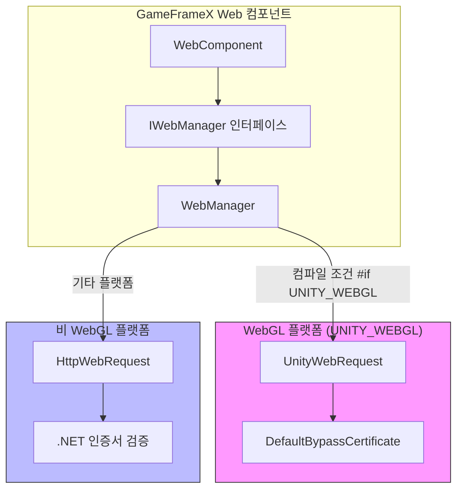
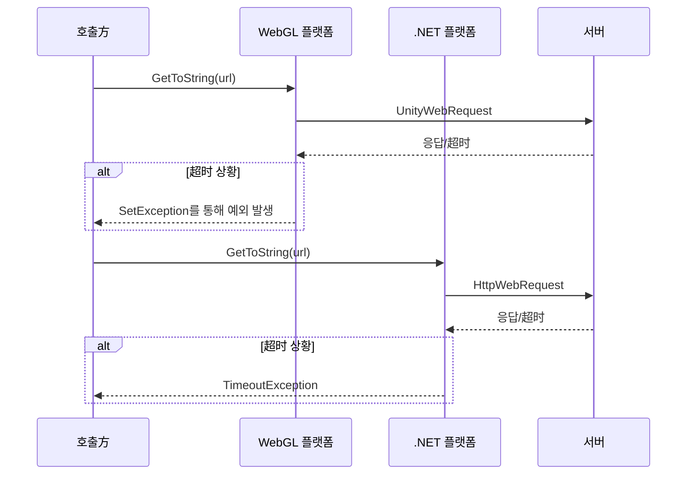

# 플랫폼 차이 설명

이 문서는 GameFrameX Web 컴포넌트의 다양한 Unity 플랫폼에서의 구현 차이를 상세히 소개하여, 개발자가 각 플랫폼의 특성을 이해하고 컴포넌트를 올바르게 사용할 수 있도록 돕습니다.

## 개요

GameFrameX Web 컴포넌트는 세 가지 주요 플랫폼 카테고리를 지원합니다:

- **WebGL 플랫폼**: 브라우저 환경에 게시되는 WebGL 빌드에 적합
- **비 WebGL 플랫폼**: PC(Windows, Mac, Linux), iOS, Android 등 네이티브 플랫폼 포함

이 두 플랫폼은 네트워크 요청 구현 메커니즘에 본질적인 차이가 있으며, 주요 차이점은 다음과 같습니다:

| 특성 | WebGL 플랫폼 | 비 WebGL 플랫폼 |
|------|------------|---------------|
| 네트워크 라이브러리 | UnityWebRequest | System.Net.HttpWebRequest |
| 비동기 모드 | 콜백식 (Callback) | 비동기 대기 (async/await) |
| 멀티스레드 지원 | 미지원 | 지원 |
| 인증서 처리 | 사용자 정의 CertificateHandler | .NET 표준 인증서 검증 |

## 아키텍처 차이



### 설계 의도

플러그인은 조건부 컴파일(`#if UNITY_WEBGL`)을 사용하여 플랫폼 차이를 구현하며, 이 설계는 다음 이점을带来합니다:

1. **통일 인터페이스**: 상위 호출 코드는底层 구현 세부 사항을 알 필요가 없습니다
2. **성능 최적화**: 각 플랫폼이 가장 적합한 네트워크 라이브러리를 사용할 수 있습니다
3. **기능 일관성**: 구현이 다르더라도 외부에 제공하는 API는 완전히 동일합니다

## 핵심 구현 차이

### 요청 전송 방식

**WebGL 플랫폼 구현:**

WebGL 플랫폼에서 요청은 `UnityWebRequest`를 통해 전송되며, 완료 통지는 이벤트 콜백으로 처리됩니다.

```csharp
// Source: Runtime/Web/WebManager.cs#L213-L258
#if UNITY_WEBGL
UnityWebRequest unityWebRequest;
if (webJsonData.IsGet)
{
    unityWebRequest = UnityWebRequest.Get(webJsonData.URL);
}
else
{
    unityWebRequest = UnityWebRequest.Post(webJsonData.URL, string.Empty);
}

unityWebRequest.certificateHandler = new DefaultBypassCertificate();
unityWebRequest.timeout = (int)RequestTimeout.TotalSeconds;
// ... 요청 헤더 및 요청 본문 설정

var asyncOperation = unityWebRequest.SendWebRequest();
asyncOperation.completed += (asyncOperation2) =>
{
    m_SendingNormalList.Remove(webJsonData);
    if (unityWebRequest.isNetworkError || unityWebRequest.isHttpError || unityWebRequest.error != null)
    {
        webJsonData.UniTaskCompletionStringSource.TrySetException(new Exception(unityWebRequest.error));
        return;
    }
    webJsonData.UniTaskCompletionStringSource.SetResult(new WebStringResult(webJsonData.UserData, unityWebRequest.downloadHandler.text));
};
#endif
```

**비 WebGL 플랫폼 구현:**

비 WebGL 플랫폼에서 요청은 `HttpWebRequest`를 통해 전송되며, 진정한 비동기 대기를 지원합니다.

```csharp
// Source: Runtime/Web/WebManager.cs#L260-L328
#else
try
{
    HttpWebRequest request = WebRequest.CreateHttp(webJsonData.URL);
    request.Method = webJsonData.IsGet ? WebRequestMethods.Http.Get : WebRequestMethods.Http.Post;
    request.Timeout = (int)RequestTimeout.TotalMilliseconds;
    // ... 요청 헤더 및 요청 본문 설정

    using (HttpWebResponse response = (HttpWebResponse)await request.GetResponseAsync())
    {
        using (StreamReader reader = new StreamReader(response.GetResponseStream()))
        {
            string content = await reader.ReadToEndAsync();
            webJsonData.UniTaskCompletionStringSource.SetResult(new WebStringResult(webJsonData.UserData, content));
        }
    }
}
catch (WebException e)
{
    if (e.Status == WebExceptionStatus.Timeout)
    {
        webJsonData.UniTaskCompletionStringSource.SetException(new TimeoutException(e.Message));
        return;
    }
    webJsonData.UniTaskCompletionStringSource.SetException(e);
}
finally
{
    m_SendingNormalList.Remove(webJsonData);
}
#endif
```

### 인증서 처리 차이

**WebGL 플랫폼:**

WebGL 플랫폼은 사용자 정의 인증서 프로세서를 사용하여 인증서 검증을 우회하며, 이는 개발 디버깅 및 자체 서명 인증서 환경에 매우 유용합니다.

```csharp
// Source: Runtime/Web/DefaultBypassCertificate.cs
public sealed class DefaultBypassCertificate : CertificateHandler
{
    protected override bool ValidateCertificate(byte[] certificateData)
    {
        return true;
    }
}
```

> Source: [DefaultBypassCertificate.cs](https://github.com/GameFrameX/com.gameframex.unity.web/blob/main/Runtime/Web/DefaultBypassCertificate.cs#L41-L44)

WebGL 플랫폼은 요청 생성 시 이 인증서 프로세서를 적용합니다:

```csharp
// Source: Runtime/Web/WebManager.cs#L224
unityWebRequest.certificateHandler = new DefaultBypassCertificate();
```

**비 WebGL 플랫폼:**

비 WebGL 플랫폼은 .NET 표준 인증서 검증 메커니즘을 사용하며, 프로덕션 환경에서 더 안전한 HTTPS 보호를 제공합니다.

### 超时 처리 차이



두 플랫폼의超时 예외 처리 방식은 약간 다릅니다:

- **WebGL**: `unityWebRequest.error`를 감지하여超时 및 기타 오류 판단
- **비 WebGL**: `WebExceptionStatus.Timeout` 예외를捕获하고 `TimeoutException`으로 변환

## 각 플랫폼 사용 주의사항

### WebGL 플랫폼

1. **단일 스레드 제한**: WebGL은 멀티스레드를 지원하지 않아, 모든 네트워크 요청이 메인 스레드에서 콜백으로 처리됩니다
2. **跨域 요청 (CORS)**: 브라우저 환경은 동종 원본 정책을强制执行하므로, 서버가 CORS 헤더를 올바르게 구성했는지 확인해야 합니다
3. **HTTPS 인증서**: 기본 인증서 우회 프로세서를 사용하며, 프로덕션 환경에서는 교체要考虑해야 합니다
4. **비동기 모드**: 인터페이스는 `Task`를 반환하지만 내부 구현은 콜백식입니다

### 비 WebGL 플랫폼 (PC/iOS/Android)

1. **진정한 비동기 지원**: .NET의 `async/await` 모드를 사용하여 진정한 non-blocking을 구현합니다
2. **표준 인증서 검증**: 시스템 기본 인증서 검증 메커니즘을 사용하여 더 안전하고 신뢰할 수 있습니다
3. **超时 정밀도**: 밀리초 수준의超时 제어를 사용합니다
4. **연결 풀 관리**: `MaxConnectionPerServer` 구성으로 동시 연결 수를 제어합니다

## 플랫폼 감지 및 조건부 컴파일

개발 과정에서 플랫폼에 따라 다른 로직을 실행해야 하는 경우, 다음 방식을 사용할 수 있습니다:

```csharp
#if UNITY_WEBGL
    // WebGL 플랫폼 특정 코드
    Debug.Log("WebGL 플랫폼에서 실행 중");
#else
    // 기타 플랫폼 코드
    Debug.Log("네이티브 플랫폼에서 실행 중");
#endif
```

### 스크립트 정의 기호

플러그인은 디버깅을 위한 두 가지 스크립트 정의 기호를 제공합니다:

| 기호 | 설명 |
|------|------|
| `ENABLE_GAMEFRAMEX_WEB_SEND_LOG` | 요청 전송 로그 활성화 |
| `ENABLE_GAMEFRAMEX_WEB_RECEIVE_LOG` | 응답 수신 로그 활성화 |

> Source: [WebLogScriptingDefineSymbols.cs](https://github.com/GameFrameX/com.gameframex.unity.web/blob/main/Editor/WebLogScriptingDefineSymbols.cs#L42-L43)

Unity 메뉴 `GameFrameX/Scripting Define Symbols`에서 이러한 로그를 빠르게 켜고 끌 수 있습니다.

## 자주 묻는 플랫폼 문제

### WebGL 플랫폼 CORS 오류

**문제**: 브라우저 콘솔에 "Access to fetch ... has been blocked by CORS policy"가 표시됩니다

**솔루션**:
1. 서버가 올바르게 CORS 응답 헤더를 설정했는지 확인합니다:
   ```
   Access-Control-Allow-Origin: *
   Access-Control-Allow-Methods: GET, POST, OPTIONS
   Access-Control-Allow-Headers: Content-Type, Authorization
   ```
2. 서버가 OPTIONS 프리플라이트 요청을 처리해야 합니다

### 超时 설정이 적용되지 않음

**문제**: WebGL 플랫폼에서 설정한超时 시간이无效似乎无效합니다

**원인 분석**:
- WebGL 플랫폼의 `UnityWebRequest.timeout` 속성은 정수 초로 설정됩니다
- 비 WebGL 플랫폼은 밀리초 수준 정밀도를 사용합니다

**권장 사항**: WebGL 플랫폼에서는 더 긴超时 시간(10초 이상 권장)을 사용합니다

### HTTPS 인증서 경고

**문제**: WebGL 플랫폼에서 HTTPS 주소에 요청할 때 인증서 경고가 나타납니다

**원인**: 기본 인증서 우회 프로세서를 사용합니다

**솔루션**: 프로덕션 환경에서는 실제 인증서 검증을 수행하는 사용자 정의 `CertificateHandler`를 구현하는 것을 권장합니다

## 관련 링크

- [플러그인 소개](./01.overview)
- [기본用法](./03.getting-started)
- [WebComponent 컴포넌트](./08.web-component)
- [IWebManager 인터페이스](./04.iwebmanager-interface)
- [타임아웃 구성](./10.timeout-settings)
- [자주 묻는 질문](./11.troubleshooting)