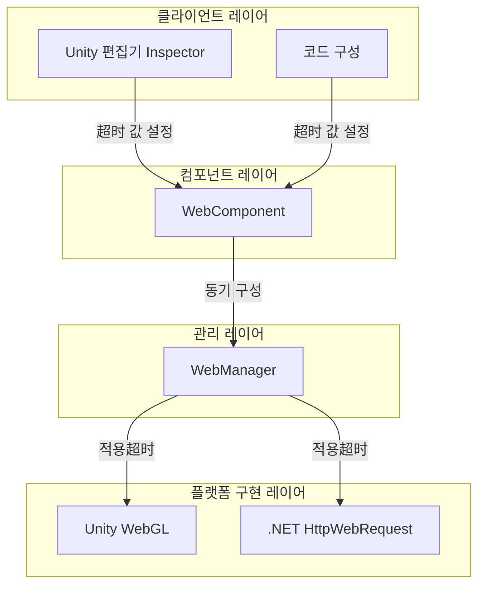
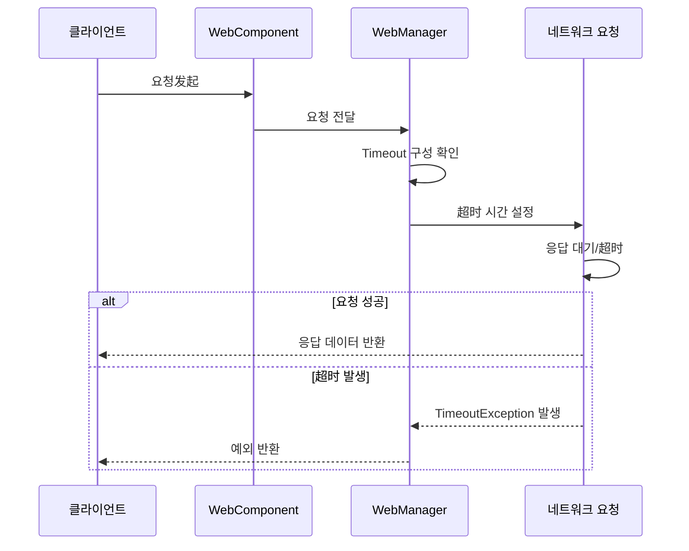

# 超时 구성

HTTP 요청의超时 시간을 구성하여 네트워크 요청의 최대 대기 시간을 제어합니다.

## 개요

超时 구성은 Web 요청 모듈의 중요한 부분으로, 네트워크 요청이 무한 대기하는 것을 방지합니다. 요청이 지정된 시간 내에 완료되지 않으면 시스템이 자동으로 요청을 종료하고 `TimeoutException` 예외를 발생시킵니다.

超时 구성은 통일된 시간 단위(초)를 사용하며, 내부에서 플랫폼에 따라 자동으로 해당 형식으로 변환됩니다:
- Unity WebGL: 정수 초으로 변환
- .NET 플랫폼: 정수 밀리초으로 변환

### 超时 구성의 핵심 역할

1. **무한 대기 방지**: 서버가 응답하지 않을 때 클라이언트가 영구적으로阻塞되지 않도록 합니다
2. **用户体验 향상**: 빠른 실패 메커니즘을 통해 사용자가 다른 작업을 수행할 수 있도록 합니다
3. **리소스 보호**: 네트워크 연결 및 기타 리소스를 적시에 해제합니다

## 아키텍처 설계



### 각 레이어 책임

| 레이어 | 컴포넌트 | 책임 |
|------|------|------|
| 클라이언트 레이어 | Inspector / Code | 超时 구성의 UI 및 코드 인터페이스 제공 |
| 컴포넌트 레이어 | WebComponent | Timeout 속성 노출, 관리자에 동기 구성 |
| 관리 레이어 | WebManager | 超时 값 저장, RequestTimeout 계산 |
| 플랫폼 구현 레이어 | UnityWebRequest / HttpWebRequest | 네트워크 요청에 실제超时 적용 |

## 구성 방식

### Unity Inspector를 통해 구성

Unity 씬에 WebComponent를 추가한 후 Inspector 패널에서 슬라이더를 통해超时 시간을 설정할 수 있습니다.

> Source: [WebComponentInspector.cs](https://github.com/GameFrameX/com.gameframex.unity.web/blob/main/Editor/Inspector/WebComponentInspector.cs#L22-L34)

```csharp
float timeout = EditorGUILayout.Slider("Timeout", m_Timeout.floatValue, 0f, 120f);
if (timeout != m_Timeout.floatValue)
{
    if (EditorApplication.isPlaying)
    {
        t.Timeout = timeout;
    }
    else
    {
        m_Timeout.floatValue = timeout;
    }
}
```

Inspector 구성 특징:
- 범위: 0에서 120초
- 런타임 동적 수정 지원
- 미리보기 모드에서 수정하면 직렬화된 필드에 저장됩니다

### 코드를 통해 구성

#### WebComponent에서 구성

> Source: [WebComponent.cs](https://github.com/GameFrameX/com.gameframex.unity.web/blob/main/Runtime/Web/WebComponent.cs#L59-L70)

```csharp
[SerializeField] [Tooltip("超时 시간. 단위: 초")]
private float m_Timeout = 5f;

public float Timeout
{
    get { return m_WebManager.Timeout; }
    set { m_WebManager.Timeout = m_Timeout = value; }
}
```

사용 예제:

```csharp
// WebComponent 컴포넌트 가져오기
var webComponent = GetComponent<WebComponent>();
// 超时 시간을 10초로 설정
webComponent.Timeout = 10f;
```

#### WebManager에서 직접 구성

> Source: [WebManager.cs](https://github.com/GameFrameX/com.gameframex.unity.web/blob/main/Runtime/Web/WebManager.cs#L55-L66)

```csharp
public float Timeout
{
    get { return m_Timeout; }
    set
    {
        m_Timeout = value;
        RequestTimeout = TimeSpan.FromSeconds(value);
    }
}
```

사용 예제:

```csharp
// GameFrameworkEntry를 통해 WebManager 가져오기
var webManager = GameFrameworkEntry.GetModule<IWebManager>();
// 超时 시간을 10초로 설정
webManager.Timeout = 10f;
```

## 超时 처리 메커니즘

### 요청 처리 흐름



### 超时 예외 처리

#### .NET 플랫폼

> Source: [WebManager.cs](https://github.com/GameFrameX/com.gameframex.unity.web/blob/main/Runtime/Web/WebManager.cs#L298-L305)

```csharp
catch (WebException e)
{
    // 超时 예외捕获
    if (e.Status == WebExceptionStatus.Timeout)
    {
        webJsonData.UniTaskCompletionStringSource.SetException(new TimeoutException(e.Message));
        return;
    }
    // 기타 예외 처리...
}
```

#### Unity WebGL 플랫폼

Unity WebGL 플랫폼은 `UnityWebRequest.isNetworkError` 속성을 통해超时을 판단합니다:

```csharp
if (unityWebRequest.isNetworkError || unityWebRequest.isHttpError || unityWebRequest.error != null)
{
    // 超시도 네트워크 오류로 분류됩니다
    webJsonData.UniTaskCompletionStringSource.TrySetException(new Exception(unityWebRequest.error));
    return;
}
```

### 超时 예외捕获 예제

```csharp
try
{
    var result = await webComponent.GetToString("https://api.example.com/data");
    Debug.Log($"요청 성공: {result.Text}");
}
catch (TimeoutException ex)
{
    Debug.LogError($"요청超时: {ex.Message}");
    // 여기서 재시도 로직을 수행할 수 있습니다
}
catch (Exception ex)
{
    Debug.LogError($"요청 실패: {ex.Message}");
}
```

## 구성 옵션

| 옵션 | 유형 | 기본값 | 설명 |
|------|------|--------|------|
| `Timeout` | float | 5f | 超时 시간으로, 단위는 초입니다. 0으로 설정하면 系统 기본값 사용 (무超时) |
| `RequestTimeout` | TimeSpan | 00:00:05 | 내부에서 사용하는 TimeSpan 형식의超时 시간 |

### 超时 시간 권장

| 시나리오 | 권장 超时 시간 | 설명 |
|------|-------------|------|
| 일반 REST API | 10-30초 | 네트워크 지연 및 서버 처리 시간 고려 |
| 파일 업로드/다운로드 | 60-120초 | 대용량 파일은 더 긴 시간이 필요합니다 |
| 실시간 통신 | 5-10초 | 빠른 응답이 필요합니다 |
| 로컬 디버깅 | 5초 | 빠른 실패, 빠른 재시도 |

### 다양한超时 값의 영향

```mermaid
flowchart TD
    Start[超时 값 설정] --> Check{超时 값 크기?}

    Check -->|너무 짧음 (<3초)| TooShort[결과可能导致:<br/>- 정상 요청이 잘못 종료됨<br/>- 모바일 네트워크 요청 실패율 높음]
    Check -->|적정 (5-30초)| Optimal[최적 균형:<br/>- 충분한 응답 시간 제공<br/>- 과도한 대기 없음]
    Check -->|너무 김 (>60초)| TooLong[결과可能导致:<br/>-用户体验 저하<br/>- 리소스 점유 증가<br/>- 문제 발견 어려움]

    TooShort --> End1[조정 권장]
    Optimal --> End2[사용 권장]
    TooLong --> End3[조정 권장]
```

## 플랫폼 차이

### Unity WebGL

```csharp
// 超时 시간을 정수 초로 설정
unityWebRequest.timeout = (int)RequestTimeout.TotalSeconds;
```

특징:
- 超시값은 정수여야 합니다
- 최소값은 1초입니다
- 값이 0이면 Unity 기본超时 사용

### .NET 플랫폼

```csharp
// 超시 시간을 정수 밀리초로 설정
request.Timeout = (int)RequestTimeout.TotalMilliseconds;
```

특징:
- 超시값은 밀리초 단위입니다
- 최소값은 1밀리초이지만 500밀리초 이상을 권장합니다

## 모범 사례

### 1. 합리적인 超时 시간 설정

실제 비즈니스 시나리오 및 네트워크 환경에 따라 적절한超时 시간을 설정합니다:

```csharp
// 환경에 따라 超시 조정
#if UNITY_ANDROID
// 모바일 네트워크 환경,稍长超时
webComponent.Timeout = 30f;
#else
// WiFi 환경, shorter超时可以使用
webComponent.Timeout = 10f;
#endif
```

### 2. 재시도 메커니즘 구현

timeout과 함께 요청 재시도를 구현합니다:

```csharp
private async Task<WebStringResult> RequestWithRetry(string url, int maxRetries = 3)
{
    for (int i = 0; i < maxRetries; i++)
    {
        try
        {
            return await webComponent.GetToString(url);
        }
        catch (TimeoutException)
        {
            if (i == maxRetries - 1) throw;
            Debug.LogWarning($"요청超时, 재시도 중 ({i + 1}/{maxRetries})...");
            await Task.Delay(1000 * (i + 1)); // 지수 백오프
        }
    }
    throw new Exception("재시도 횟수 소진");
}
```

### 3. 런타임 동적 조정

필요에 따라 런타임에서超时을 조정할 수 있습니다:

```csharp
// 특정 요청에 대해 超시 조정
var originalTimeout = webComponent.Timeout;
try
{
    // 대용량 파일 다운로드는 더 긴 超시가 필요합니다
    webComponent.Timeout = 120f;
    var result = await webComponent.GetToBytes("https://example.com/largefile.zip");
}
finally
{
    // 원본 超시 복원
    webComponent.Timeout = originalTimeout;
}
```

## 관련 링크

- [WebComponent 컴포넌트](./08.web-component)
- [IWebManager 인터페이스](./04.iwebmanager-interface)
- [WebManager 아키텍처](./05.web-manager)
- [기본 데이터 구성](./07.base-data)
- [플랫폼 차이 설명](./09.platform-differences)