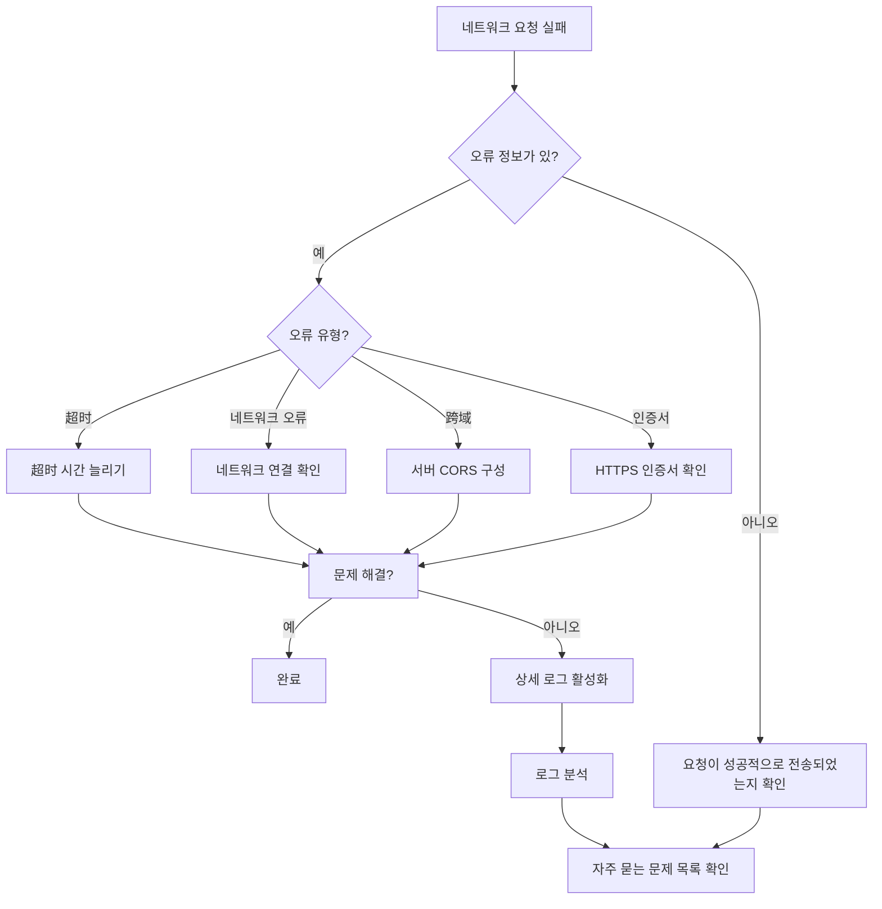

# 자주 묻는 질문

이 문서는 GameFrameX Unity Web 플러그인 사용 과정에서 자주 발생하는 문제, 원인 분석 및 해당 솔루션을 수집합니다.

## 개요

GameFrameX Web 컴포넌트는高性能의 Unity HTTP 네트워크 요청 라이브러리로, GET, POST 요청을 지원하며 문자열, JSON, 이진 데이터 등 다양한 형식을 처리할 수 있습니다. 실제 사용 과정에서 개발자는 자주一些问题에 부딪히며, 이 문서는 이러한 문제를 빠르게 파악하고 해결할 수 있도록 돕는 것을 목표로 합니다.

## 자주 묻는 문제 목록

### 1. WebGL 플랫폼 요청 실패

**문제 설명**:
WebGL 플랫폼에서 네트워크 요청을 보낼 때 요청이 응답하지 않거나 직접 오류가 발생합니다.

**가능한 원인**:
- WebGL 플랫폼에는跨域 제한이 있습니다
- 서버가 CORS 헤더 정보를 올바르게 구성하지 않았습니다
- WebGL은 멀티스레드를 지원하지 않아 모든 요청이 메인 스레드에서 처리됩니다

**솔루션**:

1. **서버가 CORS를 구성했는지确认합니다**
   서버는 다음 CORS 응답 헤더를 반환해야 합니다:
   ```http
   Access-Control-Allow-Origin: *
   Access-Control-Allow-Methods: GET, POST, OPTIONS
   Access-Control-Allow-Headers: Content-Type, Authorization
   ```

2. **OPTIONS 프리플라이트 요청 처리**
   비단순 요청(사용자 정의 헤더 또는 Content-Type이 application/x-www-form-urlencoded가 아닌 경우)의 경우 서버는 OPTIONS 프리플라이트 요청을 지원해야 합니다.

3. **비동기 대기를 사용하고阻塞 호출을 피합니다**
   WebGL은 멀티스레드를 지원하지 않으므로 `await` 비동기 대기를 권장하며 `.Wait()` 또는 `.Result`阻塞 호출은 피해야 합니다:

   ```csharp
   // 권장: 비동기 대기
   private async void Start()
   {
       var webManager = GameFrameworkEntry.GetModule<IWebManager>();
       var result = await webManager.GetToString("https://api.example.com/data");
       Debug.Log(result.Result);
   }

   // 피해야 함:阻塞 호출 (WebGL에서死锁 발생)
   private void Start()
   {
       var webManager = GameFrameworkEntry.GetModule<IWebManager>();
       var result = webManager.GetToString("https://api.example.com/data").Result; // 데드락 발생
   }
   ```

---

### 2. 요청 超时

**문제 설명**:
네트워크 요청이 오랫동안 응답하지 않으며 결국超时 예외가 발생합니다.

**가능한 원인**:
- 네트워크 연결이 불안정하거나 연결할 수 없습니다
- 서버 응답이迟钝합니다
- 超시 시간이 너무 짧게 설정되었습니다

**솔루션**:

1. **超时 시간 조정**

   ```csharp
   // 방법 1: WebComponent 컴포넌트를 통해 超시 설정
   var webComponent = gameObject.GetOrAddComponent<WebComponent>();
   webComponent.Timeout = 60f; // 60초로 설정

   // 방법 2: IWebManager 인터페이스를 통해 超시 설정
   var webManager = GameFrameworkEntry.GetModule<IWebManager>();
   webManager.Timeout = 60f; // 60초로 설정
   ```

   > Source: [WebComponent.cs](https://github.com/GameFrameX/com.gameframex.unity.web/blob/main/Runtime/Web/WebComponent.cs#L66-L70)

2. **재시도 메커니즘 구현**

   ```csharp
   public async Task<T> RetryRequest<T>(Func<Task<T>> requestFunc, int maxRetries = 3)
   {
       for (int i = 0; i < maxRetries; i++)
       {
           try
           {
               return await requestFunc();
           }
           catch (TimeoutException)
           {
               if (i == maxRetries - 1) throw;
               await Task.Delay(1000 * (i + 1)); // 지수 백오프
           }
       }
       throw new Exception("재시도 횟수 소진");
   }
   ```

3. **상세 로그를 활성화하여 원인 파악**
   로그를 켜면超时 원인을 파악하는 데 도움이 됩니다:

   - Unity 메뉴에서 **GameFrameX → Scripting Define Symbols → Enable Web Send Logs**를 선택하여 전송 로그 활성화
   - **GameFrameX → Scripting Define Symbols → Enable Web Receive Logs**를 선택하여 수신 로그 활성화

---

### 3. HTTPS 인증서 검증 실패

**문제 설명**:
모바일 장치에서 HTTPS 요청을 보낼 때 인증서 검증 실패 오류가 발생합니다.

**가능한 원인**:
- 장치 시간이 올바르지 않습니다
- 서버 인증서가 만료되었거나无效합니다
- 자체 서명 인증서입니다
- 인증서 체인이 불완전합니다

**솔루션**:

1. **기본 인증서 우회 사용 (개발 테스트용으로만)**

   플러그인에는 `DefaultBypassCertificate` 클래스가 내장되어 있어 인증서 검증을 우회합니다:

   ```csharp
   // 플러그인이 자동으로 처리하므로 수동 구성은 필요하지 않습니다
   unityWebRequest.certificateHandler = new DefaultBypassCertificate();
   ```

   > Source: [WebManager.cs](https://github.com/GameFrameX/com.gameframex.unity.web/blob/main/Runtime/Web/WebManager.cs#L224)

2. **프로덕션 환경 권장 사항**
   - 서버가 신뢰할 수 있는 CA가 서명한 유효한 인증서를 사용하는지 확인합니다
   - 모바일 장치 시간이 올바르게 설정되어 있는지 확인합니다
   - 정식 게시 시 인증서 우회 코드를 제거합니다

---

### 4. 요청 대기열阻塞

**문제 설명**:
여러 요청을 보낸 후 일부 요청이 계속 대기 상태에 있으며 오랫동안 응답하지 않습니다.

**가능한 원인**:
- 동시 연결 수 제한 (`MaxConnectionPerServer` 기본값은 8)
- 요청 대기열이 가득 찼습니다
- 앞의 요청이阻塞되었습니다

**솔루션**:

1. **동시 연결 수 조정**

   ```csharp
   var webManager = GameFrameworkEntry.GetModule<IWebManager>();
   // 동시 연결 수를 16으로 설정
   ((WebManager)webManager).MaxConnectionPerServer = 16;
   ```

   > Source: [WebManager.cs](https://github.com/GameFrameX/com.gameframex.unity.web/blob/main/Runtime/Web/WebManager.cs#L71)

2. **합리적인 요청 설계**
   - 높고 낮음 우선순위 요청을 구분합니다
   - 대용량 파일 다운로드는 별도 연결을 사용합니다
   - 배치 요청은 분할하여 보냅니다

---

### 5. 기본 데이터가 적용되지 않음

**문제 설명**:
`AddBaseForm`, `AddBaseHeader` 등의 메서드로 설정한 기본 데이터가 실제 요청에 포함되지 않았습니다.

**가능한 원인**:
- 기본 데이터가 요청 전송 전에 올바르게 추가되지 않았습니다
- 추가 후 비워졌습니다
- 병합 로직 문제입니다

**솔루션**:

1. **요청 전에 기본 데이터가 추가되었는지 확인합니다**

   ```csharp
   var webManager = GameFrameworkEntry.GetModule<IWebManager>();

   // 기본 요청 헤더 추가 (매번 요청 시 자동으로 포함됩니다)
   webManager.AddBaseHeader("Authorization", "Bearer your-token");
   webManager.AddBaseHeader("X-App-Version", "1.0.0");

   // 기본 폼 데이터 추가
   webManager.AddBaseForm("platform", "android");
   webManager.AddBaseForm("deviceId", SystemInfo.deviceUniqueIdentifier);

   // 기본 쿼리 매개변수 추가
   webManager.AddBaseQueryString("lang", "zh-CN");

   // 요청 전송
   var result = await webManager.GetToString("https://api.example.com/data");
   ```

   > Source: [IWebManager.cs](https://github.com/GameFrameX/com.gameframex.unity.web/blob/main/Runtime/Web/IWebManager.cs#L147-L198)

2. **데이터가 실수로 비워지지 않았는지 확인합니다**

   다음 메서드를 호출하지 않았는지 확인합니다:
   - `ClearBaseForm()` - 기본 폼 비우기
   - `ClearBaseHeader()` - 기본 요청 헤더 비우기
   - `ClearBaseQueryString()` - 기본 쿼리 매개변수 비우기

---

### 6. 반환 결과 분석 오류

**문제 설명**:
요청이 성공적으로 반환되었으나 응답 데이터 분석 시 예외가 발생합니다.

**가능한 원인**:
- 응답 데이터 형식이 예상과 다릅니다
- JSON 직렬화/역직렬화 실패
- 데이터가 비어 있거나 null입니다

**솔루션**:

1. **반환 결과를 올바르게 처리합니다**

   ```csharp
   var webManager = GameFrameworkEntry.GetModule<IWebManager>();
   var result = await webManager.GetToString("https://api.example.com/data");

   // 오류가 있는지 확인합니다
   if (result != null && !string.IsNullOrEmpty(result.Result))
   {
       try
       {
           var data = JsonUtility.FromJson<MyDataClass>(result.Result);
           Debug.Log($"분석 성공: {data.name}");
       }
       catch (Exception e)
       {
           Debug.LogError($"JSON 분석 실패: {e.Message}");
       }
   }
   else
   {
       Debug.LogWarning("응답 데이터가 비어 있습니다");
   }
   ```

   > Source: [WebStringResult.cs](https://github.com/GameFrameX/com.gameframex.unity.web/blob/main/Runtime/Web/WebStringResult.cs#L15-L38)

2. **바이트 배열을 사용하여 이진 데이터 수신**

   ```csharp
   var bufferResult = await webManager.GetToBytes("https://api.example.com/file");
   if (bufferResult != null && bufferResult.Result != null)
   {
       byte[] data = bufferResult.Result;
       Debug.Log($"수신 데이터 크기: {data.Length} bytes");
   }
   ```

   > Source: [WebBufferResult.cs](https://github.com/GameFrameX/com.gameframex.unity.web/blob/main/Runtime/Web/WebBufferResult.cs#L1-L20)

---

### 7. 플랫폼 차이로 인한 동작 불일치

**문제 설명**:
동일한 요청이 Editor/PC에서는 정상적으로 작동하지만 WebGL 또는 모바일 플랫폼에서 실패합니다.

**가능한 원인**:
- 서로 다른 플랫폼이 서로 다른 네트워크 라이브러리를 사용합니다
- WebGL은 `UnityWebRequest`를 사용하고 다른 플랫폼은 `HttpWebRequest`를 사용합니다
- 플랫폼 특정 기능 제한이 있습니다

**솔루션**:

1. **플랫폼 차이를 이해합니다**

   ```csharp
   // WebGL 플랫폼은 UnityWebRequest를 사용합니다
   #if UNITY_WEBGL
       UnityWebRequest unityWebRequest;
       // WebGL 특정 구현
   #else
       // 기타 플랫폼은 HttpWebRequest를 사용합니다
       HttpWebRequest request = WebRequest.CreateHttp(url);
   #endif
   ```

   > Source: [WebManager.cs](https://github.com/GameFrameX/com.gameframex.unity.web/blob/main/Runtime/Web/WebManager.cs#L213-L329)

2. **조건부 컴파일을 사용하여 플랫폼 특정 코드 처리**

   ```csharp
   public async Task<string> GetDataAsync(string url)
   {
       try
       {
           return await webManager.GetToString(url);
       }
       catch (Exception e)
       {
   #if UNITY_WEBGL
           // WebGL 특정 오류 처리
           Debug.LogError($"WebGL 오류: {e.Message}");
   #else
           // 기타 플랫폼 오류 처리
           Debug.LogError($"네트워크 오류: {e.Message}");
   #endif
           throw;
       }
   }
   ```

---

### 8. 디버깅 기법

**문제 설명**:
네트워크 요청 문제를排查해야 하지만 자세한 정보를 가져오는 방법을 모릅니다.

**솔루션**:

1. **상세 로그 활성화**

   Unity 편집기에서:
   - 메뉴: **GameFrameX → Scripting Define Symbols → Enable Web Send Logs**
   - 메뉴: **GameFrameX → Scripting Define Symbols → Enable Web Receive Logs**

   로그 매크로 정의:
   ```csharp
   // 전송 로그
   #if ENABLE_GAMEFRAMEX_WEB_SEND_LOG
       Log.Debug($"Web 요청: {webJsonData.URL} \n Header: {...}");
   #endif

   // 수신 로그
   #if ENABLE_GAMEFRAMEX_WEB_RECEIVE_LOG
       Log.Debug($"Web 응답: {webJsonData.URL} \n Content: {...}");
   #endif
   ```

   > Source: [WebLogScriptingDefineSymbols.cs](https://github.com/GameFrameX/com.gameframex.unity.web/blob/main/Editor/WebLogScriptingDefineSymbols.cs#L42-L79)

2. **Player Settings에서 디버깅 활성화**
   - **Edit → Project Settings → Player** 열기
   - **Development Build**勾選
   - **Script Debugging**勾選

3. **Unity Profiler를 사용하여 네트워크 모니터링**
   - **Window → Analysis → Profiler** 열기
   - **Network** 패널을 추가하여 네트워크 요청 모니터링

---

### 9. 요청 반환 예외 유형

**문제 설명**:
요청 실패 시 어떤 예외 유형이 발생하는지 파악할 수 없습니다.

**솔루션**:

플러그인은 다양한 오류 상황에 따라 다음 예외를 발생시킵니다:

| 예외 유형 | 트리거 조건 | 처리 권장 |
|---------|---------|---------|
| `TimeoutException` | 요청超时 | 超时 시간 늘리거나 네트워크 확인 |
| `WebException` | 네트워크 오류 | 네트워크 연결 및 서버 상태 확인 |
| `IOException` | IO 오류 | 데이터 읽기/쓰기 문제 확인 |
| `Exception` | 기타 오류 | 상세 오류 정보 확인 |

```csharp
try
{
    var result = await webManager.GetToString(url);
}
catch (TimeoutException ex)
{
    Debug.LogError($"요청超时: {ex.Message}");
}
catch (WebException ex)
{
    Debug.LogError($"네트워크 오류: {ex.Message}, 상태: {ex.Status}");
}
catch (IOException ex)
{
    Debug.LogError($"IO 오류: {ex.Message}");
}
catch (Exception ex)
{
    Debug.LogError($"알 수 없는 오류: {ex.Message}");
}
```
> Source: [WebManager.cs](https://github.com/GameFrameX/com.gameframex.unity.web/blob/main/Runtime/Web/WebManager.cs#L298-L324)

---

## 진단 흐름도



---

## 관련 링크

- [플러그인 소개](./01.overview)
- [설치 방식](./02.installation)
- [기본 사용법](./03.getting-started)
- [WebComponent 사용](./08.web-component)
- [WebManager 아키텍처](./05.web-manager)
- [요청 결과 유형](./06.result-types)
- [IWebManager 인터페이스](./04.iwebmanager-interface)
- [WebComponent 컴포넌트](./08.web-component)
- [타임아웃 구성](./10.timeout-settings)
- [기본 데이터 구성](./07.base-data)
- [플랫폼 차이 설명](./09.platform-differences)