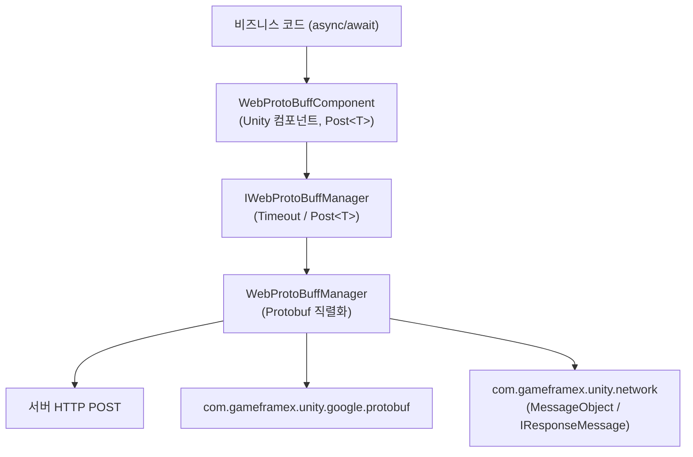

# Web ProtoBuff 컴포넌트 소개: 어떤 도움을 줄 수 있나요

Web ProtoBuff는 GameFrameX의 HTTP Protobuf 요청 컴포넌트입니다. 한 줄의 `await`만으로 Protocol Buffer 메시지를 HTTP POST를 통해 서버로 전송하고, 응답을 지정한 타입 `T`(`MessageObject`를 상속하고 `IResponseMessage`를 구현)로 바로 역직렬화할 수 있습니다. `Task<T>` 비동기 API를 기반으로 하며, 사용자 지정 타임아웃을 지원하고 Unity WebGL 및 기타 네이티브 플랫폼과 호환됩니다.

## 빠른 시작

1. **패키지 설치**. Unity 프로젝트의 `Packages/manifest.json`을 편집하여 `scopedRegistries`를 추가하고 의존성을 선언합니다:

   ```json
   {
     "scopedRegistries": [
       {
         "name": "GameFrameX",
         "url": "https://gameframex.upm.alianblank.uk",
         "scopes": [
           "com.gameframex"
         ]
       }
     ],
     "dependencies": {
       "com.gameframex.unity.web.protobuff": "1.1.3"
     }
   }
   ```

   출처: [README.zh-CN.md](https://github.com/GameFrameX/com.gameframex.unity.web.protobuff/blob/main/README.zh-CN.md#L47-L63)

   Git URL 방식으로 대체할 수도 있습니다: `"com.gameframex.unity.web.protobuff": "https://github.com/gameframex/com.gameframex.unity.web.protobuff.git"`, 또는 Package Manager에서 Git URL로 추가할 수 있습니다.

2. **매크로 정의 추가**. Unity의 **Player Settings** → **Scripting Define Symbols**에 다음을 추가합니다:

   `ENABLE_GAME_FRAME_X_WEB_PROTOBUF_NETWORK`

   이 매크로가 활성화되어 있지 않으면 `Post<T>` 관련 API가 프로젝트에 컴파일되지 않습니다.

3. **컴포넌트 추가 및 호출**. 씬의 GameFramework 오브젝트에 **GameFrameX/Web ProtoBuff** 컴포넌트(`WebProtoBuffComponent`, 기본 타임아웃 5초)를 추가한 다음 요청을 전송합니다:

   ```csharp
   using GameFrameX.Web.ProtoBuff.Runtime;

   // 요청을 전송하고 결과를 기다립니다
   LoginResponse response = await WebComponent.Post<LoginResponse>(url, request);
   ```

   출처: [README.zh-CN.md](https://github.com/GameFrameX/com.gameframex.unity.web.protobuff/blob/main/README.zh-CN.md#L108-L113)

## 핵심 API

컴포넌트가 노출하는 요청 진입점과 매니저 인터페이스는 다음과 같습니다:

```csharp
public Task<T> Post<T>(string url, GameFrameX.Network.Runtime.MessageObject message)
    where T : GameFrameX.Network.Runtime.MessageObject, GameFrameX.Network.Runtime.IResponseMessage
```

출처: [WebProtoBuffComponent.cs](https://github.com/GameFrameX/com.gameframex.unity.web.protobuff/blob/main/Runtime/Web/WebProtoBuffComponent.cs#L105-L108)

| 이름 | 시그니처/타입 | 설명 |
|------|-----------|------|
| `Post<T>` | `Task<T> Post<T>(string url, MessageObject message)` | Protobuf POST 요청을 전송하고 응답을 `T`로 파싱합니다. `T`는 `MessageObject`를 상속하고 `IResponseMessage`를 구현해야 하며, `ENABLE_GAME_FRAME_X_WEB_PROTOBUF_NETWORK` 매크로가 정의된 경우에만 사용할 수 있습니다 |
| `Timeout` | `float { get; set; }` | POST 요청 타임아웃 시간(초), 기본값 5초, Inspector에서 설정 가능 |
| `WebProtoBuffComponent` | Unity 컴포넌트 | 컴포넌트 메뉴 `GameFrameX/Web ProtoBuff`, 오브젝트당 하나만 허용되며 `GameFrameXWebProtoBuffCroppingHelper`가 필요합니다 |
| `IWebProtoBuffManager` | 인터페이스 | 매니저 인터페이스, `WebProtoBuffComponent` 내부에서 `GameFrameworkEntry.GetModule<IWebProtoBuffManager>()`를 통해 구현체를 가져옵니다 |

출처: [IWebProtoBuffManager.cs](https://github.com/GameFrameX/com.gameframex.unity.web.protobuff/blob/main/Runtime/Web/IWebProtoBuffManager.cs#L9-L29)

런타임에 두 개의 패키지에 의존하며, 설치 시 UPM이 자동으로 해석합니다:

| 의존성 패키지 | 버전 |
|--------|------|
| `com.gameframex.unity.network` | 2.6.10 |
| `com.gameframex.unity.google.protobuf` | 3.4.2 |

출처: [package.json](https://github.com/GameFrameX/com.gameframex.unity.web.protobuff/blob/main/package.json#L25-L26)

## 작동 원리 개요

호출 체인은 간단합니다. 컴포넌트의 `Post<T>`를 호출하면 컴포넌트가 요청을 매니저에게 전달하고, 매니저가 Protobuf 직렬화/역직렬화와 HTTP 전송을 담당합니다.



## 자주 발생하는 오류

- **`Post<T>`가 존재하지 않음 / 컴파일 오류**: Scripting Define Symbols에 `ENABLE_GAME_FRAME_X_WEB_PROTOBUF_NETWORK`를 추가하지 않았습니다. 이 API는 `#if ENABLE_GAME_FRAME_X_WEB_PROTOBUF_NETWORK` 조건부 컴파일로 제어됩니다.
- **제네릭 제약 조건 미충족**: `T`는 반드시 `MessageObject`를 상속함과 동시에 `IResponseMessage`를 구현해야 하며, 요청 메시지 매개변수도 `MessageObject`를 상속해야 합니다.
- **요청이 장시간 응답 없이 멈춤**: 컴포넌트 Inspector의 타임아웃 시간(단위: 초, 기본값 5)을 확인하거나 `Timeout` 속성으로 조정하세요.

## 다음 단계

- 공식 문서: https://gameframex.doc.alianblank.com
- 요청 전송 및 응답 처리의 구체적인 사용법은 이 사이트의 작업 페이지를 참조하세요
- 버전 이력은 [CHANGELOG.md](https://github.com/GameFrameX/com.gameframex.unity.web.protobuff/blob/main/CHANGELOG.md)를 참조하세요
- 다국어 README: [중국어(간체)](https://github.com/GameFrameX/com.gameframex.unity.web.protobuff/blob/main/README.zh-CN.md) · [English](https://github.com/GameFrameX/com.gameframex.unity.web.protobuff/blob/main/README.md)