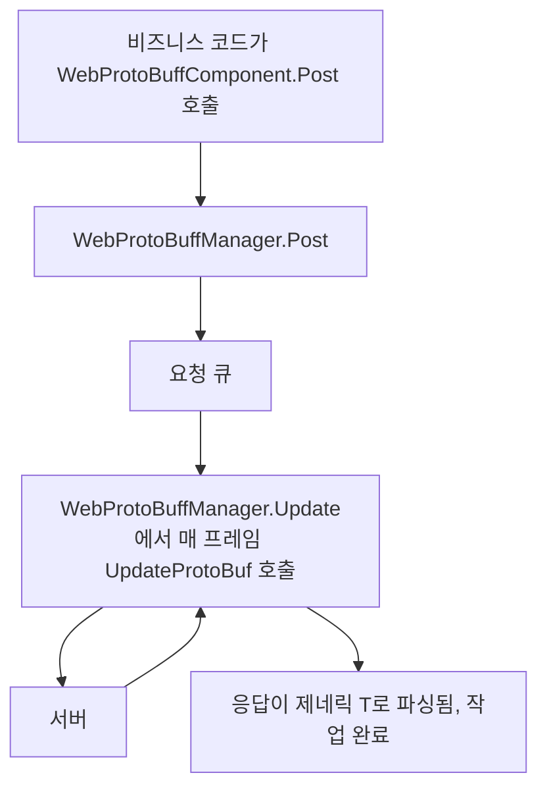

# 작동 원리: 컴포넌트, 매니저 및 요청 파이프라인

이 페이지에서는 `WebProtoBuffComponent`(Unity 컴포넌트 진입점)와 `WebProtoBuffManager`(프레임워크 모듈)가 협력하여 하나의 Protobuf HTTP 요청을 완료하는 과정을 설명합니다: 컴포넌트는 `Awake`에서 `GameFrameworkEntry`로부터 `IWebProtoBuffManager` 모듈을 가져와 타임아웃 설정을 동기화하고, 비즈니스 코드가 `Post<T>`를 호출하면 매니저가 요청 큐를 처리하며, 매 프레임 `Update`에서 응답이 제네릭 `T`로 파싱될 때까지 큐를 진행시킵니다.

## 컴포넌트와 매니저: 책임 한눈에 보기

| 타입 | 역할 | 핵심 멤버/설명 |
|------|------|---------------|
| `WebProtoBuffComponent` | Unity 씬 진입 컴포넌트(MonoBehaviour) | `Post<T>(url, message)`, `Timeout`; 컴포넌트 추가 메뉴 `GameFrameX/Web ProtoBuff`, `GameFrameXWebProtoBuffCroppingHelper`에 자동 의존 |
| `IWebProtoBuffManager` | 매니저 인터페이스 | `Task<T> Post<T>(string url, MessageObject message)`(매크로 `ENABLE_GAME_FRAME_X_WEB_PROTOBUF_NETWORK` 필요), `float Timeout { get; set; }` |
| `WebProtoBuffManager` | 프레임워크 모듈 구현(partial 클래스) | 생성 시 `MaxConnectionPerServer = 8`, `Timeout = 5f`; 매 프레임 `Update`에서 `UpdateProtoBuf`를 호출하여 요청 큐 처리; `Shutdown`은 `ShutdownProtoBuf` 호출 |

`WebProtoBuffManager`는 partial 클래스이며, `UpdateProtoBuf` / `ShutdownProtoBuf` 등 Protobuf 관련 구현은 분할 파일 [WebProtoBuffManager.ProtoBuf.cs](https://github.com/GameFrameX/com.gameframex.unity.web.protobuff/blob/main/Runtime/Web/WebProtoBuffManager.ProtoBuf.cs)과 [WebProtoBuffManager.WebProtoBufData.cs](https://github.com/GameFrameX/com.gameframex.unity.web.protobuff/blob/main/Runtime/Web/WebProtoBuffManager.WebProtoBuffData.cs)에 나뉘어 있습니다.

## 요청 파이프라인



실행 순서대로 나누어 살펴보면:

1. **비즈니스 계층에서 컴포넌트 호출**: `WebProtoBuffComponent.Post<T>(url, message)`는 파라미터를 `m_WebProtoBuffManager.Post<T>(url, message)`로 직접 전달하며, 컴포넌트 자체는 어떠한 네트워크 처리도 하지 않습니다. 이 메서드는 인터페이스 메서드와 마찬가지로 `ENABLE_GAME_FRAME_X_WEB_PROTOBUF_NETWORK` 매크로가 정의된 경우에만 컴파일됩니다.
2. **매니저가 요청 수신**: `WebProtoBuffManager`는 `IWebProtoBuffManager.Post<T>`를 구현합니다; 인터페이스 문서에 따르면 요청 메시지 본문은 파라미터 `message`로 제공되며, 응답은 지정된 제네릭 타입 `T`(`MessageObject`로 제한되고 `IResponseMessage`를 구현해야 함)로 파싱됩니다.
3. **매 프레임 큐 구동**: 프레임워크 모듈의 `Update(elapseSeconds, realElapseSeconds)`는 `lock (m_StringBuilder)` 보호 아래에서 `UpdateProtoBuf`를 호출하며, 주석에서 그 책임이 "요청 처리 큐 업데이트"라고 명시하고 있습니다.
4. **타임아웃 제어**: `Timeout`(초)에 값을 할당하면 `RequestTimeout = TimeSpan.FromSeconds(value)`로 동기화 환산되어 타임아웃이 즉시 적용됩니다.
5. **종료 시 정리**: `Shutdown()`이 `ShutdownProtoBuf()`를 호출하여 리소스를 정리합니다.

## 초기화와 라이프사이클

컴포넌트 `Awake`의 핵심 동작(소스 코드 원문 발췌):

```csharp
protected override void Awake()
{
    ImplementationComponentType = Utility.Assembly.GetType(componentType);
    InterfaceComponentType = typeof(IWebProtoBuffManager);
    base.Awake();
    m_WebProtoBuffManager = GameFrameworkEntry.GetModule<IWebProtoBuffManager>();
    if (m_WebProtoBuffManager == null)
    {
        Log.Fatal("Web manager is invalid.");
        return;
    }

    m_WebProtoBuffManager.Timeout = m_Timeout;
}
```

Source: [WebProtoBuffComponent.cs](https://github.com/GameFrameX/com.gameframex.unity.web.protobuff/blob/main/Runtime/Web/WebProtoBuffComponent.cs#L77-L90)

핵심 사항:

- 매니저 인스턴스는 컴포넌트가 직접 new하는 것이 아니라 `GameFrameworkEntry.GetModule<IWebProtoBuffManager>()`를 통해 가져옵니다; 가져올 수 없는 경우 `Log.Fatal("Web manager is invalid.")`를 호출하고 반환합니다.
- Inspector에서 설정한 `m_Timeout`(기본값 `5f`, Tooltip "타임아웃 시간. 단위: 초")은 `Awake` 마지막에 매니저로 동기화됩니다.
- 컴포넌트에는 `[RequireComponent(typeof(GameFrameXWebProtoBuffCroppingHelper))]`가 지정되어 있어 추가 시 크로핑 헬퍼 컴포넌트가 자동으로 추가됩니다; 동시에 `[DisallowMultipleComponent]`이므로 동일한 GameObject에는 하나만 존재할 수 있습니다.

## 인터페이스 계약 요약

| 멤버 | 시그니처 | 설명 |
|------|------|------|
| `Post<T>` | `Task<T> Post<T>(string url, GameFrameX.Network.Runtime.MessageObject message) where T : MessageObject, IResponseMessage` | Protobuf 메시지를 전송하는 POST 요청, 응답은 `T`로 파싱됨; `ENABLE_GAME_FRAME_X_WEB_PROTOBUF_NETWORK` 매크로 하에서만 사용 가능 |
| `Timeout` | `float Timeout { get; set; }` | POST 요청 타임아웃 시간(초), 컴포넌트 기본값 `5f` |

인터페이스 원문 참고 [IWebProtoBuffManager.cs](https://github.com/GameFrameX/com.gameframex.unity.web.protobuff/blob/main/Runtime/Web/IWebProtoBuffManager.cs#L9-L29):

```csharp
public interface IWebProtoBuffManager
{
#if ENABLE_GAME_FRAME_X_WEB_PROTOBUF_NETWORK
    Task<T> Post<T>(string url, GameFrameX.Network.Runtime.MessageObject message) where T : GameFrameX.Network.Runtime.MessageObject, GameFrameX.Network.Runtime.IResponseMessage;
#endif
    float Timeout { get; set; }
}
```

Source: [IWebProtoBuffManager.cs](https://github.com/GameFrameX/com.gameframex.unity.web.protobuff/blob/main/Runtime/Web/IWebProtoBuffManager.cs#L9-L29)

`WebProtoBuffManager` 자체의 공개 설정 항목:

| 멤버 | 타입/기본값 | 설명 |
|------|-------------|------|
| `MaxConnectionPerServer` | `int`, 생성 시 `8`로 설정 | 서버당 최대 연결 수 |
| `RequestTimeout` | `TimeSpan` | 요청 타임아웃 시간, `Timeout`(초)에서 환산됨 |

```csharp
public WebProtoBuffManager()
{
    MaxConnectionPerServer = 8;
    Timeout = 5f;
}
```

Source: [WebProtoBuffManager.cs](https://github.com/GameFrameX/com.gameframex.unity.web.protobuff/blob/main/Runtime/Web/WebProtoBuffManager.cs#L26-L31)

## 배경

- **컴포넌트/모듈 분리**: `WebProtoBuffComponent`는 파라미터 전달과 Inspector 직렬화(타임아웃 값)만 수행하며, 실제 큐 구동은 `WebProtoBuffManager.Update`에서 완료됩니다 — 이것이 요청이 Unity 메인 루프에서 프레임 단위로 진행되면서도 비즈니스 측이 받는 것은 `Task<T>` 비동기 결과인 이유입니다.
- **URL 조립**: `UrlHandler(string url, Dictionary<string, string> queryString)`가 쿼리 파라미터 사전을 URL에 결합하는 역할을 하며, 키와 값은 `Uri.EscapeDataString`으로 이스케이프됩니다; `StringBuilder(256)` 하나를 재사용하여 GC를 줄입니다.
- 소스 코드에서 `UpdateProtoBuf` / `ShutdownProtoBuf` 분할 구현의 추가 세부 사항을 찾지 못했습니다(읽기 예산 제한 및 분할 파일 미확장). 필요시 [WebProtoBuffManager.ProtoBuf.cs](https://github.com/GameFrameX/com.gameframex.unity.web.protobuff/blob/main/Runtime/Web/WebProtoBuffManager.ProtoBuf.cs)를 직접 확인하십시오.

## 관련 링크

- [WebProtoBuffComponent.cs](https://github.com/GameFrameX/com.gameframex.unity.web.protobuff/blob/main/Runtime/Web/WebProtoBuffComponent.cs) — Unity 컴포넌트 진입점, `Awake` 초기화 및 `Post<T>` 전달
- [IWebProtoBuffManager.cs](https://github.com/GameFrameX/com.gameframex.unity.web.protobuff/blob/main/Runtime/Web/IWebProtoBuffManager.cs) — 매니저 인터페이스 계약
- [WebProtoBuffManager.cs](https://github.com/GameFrameX/com.gameframex.unity.web.protobuff/blob/main/Runtime/Web/WebProtoBuffManager.cs) — 매니저 메인 분할 파일: 타임아웃, 매 프레임 `Update`, URL 표준화
- [WebProtoBuffManager.ProtoBuf.cs](https://github.com/GameFrameX/com.gameframex.unity.web.protobuff/blob/main/Runtime/Web/WebProtoBuffManager.ProtoBuf.cs) — Protobuf 요청 큐 구현 분할 파일
- [WebProtoBuffManager.WebProtoBuffData.cs](https://github.com/GameFrameX/com.gameframex.unity.web.protobuff/blob/main/Runtime/Web/WebProtoBuffManager.WebProtoBuffData.cs) — 요청/응답 데이터 구조 분할 파일
- [GameFrameXWebProtoBuffCroppingHelper.cs](https://github.com/GameFrameX/com.gameframex.unity.web.protobuff/blob/main/Runtime/GameFrameXWebProtoBuffCroppingHelper.cs) — 컴포넌트가 자동으로 의존하는 크로핑 헬퍼 클래스
- 공식 문서: https://gameframex.doc.alianblank.com/