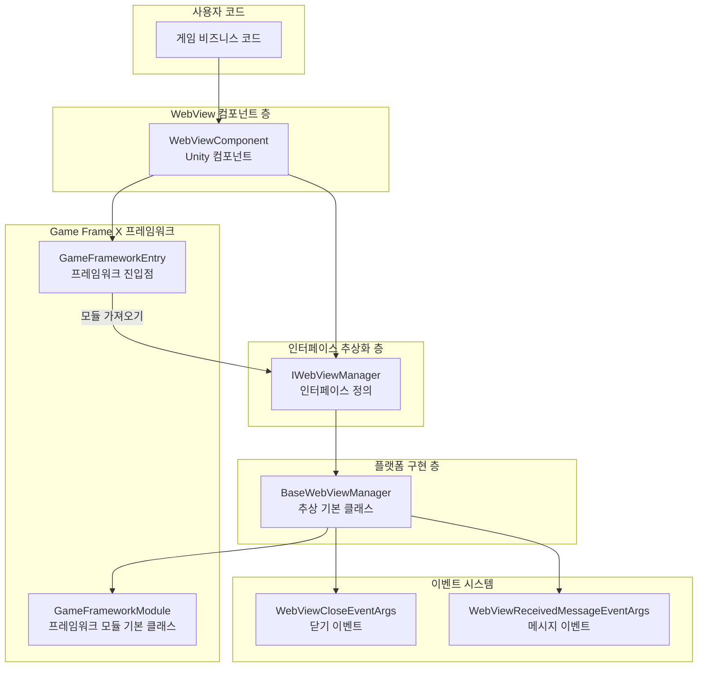
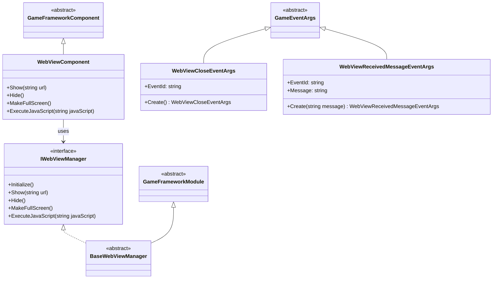
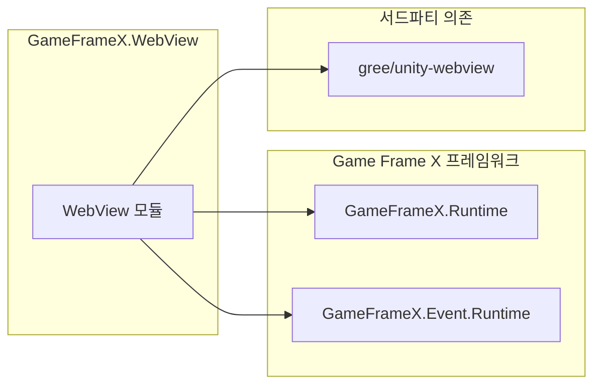

# 개요

`Game Frame X Web View`는 Game Frame X 게임 프레임워크의 WebView 컴포넌트로, Unity 게임에 임베디드 웹 페이지 표시 기능을 제공합니다. 이 컴포넌트는 [gree/unity-webview](https://github.com/gree/unity-webview)를 기반으로 캡슐화하여 더 간결한 API와 더 편리한 통합 방식을 제공합니다.

## 프로젝트 소개

GameFrameX WebView는 Game Frame X 게임 프레임워크 생태계의 일부로, Unity 게임에 웹 콘텐츠를 임베드하는 요구를 해결합니다. 이 컴포넌트를 통해 개발자는 다음을 수행할 수 있습니다:

- Unity 게임에 외부 웹 콘텐츠 표시
- C#과 JavaScript의 양방향 통신 구현
- Android 및 iOS 주요 모바일 플랫폼 지원
- Game Frame X 프레임워크의 다른 모듈과 원활한 통합

## 핵심 기능

| 기능 | 설명 |
|------|------|
| 웹 페이지 표시 | Unity 씬에 웹 페이지를 임베드하고 표시 |
| JavaScript 인터랙션 | C#과 웹 JavaScript 코드 간 양방향 호출 지원 |
| 전체 화면 표시 | 전체 화면 모드 지원 제공 |
| 플랫폼 어댑터 | Android 및 iOS 플랫폼 자동 어댑션 |
| 이벤트 시스템 | WebView 닫기 및 메시지 수신 이벤트 제공 |

## 시스템 아키텍처

### 아키텍처 설명

1. **WebViewComponent**: Unity 컴포넌트 층으로, 사용자에게 맞는 API를 제공합니다. 개발자는 이 컴포넌트를 GameObject에 붙여 WebView 기능을 사용합니다.

2. **IWebViewManager**: 인터페이스 층으로, WebView 관리자의 표준 작업을 정의합니다. 초기화, 표시, 숨기기, 전체 화면 및 JavaScript 실행 등의 메서드를 포함합니다.

3. **BaseWebViewManager**: 추상 기본 클래스로, GameFrameworkModule을 상속받아 플랫폼 관련 구체적인 구현 템플릿을 제공합니다. 플랫폼 구현 클래스(예: AndroidWebViewManager, iOSWebViewManager)가 이 클래스를 상속합니다.

4. **GameFrameworkModule**: Game Frame X 프레임워크의 모듈 기본 클래스로, 모듈 수명 주기 관리 및 프레임워크 통합 기능을 제공합니다.

5. **이벤트 시스템**: GameFrameX의 이벤트 시스템을 통해 WebView 관련 이벤트를 전파하며, 닫기 이벤트와 메시지 수신 이벤트를 포함합니다.

## 모듈 설계

## 플랫폼 지원

| 플랫폼 | 지원 상태 | 설명 |
|------|----------|------|
| Android | ✅ 지원 | unity-webview Android 플러그인을 통해 구현 |
| iOS | ✅ 지원 | unity-webview iOS 플러그인을 통해 구현 |
| Windows | ⚠️ 기본 지원 | 에디터 환경에서만 지원 |
| macOS | ⚠️ 기본 지원 | 에디터 환경에서만 지원 |
| WebGL | ❌ 지원 안 함 | WebGL 플랫폼은 WebView를 중첩할 수 없음 |

## 의존 관계

`package.json` 구성에 따라 이 모듈은 다음 컴포넌트에 의존합니다:

- **GameFrameX.Runtime** (`com.gameframex.unity: 1.0.0`): 프레임워크 핵심 런타임
- **GameFrameX.Event.Runtime**: 프레임워크 이벤트 시스템
- **gree/unity-webview**: 하위 WebView 구현 (별도 설치 필요)

## 사용 시나리오

GameFrameX WebView는 다음 시나리오에 적합합니다:

1. **게임 내 공지**: WebView를 사용하여 게임 공지, 이벤트 페이지 표시
2. **로그인 인증**: 서드파티 로그인 또는 SDK의 웹 페이지 통합 (예: Google 로그인, Apple 로그인)
3. **상점 전시**: 게임 내 가상 상품 상점 전시
4. **도움말 문서**: 게임 도움말 또는 튜토리얼 웹 페이지 표시
5. **커뮤니티 기능**: 포럼 또는 커뮤니티 페이지 통합
6. **광고 전시**: 웹 형태의 광고 콘텐츠 표시

## 관련 링크

- [설치 가이드](./02.installation) - 상세 설치 단계
- [빠른 시작](./03.getting-started) - 빠른 시작 튜토리얼
- [API 참조](./04.api-reference) - 완전한 API 문서
- [플랫폼 구성](./05.platforms) - Android 및 iOS 플랫폼 구성
- [이벤트 시스템](./06.events) - 이벤트 시스템 상세 설명
- [자주 묻는 질문](./07.troubleshooting) - 자주 묻는 질문 답변
- [Game Frame X 공식 웹사이트](https://gameframex.doc.alianblank.com)
- [gree/unity-webview](https://github.com/gree/unity-webview)