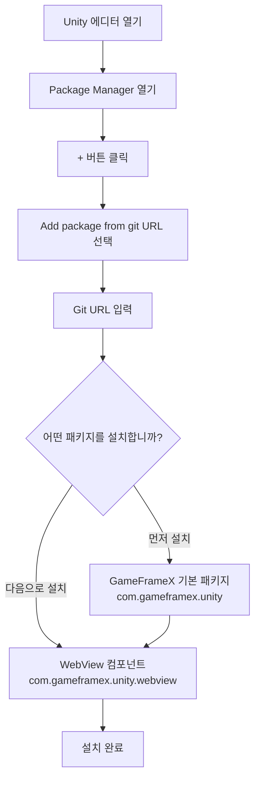

# 설치

GameFrameX WebView 컴포넌트의 설치 가이드입니다. 이 섹션에서는 WebView 플러그인을 올바르게 설치하고 구성하는 방법을 자세히 설명합니다.

## 개요

GameFrameX WebView는 GameFrameX 게임 프레임워크의 웹 뷰 컴포넌트로, [gree/unity-webview](https://github.com/gree/unity-webview)를 기반으로 캡슐화하여 더 간결한 API와 더 편리한 통합 방식을 제공합니다. 이 컴포넌트는 Unity 게임에 웹 콘텐츠를 삽입하고 표시할 수 있게 하며, Android 및 iOS 플랫폼에서 실행을 지원합니다.

## 환경 요구 사항

WebView 컴포넌트를 설치하기 전에 개발 환경이 다음 요구 사항을 충족하는지 확인하십시오:

| 요구 사항 | 최소 버전 | 설명 |
|--------|----------|------|
| Unity 에디터 | 2019.4 | LTS 버전 권장 |
| .NET Framework | 4.6.1 | Unity 스크립트 런타임 |
| GameFrameX 기본 패키지 | 1.0.0 | 먼저 설치해야 함 |

## 설치 단계

### 단계 1: GameFrameX 기본 패키지 설치

WebView 컴포넌트를 설치하기 전에 GameFrameX 기본 프레임워크 패키지를 먼저 설치해야 합니다. 이는 모든 GameFrameX 컴포넌트의 종속성 기반입니다.

1. Unity 에디터에서 `Package Manager`를 엽니다 (메뉴: `Window` → `Package Manager`)
2. 좌측 상단의 `+` 버튼을 클릭하고 `Add package from git URL...`을 선택합니다
3. GameFrameX 기본 패키지 주소를 입력합니다:

```
https://github.com/GameFrameX/com.gameframex.unity.git
```

4. `Add`를 클릭하고 설치가 완료될 때까지 기다립니다

### 단계 2: WebView 컴포넌트 설치

GameFrameX 기본 패키지 설치가 완료되면 다음 단계에 따라 WebView 컴포넌트를 설치합니다:

1. Unity 에디터에서 `Package Manager`를 엽니다 (메뉴: `Window` → `Package Manager`)
2. `Package` 드롭다운 메뉴에서 `My Packages` 또는 `In Project`를 선택합니다
3. 좌측 상단의 `+` 버튼을 클릭하고 `Add package from git URL...`을 선택합니다
4. WebView 컴포넌트의 Git 주소를 입력합니다:

```
https://github.com/GameFrameX/com.gameframex.unity.webview.git
```

5. `Add`를 클릭하고 설치가 완료될 때까지 기다립니다



### 단계 3: 설치 확인

설치가 완료되면 다음 단계에 따라 WebView 컴포넌트가 올바르게 설치되었는지 확인합니다:

1. Unity 에디터에서 메뉴의 `GameObject` → `Create Empty`를 클릭하여 빈 게임 객체를 생성합니다
2. 해당 빈 게임 객체를 클릭하고 Inspector 패널에서 `Add Component` 버튼을 클릭합니다
3. 컴포넌트 검색란에 `WebView`를 입력합니다
4. 검색 결과에 `WebView Component`가 나타나는지 확인합니다

```csharp
// 확인 방법 2: 코드로 확인
using GameFrameX.WebView.Runtime;
using UnityEngine;

public class WebViewCheck : MonoBehaviour
{
    void Start()
    {
        // WebView 컴포넌트 가져오기 시도
        var webView = FindObjectOfType<WebViewComponent>();
        if (webView != null)
        {
            Debug.Log("WebView 컴포넌트가 성공적으로 설치되었습니다!");
        }
    }
}
```

## 패키지 구조 설명

설치가 완료되면 WebView 컴포넌트가 Unity 프로젝트에 다음 파일 구조를 생성합니다:

| 디렉토리/파일 | 설명 |
|-----------|------|
| `Editor/` | 에디터 관련 코드, 컴포넌트 인스펙터 포함 |
| `Runtime/` | 런타임 핵심 코드 |
| `Runtime/WebViewComponent.cs` | WebView 핵심 컴포넌트 |
| `Runtime/IWebViewManager.cs` | WebView 관리자 인터페이스 |
| `Runtime/BaseWebViewManager.cs` | WebView 관리자 기본 클래스 |
| `Runtime/EventArgs/` | 이벤트 매개변수 정의 |

## 플랫폼 구성

설치가 완료되면 대상 플랫폼에 따라 추가 구성이 필요할 수 있습니다:

### Android 플랫폼

WebView 컴포넌트의 Android 플랫폼 지원은 기반 unity-webview 플러그인에 종속됩니다. 일반적으로 추가 구성이 필요하지 않지만, 문제가 발생하는 경우 [플랫폼 구성](./5-platforms) 문서를 참조하십시오.

### iOS 플랫폼

iOS 플랫폼 역시 unity-webview 플러그인에 종속됩니다. 구성이 필요한 경우 [플랫폼 구성](./5-platforms) 문서의 iOS 섹션을 참조하십시오.

## 일반적인 설치 문제

### 문제 1: Git URL에서 설치할 수 없음

**원인:** Unity 버전이 너무 낮거나 네트워크 문제

**해결 방법:**
- Unity 버전이 2019.4 이상인지 확인합니다
- 네트워크 연결을 확인합니다
- CNPM 미러 소스 사용을 시도합니다

### 문제 2: 종속 패키지를 찾을 수 없음

**원인:** GameFrameX 기본 패키지가 설치되지 않음

**해결 방법:**
- 먼저 `com.gameframex.unity` 기본 패키지를 설치합니다
- 기본 패키지 버전이 1.0.0 이상인지 확인합니다

### 문제 3: 컴파일 오류

**원인:** 어셈블리 정의 참조 누락

**해결 방법:**
- Unity 프로젝트를 다시 엽니다
- Package Manager에서 모든 종속 패키지가 올바르게 설치되었는지 확인합니다
- Console 창의 구체적인 오류 메시지를 확인합니다

## WebView 컴포넌트 제거

WebView 컴포넌트를 제거하려면:

1. Unity 에디터에서 `Package Manager`를 엽니다
2. 패키지 목록에서 `Game Frame X Web View`를 찾습니다
3. 해당 패키지를 클릭하고 우측 패널에서 `Remove` 버튼을 클릭합니다

> **참고:** 제거하기 전에 프로젝트에서 WebView 기능을 사용하는 코드가 없는지 확인하십시오.

## 관련 링크

- [빠른 시작](./3-getting-started) - WebView 컴포넌트 사용 방법 학습
- [API 참조](./4-api-reference) - 완전한 API 문서
- [이벤트 시스템](./6-events) - WebView 이벤트 상세 설명
- [자주 묻는 질문](./7-troubleshooting) - 자주 묻는 질문과 해결 방법
- [GameFrameX 공식 웹사이트](https://gameframex.doc.alianblank.com) - 프레임워크 문서
- [unity-webview 저장소](https://github.com/gree/unity-webview) - 기반 플러그인
