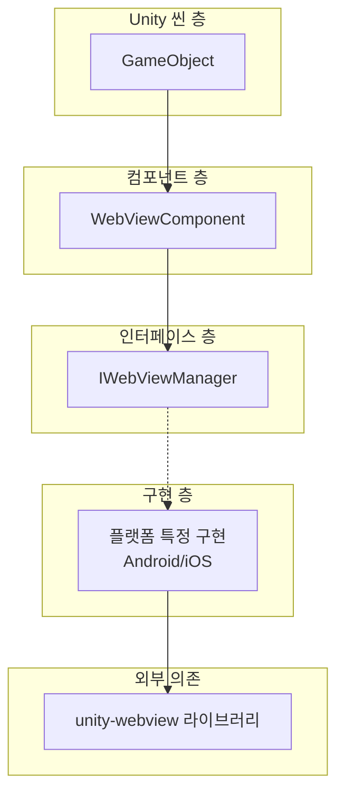
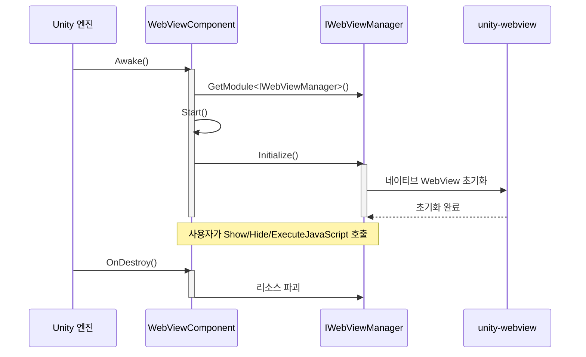

# 빠른 시작

본 가이드는 Game Frame X Web View 컴포넌트를 빠르게 시작하여 Unity 프로젝트에서 WebView 기능을 통합하고 사용하는 방법을 알려줍니다.

## 개요

Game Frame X Web View는 [gree/unity-webview](https://github.com/gree/unity-webview)의 캡슐화이며, 더 간결한 API와 더 편리한 통합 방식을 제공합니다. 이 컴포넌트를 통해 Unity 게임에 쉽게 웹 페이지를 임베드하고 C#과 JavaScript의 양방향 통신을 구현할 수 있습니다.

## 핵심 개념

시작하기 전에 다음 핵심 컴포넌트의 역할을 이해하는 것이 중요합니다:



- **WebViewComponent**: Unity 컴포넌트이며, 씬의 GameObject에 붙여야 합니다
- **IWebViewManager**: WebView 작업을 정의하는 통일된 인터페이스
- **플랫폼 구현**: 실행 플랫폼에 따라 적합한 구현을 자동 선택 (Android/iOS)

## 기본 사용 흐름

### 단계 1: 씬에 WebView 컴포넌트 추가

1. Unity 에디터에서 씬을 엽니다
2. 새 빈 GameObject를 생성합니다 (마우스 우클릭 → Create Empty)
3. 해당 GameObject를 선택하고 Inspector 패널의 "Add Component"를 클릭합니다
4. "WebView"를 검색하여 추가합니다

```csharp
// 컴포넌트 경로: Game Framework → WebView
// Source: [WebViewComponent.cs](https://github.com/GameFrameX/com.gameframex.unity.webview/blob/main/Runtime/WebViewComponent.cs#L10-L14)
[DisallowMultipleComponent]
[AddComponentMenu("Game Framework/WebView")]
[UnityEngine.Scripting.Preserve]
public partial class WebViewComponent : GameFrameworkComponent
{
```

### 단계 2: 컴포넌트 구성 (선택 사항)

Inspector 패널에서 다음 옵션을 구성할 수 있습니다:

| 구성 항목 | 타입 | 설명 |
|--------|------|------|
| Implementation Component Type | string | 플랫폼 특정 IWebViewManager 구현 타입 |

> **참고**: 기본적으로 프레임워크가 실행 플랫폼에 따라 적절한 구현을 자동 선택하므로, 수동 구성은 필요하지 않습니다.

### 단계 3: 코드에서 WebView 가져오기 및 사용

코드에서 WebViewComponent를 사용하는 기본 방법은 다음과 같습니다:

```csharp
using GameFrameX.WebView.Runtime;
using UnityEngine;

public class Example : MonoBehaviour
{
    private WebViewComponent _webView;

    void Start()
    {
        // WebViewComponent 인스턴스 가져오기
        _webView = FindObjectOfType<WebViewComponent>();

        if (_webView != null)
        {
            // WebView를 표시하고 지정된 URL을 로드합니다
            _webView.Show("https://gameframex.doc.alianblank.com");
        }
    }
}
```
> Source: [README.md](https://github.com/GameFrameX/com.gameframex.unity.webview/blob/main/README.md#L31-L43)

## 일반 작업 예제

### 웹 페이지 표시

```csharp
// WebView를 표시하고 URL을 로드합니다
webView.Show("https://example.com");
```

### WebView 숨기기

```csharp
// WebView를 숨깁니다 (파괴하지 않고, 보이지만 않을 뿐입니다)
webView.Hide();
```

### 전체 화면 표시

```csharp
// WebView를 전체 화면 모드로 설정합니다
webView.MakeFullScreen();
```

### JavaScript 실행

```csharp
// 현재 로드된 웹 페이지에서 JavaScript 코드를 실행합니다
webView.ExecuteJavaScript("document.title = 'Hello from Unity!'");
```

```csharp
// JavaScript 호출 후 C#을 다시 호출하여 다른 JavaScript를 실행합니다
webView.ExecuteJavaScript("Unity.call('messageFromJS');");
```

## 고급 사용 시나리오

### 시나리오 1: 사용자 로그인 인터페이스

게임에서 서드파티 로그인(예: Google 로그인, Apple 로그인)을 통합할 때, WebView는 일반적인 솔루션입니다:

```csharp
public class LoginManager : MonoBehaviour
{
    private WebViewComponent _webView;

    void Start()
    {
        _webView = FindObjectOfType<WebViewComponent>();
    }

    public void ShowLogin(string provider)
    {
        // 로그인 페이지 표시
        string loginUrl = $"https://example.com/login?provider={provider}";
        _webView.Show(loginUrl);
    }

    public void OnLoginSuccess(string token)
    {
        // 로그인 성공 처리
        Debug.Log($"로그인 성공, 토큰: {token}");

        // WebView 숨기기
        _webView.Hide();

        // 사용자 데이터 로드 등 후속 작업...
    }

    public void OnLoginFailed(string error)
    {
        Debug.LogError($"로그인 실패: {error}");
        _webView.Hide();
    }
}
```

### 시나리오 2: 개인정보 보호 정책 및 사용자 계약

게임 출시 전 개인정보 보호 정책을 표시해야 하며, WebView를 사용하면 HTML 콘텐츠를 편리하게 표시할 수 있습니다:

```csharp
public class PrivacyPolicyController : MonoBehaviour
{
    private WebViewComponent _webView;

    void Awake()
    {
        _webView = FindObjectOfType<WebViewComponent>();
    }

    public void ShowPrivacyPolicy()
    {
        // 로컬 HTML 파일 로드
        _webView.Show(Application.dataPath + "/PrivacyPolicy.html");
    }

    public void ShowTermsOfService()
    {
        // 온라인 서비스 약관 로드
        _webView.Show("https://example.com/terms");
    }
}
```

### 시나리오 3: 게임 내 브라우저

有些游戏提供内置浏览器功能，让玩家查看攻略或社区:

```csharp
public class InGameBrowser : MonoBehaviour
{
    [SerializeField] private WebViewComponent _webView;
    [SerializeField] private string _defaultUrl = "https://gameframex.doc.alianblank.com";

    void Start()
    {
        // 게임 공식 사이트 열기
        _webView.Show(_defaultUrl);
    }

    public void NavigateTo(string url)
    {
        _webView.Show(url);
    }

    public void Refresh()
    {
        // 현재 페이지 새로고침
        _webView.ExecuteJavaScript("location.reload();");
    }

    public void CloseBrowser()
    {
        _webView.Hide();
    }

    public void ToggleFullScreen()
    {
        _webView.MakeFullScreen();
    }
}
```

### 시나리오 4: C#과 JavaScript 양방향 통신

```csharp
public class JSBridgeExample : MonoBehaviour
{
    private WebViewComponent _webView;

    void Start()
    {
        _webView = FindObjectOfType<WebViewComponent>();

        // JavaScript 메시지 콜백 등록
        // 참고: 구체적인 콜백 방식은 하위 unity-webview 구현에 따라 다릅니다
    }

    // JavaScript에서 데이터 가져오기
    public void GetUserData()
    {
        string jsCode = @"
            var userData = {
                name: 'Player1',
                level: 10,
                gold: 1000
            };
            JSON.stringify(userData);
        ";
        _webView.ExecuteJavaScript(jsCode);
    }

    // JavaScript에 메시지 보내기
    public void SendMessageToJS(string message)
    {
        _webView.ExecuteJavaScript($"console.log('Unity says: {message}');");
    }
}
```

## 수명 주기 관리



**수명 주기 설명:**

1. **Awake()**: IWebViewManager 인스턴스 가져오기
2. **Start()**: Initialize() 호출하여 WebView 초기화
3. **사용자 작업**: Show/Hide/MakeFullScreen/ExecuteJavaScript 호출
4. **OnDestroy()**: 파괴 시 리소스 자동 해제

## 플랫폼 주의 사항

- **Android**: AndroidManifest.xml 권한 구성 필요
- **iOS**: iOS 플랫폼 설정 구성 필요

> 구체적인 플랫폼 구성은 [플랫폼 구성](./05.platforms) 문서를 참고하세요.

## 자주 묻는 질문

1. **WebView가 표시되지 않나요?**
   - WebViewComponent가 올바르게 추가되었는지 확인합니다
   - 플랫폼 구현이 올바르게 구성되었는지 확인합니다

2. **URL을 로드할 수 없나요?**
   - 네트워크 권한이 구성되었는지 확인합니다
   - URL이 유효한지 확인합니다

3. **JavaScript 실행이无效나요?**
   - WebView가 올바르게 초기화되었는지 확인합니다
   - JavaScript 문법이 올바른지 확인합니다

## 관련 링크

- [개요](./01.overview) - WebView 컴포넌트의 전체 설계에 대해 자세히 알아보기
- [설치](./02.installation) - 상세 설치 가이드
- [API 참조](./04.api-reference) - 완전한 API 문서
- [플랫폼 구성](./05.platforms) - Android 및 iOS 플랫폼 특정 구성
- [이벤트 시스템](./06.events) - 이벤트 메커니즘 알아보기
- [자주 묻는 질문](./07.troubleshooting) - 자주 묻는 질문과 해결책