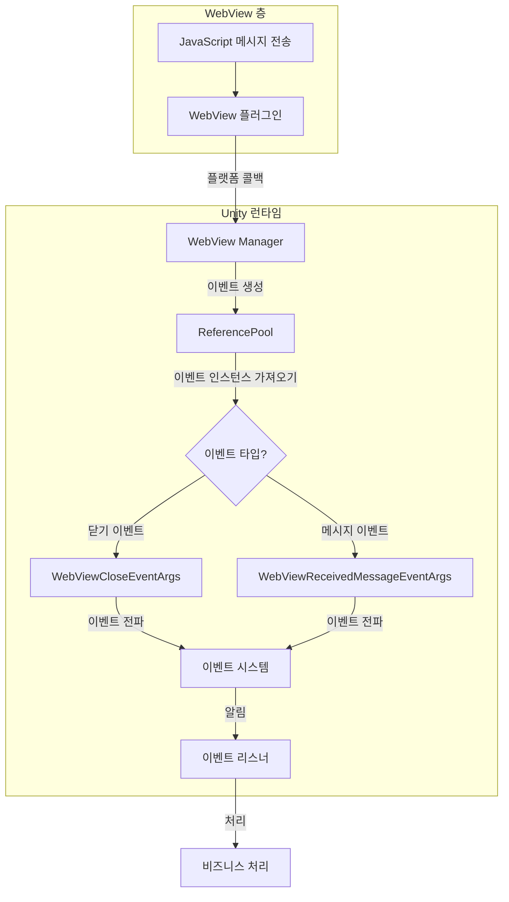

# 이벤트 시스템

이 문서는 GameFrameX WebView 컴포넌트의 이벤트 시스템을 소개하며, 이벤트 타입, 데이터 구조 및 프로젝트에서 이러한 이벤트를 사용하는 방법을 설명합니다.

## 개요

GameFrameX WebView 컴포넌트는 이벤트驱动 아키텍처를 채택하여, WebView와 Unity 애플리케이션 간의 통신을 구현합니다. 이 이벤트 시스템은 GameFrameX 핵심 프레임워크의 `GameEventArgs` 클래스를 기반으로 구축되며, 성능 최적화를 위해 객체 풀링을 지원합니다.

이벤트 시스템은 주로 다음 두 가지 이벤트를 제공합니다:
- **WebView 닫기 이벤트** - WebView가 닫힐 때 트리거
- **WebView 메시지 수신 이벤트** - WebView에서 메시지를 수신할 때 트리거

## 아키텍처 설계

```mermaid
classDiagram
    class GameEventArgs {
        <<abstract>>
        +string Id { get; }
        +void Clear()
    }

    class WebViewCloseEventArgs {
        +static string EventId
        +static WebViewCloseEventArgs Create()
    }

    class WebViewReceivedMessageEventArgs {
        +static string EventId
        +string Message { get; }
        +static WebViewReceivedMessageEventArgs Create(string message)
    }

    class ReferencePool {
        +static T Acquire~T~()
        +static void Release(T instance)
    }

    GameEventArgs <|-- WebViewCloseEventArgs
    GameEventArgs <|-- WebViewReceivedMessageEventArgs
    WebViewCloseEventArgs --> ReferencePool : uses
    WebViewReceivedMessageEventArgs --> ReferencePool : uses
```

### 컴포넌트 설명

| 컴포넌트 | 설명 |
|------|------|
| `GameEventArgs` | 이벤트 매개변수 기본 클래스, GameFrameX 핵심 런타임에서 가져옴 |
| `WebViewCloseEventArgs` | WebView 닫기 이벤트 매개변수 |
| `WebViewReceivedMessageEventArgs` | WebView 메시지 수신 이벤트 매개변수 |
| `ReferencePool` | 객체 풀, 이벤트 객체의 재활용에 사용 |

## 이벤트 타입 상세

### WebViewCloseEventArgs

`WebViewCloseEventArgs`는 WebView 닫기 이벤트를 나타내며, WebView 창이 닫힐 때 트리거됩니다.

```csharp
// Source: Runtime/EventArgs/WebViewCloseEventArgs.cs#L15-L41
public sealed class WebViewCloseEventArgs : GameEventArgs
{
    /// <summary>
    /// WebView 메시지 닫기 이벤트 ID
    /// </summary>
    public static readonly string EventId = typeof(WebViewCloseEventArgs).FullName;

    public override void Clear()
    {
    }

    public override string Id
    {
        get { return EventId; }
    }

    /// <summary>
    /// WebView 메시지 닫기 이벤트 생성
    /// </summary>
    /// <returns></returns>
    public static WebViewCloseEventArgs Create()
    {
        var eventArgs = ReferencePool.Acquire<WebViewCloseEventArgs>();
        return eventArgs;
    }
}
```

**특징:**
- 추가 데이터 페이로드 없음
- 객체 풀 관리 인스턴스 사용, 빈번한 GC 피하기

### WebViewReceivedMessageEventArgs

`WebViewReceivedMessageEventArgs`는 WebView에서 수신된 메시지 이벤트를 나타내며, JavaScript와 Unity가 통신할 때 트리거됩니다.

```csharp
// Source: Runtime/EventArgs/WebViewReceivedMessageEventArgs.cs#L9-L42
public sealed class WebViewReceivedMessageEventArgs : GameEventArgs
{
    /// <summary>
    /// WebView 메시지 수신 이벤트 ID
    /// </summary>
    public static readonly string EventId = typeof(WebViewReceivedMessageEventArgs).FullName;

    public override void Clear()
    {
    }

    public override string Id
    {
        get { return EventId; }
    }

    /// <summary>
    /// WebView 메시지 수신 이벤트 생성
    /// </summary>
    /// <param name="message">메시지 내용</param>
    /// <returns></returns>
    public static WebViewReceivedMessageEventArgs Create(string message)
    {
        var eventArgs = ReferencePool.Acquire<WebViewReceivedMessageEventArgs>();
        eventArgs.Message = message;
        return eventArgs;
    }

    /// <summary>
    /// 이벤트 메시지
    /// </summary>
    public string Message { get; private set; }
}
```

**속성 설명:**
| 속성 | 타입 | 설명 |
|------|------|------|
| Message | string | WebView에서 수신된 메시지 내용 |

## 이벤트 흐름 프로세스



## 이벤트 구독 및 처리

GameFrameX WebView 이벤트를 구독하려면 GameFrameX 핵심 프레임워크의 이벤트 시스템을 사용해야 합니다. 다음은 이벤트 구독의 기본 패턴입니다:

### WebView 닫기 이벤트 구독

```csharp
// 이벤트 구독
EventCenter.EventSystem.Subscribe(WebViewCloseEventArgs.EventId, OnWebViewClosed);

// 이벤트 처리 메서드
private void OnWebViewClosed(object sender, GameEventArgs e)
{
    var args = e as WebViewCloseEventArgs;
    // 닫기 이벤트 처리
    Debug.Log("WebView가 닫혔습니다");
}

// 구독 취소
EventCenter.EventSystem.Unsubscribe(WebViewCloseEventArgs.EventId, OnWebViewClosed);
```

### WebView 메시지 수신 이벤트 구독

```csharp
// 이벤트 구독
EventCenter.EventSystem.Subscribe(WebViewReceivedMessageEventArgs.EventId, OnMessageReceived);

// 이벤트 처리 메서드
private void OnMessageReceived(object sender, GameEventArgs e)
{
    var args = e as WebViewReceivedMessageEventArgs;
    if (args != null)
    {
        // 수신된 메시지 처리
        Debug.Log($"WebView 메시지 수신: {args.Message}");
    }
}

// 구독 취소
EventCenter.EventSystem.Unsubscribe(WebViewReceivedMessageEventArgs.EventId, OnMessageReceived);
```

## 객체 풀 메커니즘

GameFrameX WebView 이벤트 시스템은 성능 최적화를 위해 `ReferencePool`을 통한 객체 풀化管理를 사용합니다:

1. **이벤트 생성**: `Create()` 메서드를 통해 객체 풀에서 인스턴스를 가져옴
2. **이벤트 처리**: 처리 완료 후, 이벤트 인스턴스는 자동回收됩니다
3. **장점**: 가비지 컬렉션 압박을 줄이고 게임 성능을 향상시킵니다

```csharp
// 객체 풀에서 이벤트 인스턴스 가져오기
var eventArgs = ReferencePool.Acquire<WebViewReceivedMessageEventArgs>();
eventArgs.Message = "Hello Unity";

// 사용 후 자동 회수 - 이벤트 시스템에서 처리
```

## 이벤트 ID 참조

| 이벤트 타입 | EventId |
|----------|---------|
| WebViewCloseEventArgs | `GameFrameX.WebView.Runtime.WebViewCloseEventArgs` |
| WebViewReceivedMessageEventArgs | `GameFrameX.WebView.Runtime.WebViewReceivedMessageEventArgs` |

## 관련 링크

- [API 참조](./04.api-reference) - WebView 완전한 API 문서
- [빠른 시작](./03.getting-started) - WebView 기초 사용 튜토리얼
- [플랫폼 구성](./05.platforms) - Android 및 iOS 플랫폼 구성
- [GameFrameX 핵심 프레임워크](https://gameframex.doc.alianblank.com) - 이벤트 시스템 하위 구현