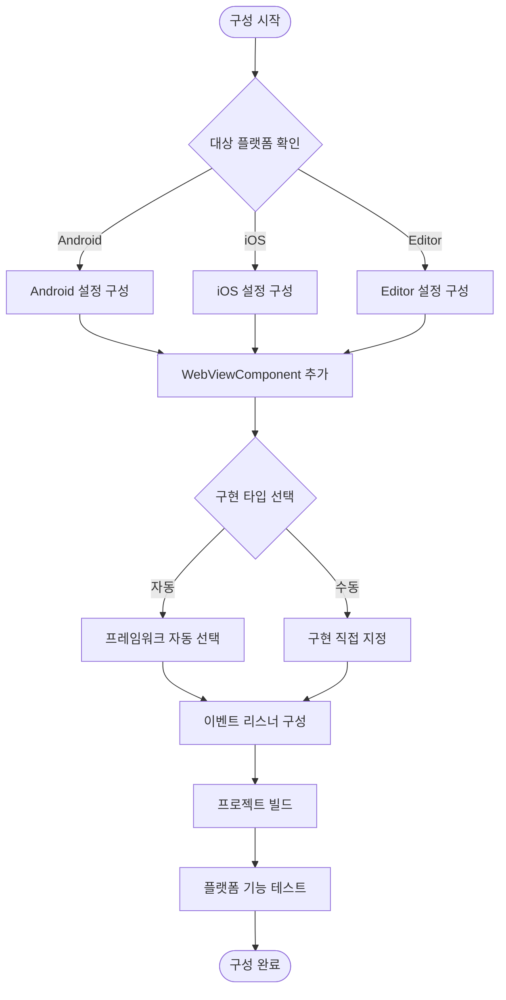

# 플랫폼 구성

이 문서는 GameFrameX WebView 컴포넌트의 다양한 플랫폼에서의 구성 방법을 소개하며, 플랫폼 선택 메커니즘, 사용 가능한 플랫폼 구현 및 구성 옵션을 포함합니다.

## 개요

GameFrameX WebView 컴포넌트는 플랫폼에 무관한 아키텍처 설계를 채택하여, `IWebViewManager` 인터페이스를 통해 통일된 WebView 작업 API를 정의합니다. 프레임워크는 런타임 플랫폼에 따라 적절한 구현을 자동 선택하며, 특정 플랫폼의 관리자를 수동 구성하는 것도 지원합니다.

### 지원 플랫폼

| 플랫폼 | 지원 상태 | 설명 |
|------|----------|------|
| Android | ✅ 지원 | gree/unity-webview의 Android 구현 기반 |
| iOS | ✅ 지원 | gree/unity-webview의 iOS 구현 기반 |
| WebGL | ⚠️ 제한적 지원 | WebGL 플랫폼의 WebView 기능이 제한됨 |
| Windows/Mac Editor | ✅ 지원 | 에디터 환경에서 디버깅 가능 |

## 아키텍처 설계

```mermaid
flowchart TD
    subgraph Client["클라이언트 층"]
        WC[WebViewComponent]
    end

    subgraph Interface["인터페이스 층"]
        IWM[IWebViewManager 인터페이스]
    end

    subgraph Abstract["추상 층"]
        BWM[BaseWebViewManager]
    end

    subgraph Implementations["플랫폼 구현 층"]
        AndroidWM[AndroidWebViewManager]
        iOSWM[iOSWebViewManager]
        EditorWM[EditorWebViewManager]
    end

    subgraph Native["네이티브 층"]
        AndroidNative[Android WebView]
        iOSNative[UIWebView/WKWebView]
    end

    WC --> IWM
    IWM <|.. BWM
    BWM <|-- AndroidWM
    BWM <|-- iOSWM
    BWM <|-- EditorWM
    AndroidWM --> AndroidNative
    iOSWM --> iOSNative
```

### 컴포넌트 책임

| 컴포넌트 | 책임 |
|------|------|
| `WebViewComponent` | Unity 컴포넌트 진입점, 수명 주기 처리 및 호출 전달 |
| `IWebViewManager` | WebView 작업의 통일된 인터페이스 정의 |
| `BaseWebViewManager` | GameFrameworkModule을 상속하는 추상 기본 클래스 제공 |
| 플랫폼 구현 클래스 | 특정 플랫폼의 WebView 기능 구현 |

## 플랫폼 선택 메커니즘

### 자동 선택

프레임워크는 GameFrameX의 모듈 시스템을 통해 플랫폼 구현을 자동 선택합니다. `GameFrameworkEntry.GetModule<IWebViewManager>()`를 호출할 때, 프레임워크는 현재 런타임 플랫폼에 따라 대응하는 구현을查找 및 로드합니다.

```csharp
// Runtime/WebViewComponent.cs
_webViewManager = GameFrameworkEntry.GetModule<IWebViewManager>();
```
> Source: [WebViewComponent.cs](https://github.com/GameFrameX/com.gameframex.unity.webview/blob/main/Runtime/WebViewComponent.cs#L28)

### 수동 구성

某些 시나리오에서는 특정 플랫폼 구현을 수동 지정해야 할 수 있습니다. Unity Editor의 Inspector 패널을 통해 구성할 수 있습니다:

1. WebViewComponent가 포함된 GameObject를 씬에 생성합니다
2. Inspector에서 **Implementation Type** 드롭다운 메뉴를 찾습니다
3. 원하는 플랫폼 구현 클래스를 선택합니다

```csharp
// WebViewComponent는 GameFrameworkComponent를 상속합니다
// componentType 속성은 사용자가 선택한 구현 타입을 저장합니다
ImplementationComponentType = Utility.Assembly.GetType(componentType);
```
> Source: [WebViewComponent.cs](https://github.com/GameFrameX/com.gameframex.unity.webview/blob/main/Runtime/WebViewComponent.cs#L24-L25)

## 플랫폼 특정 구성

### Android 플랫폼 구성

Android 플랫폼은 네이티브 WebView 컴포넌트를 사용하며, 다음 구성이 필요합니다:

**AndroidManifest.xml 권한:**
```xml
<!-- 네트워크 권한 추가 필요 -->
<uses-permission android:name="android.permission.INTERNET" />
```

**gradle 구성:**
```groovy
// PlayerSettings > Publishing Settings > Build
// unity-webview의 Android 라이브러리가 포함되었는지 확인합니다
```

### iOS 플랫폼 구성

iOS 플랫폼은 `WKWebView`(iOS 13+) 또는 `UIWebView`(호환성 모드)를 사용합니다:

**Info.plist 구성:**
```xml
<!-- 임의의 URL 로드 허용 (요구에 따라 구성) -->
<key>NSAppTransportSecurity</key>
<dict>
    <key>NSAllowsArbitraryLoads</key>
    <true/>
</dict>
```

**PlayerSettings 구성:**
- **Resolution and Presentation**: 적절한 WebView 렌더링 모드 설정
- **Other Settings**: IL2CPP 및 ABI 구성이 올바른지 확인합니다

### 에디터 디버깅 구성

Unity Editor 환경에서 실행할 때, 에디터 전용 WebView 구현을 사용하여 디버깅할 수 있습니다:

```csharp
// 에디터 구현은 시뮬레이션된 WebView 환경을 제공합니다
// 개발 단계에서 기능 테스트를 용이하게 합니다
```

## 구성 흐름



## 이벤트 시스템 구성

WebView 컴포넌트는 애플리케이션에各种 상태 변화를 알리기 위해 이벤트 시스템을 사용합니다. 서로 다른 플랫폼의 이벤트 동작은 동일합니다:

| 이벤트 | 설명 | 적용 플랫폼 |
|------|------|----------|
| `WebViewCloseEventArgs` | WebView 닫기 이벤트 | 모든 플랫폼 |
| `WebViewReceivedMessageEventArgs` | JavaScript 메시지 수신 | 모든 플랫폼 |

### 이벤트 구성 예시

```csharp
using GameFrameX.Event.Runtime;
using GameFrameX.WebView.Runtime;

// WebView 닫기 이벤트 구독
EventManager.Register<WebViewCloseEventArgs>(OnWebViewClosed);

// 메시지 수신 이벤트 구독
EventManager.Register<WebViewReceivedMessageEventArgs>(OnMessageReceived);

private void OnWebViewClosed(object sender, WebViewCloseEventArgs e)
{
    Debug.Log("WebView가 닫혔습니다");
}

private void OnMessageReceived(object sender, WebViewReceivedMessageEventArgs e)
{
    Debug.Log($"메시지 수신: {e.Message}");
}
```
> Source: [WebViewReceivedMessageEventArgs.cs](https://github.com/GameFrameX/com.gameframex.unity.webview/blob/main/Runtime/EventArgs/WebViewReceivedMessageEventArgs.cs#L30-L35)

## API 참조

### IWebViewManager 인터페이스

모든 플랫폼 구현은 통일된 인터페이스 사양을 따릅니다:

```csharp
public interface IWebViewManager
{
    /// <summary>
    /// WebView 관리자 초기화
    /// </summary>
    void Initialize();

    /// <summary>
    /// WebView를 표시하고 지정된 URL을 로드합니다
    /// </summary>
    /// <param name="url">로드할 웹 페이지 주소</param>
    void Show(string url);

    /// <summary>
    /// WebView를 전체 화면 모드로 설정합니다
    /// </summary>
    void MakeFullScreen();

    /// <summary>
    /// JavaScript 코드 실행
    /// </summary>
    /// <param name="javaScript">실행할 JavaScript 코드</param>
    void ExecuteJavaScript(string javaScript);

    /// <summary>
    /// WebView 숨기기
    /// </summary>
    void Hide();
}
```
> Source: [IWebViewManager.cs](https://github.com/GameFrameX/com.gameframex.unity.webview/blob/main/Runtime/IWebViewManager.cs#L12-L40)

### 기본 추상 클래스

```csharp
public abstract partial class BaseWebViewManager : GameFrameworkModule, IWebViewManager
{
    /// <summary>
    /// 초기화
    /// </summary>
    public abstract void Initialize();

    /// <summary>
    /// WebView 표시
    /// </summary>
    /// <param name="url">로드할 url</param>
    public abstract void Show(string url);

    /// <summary>
    /// 전체 화면
    /// </summary>
    public abstract void MakeFullScreen();

    /// <summary>
    /// JavaScript 실행
    /// </summary>
    /// <param name="javaScript">javaScript 코드</param>
    public abstract void ExecuteJavaScript(string javaScript);

    /// <summary>
    /// 숨기기
    /// </summary>
    public abstract void Hide();
}
```
> Source: [BaseWebViewManager.cs](https://github.com/GameFrameX/com.gameframex.unity.webview/blob/main/Runtime/BaseWebViewManager.cs#L11-L39)

## 자주 묻는 질문

### Q: 특정 플랫폼에 다른 WebView 구현을 사용하려면 어떻게 해야 하나요?

A: Inspector 패널에서 구현 타입을 수동으로 선택하거나, 코드에서 런타임時に动态切换할 수 있습니다:

```csharp
// 런타임時に 동적으로 구현 타입 설정
var webView = GetComponent<WebViewComponent>();
// 리플렉션 또는 구성 시스템을 통해 componentType 설정
```

### Q: 실제 기기에서 WebView가 빈 칸으로 표시되면 어떻게 해야 하나요?

A: 다음 구성을 확인합니다:
1. INTERNET 권한이 추가되었는지 확인합니다 (Android)
2. Info.plist의 App Transport Security 구성 확인
3. URL이 공개적으로 접근 가능한지 확인합니다

### Q: 서로 다른 플랫폼에 다른 URL을 사용하려면 어떻게 해야 하나요?

A: 플랫폼 조건부 컴파일 또는 런타임 감지를 사용합니다:

```csharp
#if UNITY_ANDROID
webView.Show("https://android.example.com");
#elif UNITY_IOS
webView.Show("https://ios.example.com");
#else
webView.Show("https://default.example.com");
#endif
```

## 관련 링크

- [개요](./01.overview) - 프로젝트 전체 소개
- [빠른 시작](./03.getting-started) - 빠르게 시작하기
- [API 참조](./04.api-reference) - 완전한 API 문서
- [이벤트 시스템](./06.events) - 이벤트 메커니즘 상세 설명
- [자주 묻는 질문](./07.troubleshooting) - 문제排查 가이드
- [GameFrameX 공식 웹사이트](https://gameframex.doc.alianblank.com)
- [gree/unity-webview](https://github.com/gree/unity-webview) - 네이티브 WebView 플러그인