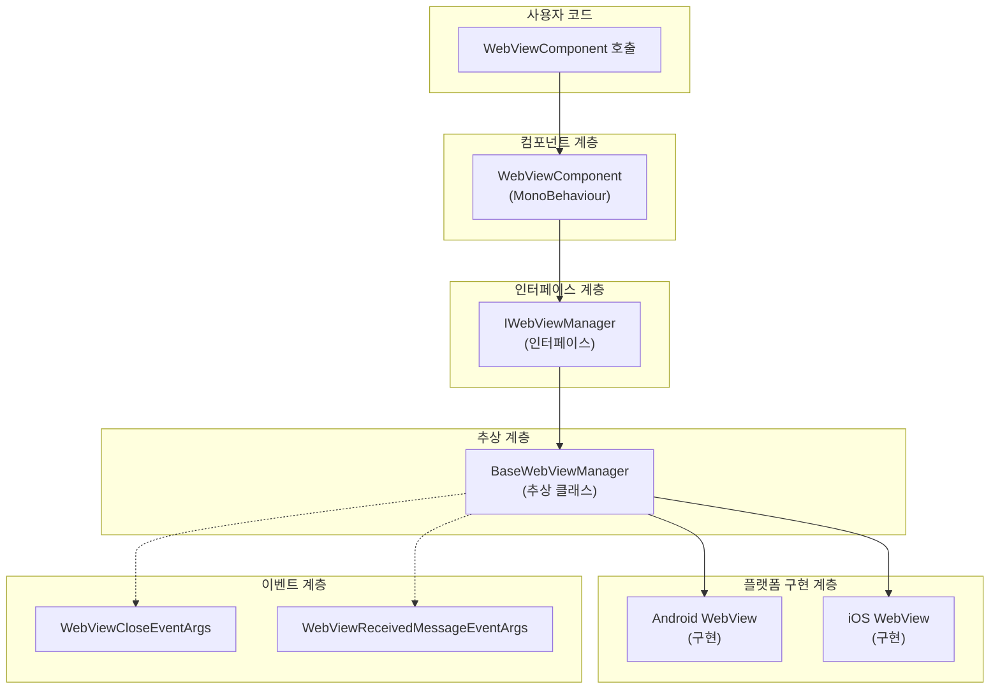

# API 참조

이 문서는 GameFrameX WebView 컴포넌트의 완전한 API 인터페이스를 상세히 설명한다. 인터페이스 정의, 컴포넌트 메서드, 이벤트 파라미터 등을 포함한다.

## 개요

GameFrameX WebView 컴포넌트는 Unity 게임에서 Web 콘텐츠를 임베드하고 표시하는 완전한 솔루션을 제공한다. API 설계는 GameFrameX 프레임워크 규범을 따르며, 인터페이스 추상을 통해 플랫폼에 무관한 핵심 기능을 구현하고, 각 플랫폼의 구체적 구현(gree/unity-webview 기반)에서 네이티브 지원을 제공한다.

주요 API는 다음과 같이 나뉜다:
- **IWebViewManager 인터페이스** - WebView管理的 핵심 추상 정의
- **WebViewComponent 컴포넌트** - Unity 레벨의 사용자 상호작용 진입점
- **이벤트 시스템** - WebView 상태 변화의 알림 메커니즘
- **이벤트 파라미터** - 이벤트가 전달하는 데이터 구조

## 아키텍처



### 아키텍처 설명

1. **사용자 코드 계층**: `WebViewComponent`를 통해 시스템과 상호작용
2. **컴포넌트 계층**: `WebViewComponent`는 `GameFrameworkComponent`에서 상속되며, Unity 레벨의 진입점
3. **인터페이스 계층**: `IWebViewManager`가 통일된 추상 인터페이스 정의
4. **추상 계층**: `BaseWebViewManager`가 모든 구현의 공통 기본 클래스 제공
5. **플랫폼 구현 계층**: 구체적인 플랫폼(Android, iOS)의 WebView 구현

## IWebViewManager 인터페이스

`IWebViewManager`는 WebView 기능의 핵심 인터페이스로, 모든 WebView 조작의 표준 추상을 정의한다. 프레임워크가 실행 플랫폼에 따라 적합한 구현을 자동으로 선택한다.

> Source: [IWebViewManager.cs](https://github.com/GameFrameX/com.gameframex.unity.webview/blob/main/Runtime/IWebViewManager.cs#L1-L41)

### 메서드 목록

| 메서드 | 설명 |
|------|------|
| `Initialize()` | WebView 시스템 초기화 |
| `Show(string url)` | WebView를 표시하고 지정된 URL 로드 |
| `MakeFullScreen()` | WebView를 전체 화면 모드로 설정 |
| `ExecuteJavaScript(string javaScript)` | WebView에서 JavaScript 코드 실행 |
| `Hide()` | WebView 숨기기 |

### `Initialize(): void`

WebView 시스템을 초기화한다. 이 메서드는 컴포넌트가 시작할 때 자동으로 호출되며, 재초기화를 위해 수동으로 호출할 수도 있다.

**구현 코드:**

```csharp
/// <summary>
/// 초기화
/// </summary>
void Initialize();
```

> Source: [IWebViewManager.cs](https://github.com/GameFrameX/com.gameframex.unity.webview/blob/main/Runtime/IWebViewManager.cs#L14-L17)

---

### `Show(url: string): void`

WebView를 표시하고 지정된 URL을 로드한다. 이 메서드를 호출하면 WebView가 표시 상태가 되어 웹 페이지 콘텐츠 로드를 시작한다.

**파라미터:**
- `url` (string): 로드할 웹 페이지 URL 주소, http:// 및 https:// 프로토콜 지원

**구현 코드:**

```csharp
/// <summary>
/// WebView 표시
/// </summary>
/// <param name="url">로드할 url</param>
void Show(string url);
```

> Source: [IWebViewManager.cs](https://github.com/GameFrameX/com.gameframex.unity.webview/blob/main/Runtime/IWebViewManager.cs#L19-L23)

---

### `MakeFullScreen(): void`

WebView를 전체 화면 모드로 설정한다. 전체 화면 모드에서 WebView는 전체 화면 영역을 덮는다.

**구현 코드:**

```csharp
/// <summary>
/// 전체 화면
/// </summary>
void MakeFullScreen();
```

> Source: [IWebViewManager.cs](https://github.com/GameFrameX/com.gameframex.unity.webview/blob/main/Runtime/IWebViewManager.cs#L25-L28)

---

### `ExecuteJavaScript(javaScript: string): void`

현재 로드된 Web 페이지에서 JavaScript 코드를 실행한다. 이를 통해 Unity 애플리케이션은 Web 페이지와 양방향 통신을 할 수 있다.

**파라미터:**
- `javaScript` (string): 실행할 JavaScript 코드 문자열

**구현 코드:**

```csharp
/// <summary>
/// JavaScript 실행
/// </summary>
/// <param name="javaScript">javaScript 코드</param>
void ExecuteJavaScript(string javaScript);
```

> Source: [IWebViewManager.cs](https://github.com/GameFrameX/com.gameframex.unity.webview/blob/main/Runtime/IWebViewManager.cs#L30-L34)

---

### `Hide(): void`

WebView를 숨긴다. 숨긴 후 WebView는 보이지 않지만 메모리에 여전히 존재하므로 언제든지 `Show()` 메서드를 통해 다시 표시할 수 있다.

**구현 코드:**

```csharp
/// <summary>
/// 숨기기
/// </summary>
void Hide();
```

> Source: [IWebViewManager.cs](https://github.com/GameFrameX/com.gameframex.unity.webview/blob/main/Runtime/IWebViewManager.cs#L36-L39)

---

## BaseWebViewManager 추상 클래스

`BaseWebViewManager`는 모든 플랫폼 특정 구현의 추상 기본 클래스로, `GameFrameworkModule`에서 상속되고 `IWebViewManager` 인터페이스를 구현한다.

> Source: [BaseWebViewManager.cs](https://github.com/GameFrameX/com.gameframex.unity.webview/blob/main/Runtime/BaseWebViewManager.cs#L1-L40)

### 클래스 정의

```csharp
public abstract partial class BaseWebViewManager : GameFrameworkModule, IWebViewManager
```

> Source: [BaseWebViewManager.cs](https://github.com/GameFrameX/com.gameframex.unity.webview/blob/main/Runtime/BaseWebViewManager.cs#L11)

### 추상 메서드

`IWebViewManager` 인터페이스의 모든 메서드는 `BaseWebViewManager`에서 추상 메서드로 선언되며, 각 플랫폼 구현 클래스가 구체적으로 구현한다:

| 메서드 | 시그니처 |
|------|----------|
| Initialize | `public abstract void Initialize();` |
| Show | `public abstract void Show(string url);` |
| MakeFullScreen | `public abstract void MakeFullScreen();` |
| ExecuteJavaScript | `public abstract void ExecuteJavaScript(string javaScript);` |
| Hide | `public abstract void Hide();` |

> Source: [BaseWebViewManager.cs](https://github.com/GameFrameX/com.gameframex.unity.webview/blob/main/Runtime/BaseWebViewManager.cs#L11-L39)

---

## WebViewComponent 컴포넌트

`WebViewComponent`는 사용자가 Unity 장면에서 직접 사용하는 컴포넌트로, `GameFrameworkComponent`에서 상속된다. `IWebViewManager`의 호출을 래핑하여 더 친숙한 Unity API를 제공한다.

> Source: [WebViewComponent.cs](https://github.com/GameFrameX/com.gameframex.unity.webview/blob/main/Runtime/WebViewComponent.cs#L1-L76)

### 컴포넌트 특성

```csharp
[DisallowMultipleComponent]
[AddComponentMenu("Game Framework/WebView")]
[UnityEngine.Scripting.Preserve]
public partial class WebViewComponent : GameFrameworkComponent
```

- `DisallowMultipleComponent`: 동일한 GameObject에 여러 인스턴스 추가 금지
- `AddComponentMenu`: Unity 메뉴에 바로 가기 생성 항목 추가
- `Scripting.Preserve`: 코드가 릴리스 시 난독화되지 않도록 보장

> Source: [WebViewComponent.cs](https://github.com/GameFrameX/com.gameframex.unity.webview/blob/main/Runtime/WebViewComponent.cs#L10-L12)

### 라이프사이클 메서드

#### Awake()

컴포넌트 초기화 시 호출되며, `IWebViewManager` 모듈 인스턴스를 가져오고 구성한다.

```csharp
protected override void Awake()
{
    ImplementationComponentType = Utility.Assembly.GetType(componentType);
    InterfaceComponentType = typeof(IWebViewManager);
    base.Awake();

    _webViewManager = GameFrameworkEntry.GetModule<IWebViewManager>();
    if (_webViewManager == null)
    {
        Log.Fatal("Web View manager is invalid.");
        return;
    }
}
```

> Source: [WebViewComponent.cs](https://github.com/GameFrameX/com.gameframex.unity.webview/blob/main/Runtime/WebViewComponent.cs#L22-L34)

#### Start()

장면 시작 시 호출되며, WebView 시스템을 초기화한다.

```csharp
private void Start()
{
    _webViewManager.Initialize();
}
```

> Source: [WebViewComponent.cs](https://github.com/GameFrameX/com.gameframex.unity.webview/blob/main/Runtime/WebViewComponent.cs#L36-L39)

### 공개 메서드

#### `Show(url: string): void`

WebView를 표시하고 지정된 URL을 로드한다.

```csharp
/// <summary>
/// WebView 표시
/// </summary>
/// <param name="url">로드할 url</param>
public void Show(string url)
{
    _webViewManager.Show(url);
}
```

> Source: [WebViewComponent.cs](https://github.com/GameFrameX/com.gameframex.unity.webview/blob/main/Runtime/WebViewComponent.cs#L42-L49)

**사용 예시:**

```csharp
var webView = FindObjectOfType<WebViewComponent>();
webView.Show("https://gameframex.doc.alianblank.com");
```

---

#### `MakeFullScreen(): void`

WebView를 전체 화면 모드로 설정한다.

```csharp
/// <summary>
/// 전체 화면
/// </summary>
public void MakeFullScreen()
{
    _webViewManager.MakeFullScreen();
}
```

> Source: [WebViewComponent.cs](https://github.com/GameFrameX/com.gameframex.unity.webview/blob/main/Runtime/WebViewComponent.cs#L51-L57)

**사용 예시:**

```csharp
var webView = FindObjectOfType<WebViewComponent>();
webView.MakeFullScreen();
```

---

#### `ExecuteJavaScript(javaScript: string): void`

현재 로드된 Web 페이지에서 JavaScript 코드를 실행한다.

```csharp
/// <summary>
/// JavaScript 실행
/// </summary>
/// <param name="javaScript">JavaScript 코드</param>
public void ExecuteJavaScript(string javaScript)
{
    _webViewManager.ExecuteJavaScript(javaScript);
}
```

> Source: [WebViewComponent.cs](https://github.com/GameFrameX/com.gameframex.unity.webview/blob/main/Runtime/WebViewComponent.cs#L59-L66)

**사용 예시:**

```csharp
var webView = FindObjectOfType<WebViewComponent>();
// JavaScript 함수 호출
webView.ExecuteJavaScript("alert('Hello from Unity!');");
// JavaScript 변수 값 가져오기
webView.ExecuteJavaScript("unityCallback(document.title)");
```

---

#### `Hide(): void`

WebView를 숨긴다.

```csharp
/// <summary>
/// 숨기기
/// </summary>
public void Hide()
{
    _webViewManager.Hide();
}
```

> Source: [WebViewComponent.cs](https://github.com/GameFrameX/com.gameframex.unity.webview/blob/main/Runtime/WebViewComponent.cs#L68-L74)

**사용 예시:**

```csharp
var webView = FindObjectOfType<WebViewComponent>();
webView.Hide();
```

---

## 이벤트 시스템

GameFrameX WebView 컴포넌트는 완전한 이벤트 시스템을 제공하여 WebView 상태 변화를 알린다.

### WebViewCloseEventArgs

WebView가 닫힐 때 트리거되는 이벤트 파라미터.

> Source: [WebViewCloseEventArgs.cs](https://github.com/GameFrameX/com.gameframex.unity.webview/blob/main/Runtime/EventArgs/WebViewCloseEventArgs.cs#L1-L42)

#### 속성

| 속성 | 타입 | 설명 |
|------|------|------|
| EventId | string | 이벤트 고유 식별자: `GameFrameX.WebView.Runtime.WebViewCloseEventArgs` |
| Id | string | 이벤트 식별자 가져오기 (GameEventArgs 구현) |

#### 메서드

| 메서드 | 반환 타입 | 설명 |
|------|----------|------|
| Create() | `static WebViewCloseEventArgs` | 객체 풀에서 가져오거나 새 이벤트 인스턴스 생성 |
| Clear() | `void` | 이벤트 데이터 지우기 (GameEventArgs 구현) |

#### 사용 예시

```csharp
// 이벤트 구독
EventComponent eventComponent = GameEntry.GetComponent<EventComponent>();
eventComponent.Subscribe(WebViewCloseEventArgs.EventId, OnWebViewClosed);

// 이벤트 처리 메서드
private void OnWebViewClosed(object sender, GameEventArgs e)
{
    // WebView가 닫혀서 해당 처리 수행
}
```

---

### WebViewReceivedMessageEventArgs

WebView에서 메시지를 받을 때 트리거되는 이벤트 파라미터. 이 이벤트는 Unity와 Web 페이지의 양방향 통신을 구현하는 데 사용된다.

> Source: [WebViewReceivedMessageEventArgs.cs](https://github.com/GameFrameX/com.gameframex.unity.webview/blob/main/Runtime/EventArgs/WebViewReceivedMessageEventArgs.cs#L1-L42)

#### 속성

| 속성 | 타입 | 설명 |
|------|------|------|
| EventId | string | 이벤트 고유 식별자: `GameFrameX.WebView.Runtime.WebViewReceivedMessageEventArgs` |
| Message | string | WebView에서 받은 메시지 내용 |
| Id | string | 이벤트 식별자 가져오기 (GameEventArgs 구현) |

#### 메서드

| 메서드 | 반환 타입 | 설명 |
|------|----------|------|
| Create(string message) | `static WebViewReceivedMessageEventArgs` | 메시지 내용이 포함된 이벤트 인스턴스 생성 |
| Clear() | `void` | 이벤트 데이터 지우기 (GameEventArgs 구현) |

#### 사용 예시

```csharp
// 이벤트 구독
EventComponent eventComponent = GameEntry.GetComponent<EventComponent>();
eventComponent.Subscribe(WebViewReceivedMessageEventArgs.EventId, OnMessageReceived);

// 이벤트 처리 메서드
private void OnMessageReceived(object sender, GameEventArgs e)
{
    var args = e as WebViewReceivedMessageEventArgs;
    Debug.Log($"WebView에서 메시지 수신: {args.Message}");
}

// JavaScript 측에서는 다음 방식으로 Unity에 메시지 보낼 수 있음
// unityWebView.postMessage('JS에서 메시지');
```

---

## 완전한 사용 예시

다음은 WebView의 초기화, 표시, JavaScript 실행 및 이벤트 처리를 보여주는 완전한 사용 예시:

```csharp
using GameFrameX.WebView.Runtime;
using GameFrameX.Runtime;
using UnityEngine;

public class WebViewExample : MonoBehaviour
{
    private WebViewComponent _webView;

    private void Start()
    {
        // WebViewComponent 인스턴스 가져오기
        _webView = FindObjectOfType<WebViewComponent>();
        
        if (_webView != null)
        {
            // 닫기 이벤트 구독
            var eventComponent = GameEntry.GetComponent<EventComponent>();
            eventComponent.Subscribe(WebViewCloseEventArgs.EventId, OnWebViewClosed);
            
            // 메시지 수신 이벤트 구독
            eventComponent.Subscribe(WebViewReceivedMessageEventArgs.EventId, OnMessageReceived);
        }
    }

    public void ShowWebView()
    {
        // WebView를 표시하고 URL 로드
        _webView.Show("https://gameframex.doc.alianblank.com");
    }

    public void MakeWebViewFullScreen()
    {
        // 전체 화면으로 설정
        _webView.MakeFullScreen();
    }

    public void ExecuteJs()
    {
        // JavaScript 실행
        _webView.ExecuteJavaScript("document.title");
    }

    public void HideWebView()
    {
        // WebView 숨기기
        _webView.Hide();
    }

    private void OnWebViewClosed(object sender, GameEventArgs e)
    {
        Debug.Log("WebView가 닫혔습니다");
    }

    private void OnMessageReceived(object sender, GameEventArgs e)
    {
        var args = e as WebViewReceivedMessageEventArgs;
        Debug.Log($"메시지 수신: {args.Message}");
    }

    private void OnDestroy()
    {
        // 이벤트 구독 취소
        if (_webView != null)
        {
            var eventComponent = GameEntry.GetComponent<EventComponent>();
            if (eventComponent != null)
            {
                eventComponent.Unsubscribe(WebViewCloseEventArgs.EventId, OnWebViewClosed);
                eventComponent.Unsubscribe(WebViewReceivedMessageEventArgs.EventId, OnMessageReceived);
            }
        }
    }
}
```

> Sources:
> - [WebViewComponent.cs](https://github.com/GameFrameX/com.gameframex.unity.webview/blob/main/Runtime/WebViewComponent.cs#L1-L76)
> - [WebViewCloseEventArgs.cs](https://github.com/GameFrameX/com.gameframex.unity.webview/blob/main/Runtime/EventArgs/WebViewCloseEventArgs.cs#L1-L42)
> - [WebViewReceivedMessageEventArgs.cs](https://github.com/GameFrameX/com.gameframex.unity.webview/blob/main/Runtime/EventArgs/WebViewReceivedMessageEventArgs.cs#L1-L42)

---

## Unity-JavaScript 통신

### Unity에서 JavaScript 호출

`ExecuteJavaScript` 메서드를 사용하여 WebView에서 임의의 JavaScript 코드 실행:

```csharp
webView.ExecuteJavaScript("alert('Hello from Unity!');");
webView.ExecuteJavaScript("document.getElementById('myButton').click();");
webView.ExecuteJavaScript("JSON.stringify({name: 'test', value: 123});");
```

### JavaScript에서 Unity 호출

WebView는 JavaScript에서 Unity로 메시지를 보내는 것을 지원한다. HTML 페이지에서 `unityWebView.postMessage()` 메서드를 사용:

```javascript
// Unity로 메시지 보내기
unityWebView.postMessage('Hello Unity!');

// JSON 데이터 보내기
unityWebView.postMessage(JSON.stringify({action: 'update', score: 100}));
```

> 참고: JavaScript에서 Unity로의 통신은 플랫폼 특정 WebView 구현에서 활성화해야 하며, 자세한 내용은 [플랫폼 구성](./5-platforms) 문서를 참조.

---

## 관련 링크

- [개요](./1-overview) - WebView 컴포넌트 소개 및 기능 개요
- [빠른 시작](./3-getting-started) - WebView 빠른 시작
- [플랫폼 구성](./5-platforms) - Android 및 iOS 플랫폼 특정 구성
- [이벤트 시스템](./6-events) - 상세한 이벤트 시스템 설명
- [자주 묻는 질문](./7-troubleshooting) - 일반적인 문제排查 가이드
