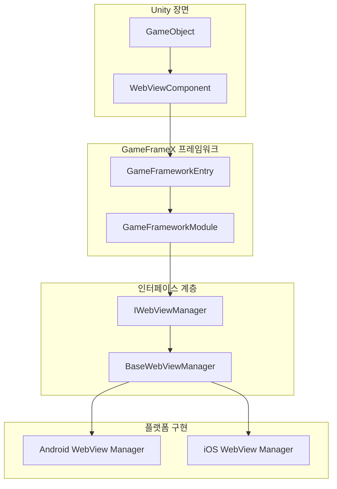
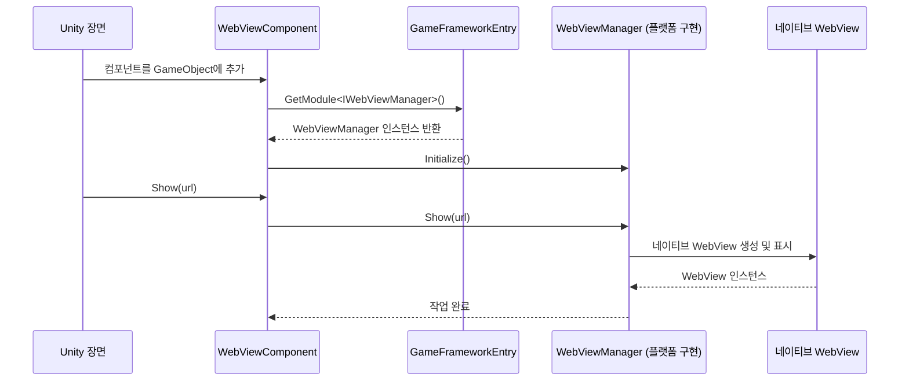

# 자주 묻는 질문

이 문서는 GameFrameX WebView 컴포넌트를 사용할 때 발생할 수 있는 일반적인 문제 및 해결책을 수집한다.

## 개요

GameFrameX WebView 컴포넌트는 Unity WebView 래핑 라이브러리로, [gree/unity-webview](https://github.com/gree/unity-webview)를 기반으로 구현된다. 이 컴포넌트는 인터페이스 설계 패턴을 채택하여 `IWebViewManager` 인터페이스를 통해 플랫폼 간 WebView 기능을 제공한다.

> **주의**: 이 패키지는 WebView의 인터페이스 정의 및 Unity 컴포넌트만 제공하며, 구체적인 플랫폼 구현(Android/iOS WebView)은 추가 설치가 필요한 해당 구현 패키지가 필요하다.

## 일반적인 문제 및 해결책

### 문제 1: WebView가 표시되지 않음

#### 증상
WebViewComponent를 장면에 추가한 후 `Show(url)` 메서드를 호출하면 WebView가 표시되지 않는다.

#### 가능한 원인
1. 플랫폼 구현 패키지가 설치되지 않음
2. WebViewManager가 올바르게 초기화되지 않음
3. URL 형식이不正确

#### 해결책
```csharp
// WebViewComponent 인스턴스를 올바르게 가져오기 확인
var webView = FindObjectOfType<WebViewComponent>();
if (webView != null)
{
    // 유효한 HTTPS URL 사용
    webView.Show("https://gameframex.doc.alianblank.com");
}
else
{
    Debug.LogError("WebViewComponent가 장면에서 찾을 수 없습니다!");
}
```

> Source: [WebViewComponent.cs](https://github.com/GameFrameX/com.gameframex.unity.webview/blob/main/Runtime/WebViewComponent.cs#L36-L49)

---

### 문제 2: Fatal: Web View manager is invalid

#### 증상
실행 시 콘솔에 `Log.Fatal("Web View manager is invalid.")` 오류가 출력된다.

#### 가능한 원인
1. **핵심 의존성 패키지가 설치되지 않음**: 이 컴포넌트는 `com.gameframex.unity` 패키지에 의존
2. **플랫폼 구현 패키지 누락**: 해당 플랫폼의 WebView 구현 패키지가 설치되지 않음
3. **모듈 등록 실패**: WebViewManager 모듈이 프레임워크에 올바르게 등록되지 않음

#### 해결책

1. **핵심 의존성 패키지 설치**:
   ```
   Unity Package Manager를 통해 추가: https://github.com/gameframex/com.gameframex.unity.git
   ```

2. **플랫폼 구현 패키지 설치**: 대상 플랫폼에 따라 해당 WebView 구현 패키지 설치 (있는 경우)

3. **모듈 등록 확인**: 게임 시작 시 GameFrameX 프레임워크가 올바르게 초기화되었는지 확인

---

### 문제 3: iOS/Android 플랫폼 WebView가 비어 있음

#### 증상
iOS 또는 Android 플랫폼에서 WebView가 비어ものとして 표시되며 페이지가 로드되지 않는다.

#### 가능한 원인
1. 네트워크 권한이 구성되지 않음
2. HTTPS 인증서 문제
3. 플랫폼 특정 구성이 누락됨

#### 해결책

**iOS의 경우**:
- `Info.plist`에 네트워크 권한 추가:
```xml
<key>NSAppTransportSecurity</key>
<dict>
    <key>NSAllowsArbitraryLoads</key>
    <true/>
</dict>
```

**Android의 경우**:
- `AndroidManifest.xml`에 Internet 권한 추가:
```xml
<uses-permission android:name="android.permission.INTERNET" />
```

---

### 문제 4: JavaScript 상호작용이 응답 없음

#### 증상
`ExecuteJavaScript()` 메서드를 호출한 후 JavaScript 코드가 실행되지 않거나 효과가 없다.

#### 가능한 원인
1. WebView가 완전히 로드되지 않음
2. JavaScript 코드 문법 오류
3. 호출 타이밍이 너무 빠름

#### 해결책
```csharp
// WebView가 로드된 후에 JavaScript를 실행할 것을 권장
// 로드 완료 상태를 듣기 위해 이벤트 구독 가능
var webView = FindObjectOfType<WebViewComponent>();
webView.Show("https://example.com");

// 페이지가 로드된 후 JavaScript 실행 지연
Invoke(nameof(ExecuteCustomJavaScript), 2.0f);

void ExecuteCustomJavaScript()
{
    webView.ExecuteJavaScript("console.log('Unity에서 인사!');");
}
```

> Source: [WebViewComponent.cs](https://github.com/GameFrameX/com.gameframex.unity.webview/blob/main/Runtime/WebViewComponent.cs#L59-L66)

---

### 문제 5: WebView 전체 화면 표시 이상

#### 증상
`MakeFullScreen()` 메서드를 호출한 후 WebView 표시 위치나 크기가 올바르지 않다.

#### 해결책
```csharp
var webView = FindObjectOfType<WebViewComponent>();
webView.Show("https://example.com");
// 페이지 로드가 완료된 후에 전체 화면으로 설정
Invoke(nameof(MakeFullScreen), 1.0f);

void MakeFullScreen()
{
    webView.MakeFullScreen();
}
```

> Source: [WebViewComponent.cs](https://github.com/GameFrameX/com.gameframex.unity.webview/blob/main/Runtime/WebViewComponent.cs#L54-L57)

---

### 문제 6: 여러 WebView 인스턴스 충돌

#### 증상
장면에 WebViewComponent가 여러 개 있을 때 표시 혼란 또는 이벤트 오류가 발생한다.

#### 해결책
- 장면에 WebViewComponent 인스턴스를 하나만 유지할 것을 권장
- 단일 패턴을 사용하여 WebView 관리:
```csharp
public class WebViewManager : MonoBehaviour
{
    private static WebViewManager _instance;
    public static WebViewManager Instance => _instance;
    
    private WebViewComponent _webView;
    
    private void Awake()
    {
        _instance = this;
        _webView = GetComponent<WebViewComponent>();
    }
    
    public void ShowWebView(string url)
    {
        _webView.Show(url);
    }
}
```

---

### 문제 7: Unity 에디터에서 테스트 불가

#### 증상
Unity 에디터 모드에서 실행하면 WebView가 표시되지 않거나 오류가 발생한다.

#### 원인 설명
WebView 기능은 실제 기기 또는 해당 플랫폼 에뮬레이터에서 테스트해야 하며, Unity 에디터 자체는 네이티브 WebView 표시를 지원하지 않는다.

#### 해결책
- 대상 플랫폼(iOS/Android)으로 프로젝트 빌드하여 테스트
- 플랫폼 관련 에뮬레이터 사용

---

## 진단 단계

### 기본 진단 프로세스

```mermaid
flowchart TD
    Start([진단 시작]) --> Step1{콘솔에 오류?}
    Step1 -->|예| Step2{오류 메시지가 "Web View manager is invalid"?}
    Step1 -->|아니요| Step3{코드 호출 확인}
    
    Step2 -->|예| Step4{핵심 의존성 패키지 확인}
    Step2 -->|아니요| Step5{구체적인 오류에 따라排查}
    
    Step4 --> Step6{의존성 패키지 설치?}
    Step6 -->|아니요| Step7[com.gameframex.unity 설치]
    Step6 -->|예| Step8[플랫폼 구현 패키지 확인]
    
    Step7 --> Step9[프로젝트 다시 빌드]
    Step8 --> Step9
    Step9 --> End1([종료])
    
    Step3 --> Step10{URL 유효?}
    Step10 -->|아니요| Step11[유효한 HTTPS URL 사용]
    Step10 -->|예| Step12[플랫폼 권한 구성 확인]
    
    Step5 --> End1
    Step11 --> End1
    Step12 --> End1
```

### 디버그 확인清单

| 확인 항목 | 조작 방법 |
|--------|----------|
| 핵심 패키지 의존성 | Package Manager에서 `com.gameframex.unity` 설치 확인 |
| 장면 구성 | GameObject에 WebViewComponent가 올바르게 추가되었는지 확인 |
| 코드 호출 | Start() 이후에 Show() 메서드 호출 확인 |
| URL 유효성 | 유효한 HTTPS URL 사용 확인 |
| 플랫폼 권한 | 각 플랫폼의 권한 구성 파일 확인 |
| 이벤트 리스닝 | 이벤트 리스닝 추가하여 오류 이벤트 트리거 여부 확인 |

---

## 아키텍처 설명

### 컴포넌트 관계



### 작업 프로세스



---

## 관련 링크

- [개요](./1-overview) - WebView 컴포넌트 개요 및 기능 소개
- [설치](./2-installation) - 상세 설치 가이드
- [빠른 시작](./3-getting-started) - WebView 빠르게 시작 사용
- [API 참조](./4-api-reference) - 완전한 API 메서드 설명
- [플랫폼 구성](./5-platforms) - 각 플랫폼 특정 구성 설명
- [이벤트 시스템](./6-events) - WebView 이벤트 시스템 상세
- [GameFrameX 핵심 프레임워크](https://github.com/GameFrameX/com.gameframex.unity) - 핵심 프레임워크 저장소
- [gree/unity-webview](https://github.com/gree/unity-webview) - 원본 WebView 플러그인
