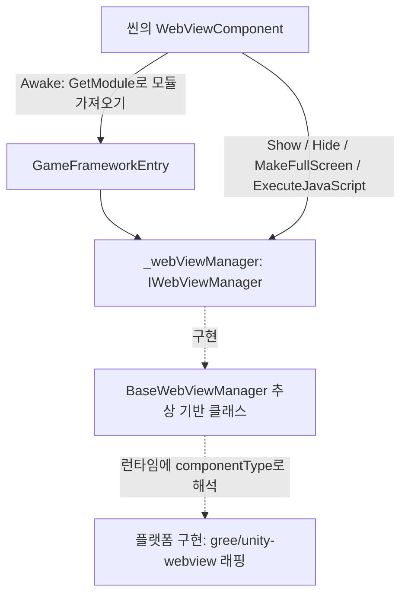

# 작동 원리: 컴포넌트가 WebView를 구동하는 방법

`WebViewComponent`는 씬에 부착되는 GameFrameworkComponent 셸로서, `Awake`에서 `GameFrameworkEntry.GetModule<IWebViewManager>()`를 통해 매니저를 가져와 `Show` / `Hide` / `MakeFullScreen` / `ExecuteJavaScript`를 모두 전달합니다. 본 패키지는 인터페이스(`IWebViewManager`), 추상 기반 클래스(`BaseWebViewManager`), 컴포넌트 셸만 정의하며, 구체적인 플랫폼 구현은 [gree/unity-webview](https://github.com/gree/unity-webview)에 대한 래핑으로, 런타임에 `componentType`에 따라 해석하여 조립합니다.

## 컴포넌트 계층 구조

| 계층 | 실제 타입 | 위치한 파일 | 담당 |
|------|----------|----------|------|
| 컴포넌트 셸 | `WebViewComponent : GameFrameworkComponent` | `Runtime/WebViewComponent.cs` | Unity 씬 진입점, 모듈 조립 및 호출 전달 담당 |
| 인터페이스 | `IWebViewManager` | `Runtime/IWebViewManager.cs` | `Initialize` / `Show` / `MakeFullScreen` / `ExecuteJavaScript` / `Hide` 다섯 개 메서드 정의 |
| 추상 기반 클래스 | `BaseWebViewManager : GameFrameworkModule, IWebViewManager` | `Runtime/BaseWebViewManager.cs` | 플랫폼 구현의 기반 클래스, 다섯 개 메서드 모두 `abstract` |
| 구체적 구현 | 런타임에 `componentType`로 해석(본 리포지토리에 없음) | — | gree/unity-webview 기반 플랫폼 Web View 기능 |

## 호출 체인



## 시작 시퀀스

1. `Awake`에서 구현 타입과 인터페이스 타입을 설정한 후, `GameFrameworkEntry`에서 모듈을 가져옵니다. 가져오지 못하면 Fatal 로그를 남기고 이후 초기화를 중단합니다:

```csharp
protected override void Awake()
{
    ImplementationComponentType = Utility.Assembly.GetType(componentType);
    InterfaceComponentType = typeof(IWebViewManager);
    base.Awake();
    if (!IsRuntimeComponentReady)
    {
        return;
    }

    _webViewManager = GameFrameworkEntry.GetModule<IWebViewManager>();
    if (_webViewManager == null)
    {
        Log.Fatal("Web View manager is invalid.");
        return;
    }
}
```

출처: [WebViewComponent.cs](https://github.com/GameFrameX/com.gameframex.unity.webview/blob/main/Runtime/WebViewComponent.cs#L22-L38)

2. `Start`에서 `_webViewManager.Initialize()`를 한 번 호출하여 매니저 초기화를 완료합니다. `Awake`에서 모듈을 가져오지 못한 경우 여기서 바로 반환합니다:

```csharp
private void Start()
{
    if (_webViewManager == null)
    {
        return;
    }

    _webViewManager.Initialize();
}
```

출처: [WebViewComponent.cs](https://github.com/GameFrameX/com.gameframex.unity.webview/blob/main/Runtime/WebViewComponent.cs#L40-L48)

## 공개 API 전달 방식

컴포넌트의 네 개 공개 메서드는 모두 한 줄 전달이며, 어떠한 플랫폼 로직도 포함하지 않습니다:

```csharp
public void Show(string url)
{
    _webViewManager.Show(url);
}

public void MakeFullScreen()
{
    _webViewManager.MakeFullScreen();
}

public void ExecuteJavaScript(string javaScript)
{
    _webViewManager.ExecuteJavaScript(javaScript);
}

public void Hide()
{
    _webViewManager.Hide();
}
```

출처: [WebViewComponent.cs](https://github.com/GameFrameX/com.gameframex.unity.webview/blob/main/Runtime/WebViewComponent.cs#L51-L83)

매니저 측의 계약(`BaseWebViewManager`는 이를 `abstract`로 선언하며, 플랫폼 하위 클래스에서 구현):

```csharp
public interface IWebViewManager
{
    void Initialize();
    void Show(string url);
    void MakeFullScreen();
    void ExecuteJavaScript(string javaScript);
    void Hide();
}
```

출처: [IWebViewManager.cs](https://github.com/GameFrameX/com.gameframex.unity.webview/blob/main/Runtime/IWebViewManager.cs#L12-L40)

## 사용자 코드가 컴포넌트에 접근하는 방법

README에서 제공하는 사용법에 따라, 씬에 `WebViewComponent`를 배치한 후 직접 호출합니다:

```csharp
using GameFrameX.WebView.Runtime;
using UnityEngine;

public class Example : MonoBehaviour
{
    void Start()
    {
        var webView = FindObjectOfType<WebViewComponent>();
        webView.Show("https://gameframex.doc.alianblank.com");
    }
}
```

출처: [README.zh-CN.md](https://github.com/GameFrameX/com.gameframex.unity.webview/blob/main/README.zh-CN.md#L102-L116)

## 소스 코드 파일 빠른 참조

| 파일 | 설명 |
|------|------|
| [WebViewComponent.cs](https://github.com/GameFrameX/com.gameframex.unity.webview/blob/main/Runtime/WebViewComponent.cs) | 컴포넌트 셸: 모듈 조립, 초기화, 네 개 공개 메서드 전달; `[DisallowMultipleComponent]` + `[AddComponentMenu("Game Framework/WebView")]` |
| [IWebViewManager.cs](https://github.com/GameFrameX/com.gameframex.unity.webview/blob/main/Runtime/IWebViewManager.cs) | 매니저 인터페이스, 다섯 개 메서드의 계약 |
| [BaseWebViewManager.cs](https://github.com/GameFrameX/com.gameframex.unity.webview/blob/main/Runtime/BaseWebViewManager.cs) | 추상 기반 클래스, `GameFrameworkModule`을 상속하고 인터페이스를 구현 |
| [WebViewComponentInspector.cs](https://github.com/GameFrameX/com.gameframex.unity.webview/blob/main/Editor/WebViewComponentInspector.cs) | Editor 디렉토리의 컴포넌트 Inspector(본 페이지에서는 구현을 상세히 다루지 않음) |
| [WebViewCloseEventArgs.cs](https://github.com/GameFrameX/com.gameframex.unity.webview/blob/main/Runtime/EventArgs/WebViewCloseEventArgs.cs) / [WebViewReceivedMessageEventArgs.cs](https://github.com/GameFrameX/com.gameframex.unity.webview/blob/main/Runtime/EventArgs/WebViewReceivedMessageEventArgs.cs) | Runtime/EventArgs下的 닫기 / 메시지 수신 이벤트 인자 정의(필드 세부 사항은 소스 코드 참조) |
| [GameFrameXWebViewCroppingHelper.cs](https://github.com/GameFrameX/com.gameframex.unity.webview/blob/main/Runtime/GameFrameXWebViewCroppingHelper.cs) | Runtime 디렉토리의 크로핑 보조 클래스(본 페이지에서는 구현을 상세히 다루지 않음) |

## 관련 링크

- [README.zh-CN.md](https://github.com/GameFrameX/com.gameframex.unity.webview/blob/main/README.zh-CN.md) — 설치 방법, 사용 예제 및 종속성 설명(`com.gameframex.unity` 1.0.0 종속)
- [Game Frame X 공식 문서](https://gameframex.doc.alianblank.com)
- [gree/unity-webview](https://github.com/gree/unity-webview) — 본 컴포넌트가 래핑하는 기반 Web View 구현, Android 및 iOS 지원