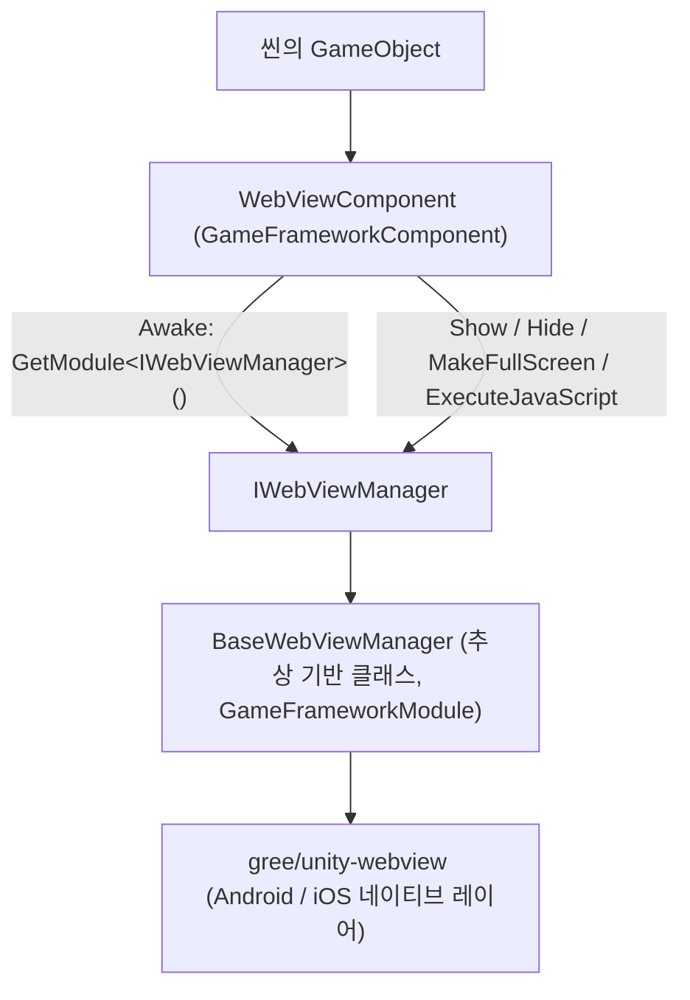

# 프로젝트 개요: Unity 내장 웹 페이지 컴포넌트

Game Frame X Web View는 Game Frame X 프레임워크에 속한 Unity 내장 웹 페이지 컴포넌트로, [gree/unity-webview](https://github.com/gree/unity-webview)를 래핑하여 Android / iOS 게임에서 하나의 컴포넌트만으로 웹 페이지를 표시하고 JavaScript를 실행할 수 있게 해주며, 통합 인터페이스 `IWebViewManager`를 통해 프레임워크의 모듈 체계에 연결할 수 있습니다.

## 빠른 시작

### 1. 패키지 설치

아래 방법 중 하나를 선택하여 `com.gameframex.unity.webview`를 Unity 프로젝트에 추가하세요:

**방법 A: scoped registry(권장)** —— `Packages/manifest.json`을 편집합니다:

```json
{
  "scopedRegistries": [
    {
      "name": "GameFrameX",
      "url": "https://gameframex.upm.alianblank.uk",
      "scopes": [
        "com.gameframex"
      ]
    }
  ],
  "dependencies": {
    "com.gameframex.unity.webview": "1.0.0"
  }
}
```

**방법 B: Git URL** —— `manifest.json`의 `dependencies`에 직접 작성합니다:

```json
{
  "dependencies": {
    "com.gameframex.unity.webview": "https://github.com/gameframex/com.gameframex.unity.webview.git"
  }
}
```

출처: [README.md](https://github.com/GameFrameX/com.gameframex.unity.webview/blob/main/README.md#L43-L70)

Unity **Package Manager**에서 **Add package from git URL**을 사용해 `https://github.com/gameframex/com.gameframex.unity.webview.git`를 입력하거나, 저장소를 `Packages` 디렉터리에 직접 클론하여 자동으로 로드할 수도 있습니다.

> 의존성: `com.gameframex.unity` 1.0.0도 함께 사용할 수 있어야 합니다([README.md](https://github.com/GameFrameX/com.gameframex.unity.webview/blob/main/README.md#L126-L131) 참조).

### 2. 컴포넌트 부착

씬에 있는 GameFramework 오브젝트(또는 임의의 오브젝트)에 **Add Component → Game Framework → WebView**를 통해 `WebViewComponent`를 추가합니다. 컴포넌트는 `Start` 시점에 관리자 초기화를 자동으로 완료합니다:

```csharp
private void Start()
{
    if (_webViewManager == null)
    {
        return;
    }

    _webViewManager.Initialize();
}
```

출처: [WebViewComponent.cs](https://github.com/GameFrameX/com.gameframex.unity.webview/blob/main/Runtime/WebViewComponent.cs#L40-L48)

### 3. 웹 페이지 표시

```csharp
using GameFrameX.WebView.Runtime;
using UnityEngine;

public class Example : MonoBehaviour
{
    void Start()
    {
        var webView = FindObjectOfType<WebViewComponent>();
        webView.Show("https://gameframex.doc.alianblank.com");
    }
}
```

출처: [README.md](https://github.com/GameFrameX/com.gameframex.unity.webview/blob/main/README.md#L102-L116)

### 4. 자주 사용하는 API 한눈에 보기

| 이름 | 시그니처 | 설명 |
|------|------|------|
| 웹 페이지 표시 | `Show(string url)` | WebView를 표시하고 지정된 URL을 로드합니다 |
| 숨기기 | `Hide()` | WebView를 숨깁니다 |
| 전체 화면 | `MakeFullScreen()` | WebView를 전체 화면으로 설정합니다 |
| 스크립트 실행 | `ExecuteJavaScript(string javaScript)` | 웹 페이지에서 JavaScript 코드를 실행합니다 |

위 메서드는 모두 `WebViewComponent`의 공개 메서드이며, `IWebViewManager` 구현으로 직접 전달됩니다([WebViewComponent.cs](https://github.com/GameFrameX/com.gameframex.unity.webview/blob/main/Runtime/WebViewComponent.cs#L51-L83) 및 [IWebViewManager.cs](https://github.com/GameFrameX/com.gameframex.unity.webview/blob/main/Runtime/IWebViewManager.cs#L12-L40) 참조).

## 작동 원리 개요

컴포넌트 계층 구조는 매우 간단합니다: 씬의 `WebViewComponent`(`GameFrameworkComponent` 상속)는 전달만 담당하고, 실제 동작은 `IWebViewManager`를 구현하는 관리자(`BaseWebViewManager`가 추상 기반 클래스)가 수행하며, 하위 레이어의 네이티브 WebView 렌더링은 래핑된 gree/unity-webview가 담당합니다.



핵심 호출 체인(소스 코드 확인):

1. `WebViewComponent.Awake()`는 `GameFrameworkEntry.GetModule<IWebViewManager>()`를 통해 모듈 인스턴스를 가져오며, 실패 시 `Log.Fatal("Web View manager is invalid.")`를 호출합니다([WebViewComponent.cs](https://github.com/GameFrameX/com.gameframex.unity.webview/blob/main/Runtime/WebViewComponent.cs#L22-L38)).
2. `Start()`에서 `_webViewManager.Initialize()`를 호출하여 초기화를 완료합니다([WebViewComponent.cs](https://github.com/GameFrameX/com.gameframex.unity.webview/blob/main/Runtime/WebViewComponent.cs#L40-L48)).
3. `BaseWebViewManager`는 `Initialize / Show / MakeFullScreen / ExecuteJavaScript / Hide`를 추상 메서드 형태로 선언합니다([BaseWebViewManager.cs](https://github.com/GameFrameX/com.gameframex.unity.webview/blob/main/Runtime/BaseWebViewManager.cs#L11-L39)).

저장소에는 메시지 콜백과 에디터 확장에 사용되는 `Runtime/EventArgs/`의 `WebViewCloseEventArgs`, `WebViewReceivedMessageEventArgs` 이벤트 인자, 그리고 `Editor/WebViewComponentInspector.cs` 커스텀 Inspector와 `GameFrameXWebViewCroppingHelper.cs` 크로핑 헬퍼 클래스도 포함되어 있습니다.

## 다음 단계

- 사용 세부 사항 및 문서 사이트: [Game Frame X Documentation](https://gameframex.doc.alianblank.com)([README.md](https://github.com/GameFrameX/com.gameframex.unity.webview/blob/main/README.md#L132-L134))
- 각 인터페이스의 전체 시그니처: [IWebViewManager.cs](https://github.com/GameFrameX/com.gameframex.unity.webview/blob/main/Runtime/IWebViewManager.cs#L12-L40)
- 컴포넌트 라이프사이클 및 전달 구현: [WebViewComponent.cs](https://github.com/GameFrameX/com.gameframex.unity.webview/blob/main/Runtime/WebViewComponent.cs#L13-L84)
- 추상 기반 클래스 확장 포인트: [BaseWebViewManager.cs](https://github.com/GameFrameX/com.gameframex.unity.webview/blob/main/Runtime/BaseWebViewManager.cs#L11-L39)
- 버전 이력: [CHANGELOG.md](https://github.com/GameFrameX/com.gameframex.unity.webview/blob/main/CHANGELOG.md) 및 [Releases](https://github.com/GameFrameX/gameframex/com.gameframex.unity.webview/releases)